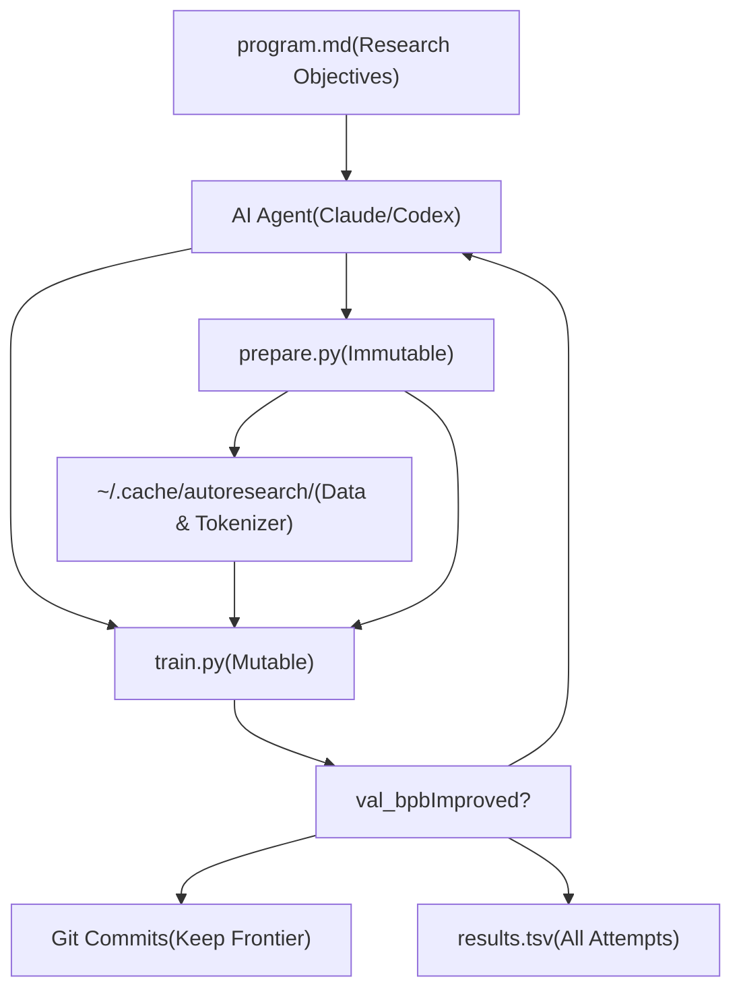

# Autoresearch Overview

Relevant source files

-   [README.md](https://github.com/karpathy/autoresearch/blob/e6d79c12/README.md?plain=1)
-   [program.md](https://github.com/karpathy/autoresearch/blob/e6d79c12/program.md?plain=1)

## Purpose and Scope

This document provides a high-level introduction to the autoresearch system, an autonomous AI research framework for machine learning experimentation. Autoresearch enables AI agents to conduct overnight experiments on a small but real LLM training setup, autonomously modifying code, running experiments, and deciding which changes to keep based on performance improvements. [README.md1-19](https://github.com/karpathy/autoresearch/blob/e6d79c12/README.md?plain=1#L1-L19)

This page covers the fundamental architecture, core concepts, and design principles. For detailed setup instructions, see [Getting Started](/karpathy/autoresearch/2-getting-started). For component-level documentation, see [Core Components](/karpathy/autoresearch/3-core-components). For information on how agents operate, see [Agent Operation](/karpathy/autoresearch/4-agent-operation).

**Sources:** [README.md1-19](https://github.com/karpathy/autoresearch/blob/e6d79c12/README.md?plain=1#L1-L19)

## What is Autoresearch?

Autoresearch is a framework that inverts the traditional ML research workflow. Instead of humans writing code and running experiments, an AI agent autonomously: [README.md7-17](https://github.com/karpathy/autoresearch/blob/e6d79c12/README.md?plain=1#L7-L17)

1.  Reads research objectives from `program.md` [README.md15](https://github.com/karpathy/autoresearch/blob/e6d79c12/README.md?plain=1#L15-L15)
2.  Modifies `train.py` to implement experimental ideas [README.md14](https://github.com/karpathy/autoresearch/blob/e6d79c12/README.md?plain=1#L14-L14)
3.  Runs training for exactly 5 minutes [README.md17](https://github.com/karpathy/autoresearch/blob/e6d79c12/README.md?plain=1#L17-L17)
4.  Extracts the `val_bpb` metric from logs [program.md58-61](https://github.com/karpathy/autoresearch/blob/e6d79c12/program.md?plain=1#L58-L61)
5.  Decides whether to keep or discard the change [program.md103-104](https://github.com/karpathy/autoresearch/blob/e6d79c12/program.md?plain=1#L103-L104)
6.  Logs all attempts to `results.tsv` [program.md66-78](https://github.com/karpathy/autoresearch/blob/e6d79c12/program.md?plain=1#L66-L78)
7.  Repeats indefinitely (~12 experiments per hour) [README.md64](https://github.com/karpathy/autoresearch/blob/e6d79c12/README.md?plain=1#L64-L64)

The human's role shifts from writing code to writing the "research org code" in `program.md`—the instructions that guide the agent's research direction. [README.md7](https://github.com/karpathy/autoresearch/blob/e6d79c12/README.md?plain=1#L7-L7) Overnight runs produce approximately 100 experiments, with all results logged for post-hoc analysis. [README.md64](https://github.com/karpathy/autoresearch/blob/e6d79c12/README.md?plain=1#L64-L64)

**Sources:** [README.md7-17](https://github.com/karpathy/autoresearch/blob/e6d79c12/README.md?plain=1#L7-L17) [README.md44-65](https://github.com/karpathy/autoresearch/blob/e6d79c12/README.md?plain=1#L44-L65) [program.md58-104](https://github.com/karpathy/autoresearch/blob/e6d79c12/program.md?plain=1#L58-L104)

## System Architecture Overview

### Three-Layer Design


**Diagram: Three-Layer Architecture with Code Entities**

The system separates concerns across three immutable boundaries: [README.md11-17](https://github.com/karpathy/autoresearch/blob/e6d79c12/README.md?plain=1#L11-L17)

| Layer | Files | Modification Policy | Purpose |
| --- | --- | --- | --- |
| **Human** | `program.md` | Human edits | Define research objectives and agent instructions [README.md15](https://github.com/karpathy/autoresearch/blob/e6d79c12/README.md?plain=1#L15-L15) |
| **Agent** | AI executor | Autonomous operation | Read objectives, propose changes, make decisions [program.md94-112](https://github.com/karpathy/autoresearch/blob/e6d79c12/program.md?plain=1#L94-L112) |
| **Infrastructure** | `prepare.py` (immutable)
`train.py` (mutable) | `prepare.py`: never modified
`train.py`: agent modifies | Fixed evaluation harness and experimental sandbox [README.md13-14](https://github.com/karpathy/autoresearch/blob/e6d79c12/README.md?plain=1#L13-L14) |

**Sources:** [README.md11-17](https://github.com/karpathy/autoresearch/blob/e6d79c12/README.md?plain=1#L11-L17) [README.md54-59](https://github.com/karpathy/autoresearch/blob/e6d79c12/README.md?plain=1#L54-L59) [program.md94-112](https://github.com/karpathy/autoresearch/blob/e6d79c12/program.md?plain=1#L94-L112)

### File Roles and Responsibilities

**Diagram: File Structure and Code Entity Mapping**

| File | Modification Policy | Key Entities | Purpose |
| --- | --- | --- | --- |
| `prepare.py` | **Never modified** | `MAX_SEQ_LEN`, `TIME_BUDGET`, `make_dataloader()`, `evaluate_bpb()`, `Tokenizer` | Ensures fair comparison across experiments [README.md13](https://github.com/karpathy/autoresearch/blob/e6d79c12/README.md?plain=1#L13-L13) |
| `train.py` | **Agent modifies** | `GPT`, `CausalSelfAttention`, `MLP`, `MuonAdamW`, training loop, `DEPTH`, `WINDOW_PATTERN` | The experimental sandbox where all changes happen [README.md14](https://github.com/karpathy/autoresearch/blob/e6d79c12/README.md?plain=1#L14-L14) |
| `program.md` | **Human edits** | Research objectives, agent instructions, context | The "research org code" that guides agent behavior [README.md15](https://github.com/karpathy/autoresearch/blob/e6d79c12/README.md?plain=1#L15-L15) |
| `pyproject.toml` | **Fixed** | Dependencies: `torch`, `tiktoken`, `rustbpe`, etc. | Minimal dependency set [README.md58](https://github.com/karpathy/autoresearch/blob/e6d79c12/README.md?plain=1#L58-L58) |

**Sources:** [README.md11-17](https://github.com/karpathy/autoresearch/blob/e6d79c12/README.md?plain=1#L11-L17) [README.md54-59](https://github.com/karpathy/autoresearch/blob/e6d79c12/README.md?plain=1#L54-L59) [README.md63-66](https://github.com/karpathy/autoresearch/blob/e6d79c12/README.md?plain=1#L63-L66)

## The Autonomous Research Loop

**Diagram: Autonomous Research Loop State Machine**

The loop runs continuously without human intervention. [program.md112](https://github.com/karpathy/autoresearch/blob/e6d79c12/program.md?plain=1#L112-L112) Each iteration takes approximately 5 minutes of training plus overhead for compilation, logging, and git operations. [program.md108](https://github.com/karpathy/autoresearch/blob/e6d79c12/program.md?plain=1#L108-L108) This yields roughly 12 experiments per hour and 100 experiments during an 8-hour overnight run. [README.md64](https://github.com/karpathy/autoresearch/blob/e6d79c12/README.md?plain=1#L64-L64)

**Sources:** [README.md7](https://github.com/karpathy/autoresearch/blob/e6d79c12/README.md?plain=1#L7-L7) [README.md64](https://github.com/karpathy/autoresearch/blob/e6d79c12/README.md?plain=1#L64-L64) [program.md94-112](https://github.com/karpathy/autoresearch/blob/e6d79c12/program.md?plain=1#L94-L112)

## Key Design Principles

### 1\. Fixed Time Budget

Training runs for exactly **5 minutes** (300 seconds) of wall-clock time, excluding startup and compilation. [README.md17](https://github.com/karpathy/autoresearch/blob/e6d79c12/README.md?plain=1#L17-L17) This is enforced in the training loop via the `TIME_BUDGET` constant from `prepare.py`. [README.md13](https://github.com/karpathy/autoresearch/blob/e6d79c12/README.md?plain=1#L13-L13)

**Rationale:**

-   **Fair comparison:** All experiments are directly comparable regardless of model size, batch size, or architecture changes [README.md64](https://github.com/karpathy/autoresearch/blob/e6d79c12/README.md?plain=1#L64-L64)
-   **Platform optimization:** Autoresearch finds the most optimal model for your specific hardware within the time budget [README.md64](https://github.com/karpathy/autoresearch/blob/e6d79c12/README.md?plain=1#L64-L64)
-   **Predictable throughput:** Enables reliable estimation of experiments per hour (~12) and overnight runs (~100) [README.md64](https://github.com/karpathy/autoresearch/blob/e6d79c12/README.md?plain=1#L64-L64)

**Trade-off:** Results are platform-specific and not directly comparable across different hardware (H100 vs RTX 4090, etc.) [README.md64](https://github.com/karpathy/autoresearch/blob/e6d79c12/README.md?plain=1#L64-L64)

**Sources:** [README.md17](https://github.com/karpathy/autoresearch/blob/e6d79c12/README.md?plain=1#L17-L17) [README.md64](https://github.com/karpathy/autoresearch/blob/e6d79c12/README.md?plain=1#L64-L64)

### 2\. Single Metric: val\_bpb

The sole optimization target is `val_bpb` (validation bits per byte), extracted via `grep '^val_bpb:' run.log`. [program.md61](https://github.com/karpathy/autoresearch/blob/e6d79c12/program.md?plain=1#L61-L61) This metric is:

-   **Vocab-size independent:** Allows fair comparison when agent changes tokenizer or vocabulary [README.md17](https://github.com/karpathy/autoresearch/blob/e6d79c12/README.md?plain=1#L17-L17)
-   **Lower is better:** Measures compression quality of the model [README.md17](https://github.com/karpathy/autoresearch/blob/e6d79c12/README.md?plain=1#L17-L17)
-   **Fixed evaluation:** Computed by immutable `evaluate_bpb()` in `prepare.py` on a fixed set of validation tokens [program.md31](https://github.com/karpathy/autoresearch/blob/e6d79c12/program.md?plain=1#L31-L31)

**Secondary constraints:**

-   `peak_vram_mb`: Soft constraint to avoid OOM crashes [program.md35](https://github.com/karpathy/autoresearch/blob/e6d79c12/program.md?plain=1#L35-L35)
-   Code simplicity: Prefer simpler implementations when performance is similar [program.md37](https://github.com/karpathy/autoresearch/blob/e6d79c12/program.md?plain=1#L37-L37)

**Sources:** [README.md17](https://github.com/karpathy/autoresearch/blob/e6d79c12/README.md?plain=1#L17-L17) [program.md31-37](https://github.com/karpathy/autoresearch/blob/e6d79c12/program.md?plain=1#L31-L37)

### 3\. Single File Modification

The agent modifies **only** `train.py`. [README.md63](https://github.com/karpathy/autoresearch/blob/e6d79c12/README.md?plain=1#L63-L63) This design:

-   **Keeps scope manageable:** Agent doesn't need to reason about complex multi-file changes [README.md63](https://github.com/karpathy/autoresearch/blob/e6d79c12/README.md?plain=1#L63-L63)
-   **Makes diffs reviewable:** Each experiment is one commit with changes to a single file [README.md63](https://github.com/karpathy/autoresearch/blob/e6d79c12/README.md?plain=1#L63-L63)
-   **Prevents infrastructure drift:** `prepare.py` remains fixed, ensuring `evaluate_bpb()` never changes [README.md13](https://github.com/karpathy/autoresearch/blob/e6d79c12/README.md?plain=1#L13-L13)

Everything in `train.py` is fair game:

-   Model architecture (`GPT`, `CausalSelfAttention`, `MLP`) [README.md14](https://github.com/karpathy/autoresearch/blob/e6d79c12/README.md?plain=1#L14-L14)
-   Optimizer (`MuonAdamW` or alternatives) [README.md14](https://github.com/karpathy/autoresearch/blob/e6d79c12/README.md?plain=1#L14-L14)
-   Hyperparameters (`DEPTH`, `WINDOW_PATTERN`, `TOTAL_BATCH_SIZE`, learning rates) [README.md14](https://github.com/karpathy/autoresearch/blob/e6d79c12/README.md?plain=1#L14-L14)
-   Training loop logic (gradient accumulation, LR scheduling) [README.md14](https://github.com/karpathy/autoresearch/blob/e6d79c12/README.md?plain=1#L14-L14)

**Sources:** [README.md14](https://github.com/karpathy/autoresearch/blob/e6d79c12/README.md?plain=1#L14-L14) [README.md63](https://github.com/karpathy/autoresearch/blob/e6d79c12/README.md?plain=1#L63-L63)

### 4\. Minimal Dependencies

The system is self-contained with minimal external dependencies defined in `pyproject.toml`. [README.md65-66](https://github.com/karpathy/autoresearch/blob/e6d79c12/README.md?plain=1#L65-L66)

| Dependency | Purpose |
| --- | --- |
| `torch` (CUDA 12.8) | Model training and GPU acceleration [README.md23](https://github.com/karpathy/autoresearch/blob/e6d79c12/README.md?plain=1#L23-L23) |
| `tiktoken` | BPE tokenizer utilities [README.md65](https://github.com/karpathy/autoresearch/blob/e6d79c12/README.md?plain=1#L65-L65) |
| `rustbpe` | Fast BPE training [README.md65](https://github.com/karpathy/autoresearch/blob/e6d79c12/README.md?plain=1#L65-L65) |
| `uv` | Project and dependency management [README.md23](https://github.com/karpathy/autoresearch/blob/e6d79c12/README.md?plain=1#L23-L23) |

No distributed training frameworks, no complex configuration systems, no external experiment tracking. One GPU, one file, one metric. [README.md65](https://github.com/karpathy/autoresearch/blob/e6d79c12/README.md?plain=1#L65-L65)

**Sources:** [README.md23](https://github.com/karpathy/autoresearch/blob/e6d79c12/README.md?plain=1#L23-L23) [README.md65-66](https://github.com/karpathy/autoresearch/blob/e6d79c12/README.md?plain=1#L65-L66)

## System Workflow

The complete autoresearch workflow proceeds in phases:

### Phase 1: One-Time Setup

```
uv sync                # Install dependenciesuv run prepare.py      # Download data, train tokenizer (~2 minutes)
```
[README.md31-34](https://github.com/karpathy/autoresearch/blob/e6d79c12/README.md?plain=1#L31-L34)

Creates `~/.cache/autoresearch/` containing data shards and a tokenizer. [program.md15](https://github.com/karpathy/autoresearch/blob/e6d79c12/program.md?plain=1#L15-L15)

### Phase 2: Baseline Establishment

```
uv run train.py        # Manual baseline run (~5 minutes)
```
[README.md37](https://github.com/karpathy/autoresearch/blob/e6d79c12/README.md?plain=1#L37-L37)

Establishes the initial `val_bpb` to beat. [program.md39](https://github.com/karpathy/autoresearch/blob/e6d79c12/program.md?plain=1#L39-L39)

### Phase 3: Autonomous Operation

```
# Prompt the agent:
"Hi have a look at program.md and let's kick off a new experiment!"
```
[README.md47](https://github.com/karpathy/autoresearch/blob/e6d79c12/README.md?plain=1#L47-L47)

The agent runs the research loop indefinitely, logging to `results.tsv`. [program.md94-112](https://github.com/karpathy/autoresearch/blob/e6d79c12/program.md?plain=1#L94-L112)

### Phase 4: Analysis

Analysis of `results.tsv` and git history allows humans to interpret the research progress. [program.md66-88](https://github.com/karpathy/autoresearch/blob/e6d79c12/program.md?plain=1#L66-L88)

**Sources:** [README.md23-51](https://github.com/karpathy/autoresearch/blob/e6d79c12/README.md?plain=1#L23-L51) [program.md15-112](https://github.com/karpathy/autoresearch/blob/e6d79c12/program.md?plain=1#L15-L112)

## Intended Use Cases

Autoresearch is designed for: [README.md7](https://github.com/karpathy/autoresearch/blob/e6d79c12/README.md?plain=1#L7-L7)

1.  **Overnight experimentation:** Run ~100 experiments while you sleep [README.md114](https://github.com/karpathy/autoresearch/blob/e6d79c12/README.md?plain=1#L114-L114)
2.  **Architecture search:** Explore model design space (attention patterns, layer types, etc.) [program.md33](https://github.com/karpathy/autoresearch/blob/e6d79c12/program.md?plain=1#L33-L33)
3.  **Hyperparameter tuning:** Find optimal learning rates, batch sizes, depths [program.md33](https://github.com/karpathy/autoresearch/blob/e6d79c12/program.md?plain=1#L33-L33)
4.  **Optimizer comparison:** Test variants of MuonAdamW or alternative optimizers [program.md33](https://github.com/karpathy/autoresearch/blob/e6d79c12/program.md?plain=1#L33-L33)
5.  **Research org optimization:** Iterate on `program.md` to improve agent efficiency [README.md7](https://github.com/karpathy/autoresearch/blob/e6d79c12/README.md?plain=1#L7-L7)

Autoresearch is **not** designed for:

-   Multi-GPU distributed training (single GPU only) [README.md65](https://github.com/karpathy/autoresearch/blob/e6d79c12/README.md?plain=1#L65-L65)
-   Long training runs (fixed 5-minute budget) [README.md64](https://github.com/karpathy/autoresearch/blob/e6d79c12/README.md?plain=1#L64-L64)
-   Human-in-the-loop experiments (fully autonomous) [program.md112](https://github.com/karpathy/autoresearch/blob/e6d79c12/program.md?plain=1#L112-L112)
-   Cross-platform result comparison (platform-specific optimization) [README.md64](https://github.com/karpathy/autoresearch/blob/e6d79c12/README.md?plain=1#L64-L64)

**Sources:** [README.md7](https://github.com/karpathy/autoresearch/blob/e6d79c12/README.md?plain=1#L7-L7) [README.md64-66](https://github.com/karpathy/autoresearch/blob/e6d79c12/README.md?plain=1#L64-L66) [README.md114](https://github.com/karpathy/autoresearch/blob/e6d79c12/README.md?plain=1#L114-L114) [program.md33-112](https://github.com/karpathy/autoresearch/blob/e6d79c12/program.md?plain=1#L33-L112)

## Platform Requirements

| Requirement | Specification |
| --- | --- |
| **GPU** | Single NVIDIA GPU (tested on H100) [README.md23](https://github.com/karpathy/autoresearch/blob/e6d79c12/README.md?plain=1#L23-L23) |
| **Python** | 3.10+ [README.md23](https://github.com/karpathy/autoresearch/blob/e6d79c12/README.md?plain=1#L23-L23) |
| **Package Manager** | `uv` (Astral's package manager) [README.md23](https://github.com/karpathy/autoresearch/blob/e6d79c12/README.md?plain=1#L23-L23) |
| **CUDA** | 12.8 (PyTorch requirement) [README.md23](https://github.com/karpathy/autoresearch/blob/e6d79c12/README.md?plain=1#L23-L23) |

For platform adaptations (MacOS, Windows RTX, etc.), see [Platform Adaptation and Forks](/karpathy/autoresearch/8.4-platform-adaptation-and-forks). [README.md69-81](https://github.com/karpathy/autoresearch/blob/e6d79c12/README.md?plain=1#L69-L81)

**Sources:** [README.md23](https://github.com/karpathy/autoresearch/blob/e6d79c12/README.md?plain=1#L23-L23) [README.md67-88](https://github.com/karpathy/autoresearch/blob/e6d79c12/README.md?plain=1#L67-L88)

## Next Steps

-   **New users:** Start with [Getting Started](/karpathy/autoresearch/2-getting-started) for installation and first experiment
-   **Understanding components:** See [Core Components](/karpathy/autoresearch/3-core-components) for detailed file documentation
-   **Running experiments:** See [Agent Operation](/karpathy/autoresearch/4-agent-operation) for autonomous loop details
-   **Customization:** See [Advanced Topics](/karpathy/autoresearch/8-advanced-topics) for platform tuning and research program design

**Sources:** [README.md21-51](https://github.com/karpathy/autoresearch/blob/e6d79c12/README.md?plain=1#L21-L51)
