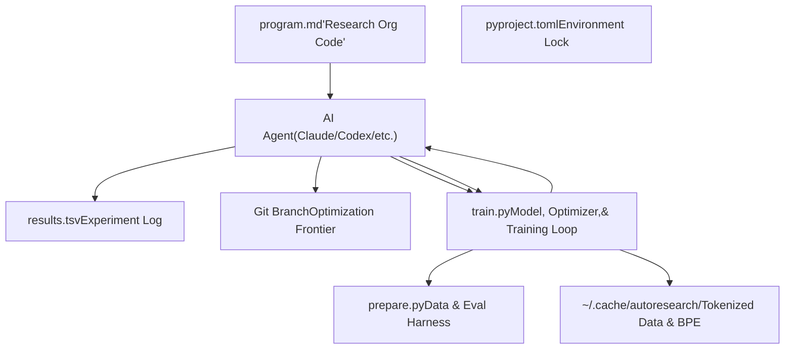
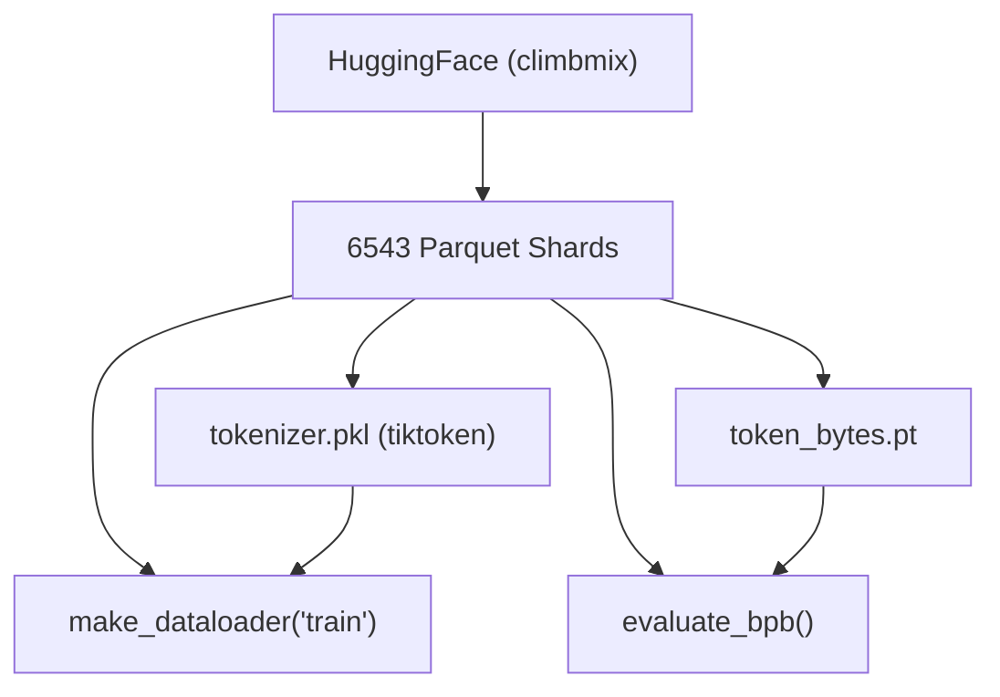

# System Architecture

Relevant source files

-   [README.md](https://github.com/karpathy/autoresearch/blob/e6d79c12/README.md?plain=1)
-   [prepare.py](https://github.com/karpathy/autoresearch/blob/e6d79c12/prepare.py)
-   [train.py](https://github.com/karpathy/autoresearch/blob/e6d79c12/train.py)

## Purpose and Scope

This document provides a detailed technical explanation of the **autoresearch** system architecture. It covers the three-layer separation between human-driven strategy, agent-driven execution, and the underlying immutable infrastructure. The system is designed as a "closed-loop" research environment where an AI agent iteratively modifies a single file (`train.py`) to minimize a specific metric (`val_bpb`) within a fixed time budget.

## Component Overview

The architecture is divided into three distinct layers: the **Human Layer** (strategy), the **Agent Layer** (execution), and the **Infrastructure Layer** (fixed environment).


**Component Responsibilities:**

| Component | Role | File Path | Modifiable By |
| --- | --- | --- | --- |
| **Strategy** | Instructions and experiment protocols | `program.md` | Human |
| **Infrastructure** | Data loading, tokenization, and `evaluate_bpb` | `prepare.py` | Fixed |
| **Research Core** | Model architecture, optimizer, and training loop | `train.py` | Agent |
| **Metric Log** | Tabular history of all attempts (success/fail) | `results.tsv` | Agent |
| **Frontier** | Version control tracking the current "best" code | Git | Agent |

**Sources:** [README.md11-15](https://github.com/karpathy/autoresearch/blob/e6d79c12/README.md?plain=1#L11-L15) [README.md52-59](https://github.com/karpathy/autoresearch/blob/e6d79c12/README.md?plain=1#L52-L59) [program.md7-15](https://github.com/karpathy/autoresearch/blob/e6d79c12/program.md?plain=1#L7-L15)

## The Three-Layer Architecture

### 1\. Human Layer (`program.md`)

The human acts as the "Director of Research," writing the `program.md` file. This file does not contain model code; instead, it contains the **meta-code** for the research organization. It defines how the agent should think, how it should handle errors, and the specific protocol for logging results.

-   **Role:** Sets the research direction and operational constraints [program.md7-10](https://github.com/karpathy/autoresearch/blob/e6d79c12/program.md?plain=1#L7-L10)
-   **Key Entity:** The "Skill" or "Research Org Code" [README.md50](https://github.com/karpathy/autoresearch/blob/e6d79c12/README.md?plain=1#L50-L50)

### 2\. Agent Layer (Autonomous Executor)

The agent (typically a Large Language Model with tool-use capabilities) follows the instructions in `program.md` to run an infinite loop of experimentation.

-   **Research Loop:** Propose change -> Modify `train.py` -> Commit -> Run -> Evaluate -> Keep/Discard [program.md90-114](https://github.com/karpathy/autoresearch/blob/e6d79c12/program.md?plain=1#L90-L114)
-   **Decision Logic:** If `val_bpb` improves, the commit is kept; otherwise, the agent performs `git reset --hard HEAD~1` to return to the previous known-best state [program.md103-108](https://github.com/karpathy/autoresearch/blob/e6d79c12/program.md?plain=1#L103-L108)

### 3\. Infrastructure Layer (`prepare.py` & `train.py` constants)

The infrastructure provides the "physics" of the research world. It is strictly immutable to ensure that the agent cannot "cheat" by modifying the evaluation metric or the data.

-   **Fixed Constraints:** `TIME_BUDGET` (300s), `MAX_SEQ_LEN` (2048), and `EVAL_TOKENS` [prepare.py30-32](https://github.com/karpathy/autoresearch/blob/e6d79c12/prepare.py#L30-L32)
-   **Evaluation:** The `evaluate_bpb` function calculates Bits Per Byte, a vocab-size independent metric [prepare.py148-200](https://github.com/karpathy/autoresearch/blob/e6d79c12/prepare.py#L148-L200)

**Sources:** [README.md63-65](https://github.com/karpathy/autoresearch/blob/e6d79c12/README.md?plain=1#L63-L65) [prepare.py27-32](https://github.com/karpathy/autoresearch/blob/e6d79c12/prepare.py#L27-L32) [program.md25-31](https://github.com/karpathy/autoresearch/blob/e6d79c12/program.md?plain=1#L25-L31)

## Code Entity Interaction Diagram

The following diagram bridges the natural language concepts of "Training" and "Evaluation" to the specific Python entities and file paths.

> **[Mermaid sequence]**
> *(图表结构无法解析)*

**Key Code Entities:**

-   `GPTConfig`: Dataclass defining the model width, depth, and heads [train.py32-40](https://github.com/karpathy/autoresearch/blob/e6d79c12/train.py#L32-L40)
-   `Muon`: The optimizer used for internal 2D parameters [train.py357-428](https://github.com/karpathy/autoresearch/blob/e6d79c12/train.py#L357-L428)
-   `evaluate_bpb`: The core evaluation function that must remain untouched [prepare.py148-200](https://github.com/karpathy/autoresearch/blob/e6d79c12/prepare.py#L148-L200)
-   `TIME_BUDGET`: The wall-clock limit (5 minutes) enforced in the training loop [train.py604-605](https://github.com/karpathy/autoresearch/blob/e6d79c12/train.py#L604-L605)

**Sources:** [train.py26-27](https://github.com/karpathy/autoresearch/blob/e6d79c12/train.py#L26-L27) [train.py32-40](https://github.com/karpathy/autoresearch/blob/e6d79c12/train.py#L32-L40) [train.py604-614](https://github.com/karpathy/autoresearch/blob/e6d79c12/train.py#L604-L614) [prepare.py148-200](https://github.com/karpathy/autoresearch/blob/e6d79c12/prepare.py#L148-L200)

## Data Flow and Evaluation Logic

The primary metric, `val_bpb` (Validation Bits Per Byte), is the architectural anchor of the system. Unlike Loss or Perplexity, BPB is independent of the `VOCAB_SIZE` chosen by the agent, allowing for fair comparison of architectural changes that include tokenizer modifications.

### Data Preparation Flow


1.  **Tokenizer Training:** Uses `rustbpe` to train a BPE tokenizer on the training shards [prepare.py161-163](https://github.com/karpathy/autoresearch/blob/e6d79c12/prepare.py#L161-L163)
2.  **Byte Mapping:** A tensor `token_bytes.pt` is created, mapping every token ID to its length in UTF-8 bytes [prepare.py185-195](https://github.com/karpathy/autoresearch/blob/e6d79c12/prepare.py#L185-L195)
3.  **BPB Calculation:** Inside `evaluate_bpb`, the total cross-entropy loss is divided by the total number of bytes represented by the tokens, then converted to base-2 (bits) [prepare.py148-200](https://github.com/karpathy/autoresearch/blob/e6d79c12/prepare.py#L148-L200)

### The Training Loop Invariant

The training loop in `train.py` is designed to be self-terminating based on time rather than steps:

```
# From train.pyif step > 10 and total_training_time >= TIME_BUDGET:    break
```
[train.py604-605](https://github.com/karpathy/autoresearch/blob/e6d79c12/train.py#L604-L605)

This ensures that whether the agent implements a tiny, fast model or a massive, slow model, it only has 5 minutes to extract as much learning as possible from the data.

**Sources:** [prepare.py45](https://github.com/karpathy/autoresearch/blob/e6d79c12/prepare.py#L45-L45) [prepare.py161-163](https://github.com/karpathy/autoresearch/blob/e6d79c12/prepare.py#L161-L163) [prepare.py185-200](https://github.com/karpathy/autoresearch/blob/e6d79c12/prepare.py#L185-L200) [train.py604-605](https://github.com/karpathy/autoresearch/blob/e6d79c12/train.py#L604-L605)

## System Constraints and Protections

To maintain the integrity of the autonomous research, the following constraints are baked into the architecture:

-   **Single-GPU Focus:** The code is optimized for a single NVIDIA GPU using `torch.compile` and Flash Attention 3 [train.py21-25](https://github.com/karpathy/autoresearch/blob/e6d79c12/train.py#L21-L25) [train.py534](https://github.com/karpathy/autoresearch/blob/e6d79c12/train.py#L534-L534)
-   **Memory Management:** The system uses `expandable_segments` and aggressive `gc.collect()` to prevent fragmentation during the infinite loop [train.py8-11](https://github.com/karpathy/autoresearch/blob/e6d79c12/train.py#L8-L11) [train.py476](https://github.com/karpathy/autoresearch/blob/e6d79c12/train.py#L476-L476)
-   **Mutable Scope:** The agent is explicitly instructed via `program.md` that it may only edit `train.py`. Any attempt to modify `prepare.py` is considered a protocol violation [program.md25-31](https://github.com/karpathy/autoresearch/blob/e6d79c12/program.md?plain=1#L25-L31)

**Sources:** [train.py8-11](https://github.com/karpathy/autoresearch/blob/e6d79c12/train.py#L8-L11) [train.py21-25](https://github.com/karpathy/autoresearch/blob/e6d79c12/train.py#L21-L25) [program.md25-31](https://github.com/karpathy/autoresearch/blob/e6d79c12/program.md?plain=1#L25-L31)
