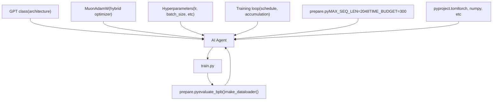
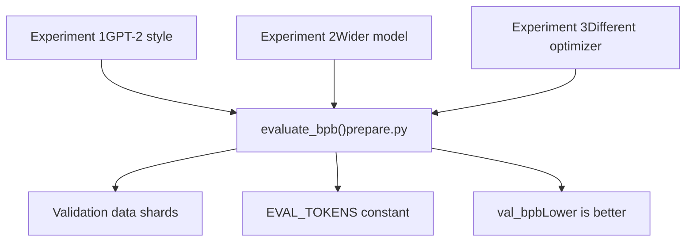
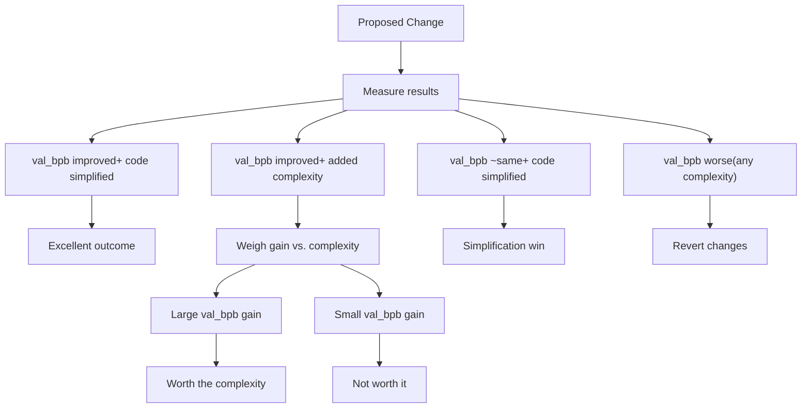

# Key Design Principles

Relevant source files

-   [README.md](https://github.com/karpathy/autoresearch/blob/e6d79c12/README.md?plain=1)
-   [program.md](https://github.com/karpathy/autoresearch/blob/e6d79c12/program.md?plain=1)

This document explains the core design decisions that enable `autoresearch` to function as an autonomous research system. These principles define **what the agent can and cannot modify**, **how experiments are compared fairly**, and **why the system is architected with specific constraints**.

For the overall system architecture and component interaction, see [System Architecture](https://github.com/karpathy/autoresearch/blob/e6d79c12/System Architecture) For details on individual components, see [Core Components](https://github.com/karpathy/autoresearch/blob/e6d79c12/Core Components) For how these principles affect agent operation, see [Agent Operation](https://github.com/karpathy/autoresearch/blob/e6d79c12/Agent Operation)

---

## Purpose and Scope

The `autoresearch` system is built on a foundation of **hard constraints** and **soft guidelines** that together enable autonomous experimentation while ensuring meaningful, comparable results. The design philosophy prioritizes:

1.  **Fair comparison** across all experiments.
2.  **Autonomous operation** without human intervention.
3.  **Rapid iteration** (multiple experiments per hour).
4.  **Simplicity** in both architecture and experiment tracking.

These principles manifest as explicit constraints in the codebase, documented primarily in [README.md61-66](https://github.com/karpathy/autoresearch/blob/e6d79c12/README.md?plain=1#L61-L66) and [program.md23-38](https://github.com/karpathy/autoresearch/blob/e6d79c12/program.md?plain=1#L23-L38)

Sources: [README.md61-66](https://github.com/karpathy/autoresearch/blob/e6d79c12/README.md?plain=1#L61-L66) [program.md23-38](https://github.com/karpathy/autoresearch/blob/e6d79c12/program.md?plain=1#L23-L38)

---

## The Single Modifiable File Constraint

### Design Decision

The agent may **only modify** `train.py`. All other system files are **read-only**.

**Modifiable:**

-   `train.py` — model architecture, optimizer, hyperparameters, training loop [README.md14](https://github.com/karpathy/autoresearch/blob/e6d79c12/README.md?plain=1#L14-L14)

**Immutable:**

-   `prepare.py` — fixed constants, data pipeline, tokenizer, evaluation harness [README.md13](https://github.com/karpathy/autoresearch/blob/e6d79c12/README.md?plain=1#L13-L13)
-   `program.md` — agent instructions [README.md15](https://github.com/karpathy/autoresearch/blob/e6d79c12/README.md?plain=1#L15-L15)
-   `pyproject.toml` — dependency lock [README.md58](https://github.com/karpathy/autoresearch/blob/e6d79c12/README.md?plain=1#L58-L58)

Sources: [README.md11-15](https://github.com/karpathy/autoresearch/blob/e6d79c12/README.md?plain=1#L11-L15) [README.md63](https://github.com/karpathy/autoresearch/blob/e6d79c12/README.md?plain=1#L63-L63) [program.md25-31](https://github.com/karpathy/autoresearch/blob/e6d79c12/program.md?plain=1#L25-L31)

### Rationale

This constraint serves multiple purposes:

| Benefit | Explanation |
| --- | --- |
| **Manageable diffs** | Changes are confined to a single file, making Git diffs easy to review [README.md63](https://github.com/karpathy/autoresearch/blob/e6d79c12/README.md?plain=1#L63-L63) |
| **Clear scope** | Agent knows exactly what it can and cannot touch [program.md25-31](https://github.com/karpathy/autoresearch/blob/e6d79c12/program.md?plain=1#L25-L31) |
| **Stable evaluation** | Evaluation harness cannot be accidentally modified [program.md31](https://github.com/karpathy/autoresearch/blob/e6d79c12/program.md?plain=1#L31-L31) |
| **Simple recovery** | Failed experiments are trivially reverted with `git reset` [program.md104](https://github.com/karpathy/autoresearch/blob/e6d79c12/program.md?plain=1#L104-L104) |

The constraint is enforced by convention (documented in [program.md25-31](https://github.com/karpathy/autoresearch/blob/e6d79c12/program.md?plain=1#L25-L31)), not by technical restrictions. The agent is trusted to follow the rules.

### Mapping Natural Language Goals to Code Entities

Sources: [README.md13-15](https://github.com/karpathy/autoresearch/blob/e6d79c12/README.md?plain=1#L13-L15) [program.md25-31](https://github.com/karpathy/autoresearch/blob/e6d79c12/program.md?plain=1#L25-L31)

---

## Fixed Time Budget

### Design Decision

All experiments train for exactly **5 minutes** (300 seconds) of wall-clock training time, excluding startup and compilation [README.md17](https://github.com/karpathy/autoresearch/blob/e6d79c12/README.md?plain=1#L17-L17) This is defined as a constant in the infrastructure layer.

The training loop in `train.py` checks elapsed time and terminates when the budget is exhausted [README.md64](https://github.com/karpathy/autoresearch/blob/e6d79c12/README.md?plain=1#L64-L64)

Sources: [README.md17](https://github.com/karpathy/autoresearch/blob/e6d79c12/README.md?plain=1#L17-L17) [README.md64](https://github.com/karpathy/autoresearch/blob/e6d79c12/README.md?plain=1#L64-L64) [program.md23](https://github.com/karpathy/autoresearch/blob/e6d79c12/program.md?plain=1#L23-L23)

### Why This Matters

Fixed time budgets enable **apples-to-apples comparison**:

| Variable | Without Fixed Time | With Fixed Time |
| --- | --- | --- |
| Model size | Larger models train slower → fewer steps | All models get same time → fair comparison |
| Batch size | Larger batches → fewer steps | All configurations get 300 seconds |
| Architecture | Complex architectures penalized | Complexity cost is explicit in time usage |

A model that achieves lower `val_bpb` in the same time budget is genuinely better, regardless of model size, batch size, or architectural complexity [README.md64](https://github.com/karpathy/autoresearch/blob/e6d79c12/README.md?plain=1#L64-L64)

Sources: [README.md64](https://github.com/karpathy/autoresearch/blob/e6d79c12/README.md?plain=1#L64-L64) [program.md33](https://github.com/karpathy/autoresearch/blob/e6d79c12/program.md?plain=1#L33-L33)

### Implementation Details

The time budget is measured as **wall-clock training time**:

> **[Mermaid sequence]**
> *(图表结构无法解析)*

Sources: [README.md17](https://github.com/karpathy/autoresearch/blob/e6d79c12/README.md?plain=1#L17-L17) [README.md64](https://github.com/karpathy/autoresearch/blob/e6d79c12/README.md?plain=1#L64-L64)

---

## Immutable Evaluation Harness

### Design Decision

The evaluation metric `val_bpb` (validation bits per byte) is calculated by the `evaluate_bpb` function in `prepare.py` [README.md13](https://github.com/karpathy/autoresearch/blob/e6d79c12/README.md?plain=1#L13-L13) This function **cannot be modified** by the agent [program.md31](https://github.com/karpathy/autoresearch/blob/e6d79c12/program.md?plain=1#L31-L31)

Key properties:

-   Uses fixed validation data [README.md13](https://github.com/karpathy/autoresearch/blob/e6d79c12/README.md?plain=1#L13-L13)
-   Vocabulary-size-independent metric [README.md17](https://github.com/karpathy/autoresearch/blob/e6d79c12/README.md?plain=1#L17-L17)
-   Consistent across all experiments [program.md33](https://github.com/karpathy/autoresearch/blob/e6d79c12/program.md?plain=1#L33-L33)

Sources: [README.md13](https://github.com/karpathy/autoresearch/blob/e6d79c12/README.md?plain=1#L13-L13) [README.md17](https://github.com/karpathy/autoresearch/blob/e6d79c12/README.md?plain=1#L17-L17) [program.md31](https://github.com/karpathy/autoresearch/blob/e6d79c12/program.md?plain=1#L31-L31)

### Why Vocabulary-Size Independence Matters

The BPB (bits per byte) metric is calculated to be independent of vocabulary size because it measures how well the model compresses the **original byte-level data**, not how well it predicts tokens [README.md17](https://github.com/karpathy/autoresearch/blob/e6d79c12/README.md?plain=1#L17-L17) This enables:

| Experiment Type | Why BPB Works |
| --- | --- |
| Change vocab size | Fair comparison — metric doesn't change with vocab [README.md17](https://github.com/karpathy/autoresearch/blob/e6d79c12/README.md?plain=1#L17-L17) |
| Byte-level model | Can compete directly with subword models |
| Character-level model | Same metric applies |
| Different tokenizers | All measured on same byte-level compression |

Sources: [README.md17](https://github.com/karpathy/autoresearch/blob/e6d79c12/README.md?plain=1#L17-L17) [program.md33](https://github.com/karpathy/autoresearch/blob/e6d79c12/program.md?plain=1#L33-L33)

### Evaluation Consistency

Sources: [README.md13](https://github.com/karpathy/autoresearch/blob/e6d79c12/README.md?plain=1#L13-L13) [program.md31](https://github.com/karpathy/autoresearch/blob/e6d79c12/program.md?plain=1#L31-L31)

---

## The Simplicity Criterion

### Design Principle

From [program.md37](https://github.com/karpathy/autoresearch/blob/e6d79c12/program.md?plain=1#L37-L37):

> **Simplicity criterion**: All else being equal, simpler is better. A small improvement that adds ugly complexity is not worth it. Conversely, removing something and getting equal or better results is a great outcome — that's a simplification win.

This is a **soft constraint** that guides agent decision-making but is not technically enforced.

### Decision Matrix

Sources: [program.md37](https://github.com/karpathy/autoresearch/blob/e6d79c12/program.md?plain=1#L37-L37)

---

## Dependency Lock

### Constraint

The agent **cannot install new packages** or modify `pyproject.toml` [program.md30](https://github.com/karpathy/autoresearch/blob/e6d79c12/program.md?plain=1#L30-L30) All experiments must use the existing dependency set.

Sources: [README.md58](https://github.com/karpathy/autoresearch/blob/e6d79c12/README.md?plain=1#L58-L58) [program.md30](https://github.com/karpathy/autoresearch/blob/e6d79c12/program.md?plain=1#L30-L30)

### Why This Matters

**Reproducibility:**

-   All experiments run in the same environment.
-   No dependency version drift.
-   Results are comparable across time.

**Simplicity:**

-   No dependency management overhead [README.md65](https://github.com/karpathy/autoresearch/blob/e6d79c12/README.md?plain=1#L65-L65)
-   Agent focuses on model improvements, not environment setup.

Sources: [README.md65](https://github.com/karpathy/autoresearch/blob/e6d79c12/README.md?plain=1#L65-L65) [program.md30](https://github.com/karpathy/autoresearch/blob/e6d79c12/program.md?plain=1#L30-L30)

---

## Soft Constraints

### VRAM Usage

From [program.md35](https://github.com/karpathy/autoresearch/blob/e6d79c12/program.md?plain=1#L35-L35):

> **VRAM** is a soft constraint. Some increase is acceptable for meaningful val\_bpb gains, but it should not blow up dramatically.

This is monitored but not strictly enforced. The metric `peak_vram_mb` is logged in `results.tsv` to track memory usage [program.md76](https://github.com/karpathy/autoresearch/blob/e6d79c12/program.md?plain=1#L76-L76)

Sources: [program.md35](https://github.com/karpathy/autoresearch/blob/e6d79c12/program.md?plain=1#L35-L35) [program.md76](https://github.com/karpathy/autoresearch/blob/e6d79c12/program.md?plain=1#L76-L76)

### Crash Handling

From [program.md110](https://github.com/karpathy/autoresearch/blob/e6d79c12/program.md?plain=1#L110-L110):

> If a run crashes (OOM, or a bug, or etc.), use your judgment: If it's something dumb and easy to fix (e.g. a typo, a missing import), fix it and re-run. If the idea itself is fundamentally broken, just skip it, log "crash" as the status in the tsv, and move on.

Crashes are **soft failures**:

-   Simple bugs (typos, imports) → fix and retry.
-   Fundamental issues (OOM, architectural problems) → log and skip.
-   Logged as `status=crash` in `results.tsv` [program.md77](https://github.com/karpathy/autoresearch/blob/e6d79c12/program.md?plain=1#L77-L77)

Sources: [program.md110](https://github.com/karpathy/autoresearch/blob/e6d79c12/program.md?plain=1#L110-L110) [program.md77](https://github.com/karpathy/autoresearch/blob/e6d79c12/program.md?plain=1#L77-L77)

---

## Design Principles Summary

### The Core Tradeoff

The system trades **flexibility for validity**:

**What you sacrifice:**

-   Cannot modify evaluation [program.md31](https://github.com/karpathy/autoresearch/blob/e6d79c12/program.md?plain=1#L31-L31)
-   Cannot change time budget [program.md23](https://github.com/karpathy/autoresearch/blob/e6d79c12/program.md?plain=1#L23-L23)
-   Cannot install new packages [program.md30](https://github.com/karpathy/autoresearch/blob/e6d79c12/program.md?plain=1#L30-L30)
-   Cannot modify multiple files [program.md26](https://github.com/karpathy/autoresearch/blob/e6d79c12/program.md?plain=1#L26-L26)

**What you gain:**

-   All results are comparable [README.md64](https://github.com/karpathy/autoresearch/blob/e6d79c12/README.md?plain=1#L64-L64)
-   No evaluation hacking.
-   Clean experiment history [program.md103-104](https://github.com/karpathy/autoresearch/blob/e6d79c12/program.md?plain=1#L103-L104)
-   Fast iteration (~12 experiments/hour) [README.md64](https://github.com/karpathy/autoresearch/blob/e6d79c12/README.md?plain=1#L64-L64)
-   Reproducible research.

This design ensures that improvements in `val_bpb` represent **genuine model improvements**, not artifacts of evaluation inconsistency or unfair comparison.

Sources: [README.md61-66](https://github.com/karpathy/autoresearch/blob/e6d79c12/README.md?plain=1#L61-L66) [program.md23-38](https://github.com/karpathy/autoresearch/blob/e6d79c12/program.md?plain=1#L23-L38)
