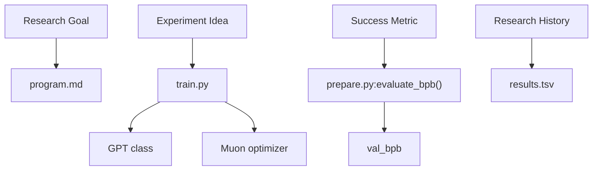
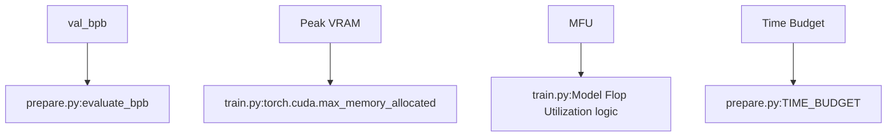

# Glossary

Relevant source files

-   [README.md](https://github.com/karpathy/autoresearch/blob/e6d79c12/README.md?plain=1)
-   [analysis.ipynb](https://github.com/karpathy/autoresearch/blob/e6d79c12/analysis.ipynb)
-   [prepare.py](https://github.com/karpathy/autoresearch/blob/e6d79c12/prepare.py)
-   [program.md](https://github.com/karpathy/autoresearch/blob/e6d79c12/program.md?plain=1)
-   [pyproject.toml](https://github.com/karpathy/autoresearch/blob/e6d79c12/pyproject.toml)
-   [train.py](https://github.com/karpathy/autoresearch/blob/e6d79c12/train.py)

This page provides a high-level overview of the specialized terminology, quantitative metrics, and architectural concepts used within the `autoresearch` codebase. It serves as a bridge between natural language research goals and the underlying Python implementation.

## Overview of the Research Environment

The `autoresearch` system operates as an autonomous loop where an AI agent modifies a training script, executes it, and decides whether to keep or discard the changes based on a fixed set of criteria.

### System Interaction Diagram

This diagram illustrates how high-level research concepts map to specific files and functions within the codebase.

**Natural Language to Code Entity Space**

Sources: [README.md11-17](https://github.com/karpathy/autoresearch/blob/e6d79c12/README.md?plain=1#L11-L17) [program.md21-33](https://github.com/karpathy/autoresearch/blob/e6d79c12/program.md?plain=1#L21-L33) [prepare.py231-255](https://github.com/karpathy/autoresearch/blob/e6d79c12/prepare.py#L231-L255)

---

## Metrics and Optimization Terms

Quantitative evaluation is the core of the autonomous decision-making process. The system relies on a single ground-truth metric and a set of performance indicators to determine if an architectural change is beneficial.

-   **val\_bpb**: Validation Bits Per Byte. The primary success metric. It measures how efficiently the model compresses the validation data, independent of the vocabulary size.
-   **Frontier**: The set of experiments that represent the current best performance. In Git terms, this is the head of the active research branch.
-   **Keep Rate**: The percentage of experiments that successfully improve the model and are merged into the main line of research.
-   **Time Budget**: A strictly enforced 5-minute wall-clock limit for training, ensuring that improvements are measured by their efficiency within a fixed compute window.

For detailed definitions and the mathematical basis of these terms, see **[Metrics and Optimization Terms](/karpathy/autoresearch/10.1-metrics-and-optimization-terms)**.

### Performance Tracking Mapping

**Metric Space to Code Implementation**

Sources: [prepare.py30-32](https://github.com/karpathy/autoresearch/blob/e6d79c12/prepare.py#L30-L32) [train.py446-455](https://github.com/karpathy/autoresearch/blob/e6d79c12/train.py#L446-L455) [analysis.ipynb75-78](https://github.com/karpathy/autoresearch/blob/e6d79c12/analysis.ipynb#L75-L78)

---

## Architecture and System Terms

The `autoresearch` codebase utilizes a modern transformer architecture with several non-standard components designed for high-efficiency training on single GPUs.

-   **Muon**: A specialized optimizer used for internal matrix parameters, often paired with AdamW for other weights.
-   **ResFormer / Value Embedding**: An architectural feature where values are mixed with input-dependent gates, often appearing in the `CausalSelfAttention` class.
-   **Window Pattern**: A configuration for attention masks (e.g., "SSSL" for Sliding/Sliding/Sliding/Long) that dictates how many previous tokens a layer can attend to.
-   **Simplicity Criterion**: A heuristic used by the agent to favor shorter, cleaner code when performance gains are marginal.
-   **Agent Lifecycle**: The state transitions an experiment undergoes: `commit` -> `run` -> `extract` -> `keep`/`discard`/`crash`.

For a deep dive into the transformer implementation and the specific research jargon used in `program.md`, see **[Architecture and System Terms](/karpathy/autoresearch/10.2-architecture-and-system-terms)**.

### Architectural Component Reference

| Term | Code Pointer | Role |
| --- | --- | --- |
| **Muon** | `train.py:330-380` (approx) | Optimizer for orthogonal matrix updates |
| **RoPE** | `train.py:183-200` | Rotary Positional Embeddings |
| **Window Pattern** | `train.py:33-40` | Attention span configuration in `GPTConfig` |
| **Best-fit Packing** | `prepare.py:210-230` | Dataloader logic to minimize padding tokens |
| **BPE** | `prepare.py:141-160` | Byte Pair Encoding via `rustbpe` |

Sources: [train.py33-40](https://github.com/karpathy/autoresearch/blob/e6d79c12/train.py#L33-L40) [train.py183-200](https://github.com/karpathy/autoresearch/blob/e6d79c12/train.py#L183-L200) [prepare.py141-160](https://github.com/karpathy/autoresearch/blob/e6d79c12/prepare.py#L141-L160) [program.md37-40](https://github.com/karpathy/autoresearch/blob/e6d79c12/program.md?plain=1#L37-L40)
