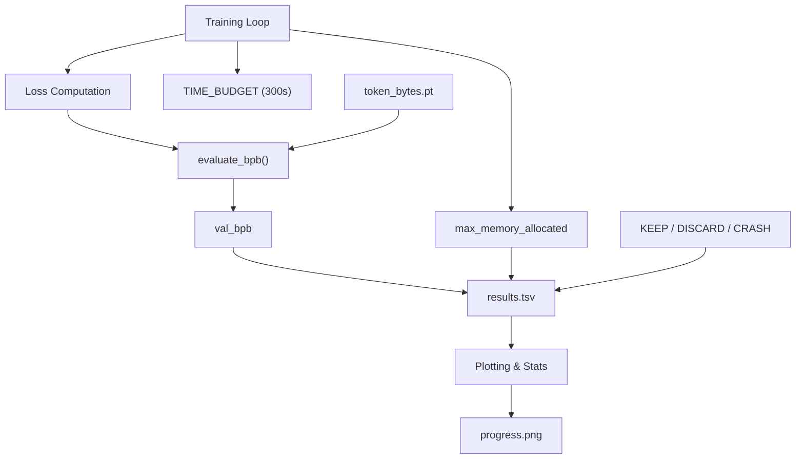
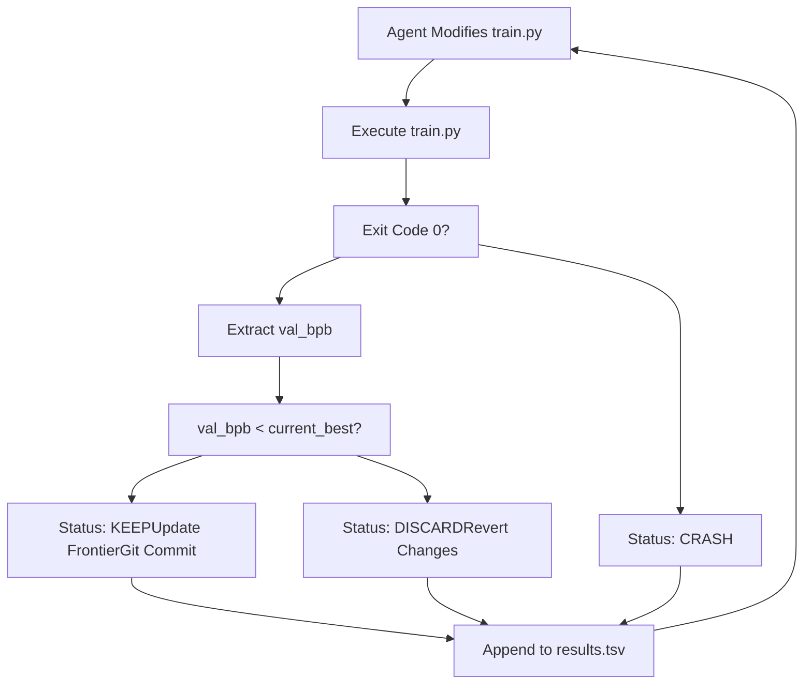

# Metrics and Optimization Terms

Relevant source files

-   [analysis.ipynb](https://github.com/karpathy/autoresearch/blob/e6d79c12/analysis.ipynb)
-   [prepare.py](https://github.com/karpathy/autoresearch/blob/e6d79c12/prepare.py)
-   [train.py](https://github.com/karpathy/autoresearch/blob/e6d79c12/train.py)

This page defines the quantitative metrics and optimization terminology used throughout the `autoresearch` system. These terms govern how the autonomous agent evaluates architectural changes, manages the experiment lifecycle, and tracks progress over time.

## Core Performance Metrics

The system relies on a single primary objective function (`val_bpb`) constrained by a strict temporal budget.

### Validation Bits Per Byte (val\_bpb)

`val_bpb` is the primary metric for measuring model performance. Unlike standard Cross Entropy loss, which depends on the specific vocabulary size of the tokenizer, BPB provides a vocabulary-independent measure of compression quality.

-   **Implementation**: It is calculated by taking the total evaluation loss (sum of cross-entropy), converting it to base-2 (bits) using `1/log(2)`, and dividing by the total number of raw UTF-8 bytes in the evaluation set [prepare.py228-232](https://github.com/karpathy/autoresearch/blob/e6d79c12/prepare.py#L228-L232)
-   **Significance**: A lower `val_bpb` indicates a more efficient model that predicts the data with higher certainty.
-   **Data Flow**: The `evaluate_bpb` function in `prepare.py` uses a pre-computed `token_bytes` tensor (mapping token IDs to their UTF-8 byte lengths) to ensure the denominator is constant across different model runs [prepare.py210-234](https://github.com/karpathy/autoresearch/blob/e6d79c12/prepare.py#L210-L234)

### Model Flops Utilization (MFU)

MFU measures the efficiency of the training implementation relative to the theoretical peak performance of the hardware.

-   **Calculation**: It estimates the number of floating-point operations performed per second (based on parameter count, sequence length, and batch size) and divides it by the GPU's peak theoretical bfloat16/float16 FLOPS [train.py461-470](https://github.com/karpathy/autoresearch/blob/e6d79c12/train.py#L461-L470)
-   **Usage**: While not the optimization objective, high MFU suggests that architectural changes are hardware-efficient.

### Memory Usage (peak\_vram\_mb)

The system tracks the maximum GPU memory allocated during a 5-minute run.

-   **Implementation**: Tracked via `torch.cuda.max_memory_allocated()` [train.py476](https://github.com/karpathy/autoresearch/blob/e6d79c12/train.py#L476-L476)
-   **Constraint**: If an experiment exceeds the available VRAM, it results in a `CRASH` status [analysis.ipynb48](https://github.com/karpathy/autoresearch/blob/e6d79c12/analysis.ipynb#L48-L48)

---

## Optimization and Tracking Terms

The following terms describe how the system manages the "Research Loop" and logs results.

### The Frontier and Running Min

The **Frontier** represents the current state-of-the-art (SOTA) for the specific `program.md` objective.

-   **running\_min**: In `analysis.ipynb`, this is the cumulative minimum of `val_bpb` across all `KEEP` experiments [analysis.ipynb112](https://github.com/karpathy/autoresearch/blob/e6d79c12/analysis.ipynb#L112-L112)
-   **Visual Representation**: In `progress.png`, the frontier is visualized as a step-line connecting the best-performing experiments found so far [analysis.ipynb113-115](https://github.com/karpathy/autoresearch/blob/e6d79c12/analysis.ipynb#L113-L115)

### Baseline BPB

The `baseline_bpb` is the performance of the initial `train.py` before any agent modifications. Every new experiment is evaluated against the current "best" `val_bpb` to decide if the change should be merged into the main research branch.

### Delta

The improvement (or regression) of an experiment relative to the previous successful experiment.

-   **Calculation**: `delta = prev_bpb - current_bpb` [analysis.ipynb200](https://github.com/karpathy/autoresearch/blob/e6d79c12/analysis.ipynb#L200-L200)
-   **Significance**: A positive delta indicates an improvement that justifies a `KEEP` decision.

### Keep Rate

The ratio of successful architectural improvements to the total number of valid (non-crashing) attempts.

-   **Formula**: `n_keep / (n_keep + n_discard)` [analysis.ipynb51](https://github.com/karpathy/autoresearch/blob/e6d79c12/analysis.ipynb#L51-L51)
-   **Context**: This metric reflects the "intelligence" or efficiency of the agent's proposal logic.

---

## Data Flow and Metric Extraction

The following diagram illustrates how raw training data is transformed into the metrics stored in `results.tsv`.

### Metric Generation Architecture

Title: "Metric Extraction and Logging Flow"

**Sources:** [prepare.py210-234](https://github.com/karpathy/autoresearch/blob/e6d79c12/prepare.py#L210-L234) [train.py470-485](https://github.com/karpathy/autoresearch/blob/e6d79c12/train.py#L470-L485) [analysis.ipynb25-32](https://github.com/karpathy/autoresearch/blob/e6d79c12/analysis.ipynb#L25-L32)

---

## Summary of Quantitative Constraints

| Term | Value / Implementation | File Reference |
| --- | --- | --- |
| **Time Budget** | 300 seconds (5 minutes) | [prepare.py31](https://github.com/karpathy/autoresearch/blob/e6d79c12/prepare.py#L31-L31) |
| **Eval Tokens** | 20,971,520 tokens (40 \* 524,288) | [prepare.py32](https://github.com/karpathy/autoresearch/blob/e6d79c12/prepare.py#L32-L32) |
| **Sequence Len** | 2048 | [prepare.py30](https://github.com/karpathy/autoresearch/blob/e6d79c12/prepare.py#L30-L30) |
| **Vocab Size** | 8192 (Default) | [prepare.py45](https://github.com/karpathy/autoresearch/blob/e6d79c12/prepare.py#L45-L45) |
| **Status Types** | `KEEP`, `DISCARD`, `CRASH` | [analysis.ipynb28](https://github.com/karpathy/autoresearch/blob/e6d79c12/analysis.ipynb#L28-L28) |

### System Logic Diagram

Title: "Decision Logic for Experiment Retention"

**Sources:** [analysis.ipynb42-51](https://github.com/karpathy/autoresearch/blob/e6d79c12/analysis.ipynb#L42-L51) [analysis.ipynb108-115](https://github.com/karpathy/autoresearch/blob/e6d79c12/analysis.ipynb#L108-L115) [analysis.ipynb198-200](https://github.com/karpathy/autoresearch/blob/e6d79c12/analysis.ipynb#L198-L200)

---

**Sources:**

-   Metric definitions and evaluation logic: [prepare.py26-52](https://github.com/karpathy/autoresearch/blob/e6d79c12/prepare.py#L26-L52) [prepare.py210-234](https://github.com/karpathy/autoresearch/blob/e6d79c12/prepare.py#L210-L234)
-   Hardware metrics (MFU, VRAM): [train.py461-478](https://github.com/karpathy/autoresearch/blob/e6d79c12/train.py#L461-L478)
-   Result processing and visualization: [analysis.ipynb20-52](https://github.com/karpathy/autoresearch/blob/e6d79c12/analysis.ipynb#L20-L52) [analysis.ipynb87-143](https://github.com/karpathy/autoresearch/blob/e6d79c12/analysis.ipynb#L87-L143) [analysis.ipynb198-200](https://github.com/karpathy/autoresearch/blob/e6d79c12/analysis.ipynb#L198-L200)
