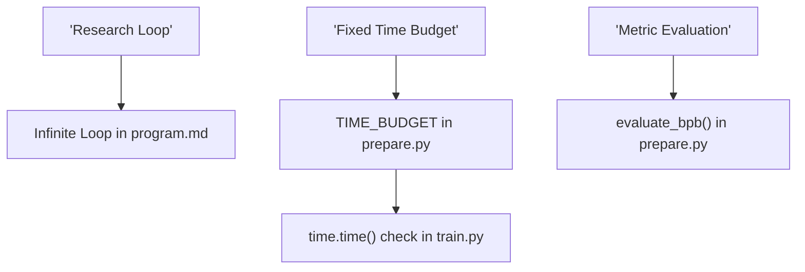
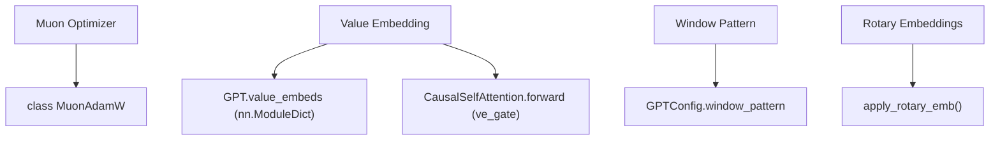

# Architecture and System Terms

Relevant source files

-   [.gitignore](https://github.com/karpathy/autoresearch/blob/e6d79c12/.gitignore)
-   [prepare.py](https://github.com/karpathy/autoresearch/blob/e6d79c12/prepare.py)
-   [program.md](https://github.com/karpathy/autoresearch/blob/e6d79c12/program.md?plain=1)
-   [train.py](https://github.com/karpathy/autoresearch/blob/e6d79c12/train.py)

This page defines the specific architectural concepts, algorithms, and system-level terms used within the `autoresearch` codebase. It serves as a technical reference for understanding the model components in `train.py` and the infrastructure constraints in `prepare.py`.

## Model Architecture Terms

The `autoresearch` model is a specialized GPT variant optimized for rapid convergence within a fixed time budget.

### Muon / NorMuon

**Muon** (Momentum Update Orthogonalization) is the primary optimizer used for all 2D internal weight matrices. In the `MuonAdamW` class, it applies an orthogonalization step to updates, which has been shown to improve convergence speed in transformer models. **NorMuon** refers to the specific configuration where Muon is combined with `F.rms_norm` on Query and Key vectors (QK-Norm) to stabilize the high learning rates Muon enables.

-   **Implementation**: `MuonAdamW` handles the partitioning of parameters. It applies Muon to parameters with `ndim == 2` and AdamW to all others (vectors/scalars).
-   **Key Logic**: The optimizer uses a Newton-Schulz iteration to orthogonalize updates.

Sources: [train.py255-309](https://github.com/karpathy/autoresearch/blob/e6d79c12/train.py#L255-L309) [train.py311-356](https://github.com/karpathy/autoresearch/blob/e6d79c12/train.py#L311-L356)

### ResFormer and Value Embedding

The architecture utilizes a "Value Embedding" (VE) strategy, sometimes referred to in the codebase context as **ResFormer**\-style residuals. Instead of the standard transformer where values ($V$) are derived solely from the hidden state, VE allows the model to look up values directly from an embedding table based on the current token, which are then mixed into the attention mechanism.

-   **Data Flow**: The `GPT` class initializes `value_embeds` as an `nn.ModuleDict`. In `CausalSelfAttention.forward`, if a layer has a value embedding, it is retrieved and mixed with the projection-derived $V$ using an input-dependent `ve_gate`.
-   **Alternating Layers**: VE is not applied to every layer. The function `has_ve` determines which layers receive it (typically alternating).

Sources: [train.py47-50](https://github.com/karpathy/autoresearch/blob/e6d79c12/train.py#L47-L50) [train.py74-88](https://github.com/karpathy/autoresearch/blob/e6d79c12/train.py#L74-L88) [train.py139-142](https://github.com/karpathy/autoresearch/blob/e6d79c12/train.py#L139-L142)

### Window Pattern

The `window_pattern` defines the attention span for each layer. It is a string (e.g., `"SSSL"`) where 'S' stands for "Sliding" (local attention) and 'L' stands for "Long" (full context attention).

-   **Implementation**: `_compute_window_sizes` converts this string into an array of integers. `S` maps to a fixed window (e.g., 128), and `L` maps to -1 (infinite/full context).
-   **Execution**: These sizes are passed to the Flash Attention kernel (`fa3.flash_attn_func`).

Sources: [train.py40-41](https://github.com/karpathy/autoresearch/blob/e6d79c12/train.py#L40-L41) [train.py93](https://github.com/karpathy/autoresearch/blob/e6d79c12/train.py#L93-L93) [train.py204-210](https://github.com/karpathy/autoresearch/blob/e6d79c12/train.py#L204-L210)

### RoPE (Rotary Positional Embeddings)

The model uses Rotary Positional Embeddings to encode sequence order.

-   **Precomputation**: The `GPT` class precomputes `cos` and `sin` buffers during initialization.
-   **Application**: The `apply_rotary_emb` function rotates the Query and Key representations before the attention score calculation.

Sources: [train.py52-58](https://github.com/karpathy/autoresearch/blob/e6d79c12/train.py#L52-L58) [train.py183-202](https://github.com/karpathy/autoresearch/blob/e6d79c12/train.py#L183-L202)

### Softcap

Softcapping is a technique to prevent logits or attention scores from exploding by passing them through a scaled `tanh` function. In the default `train.py`, it is applied to the final output logits.

-   **Implementation**: `(torch.tanh(logits / 30.0) * 30.0)` is applied before calculating the loss.

Sources: [train.py228](https://github.com/karpathy/autoresearch/blob/e6d79c12/train.py#L228-L228)

## System and Infrastructure Terms

### ASPECT\_RATIO

In the context of the `MuonAdamW` optimizer, `ASPECT_RATIO` refers to the ratio of the hidden dimension to the number of heads or other architectural dimensions. The optimizer uses this to scale learning rates for different parameter groups to ensure stable updates across varied layer shapes.

Sources: [train.py328-332](https://github.com/karpathy/autoresearch/blob/e6d79c12/train.py#L328-L332)

### Best-fit Packing

To maximize efficiency and avoid wasting tokens on padding, the system uses a **best-fit packing** algorithm in the dataloader.

-   **Logic**: Multiple documents are packed into a single `MAX_SEQ_LEN` (2048) sequence.
-   **BOS Alignment**: Each new document within a pack is preceded by a `BOS_TOKEN` (`<|reserved_0|>`).

Sources: [prepare.py30](https://github.com/karpathy/autoresearch/blob/e6d79c12/prepare.py#L30-L30) [prepare.py51](https://github.com/karpathy/autoresearch/blob/e6d79c12/prepare.py#L51-L51) [prepare.py221-255](https://github.com/karpathy/autoresearch/blob/e6d79c12/prepare.py#L221-L255)

### BPE and rustbpe

The system uses Byte Pair Encoding (BPE).

-   **rustbpe**: A high-performance library used to train the tokenizer on the `climbmix` dataset.
-   **tiktoken**: The trained merges are wrapped in a `tiktoken.Encoding` object for fast inference-time tokenization.

Sources: [prepare.py22-23](https://github.com/karpathy/autoresearch/blob/e6d79c12/prepare.py#L22-L23) [prepare.py161-175](https://github.com/karpathy/autoresearch/blob/e6d79c12/prepare.py#L161-L175)

### Time Budget

A core constraint of the `autoresearch` system. Every training run is hard-limited to **5 minutes** (300 seconds) of wall-clock time. This ensures that all architectural changes are evaluated on their ability to learn quickly, not just their final convergence point.

Sources: [program.md23](https://github.com/karpathy/autoresearch/blob/e6d79c12/program.md?plain=1#L23-L23) [prepare.py31](https://github.com/karpathy/autoresearch/blob/e6d79c12/prepare.py#L31-L31)

### Simplicity Criterion

A qualitative heuristic used by the agent to decide whether to `keep` a change. If an architectural change provides a negligible improvement but significantly increases code complexity, it is discarded. Conversely, code simplifications that maintain performance are highly valued.

Sources: [program.md37-38](https://github.com/karpathy/autoresearch/blob/e6d79c12/program.md?plain=1#L37-L38)

## Agent Lifecycle Terms

The agent manages experiments through a specific state machine reflected in the `results.tsv` file.

| Term | Definition | Code/System Association |
| --- | --- | --- |
| **keep** | The experiment improved `val_bpb`. The changes are committed to the main research branch. | `status` column in `results.tsv` |
| **discard** | The experiment did not improve `val_bpb` or was too complex. The agent performs a `git reset --hard`. | `status` column in `results.tsv` |
| **crash** | The code failed to execute (e.g., OOM, SyntaxError). The agent attempts a fix or moves on. | `val_bpb: 0.000000` in `results.tsv` |

Sources: [program.md71-89](https://github.com/karpathy/autoresearch/blob/e6d79c12/program.md?plain=1#L71-L89) [program.md102-110](https://github.com/karpathy/autoresearch/blob/e6d79c12/program.md?plain=1#L102-L110)

## Architectural Mapping

### Natural Language to Code Entity Space: Training Loop

This diagram maps the high-level research loop concepts to the specific functions and files that implement them.

Sources: [program.md94-106](https://github.com/karpathy/autoresearch/blob/e6d79c12/program.md?plain=1#L94-L106) [prepare.py31](https://github.com/karpathy/autoresearch/blob/e6d79c12/prepare.py#L31-L31) [train.py440-445](https://github.com/karpathy/autoresearch/blob/e6d79c12/train.py#L440-L445) [prepare.py257-285](https://github.com/karpathy/autoresearch/blob/e6d79c12/prepare.py#L257-L285)

### Natural Language to Code Entity Space: Model Components

This diagram maps architectural terms to their class and variable definitions in `train.py`.

Sources: [train.py255-309](https://github.com/karpathy/autoresearch/blob/e6d79c12/train.py#L255-L309) [train.py139-142](https://github.com/karpathy/autoresearch/blob/e6d79c12/train.py#L139-L142) [train.py74-88](https://github.com/karpathy/autoresearch/blob/e6d79c12/train.py#L74-L88) [train.py40-41](https://github.com/karpathy/autoresearch/blob/e6d79c12/train.py#L40-L41) [train.py52-58](https://github.com/karpathy/autoresearch/blob/e6d79c12/train.py#L52-L58)
