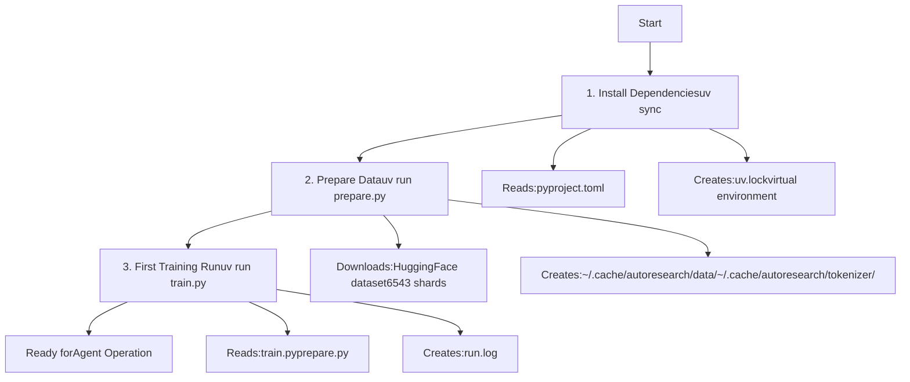
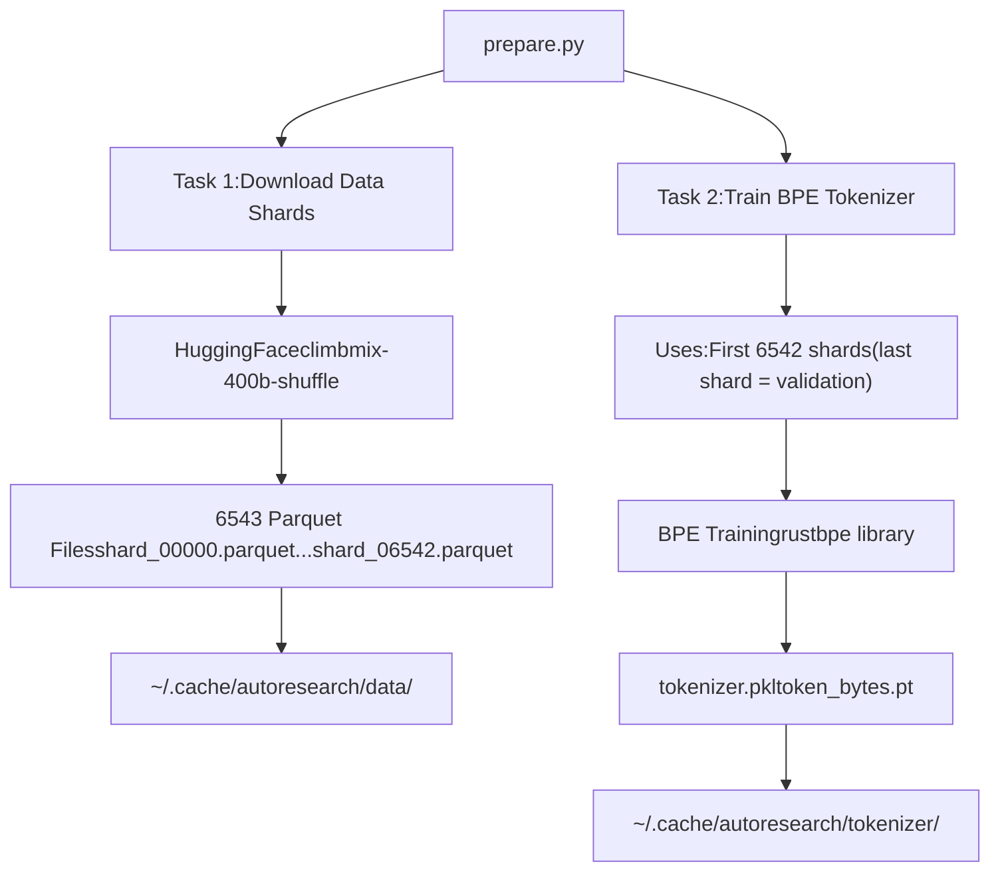
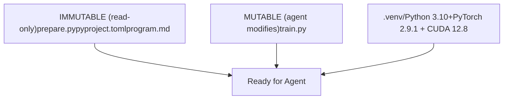

# Getting Started

Relevant source files

-   [.python-version](https://github.com/karpathy/autoresearch/blob/e6d79c12/.python-version)
-   [README.md](https://github.com/karpathy/autoresearch/blob/e6d79c12/README.md?plain=1)
-   [pyproject.toml](https://github.com/karpathy/autoresearch/blob/e6d79c12/pyproject.toml)

This guide provides step-by-step instructions for setting up the autoresearch environment and running your first training experiment. It covers installing dependencies, preparing data and tokenizer, and executing an initial training run to verify the system is working correctly.

For information about the system architecture and design principles, see [Autoresearch Overview](/karpathy/autoresearch/1-autoresearch-overview). For detailed documentation of individual components, see [Core Components](/karpathy/autoresearch/3-core-components). For information about how the AI agent operates autonomously, see [Agent Operation](/karpathy/autoresearch/4-agent-operation).

---

## Prerequisites

Before starting, ensure you have the following:

| Requirement | Specification | Notes |
| --- | --- | --- |
| **Hardware** | Single NVIDIA GPU | Tested on H100; other GPUs may work but require VRAM ≥40GB |
| **Operating System** | Linux | CUDA-enabled environment required |
| **Python** | 3.10 or higher | Specified in [.python-version1](https://github.com/karpathy/autoresearch/blob/e6d79c12/.python-version#L1-L1) |
| **Package Manager** | [uv](https://docs.astral.sh/uv/) | Astral's fast Python package manager |
| **Git** | Any recent version | For version control and agent branch management |

The system is designed to be self-contained and does not require distributed training infrastructure or complex configuration files.

**Sources:** [README.md23](https://github.com/karpathy/autoresearch/blob/e6d79c12/README.md?plain=1#L23-L23) [pyproject.toml6](https://github.com/karpathy/autoresearch/blob/e6d79c12/pyproject.toml#L6-L6) [.python-version1](https://github.com/karpathy/autoresearch/blob/e6d79c12/.python-version#L1-L1)

---

## Setup Overview

The setup process consists of three main stages, each represented by a single command:

**Diagram: Complete Setup Flow**


Each stage must be completed in order. The first two stages (`uv sync` and `uv run prepare.py`) are one-time operations, while the third stage (`uv run train.py`) is executed for every experiment.

**Sources:** [README.md27-38](https://github.com/karpathy/autoresearch/blob/e6d79c12/README.md?plain=1#L27-L38)

---

## Stage 1: Installing Dependencies

### Step 1.1: Install uv Package Manager

If you don't already have `uv` installed, install it following the [official instructions](https://docs.astral.sh/uv/getting-started/installation/):

```
curl -LsSf https://astral.sh/uv/install.sh | sh
```
### Step 1.2: Sync Dependencies

From the repository root directory, run:

```
uv sync
```
This command:

-   Reads dependency specifications from [pyproject.toml](https://github.com/karpathy/autoresearch/blob/e6d79c12/pyproject.toml)
-   Creates a virtual environment (typically `.venv/`)
-   Installs all required packages with exact versions
-   Generates `uv.lock` for reproducible builds

### Dependency Details

The [pyproject.toml7-17](https://github.com/karpathy/autoresearch/blob/e6d79c12/pyproject.toml#L7-L17) file specifies the following key dependencies:

| Package | Version | Purpose |
| --- | --- | --- |
| `torch` | 2.9.1 | PyTorch deep learning framework |
| `rustbpe` | ≥0.1.0 | Fast BPE tokenizer training |
| `tiktoken` | ≥0.11.0 | Tokenizer encoding utilities |
| `numpy` | ≥2.2.6 | Numerical operations |
| `pandas` | ≥2.3.3 | Data manipulation (for results analysis) |
| `matplotlib` | ≥3.10.8 | Visualization (for analysis notebook) |
| `kernels` | ≥0.11.7 | Custom CUDA kernels |

PyTorch is specifically sourced from the `pytorch-cu128` index ([pyproject.toml19-27](https://github.com/karpathy/autoresearch/blob/e6d79c12/pyproject.toml#L19-L27)), ensuring CUDA 12.8 compatibility.

### Verification

After `uv sync` completes, verify the installation:

```
uv run python -c "import torch; print(f'PyTorch {torch.__version__}, CUDA available: {torch.cuda.is_available()}')"
```
Expected output:

```
PyTorch 2.9.1, CUDA available: True
```
**Sources:** [README.md27-31](https://github.com/karpathy/autoresearch/blob/e6d79c12/README.md?plain=1#L27-L31) [pyproject.toml1-28](https://github.com/karpathy/autoresearch/blob/e6d79c12/pyproject.toml#L1-L28)

---

## Stage 2: Data Preparation

### Step 2.1: Run prepare.py

Execute the data preparation script:

```
uv run prepare.py
```
This is a **one-time operation** that takes approximately 2 minutes ([README.md33](https://github.com/karpathy/autoresearch/blob/e6d79c12/README.md?plain=1#L33-L33)). It performs two critical tasks:

1.  **Downloads training data** from HuggingFace (`climbmix-400b-shuffle` dataset)
2.  **Trains a BPE tokenizer** on the downloaded data

**Diagram: Data Preparation Pipeline**


### Why This Step is Critical

The data preparation step creates **immutable artifacts** that all experiments share:

-   **Fixed data split**: Managed by `prepare.py` utilities ([README.md13](https://github.com/karpathy/autoresearch/blob/e6d79c12/README.md?plain=1#L13-L13)).
-   **Fixed tokenizer**: All experiments use the same vocabulary and encoding.
-   **Fixed evaluation**: The `evaluate_bpb()` function in `prepare.py` uses these artifacts.

This ensures that performance differences between experiments reflect genuine model improvements rather than evaluation inconsistencies. See [Fair Comparison Philosophy](/karpathy/autoresearch/5.3-fair-comparison-philosophy) for more details.

**Sources:** [README.md13](https://github.com/karpathy/autoresearch/blob/e6d79c12/README.md?plain=1#L13-L13) [README.md33-34](https://github.com/karpathy/autoresearch/blob/e6d79c12/README.md?plain=1#L33-L34)

---

## Stage 3: Running Your First Experiment

### Step 3.1: Execute train.py

Run a single training experiment:

```
uv run train.py
```
This command will:

1.  Load the trained tokenizer from cache.
2.  Initialize the GPT model with default architecture.
3.  Train for exactly **5 minutes** ([README.md17](https://github.com/karpathy/autoresearch/blob/e6d79c12/README.md?plain=1#L17-L17)).
4.  Evaluate performance using `evaluate_bpb()` from `prepare.py`.
5.  Write results to `run.log`.

**Diagram: First Training Execution Flow**

### Expected Behavior

-   **Training Duration**: Fixed 5-minute time budget (wall clock), excluding startup/compilation ([README.md17](https://github.com/karpathy/autoresearch/blob/e6d79c12/README.md?plain=1#L17-L17)).
-   **Metric**: **val\_bpb** (validation bits per byte) — lower is better ([README.md17](https://github.com/karpathy/autoresearch/blob/e6d79c12/README.md?plain=1#L17-L17)).
-   **VRAM**: Peak VRAM is tracked as a soft constraint ([README.md64](https://github.com/karpathy/autoresearch/blob/e6d79c12/README.md?plain=1#L64-L64)).

### Verification Checklist

After your first training run, verify:

-   ✅ `run.log` exists and contains metrics.
-   ✅ `val_bpb` is reported.
-   ✅ Training completed in approximately 5 minutes (excluding startup).
-   ✅ No CUDA out-of-memory errors.

**Sources:** [README.md17](https://github.com/karpathy/autoresearch/blob/e6d79c12/README.md?plain=1#L17-L17) [README.md36-38](https://github.com/karpathy/autoresearch/blob/e6d79c12/README.md?plain=1#L36-L38) [README.md63-66](https://github.com/karpathy/autoresearch/blob/e6d79c12/README.md?plain=1#L63-L66)

---

## System State After Setup

Once all three stages are complete, your system is ready for autonomous agent operation:

**Diagram: System State After Complete Setup**


**Sources:** [README.md53-59](https://github.com/karpathy/autoresearch/blob/e6d79c12/README.md?plain=1#L53-L59)

---

## Next Steps

With setup complete, you can proceed to:

1.  **Review program.md**: Understand the baseline instructions provided to the agent ([README.md15](https://github.com/karpathy/autoresearch/blob/e6d79c12/README.md?plain=1#L15-L15)).
2.  **Start the autonomous research loop**: Instruct an AI agent (Claude/Codex) to read `program.md` and begin experiments ([README.md42-48](https://github.com/karpathy/autoresearch/blob/e6d79c12/README.md?plain=1#L42-L48)).

For detailed guidance on these steps, see [Running Your First Experiment](/karpathy/autoresearch/2.3-running-your-first-experiment).

**Sources:** [README.md15](https://github.com/karpathy/autoresearch/blob/e6d79c12/README.md?plain=1#L15-L15) [README.md42-48](https://github.com/karpathy/autoresearch/blob/e6d79c12/README.md?plain=1#L42-L48)
