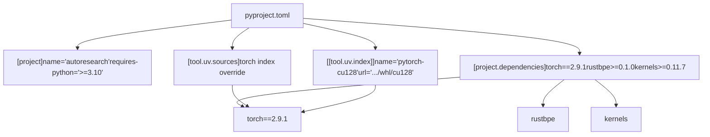

# Installation and Dependencies

Relevant source files

-   [.python-version](https://github.com/karpathy/autoresearch/blob/e6d79c12/.python-version)
-   [pyproject.toml](https://github.com/karpathy/autoresearch/blob/e6d79c12/pyproject.toml)
-   [uv.lock](https://github.com/karpathy/autoresearch/blob/e6d79c12/uv.lock)

This page covers the initial environment setup required to run `autoresearch` on your system. It explains the `uv` package manager, the dependency configuration in `pyproject.toml`, and the specific PyTorch CUDA 12.8 installation requirement.

## Prerequisites

Autoresearch requires specific hardware and software to operate correctly. The system is designed for **single-GPU operation only**.

### Hardware Requirements

| Component | Requirement | Notes |
| --- | --- | --- |
| GPU | Single NVIDIA GPU | Tested on H100; other NVIDIA GPUs supported |
| CUDA | CUDA 12.8 compatible | Required for PyTorch installation |
| VRAM | Varies by configuration | Default config uses ~44GB on H100 |

### Software Requirements

| Component | Version | Purpose |
| --- | --- | --- |
| Python | 3.10 or higher | Runtime environment [pyproject.toml6](https://github.com/karpathy/autoresearch/blob/e6d79c12/pyproject.toml#L6-L6) |
| uv | Latest stable | Package manager and dependency resolver |
| Git | Any recent version | Version control for experiment tracking |

Sources: [pyproject.toml6](https://github.com/karpathy/autoresearch/blob/e6d79c12/pyproject.toml#L6-L6) [README.md23](https://github.com/karpathy/autoresearch/blob/e6d79c12/README.md?plain=1#L23-L23) [README.md68-69](https://github.com/karpathy/autoresearch/blob/e6d79c12/README.md?plain=1#L68-L69)

## Package Manager: uv

Autoresearch uses `uv` as its package manager instead of traditional `pip` or `conda`. The `uv` tool provides fast dependency resolution and reproducible virtual environments through a lockfile system [uv.lock1-19](https://github.com/karpathy/autoresearch/blob/e6d79c12/uv.lock#L1-L19)

### Installing uv

```
curl -LsSf https://astral.sh/uv/install.sh | sh
```
The project uses `uv` for several reasons:

-   **Speed**: Significantly faster dependency resolution than pip.
-   **Reproducibility**: The `uv.lock` file ensures exact dependency versions across all research nodes [uv.lock1-3](https://github.com/karpathy/autoresearch/blob/e6d79c12/uv.lock#L1-L3)
-   **Simplicity**: Single tool handles virtual environments and package installation.
-   **PyTorch index support**: Clean handling of PyTorch's custom CUDA indexes via `tool.uv.sources` [pyproject.toml19-22](https://github.com/karpathy/autoresearch/blob/e6d79c12/pyproject.toml#L19-L22)

## Dependency Configuration

The `pyproject.toml` file defines all project dependencies and configuration.

### Dependency Architecture


Sources: [pyproject.toml1-28](https://github.com/karpathy/autoresearch/blob/e6d79c12/pyproject.toml#L1-L28)

### Core Dependencies

The project requires specific packages to support the autonomous research loop:

**Deep Learning & Optimization:**

-   `torch==2.9.1`: PyTorch with CUDA 12.8 support [pyproject.toml16](https://github.com/karpathy/autoresearch/blob/e6d79c12/pyproject.toml#L16-L16)
-   `kernels>=0.11.7`: Optimized CUDA kernels for training [pyproject.toml8](https://github.com/karpathy/autoresearch/blob/e6d79c12/pyproject.toml#L8-L8)

**Data Processing & Tokenization:**

-   `rustbpe>=0.1.0`: Fast Rust-based BPE tokenizer training [pyproject.toml14](https://github.com/karpathy/autoresearch/blob/e6d79c12/pyproject.toml#L14-L14)
-   `tiktoken>=0.11.0`: Tokenizer utilities [pyproject.toml15](https://github.com/karpathy/autoresearch/blob/e6d79c12/pyproject.toml#L15-L15)
-   `pyarrow>=21.0.0`: Parquet file handling for dataset shards [pyproject.toml12](https://github.com/karpathy/autoresearch/blob/e6d79c12/pyproject.toml#L12-L12)
-   `numpy>=2.2.6`: Numerical operations [pyproject.toml10](https://github.com/karpathy/autoresearch/blob/e6d79c12/pyproject.toml#L10-L10)

**Analysis & Infrastructure:**

-   `pandas>=2.3.3`: Results tracking and `results.tsv` analysis [pyproject.toml11](https://github.com/karpathy/autoresearch/blob/e6d79c12/pyproject.toml#L11-L11)
-   `matplotlib>=3.10.8`: Progress visualization [pyproject.toml9](https://github.com/karpathy/autoresearch/blob/e6d79c12/pyproject.toml#L9-L9)
-   `requests>=2.32.0`: Dataset downloading [pyproject.toml13](https://github.com/karpathy/autoresearch/blob/e6d79c12/pyproject.toml#L13-L13)

Sources: [pyproject.toml7-17](https://github.com/karpathy/autoresearch/blob/e6d79c12/pyproject.toml#L7-L17)

## PyTorch CUDA 12.8 Requirement

PyTorch with CUDA 12.8 support is not available on the standard PyPI. The project configures `uv` to pull from the official PyTorch wheel index.

### Installation Flow

> **[Mermaid sequence]**
> *(图表结构无法解析)*

Sources: [pyproject.toml19-28](https://github.com/karpathy/autoresearch/blob/e6d79c12/pyproject.toml#L19-L28)

The configuration uses three interconnected sections:

1.  **Dependency Declaration**: Specifies `torch==2.9.1` [pyproject.toml16](https://github.com/karpathy/autoresearch/blob/e6d79c12/pyproject.toml#L16-L16)
2.  **Source Override**: Maps `torch` to the `pytorch-cu128` index [pyproject.toml19-22](https://github.com/karpathy/autoresearch/blob/e6d79c12/pyproject.toml#L19-L22)
3.  **Index Definition**: Defines the URL `https://download.pytorch.org/whl/cu128` [pyproject.toml24-27](https://github.com/karpathy/autoresearch/blob/e6d79c12/pyproject.toml#L24-L27)

## Installing and Verifying

### Execution

To install all dependencies and create the virtual environment:

```
uv sync
```
Sources: [README.md30-31](https://github.com/karpathy/autoresearch/blob/e6d79c12/README.md?plain=1#L30-L31)

### Verification

Verify the installation by checking PyTorch's CUDA status:

```
uv run python -c "import torch; print(f'PyTorch: {torch.__version__}'); print(f'CUDA available: {torch.cuda.is_available()}'); print(f'CUDA version: {torch.version.cuda}')"
```
Expected output:

-   `PyTorch: 2.9.1+cu128`
-   `CUDA available: True`
-   `CUDA version: 12.8`

### Troubleshooting

-   **CUDA False**: Ensure NVIDIA drivers supporting CUDA 12.8 are installed.
-   **Python Version**: If your system Python is below 3.10, `uv` will attempt to manage a compatible version automatically if configured, or you must provide one [pyproject.toml6](https://github.com/karpathy/autoresearch/blob/e6d79c12/pyproject.toml#L6-L6)
-   **Index Errors**: Ensure you have network access to `download.pytorch.org`.

Sources: [pyproject.toml6](https://github.com/karpathy/autoresearch/blob/e6d79c12/pyproject.toml#L6-L6) [pyproject.toml16](https://github.com/karpathy/autoresearch/blob/e6d79c12/pyproject.toml#L16-L16) [pyproject.toml26](https://github.com/karpathy/autoresearch/blob/e6d79c12/pyproject.toml#L26-L26)
