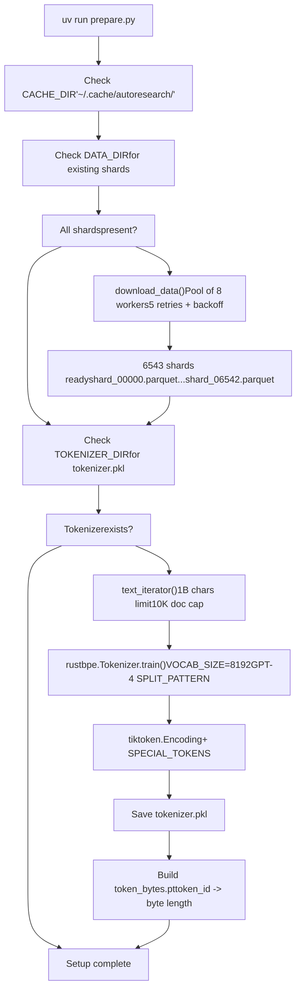
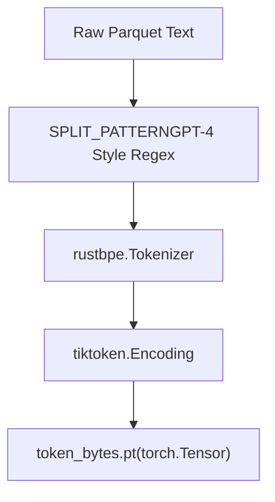
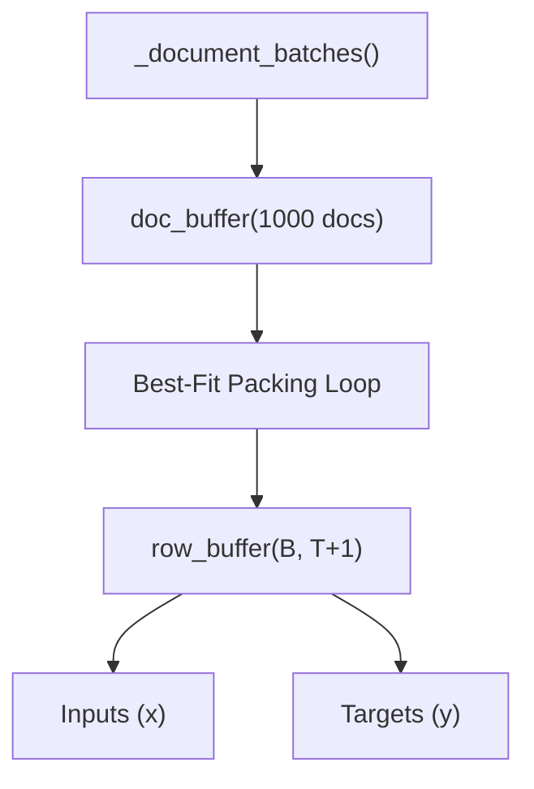

# Data Preparation

Relevant source files

-   [README.md](https://github.com/karpathy/autoresearch/blob/e6d79c12/README.md?plain=1)
-   [prepare.py](https://github.com/karpathy/autoresearch/blob/e6d79c12/prepare.py)

## Purpose and Scope

This page documents the data preparation process in autoresearch, specifically how [\`prepare.py\`](https://github.com/karpathy/autoresearch/blob/e6d79c12/`prepare.py`)() sets up the training environment. Data preparation is a **one-time setup step** that must be completed before running any training experiments.

The preparation process accomplishes three primary tasks:

1.  **Data Acquisition**: Downloads parquet shards from the `climbmix-400b-shuffle` dataset [prepare.py41-44](https://github.com/karpathy/autoresearch/blob/e6d79c12/prepare.py#L41-L44)
2.  **Tokenizer Training**: Trains a custom Byte Pair Encoding (BPE) tokenizer using `rustbpe` and converts it to `tiktoken` format [prepare.py141-182](https://github.com/karpathy/autoresearch/blob/e6d79c12/prepare.py#L141-L182)
3.  **Infrastructure Provisioning**: Generates the `token_bytes.pt` lookup table used for vocabulary-independent evaluation [prepare.py184-196](https://github.com/karpathy/autoresearch/blob/e6d79c12/prepare.py#L184-L196)

**Sources:** [prepare.py1-10](https://github.com/karpathy/autoresearch/blob/e6d79c12/prepare.py#L1-L10) [README.md13-15](https://github.com/karpathy/autoresearch/blob/e6d79c12/README.md?plain=1#L13-L15)

---

## Execution Overview

Running [\`prepare.py\`](https://github.com/karpathy/autoresearch/blob/e6d79c12/`prepare.py`)() performs both initial setup and defines the runtime utilities used during the autonomous research loop. The script is considered **infrastructure** and is not modified by the agent [README.md55](https://github.com/karpathy/autoresearch/blob/e6d79c12/README.md?plain=1#L55-L55)

```
# Standard one-time setupuv run prepare.py # Quick test with fewer shardsuv run prepare.py --num-shards 8
```
The script exports key classes and functions ([\`Tokenizer\`](https://github.com/karpathy/autoresearch/blob/e6d79c12/`Tokenizer`)(), [\`make\_dataloader\`](https://github.com/karpathy/autoresearch/blob/e6d79c12/`make_dataloader`)(), [\`evaluate\_bpb\`](https://github.com/karpathy/autoresearch/blob/e6d79c12/`evaluate_bpb`)()) that `train.py` imports to handle data flow and validation.

**Sources:** [prepare.py5-10](https://github.com/karpathy/autoresearch/blob/e6d79c12/prepare.py#L5-L10) [README.md33-34](https://github.com/karpathy/autoresearch/blob/e6d79c12/README.md?plain=1#L33-L34)

---

## Execution Flow

The following diagram illustrates the data flow from remote Hugging Face shards to local serialized artifacts.


**Execution Phases:**

| Phase | Primary Function | Logic |
| --- | --- | --- |
| **Data Download** | [\`download\_data\`](https://github.com/karpathy/autoresearch/blob/e6d79c12/`download_data`)() | Downloads up to 6543 shards in parallel. Uses `.tmp` files to ensure atomic writes [prepare.py70-75](https://github.com/karpathy/autoresearch/blob/e6d79c12/prepare.py#L70-L75) |
| **Tokenizer Training** | [\`train\_tokenizer\`](https://github.com/karpathy/autoresearch/blob/e6d79c12/`train_tokenizer`)() | Learns 8176 merges from the training shards and adds 16 special/reserved tokens [prepare.py162-169](https://github.com/karpathy/autoresearch/blob/e6d79c12/prepare.py#L162-L169) |

**Sources:** [prepare.py57-88](https://github.com/karpathy/autoresearch/blob/e6d79c12/prepare.py#L57-L88) [prepare.py119-139](https://github.com/karpathy/autoresearch/blob/e6d79c12/prepare.py#L119-L139) [prepare.py141-196](https://github.com/karpathy/autoresearch/blob/e6d79c12/prepare.py#L141-L196)

---

## Cache Directory Structure

All artifacts are stored in a centralized cache to persist across different experiment branches.

| Path Component | Code Constant | Purpose |
| --- | --- | --- |
| `~/.cache/autoresearch/` | [\`CACHE\_DIR\`](https://github.com/karpathy/autoresearch/blob/e6d79c12/`CACHE_DIR`)() | Root for all system-generated data. |
| `.../data/` | [\`DATA\_DIR\`](https://github.com/karpathy/autoresearch/blob/e6d79c12/`DATA_DIR`)() | Stores `.parquet` shards from Hugging Face. |
| `.../tokenizer/` | [\`TOKENIZER\_DIR\`](https://github.com/karpathy/autoresearch/blob/e6d79c12/`TOKENIZER_DIR`)() | Stores `tokenizer.pkl` and `token_bytes.pt`. |

The validation set is pinned to the very last shard ([\`VAL\_SHARD = 6542\`](https://github.com/karpathy/autoresearch/blob/e6d79c12/`VAL_SHARD = 6542`)()) to ensure that no training data leaks into the evaluation metric across different runs [prepare.py127](https://github.com/karpathy/autoresearch/blob/e6d79c12/prepare.py#L127-L127)

**Sources:** [prepare.py38-44](https://github.com/karpathy/autoresearch/blob/e6d79c12/prepare.py#L38-L44) [prepare.py127](https://github.com/karpathy/autoresearch/blob/e6d79c12/prepare.py#L127-L127)

---

## Tokenizer Implementation

The system uses a Byte Pair Encoding (BPE) scheme. It bridges the "Natural Language Space" (raw text) to the "Code Entity Space" (integer tokens used by the GPT model).


### Configuration

-   **Vocabulary Size**: 8192 tokens [prepare.py45](https://github.com/karpathy/autoresearch/blob/e6d79c12/prepare.py#L45-L45)
-   **Special Tokens**: Includes `<|reserved_0|>` (used as `BOS_TOKEN`) through `<|reserved_3|>` [prepare.py50-51](https://github.com/karpathy/autoresearch/blob/e6d79c12/prepare.py#L50-L51)
-   **Split Pattern**: A complex regex `SPLIT_PATTERN` that handles contractions, numbers, and whitespace to prevent sub-optimal merges [prepare.py48](https://github.com/karpathy/autoresearch/blob/e6d79c12/prepare.py#L48-L48)

### Token Bytes Lookup

A critical component for the `val_bpb` metric is the `token_bytes.pt` file. It maps every token ID back to the number of UTF-8 bytes it represents [prepare.py184-192](https://github.com/karpathy/autoresearch/blob/e6d79c12/prepare.py#L184-L192) Special tokens are assigned a length of 0 so they do not contribute to the "byte count" in the denominator of the BPB calculation [prepare.py190](https://github.com/karpathy/autoresearch/blob/e6d79c12/prepare.py#L190-L190)

**Sources:** [prepare.py45-51](https://github.com/karpathy/autoresearch/blob/e6d79c12/prepare.py#L45-L51) [prepare.py184-196](https://github.com/karpathy/autoresearch/blob/e6d79c12/prepare.py#L184-L196)

---

## Data Loading and Evaluation Utilities

The `prepare.py` file provides the infrastructure that `train.py` uses to feed the model.

### Best-Fit Packing Dataloader

The [\`make\_dataloader\`](https://github.com/karpathy/autoresearch/blob/e6d79c12/`make_dataloader`)() function implements a "best-fit packing" strategy. Instead of simple truncation or padding, it attempts to pack multiple documents into a single sequence length (`MAX_SEQ_LEN = 2048`) to maximize efficiency [prepare.py30-31](https://github.com/karpathy/autoresearch/blob/e6d79c12/prepare.py#L30-L31)


### Evaluation Harness (`evaluate_bpb`)

The [\`evaluate\_bpb\`](https://github.com/karpathy/autoresearch/blob/e6d79c12/`evaluate_bpb`)() function is the "gold standard" for the system. It:

1.  Loads the validation shard (`shard_06542.parquet`) [prepare.py247](https://github.com/karpathy/autoresearch/blob/e6d79c12/prepare.py#L247-L247)
2.  Calculates cross-entropy loss for a fixed number of tokens (`EVAL_TOKENS`) [prepare.py32](https://github.com/karpathy/autoresearch/blob/e6d79c12/prepare.py#L32-L32)
3.  Converts the result from "nats" to "bits per byte" using the `token_bytes` lookup [prepare.py345-348](https://github.com/karpathy/autoresearch/blob/e6d79c12/prepare.py#L345-L348)

**Sources:** [prepare.py30-32](https://github.com/karpathy/autoresearch/blob/e6d79c12/prepare.py#L30-L32) [prepare.py260-321](https://github.com/karpathy/autoresearch/blob/e6d79c12/prepare.py#L260-L321) [prepare.py327-349](https://github.com/karpathy/autoresearch/blob/e6d79c12/prepare.py#L327-L349)

---

## Artifact Summary

| File | Type | Description |
| --- | --- | --- |
| `shard_*.parquet` | Data | Raw text data in Apache Parquet format. |
| `tokenizer.pkl` | Model | Serialized `tiktoken.Encoding` object [prepare.py178-179](https://github.com/karpathy/autoresearch/blob/e6d79c12/prepare.py#L178-L179) |
| `token_bytes.pt` | Tensor | `torch.int32` tensor of size 8192 [prepare.py195-196](https://github.com/karpathy/autoresearch/blob/e6d79c12/prepare.py#L195-L196) |

**Sources:** [prepare.py143-144](https://github.com/karpathy/autoresearch/blob/e6d79c12/prepare.py#L143-L144) [prepare.py178-196](https://github.com/karpathy/autoresearch/blob/e6d79c12/prepare.py#L178-L196)
