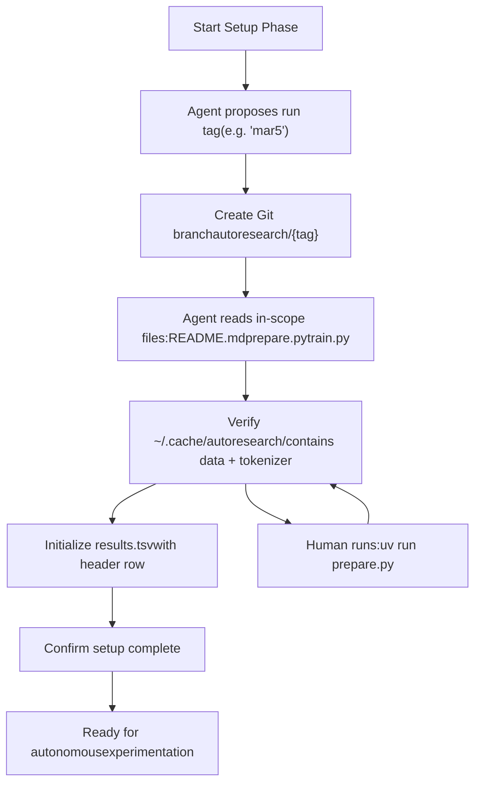
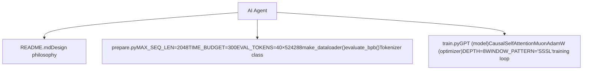

# Running Your First Experiment

Relevant source files

-   [README.md](https://github.com/karpathy/autoresearch/blob/e6d79c12/README.md?plain=1)
-   [program.md](https://github.com/karpathy/autoresearch/blob/e6d79c12/program.md?plain=1)

This page guides you through initializing an autoresearch session and running your first training experiment. It covers creating a research branch, understanding the `program.md` instructions, verifying setup prerequisites, and executing the baseline training run.

**Prerequisites:** Before following this guide, ensure you have completed [Installation and Dependencies](https://github.com/karpathy/autoresearch/blob/e6d79c12/Installation and Dependencies) and [Data Preparation](https://github.com/karpathy/autoresearch/blob/e6d79c12/Data Preparation) The data shards and tokenizer must be present in `~/.cache/autoresearch/` before proceeding [program.md15](https://github.com/karpathy/autoresearch/blob/e6d79c12/program.md?plain=1#L15-L15)

For information about how the agent conducts autonomous research after initialization, see [The Research Loop](https://github.com/karpathy/autoresearch/blob/e6d79c12/The Research Loop) For details on interpreting experiment results, see [Interpreting Results](https://github.com/karpathy/autoresearch/blob/e6d79c12/Interpreting Results)

---

## Overview of program.md

The `program.md` file serves as the instruction manual for the AI agent. It defines three distinct phases:

1.  **Setup** - Initialize the research branch and results tracking (one-time) [program.md5-17](https://github.com/karpathy/autoresearch/blob/e6d79c12/program.md?plain=1#L5-L17)
2.  **Experimentation** - The autonomous research loop (runs indefinitely) [program.md21-115](https://github.com/karpathy/autoresearch/blob/e6d79c12/program.md?plain=1#L21-L115)
3.  **Output format** - How to parse and log results [program.md41-89](https://github.com/karpathy/autoresearch/blob/e6d79c12/program.md?plain=1#L41-L89)

[program.md1-19](https://github.com/karpathy/autoresearch/blob/e6d79c12/program.md?plain=1#L1-L19) contains the setup instructions that you and the agent will follow together to initialize a new research session.

**Sources:** [program.md1-19](https://github.com/karpathy/autoresearch/blob/e6d79c12/program.md?plain=1#L1-L19)

---

## Setup Phase Workflow

The setup phase establishes the experimental environment. This is a collaborative process between you (the human) and the agent, typically done through an interactive conversation.


**Diagram: Setup Phase State Machine**

**Sources:** [program.md5-18](https://github.com/karpathy/autoresearch/blob/e6d79c12/program.md?plain=1#L5-L18)

---

## Step 1: Agree on a Run Tag

The agent will propose a run tag based on the current date. This tag identifies the research session and becomes part of the branch name [program.md9](https://github.com/karpathy/autoresearch/blob/e6d79c12/program.md?plain=1#L9-L9)

**Example interaction:**

```
Agent: "Let's set up a new experiment. I propose the tag 'mar5' for today.
        The branch autoresearch/mar5 doesn't exist yet, so we can use it."
You: "Sounds good, let's proceed."
```
The tag should be:

-   **Short and memorable** (e.g., `mar5`, `jan23a`)
-   **Unique** - the branch `autoresearch/<tag>` must not already exist [program.md9](https://github.com/karpathy/autoresearch/blob/e6d79c12/program.md?plain=1#L9-L9)
-   **Date-based** for easy organization.

**Sources:** [program.md9](https://github.com/karpathy/autoresearch/blob/e6d79c12/program.md?plain=1#L9-L9)

---

## Step 2: Create the Research Branch

The agent will create a new Git branch from the current `master` state [program.md10](https://github.com/karpathy/autoresearch/blob/e6d79c12/program.md?plain=1#L10-L10):

```
git checkout -b autoresearch/mar5
```
This branch will contain:

-   **All successful experiments** (commits with `status=keep`) [program.md103](https://github.com/karpathy/autoresearch/blob/e6d79c12/program.md?plain=1#L103-L103)
-   **Linear history** of improvements.

The branch serves as a ratcheting mechanism - only improvements are kept, failures are discarded via `git reset` [program.md104](https://github.com/karpathy/autoresearch/blob/e6d79c12/program.md?plain=1#L104-L104)

**Sources:** [program.md10-104](https://github.com/karpathy/autoresearch/blob/e6d79c12/program.md?plain=1#L10-L104)

---

## Step 3: Read In-Scope Files

The agent systematically reads the repository files to understand the system [program.md11-14](https://github.com/karpathy/autoresearch/blob/e6d79c12/program.md?plain=1#L11-L14):

| File | Purpose | Modifiable? |
| --- | --- | --- |
| `README.md` | Repository context and design philosophy [README.md1-7](https://github.com/karpathy/autoresearch/blob/e6d79c12/README.md?plain=1#L1-L7) | ❌ No |
| `prepare.py` | Constants, data pipeline, `evaluate_bpb()`, `Tokenizer` [prepare.py1-29](https://github.com/karpathy/autoresearch/blob/e6d79c12/prepare.py#L1-L29) | ❌ No |
| `train.py` | `GPT` model, `MuonAdamW` optimizer, training loop [train.py1-4](https://github.com/karpathy/autoresearch/blob/e6d79c12/train.py#L1-L4) | ✅ Yes |

The agent must understand:

-   **What can be changed** - all contents of `train.py` [program.md26](https://github.com/karpathy/autoresearch/blob/e6d79c12/program.md?plain=1#L26-L26)
-   **What is fixed** - `prepare.py` constants, `evaluate_bpb()` function, data infrastructure [program.md29-31](https://github.com/karpathy/autoresearch/blob/e6d79c12/program.md?plain=1#L29-L31)
-   **Current baseline** - existing architecture in `train.py`.


**Diagram: In-Scope File Responsibilities**

**Sources:** [program.md11-31](https://github.com/karpathy/autoresearch/blob/e6d79c12/program.md?plain=1#L11-L31) [README.md11-15](https://github.com/karpathy/autoresearch/blob/e6d79c12/README.md?plain=1#L11-L15) [prepare.py1-29](https://github.com/karpathy/autoresearch/blob/e6d79c12/prepare.py#L1-L29) [train.py1-4](https://github.com/karpathy/autoresearch/blob/e6d79c12/train.py#L1-L4)

---

## Step 4: Verify Data Preparation

The agent checks that data preparation was completed successfully [program.md15](https://github.com/karpathy/autoresearch/blob/e6d79c12/program.md?plain=1#L15-L15):

```
ls ~/.cache/autoresearch/data/*.parquet | wc -l    # Check shardsls ~/.cache/autoresearch/tokenizer/                # Check tokenizer
```
**If data is missing**, the agent will prompt you to run [program.md15](https://github.com/karpathy/autoresearch/blob/e6d79c12/program.md?plain=1#L15-L15):

```
uv run prepare.py
```
This one-time step takes approximately 2 minutes and downloads training data plus trains the BPE tokenizer [README.md33-34](https://github.com/karpathy/autoresearch/blob/e6d79c12/README.md?plain=1#L33-L34)

**Cache directory structure:**

```
~/.cache/autoresearch/
├── data/
│   ├── shard_00000.parquet  # Training data
│   └── ...
└── tokenizer/
    ├── tokenizer.pkl         # Trained BPE tokenizer
    └── token_bytes.pt        # Byte representation tensor
```
**Sources:** [program.md15](https://github.com/karpathy/autoresearch/blob/e6d79c12/program.md?plain=1#L15-L15) [README.md32-34](https://github.com/karpathy/autoresearch/blob/e6d79c12/README.md?plain=1#L32-L34)

---

## Step 5: Initialize results.tsv

The agent creates `results.tsv` to track all experiments. This file has a specific tab-separated format [program.md66](https://github.com/karpathy/autoresearch/blob/e6d79c12/program.md?plain=1#L66-L66)

```
commit	val_bpb	memory_gb	status	description
```
**Column definitions [program.md71-78](https://github.com/karpathy/autoresearch/blob/e6d79c12/program.md?plain=1#L71-L78):**

| Column | Type | Description |
| --- | --- | --- |
| `commit` | 7-char hash | Git commit identifier (short hash) |
| `val_bpb` | Float (6 decimals) | Validation bits per byte (0.000000 for crashes) |
| `memory_gb` | Float (1 decimal) | Peak VRAM in GB (`peak_vram_mb / 1024`, 0.0 for crashes) |
| `status` | `keep`|`discard`|`crash` | Experiment outcome |
| `description` | String | What the experiment tried |

**Initial state:**

At setup time, `results.tsv` contains only the header row [program.md16](https://github.com/karpathy/autoresearch/blob/e6d79c12/program.md?plain=1#L16-L16):

```
commit	val_bpb	memory_gb	status	description
```
**The baseline entry will be added AFTER the first run** [program.md39](https://github.com/karpathy/autoresearch/blob/e6d79c12/program.md?plain=1#L39-L39)

**Sources:** [program.md16-78](https://github.com/karpathy/autoresearch/blob/e6d79c12/program.md?plain=1#L16-L78)

---

## Step 6: Confirm and Begin

The agent confirms that setup is complete [program.md17](https://github.com/karpathy/autoresearch/blob/e6d79c12/program.md?plain=1#L17-L17):

```
Agent: "Setup complete. Branch autoresearch/mar5 created, in-scope files read,
        data verified, and results.tsv initialized with header row. Ready to run
        the baseline and begin autonomous experimentation."
```
At this point, the agent will proceed to run the baseline `train.py` as-is to establish the performance baseline [program.md39](https://github.com/karpathy/autoresearch/blob/e6d79c12/program.md?plain=1#L39-L39)

**Sources:** [program.md17-39](https://github.com/karpathy/autoresearch/blob/e6d79c12/program.md?plain=1#L17-L39)

---

## Running the Baseline Experiment

The first run executes `train.py` without any modifications [program.md39](https://github.com/karpathy/autoresearch/blob/e6d79c12/program.md?plain=1#L39-L39)

### Command Execution

```
uv run train.py > run.log 2>&1
```
**Command breakdown [program.md99](https://github.com/karpathy/autoresearch/blob/e6d79c12/program.md?plain=1#L99-L99):**

-   `uv run` - Execute using the uv-managed environment.
-   `train.py` - The training script.
-   `> run.log` - Redirect stdout to file.
-   `2>&1` - Redirect stderr to stdout.

**Sources:** [program.md99](https://github.com/karpathy/autoresearch/blob/e6d79c12/program.md?plain=1#L99-L99) [README.md36-37](https://github.com/karpathy/autoresearch/blob/e6d79c12/README.md?plain=1#L36-L37)

---

## Training Execution Pipeline

> **[Mermaid sequence]**
> *(图表结构无法解析)*

**Diagram: Execution Flow from Command to Metrics**

**Sources:** [README.md17-64](https://github.com/karpathy/autoresearch/blob/e6d79c12/README.md?plain=1#L17-L64) [program.md23-56](https://github.com/karpathy/autoresearch/blob/e6d79c12/program.md?plain=1#L23-L56) [prepare.py1-29](https://github.com/karpathy/autoresearch/blob/e6d79c12/prepare.py#L1-L29)

---

## Understanding the Output

### Final Summary Output

After training and evaluation complete, the script prints a summary section [program.md43-56](https://github.com/karpathy/autoresearch/blob/e6d79c12/program.md?plain=1#L43-L56):

```
---
val_bpb:          0.997900
training_seconds: 300.1
total_seconds:    325.9
peak_vram_mb:     45060.2
mfu_percent:      39.80
total_tokens_M:   499.6
num_steps:        953
num_params_M:     50.3
depth:            8
```
**Summary metrics:**

| Metric | Description | Purpose |
| --- | --- | --- |
| `val_bpb` | Validation bits per byte | **Primary objective** [program.md33](https://github.com/karpathy/autoresearch/blob/e6d79c12/program.md?plain=1#L33-L33) |
| `training_seconds` | Time in training loop | Should be ≈ 300s [README.md64](https://github.com/karpathy/autoresearch/blob/e6d79c12/README.md?plain=1#L64-L64) |
| `peak_vram_mb` | Max GPU memory used | Soft constraint [program.md35](https://github.com/karpathy/autoresearch/blob/e6d79c12/program.md?plain=1#L35-L35) |
| `mfu_percent` | Model FLOPs Utilization | Efficiency metric [program.md51](https://github.com/karpathy/autoresearch/blob/e6d79c12/program.md?plain=1#L51-L51) |

**Sources:** [program.md33-56](https://github.com/karpathy/autoresearch/blob/e6d79c12/program.md?plain=1#L33-L56) [README.md17-64](https://github.com/karpathy/autoresearch/blob/e6d79c12/README.md?plain=1#L17-L64)

---

## Extracting Metrics from run.log

The agent uses `grep` to extract decision metrics [program.md100](https://github.com/karpathy/autoresearch/blob/e6d79c12/program.md?plain=1#L100-L100):

```
grep "^val_bpb:\|^peak_vram_mb:" run.log
```
**Conversion rules [program.md76](https://github.com/karpathy/autoresearch/blob/e6d79c12/program.md?plain=1#L76-L76):**

-   `val_bpb`: Use as-is with 6 decimal places.
-   `memory_gb`: Divide `peak_vram_mb` by 1024, round to 1 decimal.

**Crash handling:** If `grep` returns empty, the run crashed. The agent sets `val_bpb=0.000000`, `memory_gb=0.0`, `status=crash` and uses `tail -n 50 run.log` to diagnose [program.md101-110](https://github.com/karpathy/autoresearch/blob/e6d79c12/program.md?plain=1#L101-L110)

**Sources:** [program.md76-110](https://github.com/karpathy/autoresearch/blob/e6d79c12/program.md?plain=1#L76-L110)

---

## Logging the Baseline to results.tsv

After the first run completes, the agent commits the baseline and logs it [program.md39-103](https://github.com/karpathy/autoresearch/blob/e6d79c12/program.md?plain=1#L39-L103):

```
# Commit unmodified train.pygit add train.pygit commit -m "baseline" # Append baseline entry to results.tsv
```
**results.tsv after baseline [program.md84](https://github.com/karpathy/autoresearch/blob/e6d79c12/program.md?plain=1#L84-L84):**

```
commit	val_bpb	memory_gb	status	descriptiona1b2c3d	0.997900	44.0	keep	baseline
```
**Sources:** [program.md39-103](https://github.com/karpathy/autoresearch/blob/e6d79c12/program.md?plain=1#L39-L103)

---

## Entering the Autonomous Research Loop

The agent now enters the infinite experimentation loop [program.md94-106](https://github.com/karpathy/autoresearch/blob/e6d79c12/program.md?plain=1#L94-L106):

> **[Mermaid stateDiagram]**
> *(图表结构无法解析)*

**Diagram: Autonomous Experimentation State Machine**

**Loop characteristics:**

-   **Infinite** - Agent does not pause to ask the human [program.md112](https://github.com/karpathy/autoresearch/blob/e6d79c12/program.md?plain=1#L112-L112)
-   **~12 experiments/hour** - Based on 5-minute budget [README.md64](https://github.com/karpathy/autoresearch/blob/e6d79c12/README.md?plain=1#L64-L64)
-   **~100 experiments overnight** [README.md64](https://github.com/karpathy/autoresearch/blob/e6d79c12/README.md?plain=1#L64-L64)

**Sources:** [program.md94-115](https://github.com/karpathy/autoresearch/blob/e6d79c12/program.md?plain=1#L94-L115) [README.md64](https://github.com/karpathy/autoresearch/blob/e6d79c12/README.md?plain=1#L64-L64)

---

## Common First-Run Issues

### Issue: Data shards not found

**Cause:** `uv run prepare.py` was not completed [program.md15](https://github.com/karpathy/autoresearch/blob/e6d79c12/program.md?plain=1#L15-L15) **Solution:** Run `uv run prepare.py` [README.md34](https://github.com/karpathy/autoresearch/blob/e6d79c12/README.md?plain=1#L34-L34)

### Issue: CUDA Out of Memory (OOM)

**Cause:** GPU has insufficient VRAM (Baseline needs ~44GB) [program.md50](https://github.com/karpathy/autoresearch/blob/e6d79c12/program.md?plain=1#L50-L50) **Solution:** Use an H100 or follow tuning guide for smaller GPUs [README.md71-79](https://github.com/karpathy/autoresearch/blob/e6d79c12/README.md?plain=1#L71-L79)

### Issue: Training exceeds time budget

**Rule:** If a run exceeds 10 minutes, kill it and treat as failure [program.md108](https://github.com/karpathy/autoresearch/blob/e6d79c12/program.md?plain=1#L108-L108)

**Sources:** [program.md15-108](https://github.com/karpathy/autoresearch/blob/e6d79c12/program.md?plain=1#L15-L108) [README.md34-79](https://github.com/karpathy/autoresearch/blob/e6d79c12/README.md?plain=1#L34-L79)
