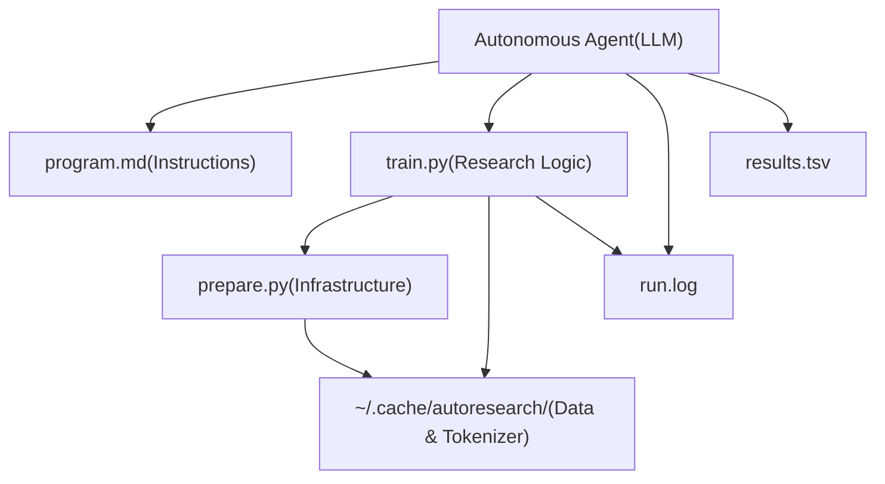
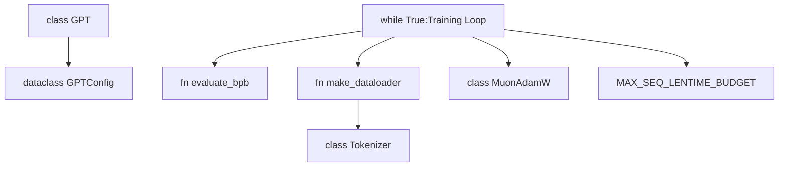

# Core Components

Relevant source files

-   [prepare.py](https://github.com/karpathy/autoresearch/blob/e6d79c12/prepare.py)
-   [program.md](https://github.com/karpathy/autoresearch/blob/e6d79c12/program.md?plain=1)
-   [train.py](https://github.com/karpathy/autoresearch/blob/e6d79c12/train.py)

This page provides an overview of the main system files in the autoresearch architecture and their respective roles. The system is designed with a strict separation between **mutable** research code and **immutable** evaluation infrastructure.

For detailed documentation of individual components, see:

-   [train.py - The Mutable Core](/karpathy/autoresearch/3.1-train.py-the-mutable-core)
-   [prepare.py - Data and Evaluation](/karpathy/autoresearch/3.2-prepare.py-data-and-evaluation)
-   [System Parameters](/karpathy/autoresearch/3.3-system-parameters)
-   [program.md - Agent Instructions](/karpathy/autoresearch/3.4-program.md-agent-instructions)

---

## Component Overview

The autoresearch system consists of three primary Python files and one instructional Markdown file. The **critical architectural constraint** is that only `train.py` can be modified by the autonomous agent.

| File | Modification Status | Primary Responsibility | Key Entities |
| --- | --- | --- | --- |
| `train.py` | **MUTABLE** | Model architecture, optimizer, training loop | `GPT`, `Block`, `MuonAdamW`, `GPTConfig` |
| `prepare.py` | **IMMUTABLE** | Data pipeline, tokenization, evaluation harness | `Tokenizer`, `make_dataloader`, `evaluate_bpb` |
| `program.md` | **IMMUTABLE** | Agent instructions and research protocols | Research loop logic, logging format |

**Sources:** [program.md11-14](https://github.com/karpathy/autoresearch/blob/e6d79c12/program.md?plain=1#L11-L14) [train.py1-5](https://github.com/karpathy/autoresearch/blob/e6d79c12/train.py#L1-L5)

---

## System Architecture Diagram

The following diagram illustrates how the autonomous agent interacts with the codebase and how the core components depend on each other during an experiment.

### System Dependency and Data Flow

**Sources:** [program.md94-105](https://github.com/karpathy/autoresearch/blob/e6d79c12/program.md?plain=1#L94-L105) [train.py26-27](https://github.com/karpathy/autoresearch/blob/e6d79c12/train.py#L26-L27) [prepare.py38-40](https://github.com/karpathy/autoresearch/blob/e6d79c12/prepare.py#L38-L40)

---

## Component Roles

### train.py - The Mutable Core

`train.py` is the sole file the agent is permitted to modify. It contains the complete definition of the model architecture, the optimization strategy, and the time-bounded training loop. The agent is encouraged to "hack" this file to find improvements in `val_bpb`.

Key modifiable sections include:

-   **Model Architecture**: The `GPT` class and its sub-modules like `CausalSelfAttention` and `MLP` [train.py61-122](https://github.com/karpathy/autoresearch/blob/e6d79c12/train.py#L61-L122)
-   **Optimizer**: The `MuonAdamW` hybrid optimizer implementation [train.py357-427](https://github.com/karpathy/autoresearch/blob/e6d79c12/train.py#L357-L427)
-   **Hyperparameters**: Constants for learning rates, batch sizes, and model depth [train.py434-452](https://github.com/karpathy/autoresearch/blob/e6d79c12/train.py#L434-L452)

For details, see [train.py - The Mutable Core](/karpathy/autoresearch/3.1-train.py-the-mutable-core).

**Sources:** [program.md25-27](https://github.com/karpathy/autoresearch/blob/e6d79c12/program.md?plain=1#L25-L27) [train.py1-5](https://github.com/karpathy/autoresearch/blob/e6d79c12/train.py#L1-L5)

---

### prepare.py - Data and Evaluation

`prepare.py` serves as the immutable infrastructure layer. It handles one-time setup tasks like downloading data shards and training the BPE tokenizer [prepare.py1-10](https://github.com/karpathy/autoresearch/blob/e6d79c12/prepare.py#L1-L10) At runtime, it provides the `evaluate_bpb` function, which is the ground-truth metric for all experiments.

Crucially, `prepare.py` defines the global constraints:

-   `MAX_SEQ_LEN`: Fixed at 2048 [prepare.py30](https://github.com/karpathy/autoresearch/blob/e6d79c12/prepare.py#L30-L30)
-   `TIME_BUDGET`: Fixed at 300 seconds (5 minutes) [prepare.py31](https://github.com/karpathy/autoresearch/blob/e6d79c12/prepare.py#L31-L31)
-   `EVAL_TOKENS`: Fixed at ~21M tokens for validation [prepare.py32](https://github.com/karpathy/autoresearch/blob/e6d79c12/prepare.py#L32-L32)

For details, see [prepare.py - Data and Evaluation](/karpathy/autoresearch/3.2-prepare.py-data-and-evaluation).

**Sources:** [program.md28-31](https://github.com/karpathy/autoresearch/blob/e6d79c12/program.md?plain=1#L28-L31) [prepare.py26-33](https://github.com/karpathy/autoresearch/blob/e6d79c12/prepare.py#L26-L33)

---

### program.md - Agent Instructions

`program.md` is the "research org code" that guides the autonomous agent. It defines the experimental loop, the success criteria (Simplicity Criterion), and the logging format for `results.tsv`. It instructs the agent to treat `train.py` as a sandbox while respecting the boundaries of `prepare.py`.

For details, see [program.md - Agent Instructions](/karpathy/autoresearch/3.4-program.md-agent-instructions).

**Sources:** [program.md1-4](https://github.com/karpathy/autoresearch/blob/e6d79c12/program.md?plain=1#L1-L4) [program.md90-115](https://github.com/karpathy/autoresearch/blob/e6d79c12/program.md?plain=1#L90-L115)

---

## Code Entity Mapping

The following diagram bridges the gap between high-level system roles and the specific code entities defined in the files.

### Entity Interaction Map

**Sources:** [train.py26-27](https://github.com/karpathy/autoresearch/blob/e6d79c12/train.py#L26-L27) [train.py124-133](https://github.com/karpathy/autoresearch/blob/e6d79c12/train.py#L124-L133) [train.py544-605](https://github.com/karpathy/autoresearch/blob/e6d79c12/train.py#L544-L605) [prepare.py327-349](https://github.com/karpathy/autoresearch/blob/e6d79c12/prepare.py#L327-L349)

---

## Component Interaction Flow

The lifecycle of an experiment follows a strict sequence of interactions between these components:

1.  **Agent Modification**: The agent reads `program.md` for goals and modifies `train.py` with a new hypothesis [program.md97-98](https://github.com/karpathy/autoresearch/blob/e6d79c12/program.md?plain=1#L97-L98)
2.  **Environment Setup**: `train.py` imports `MAX_SEQ_LEN` and `TIME_BUDGET` to configure the run [train.py26](https://github.com/karpathy/autoresearch/blob/e6d79c12/train.py#L26-L26)
3.  **Data Loading**: `train.py` calls `make_dataloader` from `prepare.py` to stream tokens from the local cache [train.py465-467](https://github.com/karpathy/autoresearch/blob/e6d79c12/train.py#L465-L467)
4.  **Training**: The loop in `train.py` executes for exactly `TIME_BUDGET` seconds [train.py544-546](https://github.com/karpathy/autoresearch/blob/e6d79c12/train.py#L544-L546)
5.  **Evaluation**: `train.py` calls `evaluate_bpb` to get the final validation score [train.py614](https://github.com/karpathy/autoresearch/blob/e6d79c12/train.py#L614-L614)
6.  **Reporting**: The agent parses the output and updates `results.tsv` [program.md100-102](https://github.com/karpathy/autoresearch/blob/e6d79c12/program.md?plain=1#L100-L102)

**Sources:** [program.md94-105](https://github.com/karpathy/autoresearch/blob/e6d79c12/program.md?plain=1#L94-L105) [train.py26-27](https://github.com/karpathy/autoresearch/blob/e6d79c12/train.py#L26-L27) [prepare.py31](https://github.com/karpathy/autoresearch/blob/e6d79c12/prepare.py#L31-L31)
