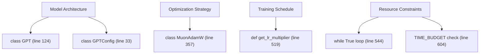
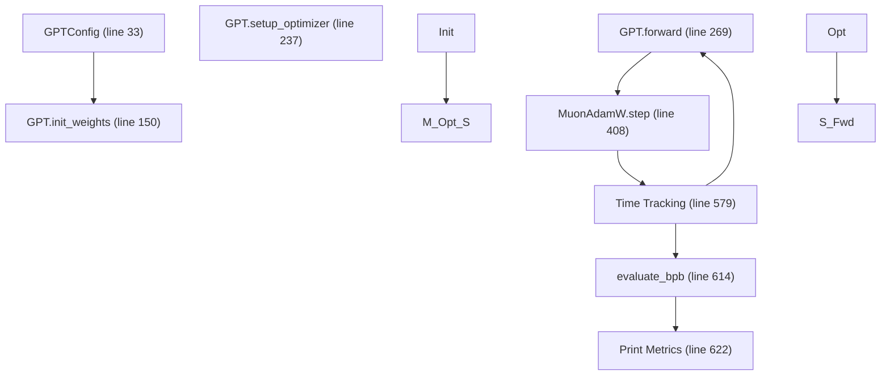

# train.py - The Mutable Core

Relevant source files

-   [train.py](https://github.com/karpathy/autoresearch/blob/e6d79c12/train.py)

## Purpose and Scope

This document provides a technical reference for `train.py`, the **sole modifiable file** in the autoresearch system. It contains the complete definition of the GPT model architecture, the MuonAdamW optimizer, and the time-based training loop. While infrastructure files like `prepare.py` are immutable to ensure evaluation integrity, `train.py` is the canvas where the AI agent performs architectural and algorithmic experimentation.

For deep dives into specific sub-components, see the following child pages:

-   [GPT Model Architecture](/karpathy/autoresearch/3.1.1-gpt-model-architecture) — Details on multi-scale residuals, value embeddings, and sliding windows.
-   [MuonAdamW Optimizer](/karpathy/autoresearch/3.1.2-muonadamw-optimizer) — Explanation of the hybrid Muon/AdamW approach and dimension-aware scaling.
-   [Training Loop and Scheduling](/karpathy/autoresearch/3.1.3-training-loop-and-scheduling) — Documentation of the time-budgeted loop and three-phase LR schedules.

## System Overview

`train.py` is a self-contained script that executes a full pretraining run within a fixed time budget. It imports only essential constants and evaluation utilities from the infrastructure layer.

### Code Entity Map: Natural Language to Code Space

The following diagram maps high-level research concepts to their specific implementations within `train.py`.

**Sources:** [train.py33-357](https://github.com/karpathy/autoresearch/blob/e6d79c12/train.py#L33-L357) [train.py519-604](https://github.com/karpathy/autoresearch/blob/e6d79c12/train.py#L519-L604)

### File Structure and Logic Flow

The script follows a linear execution path from model definition to final metric reporting.

**Sources:** [train.py33-631](https://github.com/karpathy/autoresearch/blob/e6d79c12/train.py#L33-L631)

## GPT Model Architecture

The model is a decoder-only Transformer optimized for short-budget training. Key features include:

-   **Value Embeddings (ResFormer)**: Alternating layers use input-dependent gates to mix token-specific value residuals [train.py74-88](https://github.com/karpathy/autoresearch/blob/e6d79c12/train.py#L74-L88)
-   **Multi-Scale Residuals**: Each layer learns to weight the current stream against the initial embedding $x\_0$ via `resid_lambdas` and `x0_lambdas` [train.py134-135](https://github.com/karpathy/autoresearch/blob/e6d79c12/train.py#L134-L135)
-   **Attention Variants**: Uses FlashAttention 3 [train.py24](https://github.com/karpathy/autoresearch/blob/e6d79c12/train.py#L24-L24) with a configurable `window_pattern` (e.g., "SSSL" for Short/Long sliding windows) [train.py40](https://github.com/karpathy/autoresearch/blob/e6d79c12/train.py#L40-L40)
-   **QK Norm**: RMS normalization is applied to queries and keys before the attention dot-product [train.py91-92](https://github.com/karpathy/autoresearch/blob/e6d79c12/train.py#L91-L92)

For a detailed breakdown of these components, see [GPT Model Architecture](/karpathy/autoresearch/3.1.1-gpt-model-architecture).

**Sources:** [train.py24-135](https://github.com/karpathy/autoresearch/blob/e6d79c12/train.py#L24-L135) [train.py40-92](https://github.com/karpathy/autoresearch/blob/e6d79c12/train.py#L40-L92)

## MuonAdamW Optimizer

The optimizer is a hybrid design that treats different parameter types with specialized algorithms:

-   **Muon**: Applied to 2D internal matrix parameters (e.g., QKV projections). It uses Newton-Schulz iterations to maintain orthogonality [train.py324-337](https://github.com/karpathy/autoresearch/blob/e6d79c12/train.py#L324-L337)
-   **AdamW**: Applied to embeddings, scalars, and vectors [train.py306-315](https://github.com/karpathy/autoresearch/blob/e6d79c12/train.py#L306-L315)
-   **Dimension-Aware Scaling**: Learning rates are automatically adjusted based on the model's `n_embd` and matrix aspect ratios [train.py249-250](https://github.com/karpathy/autoresearch/blob/e6d79c12/train.py#L249-L250)

For the mathematical implementation of the Muon update, see [MuonAdamW Optimizer](/karpathy/autoresearch/3.1.2-muonadamw-optimizer).

**Sources:** [train.py249-337](https://github.com/karpathy/autoresearch/blob/e6d79c12/train.py#L249-L337)

## Training Loop and Scheduling

The training loop is governed by a wall-clock timer rather than a fixed step count.

-   **Time Budget**: The loop breaks exactly when `total_training_time >= TIME_BUDGET` [train.py604-605](https://github.com/karpathy/autoresearch/blob/e6d79c12/train.py#L604-L605)
-   **Three-Phase LR**: Supports linear warmup, a plateau, and a linear warmdown (cooldown) to a `FINAL_LR_FRAC` [train.py519-526](https://github.com/karpathy/autoresearch/blob/e6d79c12/train.py#L519-L526)
-   **Gradient Accumulation**: Automatically calculated to match the `TOTAL_BATCH_SIZE` regardless of hardware `DEVICE_BATCH_SIZE` [train.py496-498](https://github.com/karpathy/autoresearch/blob/e6d79c12/train.py#L496-L498)

For details on the scheduling logic and MFU calculation, see [Training Loop and Scheduling](/karpathy/autoresearch/3.1.3-training-loop-and-scheduling).

**Sources:** [train.py496-605](https://github.com/karpathy/autoresearch/blob/e6d79c12/train.py#L496-L605)

## Mutable Hyperparameters

The following constants at the top of `train.py` are the primary levers used by the agent to tune performance.

| Parameter | Location | Description |
| --- | --- | --- |
| `ASPECT_RATIO` | [train.py434](https://github.com/karpathy/autoresearch/blob/e6d79c12/train.py#L434-L434) | Multiplier for `DEPTH` to determine `n_embd`. |
| `DEPTH` | [train.py451](https://github.com/karpathy/autoresearch/blob/e6d79c12/train.py#L451-L451) | Total number of transformer layers (`n_layer`). |
| `MATRIX_LR` | [train.py442](https://github.com/karpathy/autoresearch/blob/e6d79c12/train.py#L442-L442) | Base learning rate for Muon-optimized parameters. |
| `WINDOW_PATTERN` | [train.py436](https://github.com/karpathy/autoresearch/blob/e6d79c12/train.py#L436-L436) | String defining sliding window sequence (e.g., "SSSL"). |
| `WARMDOWN_RATIO` | [train.py447](https://github.com/karpathy/autoresearch/blob/e6d79c12/train.py#L447-L447) | Fraction of the 5-minute budget spent in LR decay. |

**Sources:** [train.py434-451](https://github.com/karpathy/autoresearch/blob/e6d79c12/train.py#L434-L451)
