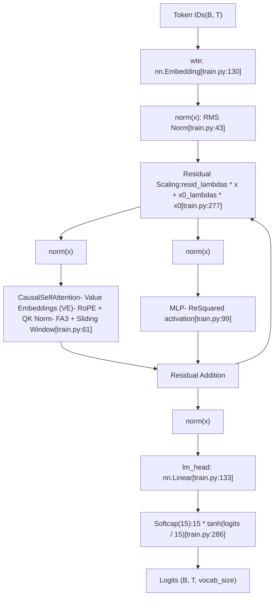
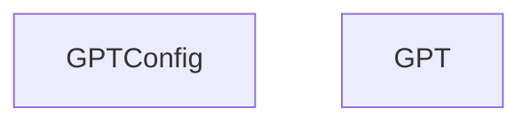
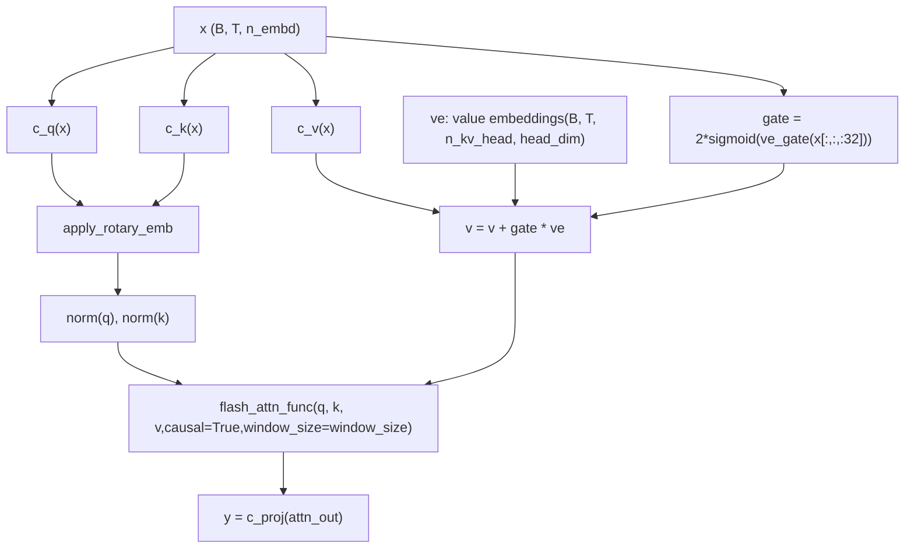

# GPT Model Architecture

Relevant source files

-   [train.py](https://github.com/karpathy/autoresearch/blob/e6d79c12/train.py)

## Purpose and Scope

This page documents the GPT model architecture implemented in `train.py`, which is the **mutable core** of the autoresearch system. The model is a decoder-only transformer with several architectural innovations including multi-scale residuals, value embeddings, sliding window attention, and QK normalization. This page focuses on the model structure and forward pass; for training loop mechanics, see [3.1.3 Training Loop and Scheduling](https://github.com/karpathy/autoresearch/blob/e6d79c12/3.1.3 Training Loop and Scheduling) and for the optimizer used to train this model, see [3.1.2 MuonAdamW Optimizer](https://github.com/karpathy/autoresearch/blob/e6d79c12/3.1.2 MuonAdamW Optimizer)

**Sources:** [train.py1-29](https://github.com/karpathy/autoresearch/blob/e6d79c12/train.py#L1-L29)

---

## High-Level Architecture Overview

The GPT model follows a standard transformer decoder architecture with several key innovations:


**Diagram: Complete GPT Model Architecture**

Key architectural features:

-   **Value Embeddings**: Alternating layers include learnable value embeddings mixed with standard value projections [train.py47-49](https://github.com/karpathy/autoresearch/blob/e6d79c12/train.py#L47-L49)
-   **Sliding Window Attention**: Configurable attention window patterns (e.g., "SSSL" = Short, Short, Short, Long) [train.py40-41](https://github.com/karpathy/autoresearch/blob/e6d79c12/train.py#L40-L41)
-   **QK Normalization**: RMS normalization is applied to both Queries and Keys before attention [train.py91-92](https://github.com/karpathy/autoresearch/blob/e6d79c12/train.py#L91-L92)
-   **Multi-scale Residuals**: Per-layer learnable scalars control residual contribution and $x\_0$ skip connections [train.py134-135](https://github.com/karpathy/autoresearch/blob/e6d79c12/train.py#L134-L135)
-   **Softcapped Logits**: Output logits are softcapped to $\\pm15$ to stabilize training [train.py286](https://github.com/karpathy/autoresearch/blob/e6d79c12/train.py#L286-L286)

**Sources:** [train.py32-148](https://github.com/karpathy/autoresearch/blob/e6d79c12/train.py#L32-L148) [train.py274-286](https://github.com/karpathy/autoresearch/blob/e6d79c12/train.py#L274-L286)

---

## Model Configuration

The model is configured via the `GPTConfig` dataclass:


**Diagram: Model Configuration Structure**

| Parameter | Purpose | Typical Range |
| --- | --- | --- |
| `sequence_len` | Maximum sequence length (context window) | Fixed at 2048 (from `MAX_SEQ_LEN`) [train.py34](https://github.com/karpathy/autoresearch/blob/e6d79c12/train.py#L34-L34) |
| `vocab_size` | Tokenizer vocabulary size | ~32K (determined by BPE tokenizer) [train.py35](https://github.com/karpathy/autoresearch/blob/e6d79c12/train.py#L35-L35) |
| `n_layer` | Number of transformer blocks | 12 (default) [train.py36](https://github.com/karpathy/autoresearch/blob/e6d79c12/train.py#L36-L36) |
| `n_head` | Number of attention heads | 6 (default) [train.py37](https://github.com/karpathy/autoresearch/blob/e6d79c12/train.py#L37-L37) |
| `n_kv_head` | Number of key/value heads (GQA) | 6 (default) [train.py38](https://github.com/karpathy/autoresearch/blob/e6d79c12/train.py#L38-L38) |
| `n_embd` | Model dimensionality | 768 (default) [train.py39](https://github.com/karpathy/autoresearch/blob/e6d79c12/train.py#L39-L39) |
| `window_pattern` | Sliding window pattern string | "SSSL" (Short/Long pattern) [train.py40](https://github.com/karpathy/autoresearch/blob/e6d79c12/train.py#L40-L40) |

**Sources:** [train.py32-41](https://github.com/karpathy/autoresearch/blob/e6d79c12/train.py#L32-L41)

---

## Token Embeddings and Positional Encoding

### Token Embedding Layer

The model uses standard learned token embeddings stored in `transformer.wte`. The embedding is normalized immediately via RMS normalization and stored as `x0` for use in skip connections throughout the model [train.py274-276](https://github.com/karpathy/autoresearch/blob/e6d79c12/train.py#L274-L276)

**Sources:** [train.py130](https://github.com/karpathy/autoresearch/blob/e6d79c12/train.py#L130-L130) [train.py274-276](https://github.com/karpathy/autoresearch/blob/e6d79c12/train.py#L274-L276)

---

### Rotary Positional Embeddings (RoPE)

The model uses **Rotary Position Embeddings (RoPE)** instead of absolute positional encodings. These are precomputed and cached in buffers [train.py144-147](https://github.com/karpathy/autoresearch/blob/e6d79c12/train.py#L144-L147)

**Diagram: Rotary Embeddings Computation and Application**

The `apply_rotary_emb` function splits each head dimension in half and applies the rotation using:

-   $y\_1 = x\_1 \\cdot \\cos + x\_2 \\cdot \\sin$
-   $y\_2 = x\_1 \\cdot (-\\sin) + x\_2 \\cdot \\cos$ [train.py56-57](https://github.com/karpathy/autoresearch/blob/e6d79c12/train.py#L56-L57)

**Sources:** [train.py52-59](https://github.com/karpathy/autoresearch/blob/e6d79c12/train.py#L52-L59) [train.py144-148](https://github.com/karpathy/autoresearch/blob/e6d79c12/train.py#L144-L148) [train.py183-194](https://github.com/karpathy/autoresearch/blob/e6d79c12/train.py#L183-L194)

---

## Causal Self-Attention with Value Embeddings

The `CausalSelfAttention` module implements multi-head attention with several key enhancements:

### Value Residual (ResFormer)

Value embeddings (VE) are an architectural innovation where:

1.  **Alternating layers** include value embeddings (determined by `has_ve(layer_idx, n_layer)`) [train.py47-49](https://github.com/karpathy/autoresearch/blob/e6d79c12/train.py#L47-L49)
2.  The last layer always has VE.
3.  VE provides a learnable value residual, mixed with an input-dependent gate [train.py84-87](https://github.com/karpathy/autoresearch/blob/e6d79c12/train.py#L84-L87)

The gating mechanism computes:

-   `gate = 2 * sigmoid(ve_gate(x[..., :32]))` [train.py86](https://github.com/karpathy/autoresearch/blob/e6d79c12/train.py#L86-L86)
-   `v = v + gate.unsqueeze(-1) * ve` [train.py87](https://github.com/karpathy/autoresearch/blob/e6d79c12/train.py#L87-L87)

### Attention Forward Pass

The attention mechanism utilizes **Flash Attention 3** (FA3) for high-performance computation [train.py93](https://github.com/karpathy/autoresearch/blob/e6d79c12/train.py#L93-L93)


**Diagram: Attention Forward Pass with Value Embeddings**

**Sources:** [train.py61-97](https://github.com/karpathy/autoresearch/blob/e6d79c12/train.py#L61-L97) [train.py139-142](https://github.com/karpathy/autoresearch/blob/e6d79c12/train.py#L139-L142)

---

## Sliding Window Attention

The model supports configurable sliding window patterns specified by `window_pattern` [train.py40](https://github.com/karpathy/autoresearch/blob/e6d79c12/train.py#L40-L40)

| Pattern Character | Window Size | Description |
| --- | --- | --- |
| `L` | `sequence_len` | Full attention (long window) |
| `S` | `sequence_len // 2` | Half context (short window) |

The window sizes are computed once during initialization and stored in `self.window_sizes`. The last layer is always forced to a long window for global context [train.py196-207](https://github.com/karpathy/autoresearch/blob/e6d79c12/train.py#L196-L207)

**Sources:** [train.py128](https://github.com/karpathy/autoresearch/blob/e6d79c12/train.py#L128-L128) [train.py196-207](https://github.com/karpathy/autoresearch/blob/e6d79c12/train.py#L196-L207)

---

## MLP with ReSquared Activation

The MLP uses a simple architecture with **ReSquared** activation (ReLU squared) [train.py107](https://github.com/karpathy/autoresearch/blob/e6d79c12/train.py#L107-L107):

```
def forward(self, x):    x = self.c_fc(x)    x = F.relu(x).square()    x = self.c_proj(x)    return x
```
**Sources:** [train.py99-109](https://github.com/karpathy/autoresearch/blob/e6d79c12/train.py#L99-L109)

---

## Multi-scale Residual Connections

The model uses two types of learnable residual mechanisms:

### Per-Layer Residual Scaling

Before each block, the input is transformed: `x = resid_lambdas[i] * x + x0_lambdas[i] * x0` [train.py277](https://github.com/karpathy/autoresearch/blob/e6d79c12/train.py#L277-L277)

Where:

-   `resid_lambdas[i]`: Scales the current residual stream (initialized to 1.0) [train.py165](https://github.com/karpathy/autoresearch/blob/e6d79c12/train.py#L165-L165)
-   `x0_lambdas[i]`: Scales the skip connection from initial embeddings (initialized to 0.1) [train.py166](https://github.com/karpathy/autoresearch/blob/e6d79c12/train.py#L166-L166)
-   `x0`: The normalized token embeddings saved at the start [train.py276](https://github.com/karpathy/autoresearch/blob/e6d79c12/train.py#L276-L276)

This provides per-layer control over residual vs skip-connection strength, optimized via specialized learning rates in Muon.

**Sources:** [train.py134-135](https://github.com/karpathy/autoresearch/blob/e6d79c12/train.py#L134-L135) [train.py165-166](https://github.com/karpathy/autoresearch/blob/e6d79c12/train.py#L165-L166) [train.py276-278](https://github.com/karpathy/autoresearch/blob/e6d79c12/train.py#L276-L278)

---

## Output Layer and Logit Softcapping

The final transformation converts hidden states to logits with softcapping [train.py286](https://github.com/karpathy/autoresearch/blob/e6d79c12/train.py#L286-L286):

1.  **RMS Norm**: `norm(x)` [train.py281](https://github.com/karpathy/autoresearch/blob/e6d79c12/train.py#L281-L281)
2.  **Linear Head**: `lm_head(x)` [train.py283](https://github.com/karpathy/autoresearch/blob/e6d79c12/train.py#L283-L283)
3.  **Softcap**: `logits = 15 * torch.tanh(logits / 15)` [train.py286](https://github.com/karpathy/autoresearch/blob/e6d79c12/train.py#L286-L286)

This prevents extremely large logit values that can destabilize training while preserving the relative ordering of predictions.

**Sources:** [train.py281-286](https://github.com/karpathy/autoresearch/blob/e6d79c12/train.py#L281-L286)

---

## Weight Initialization

The model uses custom initialization strategies [train.py150-182](https://github.com/karpathy/autoresearch/blob/e6d79c12/train.py#L150-L182):

| Parameter Type | Initialization | Rationale |
| --- | --- | --- |
| Token embeddings (`wte`) | `N(0, 1.0)` | Standard embedding init |
| Unembedding (`lm_head`) | `N(0, 0.001)` | Small values for stable early training |
| Matrix weights (`c_q`, `c_fc`, etc.) | `Uniform(-s, s)` | $s = \\sqrt{3} \\cdot n\_embd^{-0.5}$ |
| Projection weights (`c_proj`) | Zeros | Residual branches start at identity |
| VE gate weights | Zeros | Gate starts at neutral (1.0) |
| Residual lambdas | 1.0 | Start with standard residual |
| $x\_0$ lambdas | 0.1 | Small skip connection contribution |

**Sources:** [train.py150-182](https://github.com/karpathy/autoresearch/blob/e6d79c12/train.py#L150-L182)
