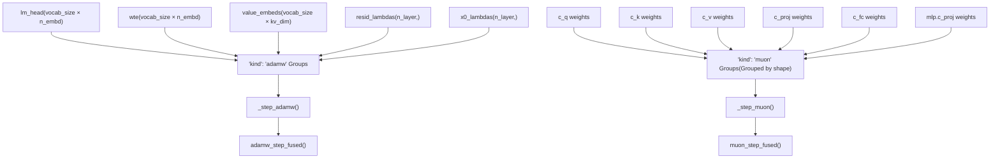
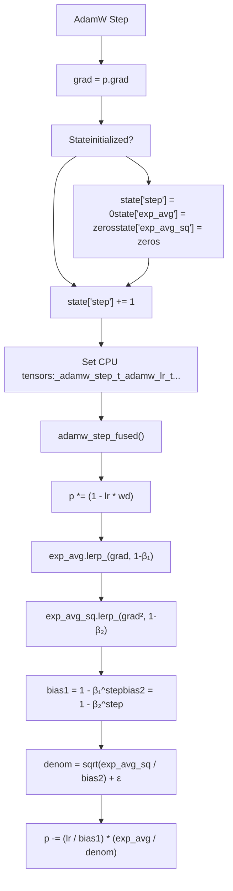
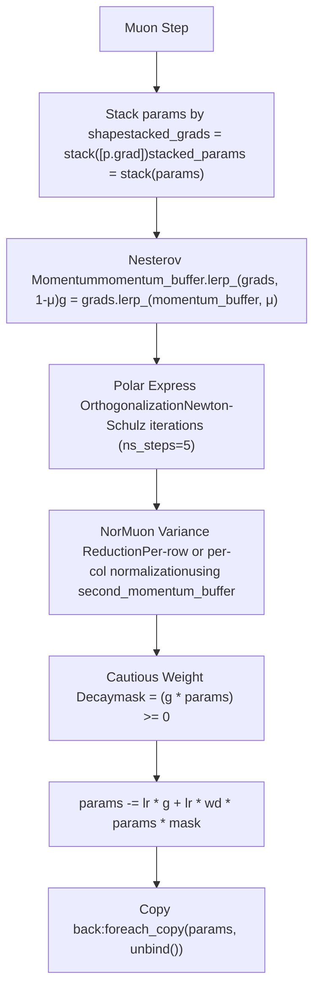

# MuonAdamW Optimizer

Relevant source files

-   [train.py](https://github.com/karpathy/autoresearch/blob/e6d79c12/train.py)

## Purpose and Scope

This page documents the `MuonAdamW` optimizer class and its setup, which implements a hybrid optimization strategy combining **AdamW** for scalar and embedding parameters with **Muon** for 2D matrix parameters. The optimizer is instantiated via `model.setup_optimizer()` and used throughout the training loop to update model weights.

For details on how the optimizer is invoked during training, see [3.1.3 Training Loop and Scheduling](https://github.com/karpathy/autoresearch/blob/e6d79c12/3.1.3 Training Loop and Scheduling)

**Sources:** [train.py295-428](https://github.com/karpathy/autoresearch/blob/e6d79c12/train.py#L295-L428)

---

## Overview

The `MuonAdamW` class implements a **hybrid optimization strategy** that applies different algorithms based on parameter dimensionality:

-   **AdamW**: Applied to embeddings (`wte`, `value_embeds`), unembedding (`lm_head`), and per-layer scalars (`resid_lambdas`, `x0_lambdas`).
-   **Muon**: Applied to all 2D matrix parameters (attention projections and MLP layers in `transformer.h`).

This hybrid approach exploits the complementary strengths of both algorithms:

-   **AdamW** provides adaptive learning rates with bias correction for 1D/0D parameters.
-   **Muon** uses orthogonalization and variance normalization for stable updates to high-dimensional weight matrices.

**Sources:** [train.py357-361](https://github.com/karpathy/autoresearch/blob/e6d79c12/train.py#L357-L361) [train.py237-267](https://github.com/karpathy/autoresearch/blob/e6d79c12/train.py#L237-L267)

---

## Architecture: Parameter Groups and Algorithm Assignment

The following diagram maps the relationship between model components and the optimizer's dispatch logic.

### Optimizer Dispatch Logic


The optimizer's `step()` method iterates through parameter groups and dispatches to the appropriate algorithm based on the `kind` field.

**Sources:** [train.py422-427](https://github.com/karpathy/autoresearch/blob/e6d79c12/train.py#L422-L427) [train.py251-263](https://github.com/karpathy/autoresearch/blob/e6d79c12/train.py#L251-L263)

---

## Parameter Group Configuration

The `setup_optimizer()` method creates parameter groups with algorithm-specific hyperparameters:

| Parameter Type | Algorithm | Learning Rate | Betas | Weight Decay | Special Config |
| --- | --- | --- | --- | --- | --- |
| `lm_head` | AdamW | `0.004 * dmodel_scale` | `(0.8, 0.95)` | `0.0` | `eps=1e-10` |
| `wte` | AdamW | `0.2 * dmodel_scale` | `(0.8, 0.95)` | `0.0` | `eps=1e-10` |
| `value_embeds` | AdamW | `0.2 * dmodel_scale` | `(0.8, 0.95)` | `0.0` | `eps=1e-10` |
| `resid_lambdas` | AdamW | `0.5 * 0.01` | `(0.8, 0.95)` | `0.0` | `eps=1e-10` |
| `x0_lambdas` | AdamW | `0.5` | `(0.96, 0.95)` | `0.0` | `eps=1e-10`, different β₁ |
| Matrix params | Muon | `0.02` | N/A | `0.2` | `momentum=0.95, ns_steps=5, beta2=0.95` |

**Key observations:**

-   **LR scaling by model dimension**: All AdamW learning rates are scaled by `(model_dim / 768)^(-0.5)` [train.py249-250](https://github.com/karpathy/autoresearch/blob/e6d79c12/train.py#L249-L250) allowing the same hyperparameters to work across different model sizes.
-   **Shape-based grouping for Muon**: Matrix parameters are grouped by shape, enabling efficient batched processing via stacking [train.py258-263](https://github.com/karpathy/autoresearch/blob/e6d79c12/train.py#L258-L263)
-   **Different β₁ for x0\_lambdas**: The skip connection scalars use `β₁=0.96` instead of `0.8` [train.py246](https://github.com/karpathy/autoresearch/blob/e6d79c12/train.py#L246-L246)
-   **Muon LR boost**: Muon learning rate is multiplied by `max(1.0, rows/cols)^0.5` for non-square matrices [train.py413](https://github.com/karpathy/autoresearch/blob/e6d79c12/train.py#L413-L413)

**Sources:** [train.py237-267](https://github.com/karpathy/autoresearch/blob/e6d79c12/train.py#L237-L267) [train.py249-250](https://github.com/karpathy/autoresearch/blob/e6d79c12/train.py#L249-L250) [train.py413](https://github.com/karpathy/autoresearch/blob/e6d79c12/train.py#L413-L413)

---

## AdamW Component

### Algorithm Flow


### Implementation Details

The AdamW implementation follows the decoupled weight decay formulation:

1.  **Weight decay** is applied directly to parameters: `p *= (1 - lr * wd)` [train.py308](https://github.com/karpathy/autoresearch/blob/e6d79c12/train.py#L308-L308)
2.  **First moment** (momentum): `exp_avg.lerp_(grad, 1 - beta1)` [train.py309](https://github.com/karpathy/autoresearch/blob/e6d79c12/train.py#L309-L309)
3.  **Second moment** (variance): `exp_avg_sq.lerp_(grad.square(), 1 - beta2)` [train.py310](https://github.com/karpathy/autoresearch/blob/e6d79c12/train.py#L310-L310)
4.  **Bias correction**: Both moments are divided by their bias correction factors [train.py311-312](https://github.com/karpathy/autoresearch/blob/e6d79c12/train.py#L311-L312)
5.  **Parameter update**: `p -= step_size * (exp_avg / denom)` where `denom = sqrt(exp_avg_sq / bias2) + eps` [train.py313-315](https://github.com/karpathy/autoresearch/blob/e6d79c12/train.py#L313-L315)

The function `adamw_step_fused()` is **torch.compiled** with `dynamic=False` and `fullgraph=True`, generating optimized CUDA kernels that fuse all operations into a single GPU kernel launch.

**Sources:** [train.py306-315](https://github.com/karpathy/autoresearch/blob/e6d79c12/train.py#L306-L315) [train.py374-393](https://github.com/karpathy/autoresearch/blob/e6d79c12/train.py#L374-L393)

---

## Muon Component

The Muon algorithm implements **orthogonalized gradient descent with variance normalization** for 2D matrix parameters.

### Algorithm Stages


### 1\. Nesterov Momentum

```
# <FileRef file-url="https://github.com/karpathy/autoresearch/blob/e6d79c12/train.py#L320-L323" min=320 max=323 file-path="train.py">Hii</FileRef>momentum_buffer.lerp_(stacked_grads, 1 - momentum)g = stacked_grads.lerp_(momentum_buffer, momentum)
```
Nesterov momentum with coefficient `μ` (scheduled from 0.85 → 0.95 over first 300 steps).

### 2\. Polar Express Orthogonalization

The "Polar Express" is a Newton-Schulz algorithm for computing the orthogonal polar factor of a matrix.

```
# <FileRef file-url="https://github.com/karpathy/autoresearch/blob/e6d79c12/train.py#L324-L336" min=324 max=336 file-path="train.py">Hii</FileRef>X = g.bfloat16()X = X / (X.norm(dim=(-2, -1), keepdim=True) * 1.02 + 1e-6) if g.size(-2) > g.size(-1):  # Tall matrices    for a, b, c in polar_express_coeffs[:ns_steps]:        A = X.mT @ X        B = b * A + c * (A @ A)        X = a * X + X @ Belse:  # Wide matrices    # ... symmetric logic for wide matrices ...
```
The algorithm uses **5 Newton-Schulz iterations** (`ns_steps=5`) with precomputed coefficients stored in `polar_express_coeffs` [train.py298-304](https://github.com/karpathy/autoresearch/blob/e6d79c12/train.py#L298-L304)

### 3\. NorMuon Variance Reduction

Gradient norms are normalized using an adaptive second moment per-row or per-column:

```
# <FileRef file-url="https://github.com/karpathy/autoresearch/blob/e6d79c12/train.py#L338-L348" min=338 max=348 file-path="train.py">Hii</FileRef>v_mean = g.float().square().mean(dim=red_dim, keepdim=True)second_momentum_buffer.lerp_(v_mean, 1 - beta2)step_size = second_momentum_buffer.clamp_min(1e-10).rsqrt()# ... normalization and rescaling ...g = g * final_scale
```
### 4\. Cautious Weight Decay

Weight decay is applied only when the gradient and parameter have the same sign:

```
# <FileRef file-url="https://github.com/karpathy/autoresearch/blob/e6d79c12/train.py#L350-L354" min=350 max=354 file-path="train.py">Hii</FileRef>mask = (g * stacked_params) >= 0stacked_params.sub_(lr * g + lr * wd * stacked_params * mask)
```
**Sources:** [train.py298-354](https://github.com/karpathy/autoresearch/blob/e6d79c12/train.py#L298-L354) [train.py409-419](https://github.com/karpathy/autoresearch/blob/e6d79c12/train.py#L409-L419)

---

## Implementation: Compiled Kernels and CPU Tensors

### Torch.compile Usage

Both step functions are decorated with `@torch.compile(dynamic=False, fullgraph=True)` to generate specialized CUDA kernels:

-   `adamw_step_fused` [train.py306](https://github.com/karpathy/autoresearch/blob/e6d79c12/train.py#L306-L306)
-   `muon_step_fused` [train.py317](https://github.com/karpathy/autoresearch/blob/e6d79c12/train.py#L317-L317)

### CPU Tensors to Avoid Recompilation

The optimizer stores hyperparameters as 0-D CPU tensors to prevent `torch.compile` from recompiling when scalar values change [train.py363-372](https://github.com/karpathy/autoresearch/blob/e6d79c12/train.py#L363-L372) These are updated each step and passed to the compiled functions.

```
# <FileRef file-url="https://github.com/karpathy/autoresearch/blob/e6d79c12/train.py#L363-L365" min=363 max=365 file-path="train.py">Hii</FileRef>self._adamw_step_t = torch.tensor(0.0, dtype=torch.float32, device="cpu")self._adamw_lr_t = torch.tensor(0.0, dtype=torch.float32, device="cpu")
```
**Sources:** [train.py306-317](https://github.com/karpathy/autoresearch/blob/e6d79c12/train.py#L306-L317) [train.py363-372](https://github.com/karpathy/autoresearch/blob/e6d79c12/train.py#L363-L372) [train.py385-390](https://github.com/karpathy/autoresearch/blob/e6d79c12/train.py#L385-L390) [train.py411-414](https://github.com/karpathy/autoresearch/blob/e6d79c12/train.py#L411-L414)

---

## Runtime Parameter Updates

During training, hyperparameters are adjusted each step in the main loop:

### Learning Rate and Momentum Schedules

-   **LR Schedule**: `group["lr"] = group["initial_lr"] * lrm` [train.py560-561](https://github.com/karpathy/autoresearch/blob/e6d79c12/train.py#L560-L561)
-   **Muon Momentum**: `muon_momentum` increases from 0.85 → 0.95 over 300 steps [train.py528-530](https://github.com/karpathy/autoresearch/blob/e6d79c12/train.py#L528-L530)
-   **Muon Weight Decay**: `muon_weight_decay` decays linearly to 0 over the training duration [train.py532-533](https://github.com/karpathy/autoresearch/blob/e6d79c12/train.py#L532-L533)

**Sources:** [train.py519-534](https://github.com/karpathy/autoresearch/blob/e6d79c12/train.py#L519-L534) [train.py556-564](https://github.com/karpathy/autoresearch/blob/e6d79c12/train.py#L556-L564)
