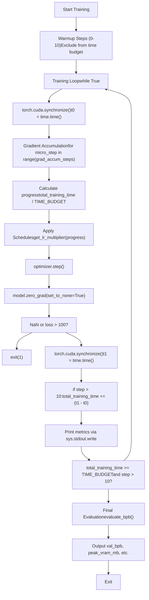
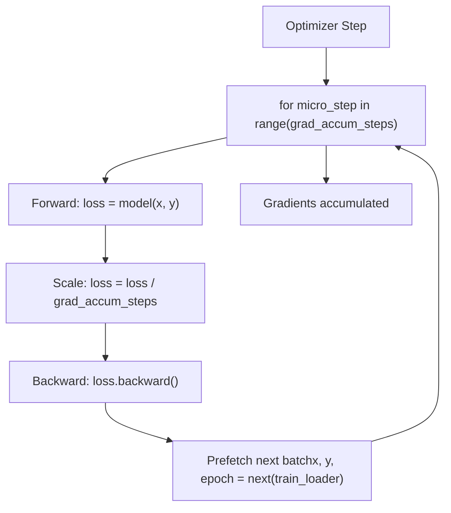
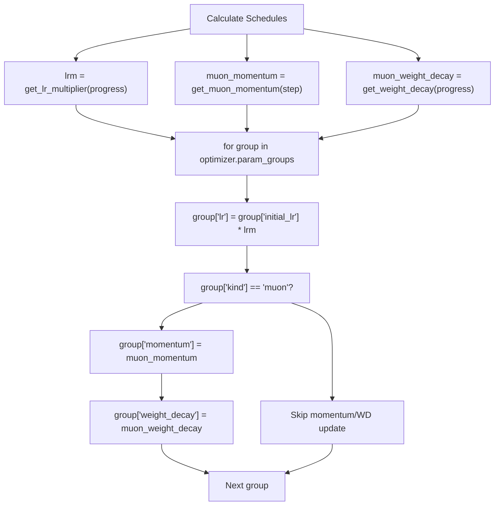

# Training Loop and Scheduling

Relevant source files

-   [train.py](https://github.com/karpathy/autoresearch/blob/e6d79c12/train.py)

This page documents the training loop implementation in `train.py`, focusing on the time-based training philosophy, gradient accumulation mechanics, and the three-phase learning rate scheduling system. The training loop is designed to execute experiments within a fixed time budget while maximizing token throughput and enabling fair comparison across different architectural configurations.

For details on the model architecture being trained, see [GPT Model Architecture](/karpathy/autoresearch/3.1.1-gpt-model-architecture). For the optimizer implementation, see [MuonAdamW Optimizer](/karpathy/autoresearch/3.1.2-muonadamw-optimizer). For the evaluation metrics produced by the training loop, see [Validation Bits Per Byte (val\_bpb)](/karpathy/autoresearch/5.1-validation-bits-per-byte-(val_bpb)).

---

## Time-Based Training Philosophy

The autoresearch system enforces a **fixed wall-clock time budget** rather than a fixed number of training steps. This design choice ensures fair comparison across experiments that modify model size, batch size, or other hyperparameters that affect training throughput.

The training loop runs for exactly `TIME_BUDGET` seconds (300s from [prepare.py27](https://github.com/karpathy/autoresearch/blob/e6d79c12/prepare.py#L27-L27)) of actual training time, excluding compilation and warmup overhead. The time budget is enforced by tracking accumulated training time and terminating when the budget is exhausted [train.py603-604](https://github.com/karpathy/autoresearch/blob/e6d79c12/train.py#L603-L604)

### Training Execution Flow

The following diagram illustrates the lifecycle of a training run, mapping logical stages to the `train.py` implementation.


**Sources**: [train.py538-604](https://github.com/karpathy/autoresearch/blob/e6d79c12/train.py#L538-L604) [prepare.py27](https://github.com/karpathy/autoresearch/blob/e6d79c12/prepare.py#L27-L27)

---

## Gradient Accumulation

Gradient accumulation enables training with large effective batch sizes (`TOTAL_BATCH_SIZE`) despite GPU memory constraints. The system splits each optimizer step into multiple microbatch forward-backward passes.

### Calculation

The number of gradient accumulation steps is computed as:

```
grad_accum_steps = TOTAL_BATCH_SIZE / (DEVICE_BATCH_SIZE * MAX_SEQ_LEN)
```
Where:

-   `TOTAL_BATCH_SIZE = 2^19` (524,288 tokens) - effective batch size [train.py438](https://github.com/karpathy/autoresearch/blob/e6d79c12/train.py#L438-L438)
-   `DEVICE_BATCH_SIZE = 128` - per-device microbatch size [train.py451](https://github.com/karpathy/autoresearch/blob/e6d79c12/train.py#L451-L451)
-   `MAX_SEQ_LEN = 2048` - sequence length from [prepare.py24](https://github.com/karpathy/autoresearch/blob/e6d79c12/prepare.py#L24-L24)

### Implementation

The gradient accumulation loop [train.py546-552](https://github.com/karpathy/autoresearch/blob/e6d79c12/train.py#L546-L552) handles the microbatching:


Each microbatch computes gradients that are accumulated in parameter `.grad` buffers. The loss is scaled by `1 / grad_accum_steps` to maintain correct gradient magnitudes [train.py548](https://github.com/karpathy/autoresearch/blob/e6d79c12/train.py#L548-L548) After all microbatches complete, `optimizer.step()` applies the accumulated gradients and `model.zero_grad(set_to_none=True)` resets the buffers [train.py564-565](https://github.com/karpathy/autoresearch/blob/e6d79c12/train.py#L564-L565)

**Sources**: [train.py438-451](https://github.com/karpathy/autoresearch/blob/e6d79c12/train.py#L438-L451) [train.py495-497](https://github.com/karpathy/autoresearch/blob/e6d79c12/train.py#L495-L497) [train.py546-552](https://github.com/karpathy/autoresearch/blob/e6d79c12/train.py#L546-L552) [train.py564-565](https://github.com/karpathy/autoresearch/blob/e6d79c12/train.py#L564-L565)

---

## Three-Phase Learning Rate Schedule

The learning rate schedule has three phases controlled by `progress = total_training_time / TIME_BUDGET` [train.py555](https://github.com/karpathy/autoresearch/blob/e6d79c12/train.py#L555-L555):

| Phase | Progress Range | Multiplier | Purpose |
| --- | --- | --- | --- |
| **Warmup** | `[0, WARMUP_RATIO)` | `progress / WARMUP_RATIO` | Linear ramp-up from 0 to 1 |
| **Plateau** | `[WARMUP_RATIO, 1 - WARMDOWN_RATIO)` | `1.0` | Full learning rate |
| **Warmdown** | `[1 - WARMDOWN_RATIO, 1.0]` | Linear decay | `1.0 → FINAL_LR_FRAC` |

### Schedule Function

The `get_lr_multiplier(progress)` function [train.py518-525](https://github.com/karpathy/autoresearch/blob/e6d79c12/train.py#L518-L525) implements this logic:

```
def get_lr_multiplier(progress):    if progress < WARMUP_RATIO:        return progress / WARMUP_RATIO if WARMUP_RATIO > 0 else 1.0    elif progress < 1.0 - WARMDOWN_RATIO:        return 1.0    else:        cooldown = (1.0 - progress) / WARMDOWN_RATIO        return cooldown * 1.0 + (1 - cooldown) * FINAL_LR_FRAC
```
### Default Hyperparameters

[train.py445-447](https://github.com/karpathy/autoresearch/blob/e6d79c12/train.py#L445-L447):

-   `WARMUP_RATIO = 0.0` - no warmup by default.
-   `WARMDOWN_RATIO = 0.5` - second half of training is the decay phase.
-   `FINAL_LR_FRAC = 0.0` - decay to zero.

### Application to Parameter Groups

The LR multiplier is applied to each parameter group's `initial_lr` [train.py559-560](https://github.com/karpathy/autoresearch/blob/e6d79c12/train.py#L559-L560):

```
for group in optimizer.param_groups:    group["lr"] = group["initial_lr"] * lrm
```
The `initial_lr` for each group is captured during optimizer initialization in [train.py264-265](https://github.com/karpathy/autoresearch/blob/e6d79c12/train.py#L264-L265)

**Sources**: [train.py445-447](https://github.com/karpathy/autoresearch/blob/e6d79c12/train.py#L445-L447) [train.py518-525](https://github.com/karpathy/autoresearch/blob/e6d79c12/train.py#L518-L525) [train.py554-563](https://github.com/karpathy/autoresearch/blob/e6d79c12/train.py#L554-L563)

---

## Optimizer-Specific Schedules

In addition to the shared LR schedule, Muon parameter groups have their own schedules for momentum and weight decay.

### Muon Momentum Warmup

The `get_muon_momentum(step)` function [train.py527-529](https://github.com/karpathy/autoresearch/blob/e6d79c12/train.py#L527-L529) implements a step-based momentum warmup:

```
def get_muon_momentum(step):    frac = min(step / 300, 1)    return (1 - frac) * 0.85 + frac * 0.95
```
This linearly interpolates from `0.85` to `0.95` over the first 300 steps. Unlike the LR schedule, this is **step-based** rather than time-based [train.py528](https://github.com/karpathy/autoresearch/blob/e6d79c12/train.py#L528-L528)

### Weight Decay Schedule

The `get_weight_decay(progress)` function [train.py531-532](https://github.com/karpathy/autoresearch/blob/e6d79c12/train.py#L531-L532) decays weight decay to zero:

```
def get_weight_decay(progress):    return WEIGHT_DECAY * (1 - progress)
```
Starting from `WEIGHT_DECAY = 0.2` [train.py443](https://github.com/karpathy/autoresearch/blob/e6d79c12/train.py#L443-L443) this linearly decays to `0.0` by the end of the time budget.

### Schedule Application Logic

The following diagram maps the scheduling functions to the `optimizer.param_groups` structure.


**Sources**: [train.py443](https://github.com/karpathy/autoresearch/blob/e6d79c12/train.py#L443-L443) [train.py527-532](https://github.com/karpathy/autoresearch/blob/e6d79c12/train.py#L527-L532) [train.py554-563](https://github.com/karpathy/autoresearch/blob/e6d79c12/train.py#L554-L563)

---

## Progress Tracking and Time Budget Enforcement

### Progress Calculation

The `progress` variable represents fractional completion of the time budget [train.py555](https://github.com/karpathy/autoresearch/blob/e6d79c12/train.py#L555-L555):

```
progress = min(total_training_time / TIME_BUDGET, 1.0)
```
### Warmup Exclusion

The first 10 steps are excluded from `total_training_time` to avoid counting PyTorch compilation and initialization overhead [train.py578-579](https://github.com/karpathy/autoresearch/blob/e6d79c12/train.py#L578-L579):

```
if step > 10:    total_training_time += dt
```
### Time Budget Enforcement

Training terminates when both conditions are met [train.py603-604](https://github.com/karpathy/autoresearch/blob/e6d79c12/train.py#L603-L604):

1.  `step > 10` - past warmup.
2.  `total_training_time >= TIME_BUDGET` - budget exhausted.

This ensures at least 11 steps execute before time-based termination, allowing throughput metrics to stabilize.

**Sources**: [train.py540](https://github.com/karpathy/autoresearch/blob/e6d79c12/train.py#L540-L540) [train.py555](https://github.com/karpathy/autoresearch/blob/e6d79c12/train.py#L555-L555) [train.py574-579](https://github.com/karpathy/autoresearch/blob/e6d79c12/train.py#L574-L579) [train.py603-604](https://github.com/karpathy/autoresearch/blob/e6d79c12/train.py#L603-L604)

---

## Fast-Fail Detection

To prevent wasting time on diverged runs, the training loop aborts immediately if the loss becomes NaN or explodes [train.py569-572](https://github.com/karpathy/autoresearch/blob/e6d79c12/train.py#L569-L572):

```
if math.isnan(train_loss_f) or train_loss_f > 100:    print("FAIL")    exit(1)
```
This fast-fail mechanism:

-   **Detects NaN**: Catches numerical instability.
-   **Detects Explosion**: A loss threshold of 100 indicates severe divergence.
-   **Immediate Exit**: `exit(1)` terminates the process, allowing the agent to detect failure via exit codes.

**Sources**: [train.py567-572](https://github.com/karpathy/autoresearch/blob/e6d79c12/train.py#L567-L572)

---

## Garbage Collection Management

Python's garbage collector can cause non-deterministic stalls. The loop manages GC explicitly to minimize interruptions [train.py592-599](https://github.com/karpathy/autoresearch/blob/e6d79c12/train.py#L592-L599):

-   **Step 0** [train.py593-596](https://github.com/karpathy/autoresearch/blob/e6d79c12/train.py#L593-L596): `gc.collect()` cleans up initialization; `gc.freeze()` marks objects as permanent; `gc.disable()` turns off automatic collection.
-   **Every 5000 steps** [train.py597-598](https://github.com/karpathy/autoresearch/blob/e6d79c12/train.py#L597-L598): `gc.collect()` is called manually to prevent unbounded memory growth.

**Sources**: [train.py592-599](https://github.com/karpathy/autoresearch/blob/e6d79c12/train.py#L592-L599)

---

## Final Evaluation and Metrics Output

After the training loop terminates, the model switches to `eval()` mode [train.py611](https://github.com/karpathy/autoresearch/blob/e6d79c12/train.py#L611-L611) and outputs standardized metrics.

### Evaluation

The validation metric is computed using the fixed harness [train.py613](https://github.com/karpathy/autoresearch/blob/e6d79c12/train.py#L613-L613):

```
val_bpb = evaluate_bpb(model, tokenizer, DEVICE_BATCH_SIZE)
```
### Output Summary

The final summary is printed with labeled metrics for agent parsing [train.py621-630](https://github.com/karpathy/autoresearch/blob/e6d79c12/train.py#L621-L630):

| Metric | Code Entity | Description |
| --- | --- | --- |
| `val_bpb` | `val_bpb` | Primary optimization target |
| `peak_vram_mb` | `torch.cuda.max_memory_allocated() / 1e6` | Soft constraint for hardware limits |
| `mfu_percent` | `mfu` | Training efficiency metric |
| `total_tokens_M` | `total_tokens / 1e6` | Throughput summary |
| `num_params_M` | `sum(p.numel() for p in model.parameters()) / 1e6` | Model scale |

**Sources**: [train.py611-631](https://github.com/karpathy/autoresearch/blob/e6d79c12/train.py#L611-L631) [prepare.py26](https://github.com/karpathy/autoresearch/blob/e6d79c12/prepare.py#L26-L26)
