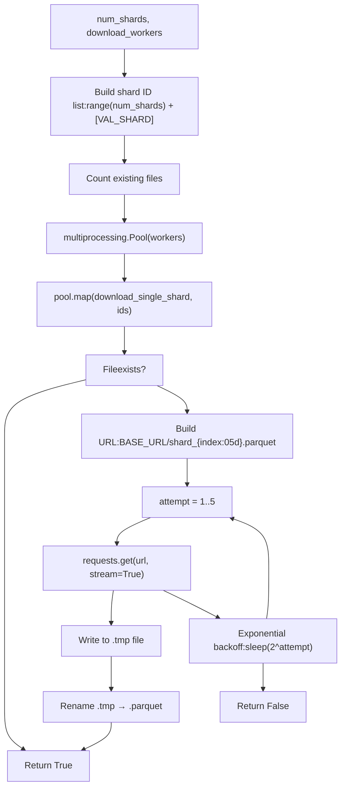
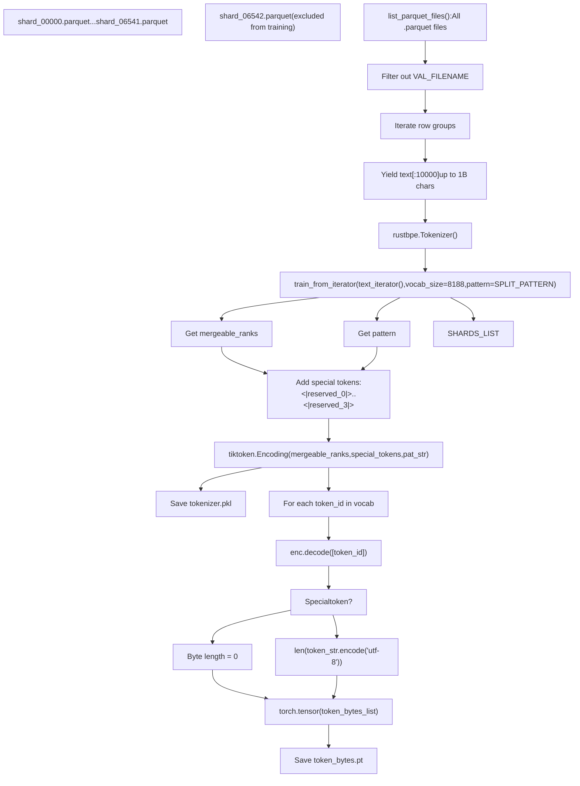
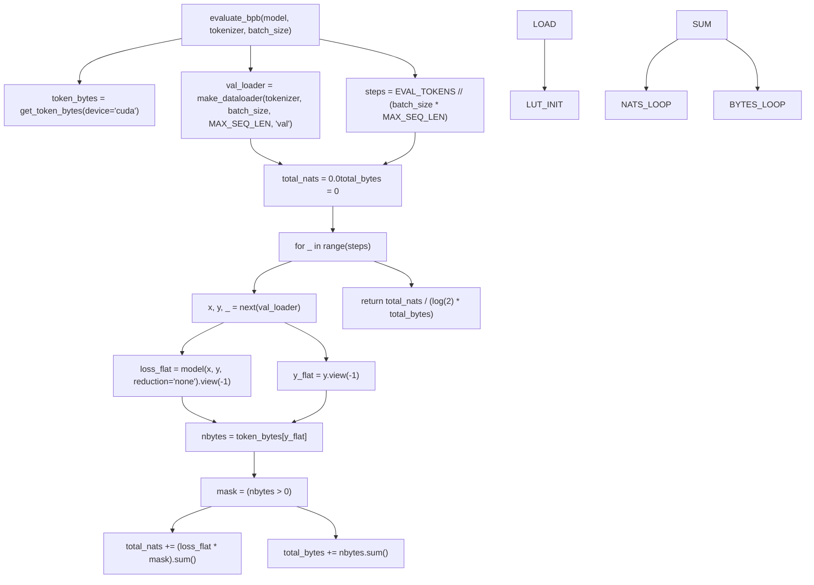

# prepare.py - Data and Evaluation

Relevant source files

-   [prepare.py](https://github.com/karpathy/autoresearch/blob/e6d79c12/prepare.py)

`prepare.py` is the **immutable infrastructure layer** of autoresearch. It provides fixed constants, one-time data preparation, and runtime utilities that establish the rules for all experiments. The agent never modifies this file—it defines the platform on which experiments run.

This page covers the data pipeline, tokenizer training, dataloader implementation, and evaluation harness. For the mutable experimental layer that uses these utilities, see [train.py - The Mutable Core](/karpathy/autoresearch/3.1-train.py-the-mutable-core). For the specific evaluation metric calculation, see [Validation Bits Per Byte (val\_bpb)](/karpathy/autoresearch/5.1-validation-bits-per-byte-(val_bpb)).

**Sources**: [prepare.py1-10](https://github.com/karpathy/autoresearch/blob/e6d79c12/prepare.py#L1-L10) [README.md13-14](https://github.com/karpathy/autoresearch/blob/e6d79c12/README.md?plain=1#L13-L14)

---

## Role in the System Architecture

The `prepare.py` file serves three distinct functions across the autoresearch lifecycle:

| Phase | Function | Output |
| --- | --- | --- |
| **One-time setup** | Download data shards, train BPE tokenizer | `~/.cache/autoresearch/` artifacts |
| **Build-time exports** | Define constants (MAX\_SEQ\_LEN, TIME\_BUDGET, EVAL\_TOKENS) | Platform parameters imported by train.py |
| **Runtime exports** | Provide utilities (Tokenizer, make\_dataloader, evaluate\_bpb) | Functions called during training |

The key architectural principle: **prepare.py is never modified by the agent**. This ensures all experiments are evaluated on the same data, with the same tokenizer, using the same metric calculation. Changes to model architecture, hyperparameters, or training loop in `train.py` remain fairly comparable because the evaluation infrastructure is frozen.

**Sources**: [prepare.py1-10](https://github.com/karpathy/autoresearch/blob/e6d79c12/prepare.py#L1-L10) [README.md13-65](https://github.com/karpathy/autoresearch/blob/e6d79c12/README.md?plain=1#L13-L65)

---

## Fixed Constants

The following constants define the experimental platform and are imported by `train.py`:

```
MAX_SEQ_LEN = 2048       # Context length for all experimentsTIME_BUDGET = 300        # Training duration in seconds (5 minutes wall clock)EVAL_TOKENS = 40 * 524288  # Validation tokens (~21M tokens)
```
**Sources**: [prepare.py30-32](https://github.com/karpathy/autoresearch/blob/e6d79c12/prepare.py#L30-L32)

### Platform Configuration

Additional constants configure data sources and tokenizer training:

| Constant | Value | Purpose |
| --- | --- | --- |
| `CACHE_DIR` | `~/.cache/autoresearch` | Root directory for all artifacts |
| `DATA_DIR` | `{CACHE_DIR}/data` | Parquet shard storage |
| `TOKENIZER_DIR` | `{CACHE_DIR}/tokenizer` | Tokenizer artifacts |
| `BASE_URL` | HuggingFace dataset URL | Source for climbmix-400b-shuffle |
| `MAX_SHARD` | 6542 | Total available shards |
| `VAL_SHARD` | 6542 | Pinned validation shard (shard\_06542.parquet) |
| `VOCAB_SIZE` | 8192 | BPE vocabulary size |

The pinned validation shard ensures all experiments evaluate on identical data. The training set comprises shards 0-6541 (or a subset if `--num-shards` is specified).

**Sources**: [prepare.py38-52](https://github.com/karpathy/autoresearch/blob/e6d79c12/prepare.py#L38-L52)

---

## One-Time Setup Phase

### Setup Command Flow

```mermaid
flowchart TD
    CLI["uv run prepare.py[--num-shards N][--download-workers W]"]
    PARSE["argparse:num_shards=10download_workers=8"]
    DL_CHECK["All shardsdownloaded?"]
    DOWNLOAD["download_data()"]
    DL_SKIP["Skip download"]
    POOL["Pool(workers)"]
    SHARD1["download_single_shard(0)"]
    SHARD2["download_single_shard(1)"]
    SHARD3["download_single_shard(...)"]
    VALSH["download_single_shard(6542)"]
    RETRY1["Retry loop:max 5 attemptsexponential backoff"]
    RETRY2["Retry loop"]
    RETRY3["Retry loop"]
    RETRYV["Retry loop"]
    DATA_DONE["All shards in~/.cache/autoresearch/data/"]
    TOK_CHECK["Tokenizerexists?"]
    TRAIN_TOK["train_tokenizer()"]
    TOK_SKIP["Skip training"]
    ITER["text_iterator():Yield docs fromtraining shards"]
    RUSTBPE["rustbpe.train_from_iteratorvocab_size=8188SPLIT_PATTERN"]
    CONVERT["Convert to tiktoken.Encoding"]
    SAVE_TOK["Save tokenizer.pkl"]
    BUILD_LUT["Build token_byteslookup table"]
    SAVE_LUT["Save token_bytes.pt"]
    DONE["Ready to train"]

    CLI --> PARSE
    PARSE --> DL_CHECK
    DL --> CHECK_DOWNLOAD
    DL --> CHECK_DL_SKIP
    DOWNLOAD --> POOL
    POOL --> SHARD1
    POOL --> SHARD2
    POOL --> SHARD3
    POOL --> VALSH
    SHARD1 --> RETRY1
    SHARD2 --> RETRY2
    SHARD3 --> RETRY3
    VALSH --> RETRYV
    RETRY1 --> DATA_DONE
    RETRY2 --> DATA_DONE
    RETRY3 --> DATA_DONE
    RETRYV --> DATA_DONE
    DL --> SKIP_TOK_CHECK
    DATA --> DONE_TOK_CHECK
    TOK --> CHECK_TRAIN_TOK
    TOK --> CHECK_TOK_SKIP
    TRAIN --> TOK_ITER
    ITER --> RUSTBPE
    RUSTBPE --> CONVERT
    CONVERT --> SAVE_TOK
    SAVE --> TOK_BUILD_LUT
    BUILD --> LUT_SAVE_LUT
    SAVE --> LUT_DONE
    TOK --> SKIP_DONE
```


**Diagram: One-time setup execution flow**

**Sources**: [prepare.py371-389](https://github.com/karpathy/autoresearch/blob/e6d79c12/prepare.py#L371-L389) [prepare.py91-114](https://github.com/karpathy/autoresearch/blob/e6d79c12/prepare.py#L91-L114) [prepare.py141-203](https://github.com/karpathy/autoresearch/blob/e6d79c12/prepare.py#L141-L203)

---

## Data Download Pipeline

### Download Functions

The download pipeline uses parallel workers with retry logic:


**Diagram: Parallel download with retry logic**

The validation shard (6542) is always downloaded even if `--num-shards` is smaller, ensuring evaluation consistency. For details, see [Data Pipeline](/karpathy/autoresearch/3.2.1-data-pipeline).

**Sources**: [prepare.py57-114](https://github.com/karpathy/autoresearch/blob/e6d79c12/prepare.py#L57-L114)

---

## Tokenizer Training Pipeline

### BPE Training Architecture


**Diagram: Tokenizer training and artifact generation**

The training process uses the `rustbpe` library and converts the results to a `tiktoken.Encoding`. It also builds a `token_bytes` lookup table for BPB metric calculation. For details, see [Tokenizer Training](/karpathy/autoresearch/3.2.2-tokenizer-training).

**Sources**: [prepare.py119-203](https://github.com/karpathy/autoresearch/blob/e6d79c12/prepare.py#L119-L203)

### Special Tokens and BOS Alignment

```
SPECIAL_TOKENS = [f"<|reserved_{i}|>" for i in range(4)]BOS_TOKEN = "<|reserved_0|>"
```
The tokenizer reserves 4 special tokens. `<|reserved_0|>` serves as the BOS (beginning of sequence) token, used by the dataloader to mark document boundaries. Special tokens have byte length 0 in the `token_bytes` lookup, excluding them from BPB calculation.

**Sources**: [prepare.py50-51](https://github.com/karpathy/autoresearch/blob/e6d79c12/prepare.py#L50-L51) [prepare.py186-193](https://github.com/karpathy/autoresearch/blob/e6d79c12/prepare.py#L186-L193)

---

## Runtime Exports

### Tokenizer Class

The `Tokenizer` class wraps `tiktoken.Encoding` for use in `train.py`:

| Method | Signature | Purpose |
| --- | --- | --- |
| `from_directory()` | `cls, tokenizer_dir` → `Tokenizer` | Load from tokenizer.pkl |
| `get_vocab_size()` | `self` → `int` | Return vocabulary size (8192) |
| `get_bos_token_id()` | `self` → `int` | Return BOS token ID |
| `encode()` | `self, text, prepend, num_threads` → `list[int]` or `list[list[int]]` | Encode text with optional BOS prepend |
| `decode()` | `self, ids` → `str` | Decode token IDs to text |

**Sources**: [prepare.py209-245](https://github.com/karpathy/autoresearch/blob/e6d79c12/prepare.py#L209-L245)

---

## BOS-Aligned Best-Fit Packing Dataloader

### Dataloader Architecture

```mermaid
flowchart TD
    PARAMS["Parameters:B = batch sizeT = sequence lengthsplit = 'train' or 'val'buffer_size = 1000"]
    INIT["Initialize:row_capacity = T + 1doc_buffer = []epoch = 1"]
    ALLOC["Preallocate buffers:row_buffer[B, T+1]cpu_buffer[2BT] (pinned)gpu_buffer[2BT] (CUDA)"]
    ROW_LOOP["for row_idx in range(B)"]
    POS["pos = 0"]
    FILL_CHECK["pos < T+1?"]
    BUF_CHECK["doc_buffer< buffer_size?"]
    REFILL["refill_buffer():- next(_document_batches)- tokenizer.encode(batch, prepend=BOS)- extend doc_buffer"]
    REMAIN["remaining = T+1 - pos"]
    BEST_FIT["Find largest doc wherelen(doc) <= remaining"]
    FOUND["Docfound?"]
    USE_BEST["doc = doc_buffer.pop(best_idx)row_buffer[row_idx, pos:pos+len(doc)] = docpos += len(doc)"]
    CROP["Find shortest docdoc = doc_buffer.pop(shortest_idx)row_buffer[row_idx, pos:pos+remaining] = doc[:remaining]pos += remaining"]
    COPY_CPU["cpu_inputs = row_buffer[:, :-1]cpu_targets = row_buffer[:, 1:]"]
    COPY_GPU["gpu_buffer.copy_(cpu_buffer, non_blocking=True)"]
    YIELD["yield inputs, targets, epoch"]

    PARAMS --> INIT
    INIT --> ALLOC
    ALLOC --> ROW_LOOP
    ROW --> LOOP_POS
    POS --> FILL_CHECK
    FILL --> CHECK_BUF_CHECK
    FILL --> CHECK_COPY_CPU
    BUF --> CHECK_REFILL
    BUF --> CHECK_REMAIN
    REFILL --> REMAIN
    REMAIN --> BEST_FIT
    BEST --> FIT_FOUND
    FOUND --> USE_BEST
    FOUND --> CROP
    USE --> BEST_FILL_CHECK
    CROP --> FILL_CHECK
    COPY --> CPU_COPY_GPU
    COPY --> GPU_YIELD
    YIELD --> ROW_LOOP
```


**Diagram: BOS-aligned best-fit packing algorithm**

The dataloader implements **BOS-aligned best-fit packing**, ensuring 100% token utilization with no padding. For details, see [Data Pipeline](/karpathy/autoresearch/3.2.1-data-pipeline).

**Sources**: [prepare.py276-337](https://github.com/karpathy/autoresearch/blob/e6d79c12/prepare.py#L276-L337)

---

## Evaluation Harness

### evaluate\_bpb Function

The `evaluate_bpb()` function is the **fixed ground truth metric** for all experiments. It must never be modified to ensure fair comparison.


**Diagram: Bits per byte evaluation computation**

The BPB metric is **vocab-size independent**, allowing fair comparison across different tokenization strategies. For details, see [Evaluation Harness](/karpathy/autoresearch/3.2.3-evaluation-harness).

**Sources**: [prepare.py343-365](https://github.com/karpathy/autoresearch/blob/e6d79c12/prepare.py#L343-L365) [README.md17](https://github.com/karpathy/autoresearch/blob/e6d79c12/README.md?plain=1#L17-L17)

---

## Artifact Storage

All artifacts are stored in `~/.cache/autoresearch/`:

```
~/.cache/autoresearch/
├── data/
│   ├── shard_00000.parquet
│   ├── ...
│   └── shard_06542.parquet  (validation shard)
└── tokenizer/
    ├── tokenizer.pkl         (tiktoken.Encoding)
    └── token_bytes.pt        (torch.Tensor[vocab_size])
```
**Sources**: [prepare.py38-40](https://github.com/karpathy/autoresearch/blob/e6d79c12/prepare.py#L38-L40) [README.md33-34](https://github.com/karpathy/autoresearch/blob/e6d79c12/README.md?plain=1#L33-L34)

---

## Immutability Rationale

The design philosophy requires `prepare.py` to be **immutable** for several reasons:

| Reason | Consequence if Modified |
| --- | --- |
| **Fair comparison** | Changing MAX\_SEQ\_LEN or EVAL\_TOKENS would make val\_bpb incomparable |
| **Reproducibility** | Different tokenizers would produce different token streams |
| **Platform definition** | TIME\_BUDGET defines the fixed 5-minute training window |
| **Metric consistency** | Modifying evaluate\_bpb could artificially improve scores |

**Sources**: [README.md13-65](https://github.com/karpathy/autoresearch/blob/e6d79c12/README.md?plain=1#L13-L65) [prepare.py1-10](https://github.com/karpathy/autoresearch/blob/e6d79c12/prepare.py#L1-L10)
