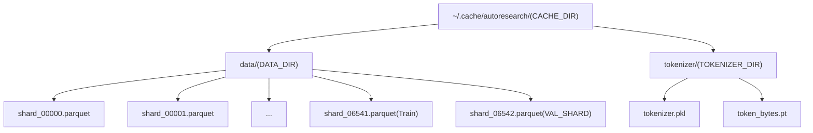
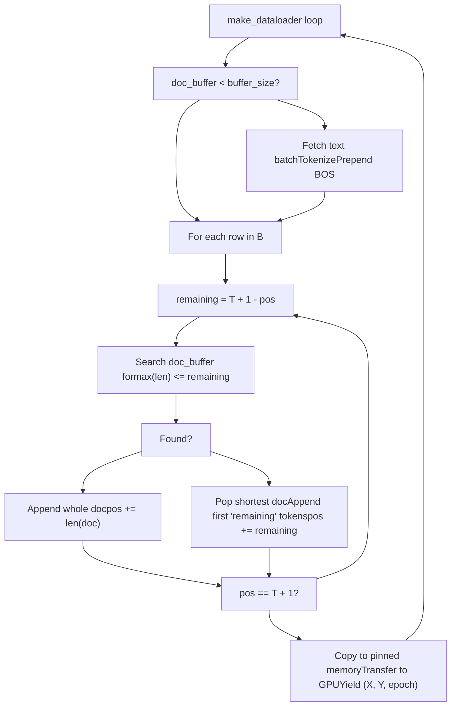

# Data Pipeline

Relevant source files

-   [prepare.py](https://github.com/karpathy/autoresearch/blob/e6d79c12/prepare.py)

## Purpose and Scope

This page documents the data pipeline in `prepare.py`, covering how the autoresearch system downloads, organizes, and loads training data at runtime. Specifically, this includes: dataset structure and storage, download mechanisms, train/validation split, and the BOS-aligned best-fit packing dataloader implementation.

The pipeline is designed to be immutable; while the agent modifies `train.py`, `prepare.py` remains a fixed infrastructure layer to ensure that all experiments are evaluated on the same data distribution and sequence length [prepare.py27-32](https://github.com/karpathy/autoresearch/blob/e6d79c12/prepare.py#L27-L32)

## Dataset Overview

The autoresearch system uses the `climbmix-400b-shuffle` dataset from Hugging Face, a large-scale pretraining corpus stored as parquet shards.

### Dataset Configuration

| Parameter | Value | Location |
| --- | --- | --- |
| Dataset Name | `climbmix-400b-shuffle` | [prepare.py41](https://github.com/karpathy/autoresearch/blob/e6d79c12/prepare.py#L41-L41) |
| Base URL | `https://huggingface.co/datasets/karpathy/climbmix-400b-shuffle/resolve/main` | [prepare.py41](https://github.com/karpathy/autoresearch/blob/e6d79c12/prepare.py#L41-L41) |
| Total Shards | 6543 (indices 0-6542) | [prepare.py42](https://github.com/karpathy/autoresearch/blob/e6d79c12/prepare.py#L42-L42) |
| Shard Format | Parquet (`.parquet`) | [prepare.py59](https://github.com/karpathy/autoresearch/blob/e6d79c12/prepare.py#L59-L59) |
| Cache Location | `~/.cache/autoresearch/data/` | [prepare.py38-39](https://github.com/karpathy/autoresearch/blob/e6d79c12/prepare.py#L38-L39) |
| Training Shards | 0-6541 (all except last) | [prepare.py94-95](https://github.com/karpathy/autoresearch/blob/e6d79c12/prepare.py#L94-L95) |
| Validation Shard | 6542 (pinned last shard) | [prepare.py43-44](https://github.com/karpathy/autoresearch/blob/e6d79c12/prepare.py#L43-L44) |

The train/validation split is deterministic: the last shard (`shard_06542.parquet`) is reserved for validation [prepare.py43-44](https://github.com/karpathy/autoresearch/blob/e6d79c12/prepare.py#L43-L44) This ensures consistent evaluation across all experiments.

**Sources:** [prepare.py38-44](https://github.com/karpathy/autoresearch/blob/e6d79c12/prepare.py#L38-L44) [prepare.py91-98](https://github.com/karpathy/autoresearch/blob/e6d79c12/prepare.py#L91-L98)

---

## Cache Directory Structure

All downloaded data and generated tokenizer artifacts are stored in a persistent cache directory to avoid redundant downloads and compute across experiments.

### Directory Layout

```
~/.cache/autoresearch/
├── data/
│   ├── shard_00000.parquet
│   ├── shard_00001.parquet
│   ├── ...
│   ├── shard_06541.parquet
│   └── shard_06542.parquet    # VAL_SHARD
└── tokenizer/
    ├── tokenizer.pkl          # tiktoken Encoding
    └── token_bytes.pt         # torch.Tensor for BPB calc
```
The `CACHE_DIR` constant defines the root cache location [prepare.py38](https://github.com/karpathy/autoresearch/blob/e6d79c12/prepare.py#L38-L38) The `DATA_DIR` contains the raw parquet shards [prepare.py39](https://github.com/karpathy/autoresearch/blob/e6d79c12/prepare.py#L39-L39) while `TOKENIZER_DIR` holds the BPE model and the token byte-length lookup table [prepare.py40](https://github.com/karpathy/autoresearch/blob/e6d79c12/prepare.py#L40-L40)

**Diagram: Cache Directory Structure**


**Sources:** [prepare.py38-44](https://github.com/karpathy/autoresearch/blob/e6d79c12/prepare.py#L38-L44) [prepare.py143-144](https://github.com/karpathy/autoresearch/blob/e6d79c12/prepare.py#L143-L144)

---

## Download Mechanism

The data pipeline downloads parquet shards with parallel execution and automatic retry logic via `download_data`.

### Download Functions

#### `download_single_shard(index)`

Downloads a single parquet shard with retry logic [prepare.py57-88](https://github.com/karpathy/autoresearch/blob/e6d79c12/prepare.py#L57-L88)

-   **Idempotent**: Skips download if file already exists [prepare.py61-62](https://github.com/karpathy/autoresearch/blob/e6d79c12/prepare.py#L61-L62)
-   **Retry logic**: Up to 5 attempts with exponential backoff (`2 ** attempt`) [prepare.py65-87](https://github.com/karpathy/autoresearch/blob/e6d79c12/prepare.py#L65-L87)
-   **Atomic writes**: Streams to a `.tmp` file and renames on success to prevent corrupted partial files [prepare.py70-75](https://github.com/karpathy/autoresearch/blob/e6d79c12/prepare.py#L70-L75)

#### `download_data(num_shards, download_workers=8)`

Orchestrates parallel downloads of multiple shards using `multiprocessing.Pool` [prepare.py91-113](https://github.com/karpathy/autoresearch/blob/e6d79c12/prepare.py#L91-L113) It ensures the pinned `VAL_SHARD` is always included in the download list [prepare.py96-97](https://github.com/karpathy/autoresearch/blob/e6d79c12/prepare.py#L96-L97)

**Diagram: Download Process Flow**

> **[Mermaid sequence]**
> *(图表结构无法解析)*

**Sources:** [prepare.py57-113](https://github.com/karpathy/autoresearch/blob/e6d79c12/prepare.py#L57-L113)

---

## Data Loading at Runtime

During training and evaluation, `prepare.py` provides an infinite iterator over document batches.

### `_document_batches(split, tokenizer_batch_size=128)`

This is an infinite generator that yields batches of raw text strings [prepare.py243-258](https://github.com/karpathy/autoresearch/blob/e6d79c12/prepare.py#L243-L258)

-   **Split Logic**: If `split="train"`, it excludes the `VAL_FILENAME` [prepare.py246](https://github.com/karpathy/autoresearch/blob/e6d79c12/prepare.py#L246-L246) If `split="val"`, it uses *only* the `VAL_FILENAME` [prepare.py247](https://github.com/karpathy/autoresearch/blob/e6d79c12/prepare.py#L247-L247)
-   **Iteration**: It reads shards sequentially, then row groups within shards using `pyarrow.parquet` [prepare.py249-253](https://github.com/karpathy/autoresearch/blob/e6d79c12/prepare.py#L249-L253)
-   **Epoch Tracking**: Increments an `epoch` counter every time it finishes iterating through the assigned shard list [prepare.py248-258](https://github.com/karpathy/autoresearch/blob/e6d79c12/prepare.py#L248-L258)

**Sources:** [prepare.py243-258](https://github.com/karpathy/autoresearch/blob/e6d79c12/prepare.py#L243-L258)

---

## BOS-Aligned Best-Fit Packing Dataloader

The `make_dataloader()` function implements a packing algorithm that achieves 100% token utilization (no padding) while ensuring every sequence starts with a BOS token.

### Design Philosophy

The dataloader enforces three invariants:

1.  **BOS-aligned**: Every row in the batch starts with the `<|reserved_0|>` (BOS) token [prepare.py51-278](https://github.com/karpathy/autoresearch/blob/e6d79c12/prepare.py#L51-L278)
2.  **Best-fit packing**: To minimize document cropping, the loader tries to fit whole documents into the remaining space of a sequence [prepare.py302-308](https://github.com/karpathy/autoresearch/blob/e6d79c12/prepare.py#L302-L308)
3.  **100% utilization**: If no document fits, it crops the shortest available document to fill the sequence exactly [prepare.py310-316](https://github.com/karpathy/autoresearch/blob/e6d79c12/prepare.py#L310-L316)

### Packing Algorithm Implementation

The loader maintains a `doc_buffer` of tokenized documents [prepare.py269](https://github.com/karpathy/autoresearch/blob/e6d79c12/prepare.py#L269-L269)

1.  **Refill**: When the buffer drops below `buffer_size` (default 1000), it fetches more text batches, tokenizes them, and prepends the BOS token [prepare.py271-278](https://github.com/karpathy/autoresearch/blob/e6d79c12/prepare.py#L271-L278)
2.  **Packing Loop**: For each row in the batch:
    -   It calculates `remaining` space [prepare.py300](https://github.com/karpathy/autoresearch/blob/e6d79c12/prepare.py#L300-L300)
    -   It performs a linear search for the largest document in the buffer that fits in `remaining` [prepare.py302-305](https://github.com/karpathy/autoresearch/blob/e6d79c12/prepare.py#L302-L305)
    -   If found, that document is popped and appended to the row [prepare.py306-308](https://github.com/karpathy/autoresearch/blob/e6d79c12/prepare.py#L306-L308)
    -   If no document fits, it pops the shortest document and crops it to fit exactly [prepare.py310-316](https://github.com/karpathy/autoresearch/blob/e6d79c12/prepare.py#L310-L316)
3.  **Target Generation**: Targets are simply the inputs shifted by one [prepare.py320](https://github.com/karpathy/autoresearch/blob/e6d79c12/prepare.py#L320-L320)

**Diagram: Best-Fit Packing Logic**


**Sources:** [prepare.py260-321](https://github.com/karpathy/autoresearch/blob/e6d79c12/prepare.py#L260-L321)

---

## Memory Layout and Pinned Transfers

To maximize training throughput, the dataloader uses pre-allocated pinned memory buffers for asynchronous CPU-to-GPU transfers.

-   **`cpu_buffer`**: A pinned `torch.Tensor` of size `2 * B * T` [prepare.py281](https://github.com/karpathy/autoresearch/blob/e6d79c12/prepare.py#L281-L281)
-   **`gpu_buffer`**: A CUDA `torch.Tensor` of the same size [prepare.py282](https://github.com/karpathy/autoresearch/blob/e6d79c12/prepare.py#L282-L282)
-   **Views**: `cpu_inputs` and `cpu_targets` are views into the pinned buffer [prepare.py284-285](https://github.com/karpathy/autoresearch/blob/e6d79c12/prepare.py#L284-L285)

When a batch is ready, it is copied into the pinned CPU buffer and then transferred to the GPU using `non_blocking=True` [prepare.py319-321](https://github.com/karpathy/autoresearch/blob/e6d79c12/prepare.py#L319-L321) This allows the CPU to begin packing the next batch while the GPU processes the current one.

**Sources:** [prepare.py280-321](https://github.com/karpathy/autoresearch/blob/e6d79c12/prepare.py#L280-L321)

---

## Summary of Constants

| Constant | Value | Description |
| --- | --- | --- |
| `MAX_SEQ_LEN` | 2048 | The context length `T` used by the dataloader [prepare.py30](https://github.com/karpathy/autoresearch/blob/e6d79c12/prepare.py#L30-L30) |
| `BOS_TOKEN` | \`< | reserved\_0 |
| `VOCAB_SIZE` | 8192 | Total size of the vocabulary including special tokens [prepare.py45](https://github.com/karpathy/autoresearch/blob/e6d79c12/prepare.py#L45-L45) |
| `EVAL_TOKENS` | 20,971,520 | Fixed number of tokens used for `val_bpb` calculation [prepare.py32](https://github.com/karpathy/autoresearch/blob/e6d79c12/prepare.py#L32-L32) |

**Sources:** [prepare.py30-51](https://github.com/karpathy/autoresearch/blob/e6d79c12/prepare.py#L30-L51)
