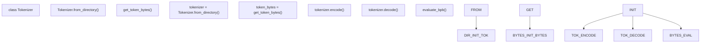

# Tokenizer Training

Relevant source files

-   [prepare.py](https://github.com/karpathy/autoresearch/blob/e6d79c12/prepare.py)

This page documents the one-time BPE tokenizer training process in autoresearch. The tokenizer is trained during the initial `prepare.py` execution and saved as immutable infrastructure for all subsequent experiments.

For runtime tokenizer usage in `train.py`, see [Data Pipeline](/karpathy/autoresearch/3.2.1-data-pipeline). For evaluation metrics that depend on the tokenizer, see [Evaluation Harness](/karpathy/autoresearch/3.2.3-evaluation-harness).

## Overview

The tokenizer training process occurs in the `train_tokenizer()` function [prepare.py141-196](https://github.com/karpathy/autoresearch/blob/e6d79c12/prepare.py#L141-L196) and consists of three phases:

1.  **BPE Training**: Train a byte-pair encoding tokenizer using `rustbpe` on training data shards.
2.  **Tiktoken Conversion**: Convert the trained merges to a `tiktoken.Encoding` object for runtime efficiency.
3.  **Byte Lookup Generation**: Build a `token_bytes.pt` tensor mapping token IDs to their UTF-8 byte lengths for BPB evaluation.

All outputs are saved to `~/.cache/autoresearch/tokenizer/` [prepare.py40](https://github.com/karpathy/autoresearch/blob/e6d79c12/prepare.py#L40-L40) and reused across all experiments. The tokenizer is trained only once and never modified by the autonomous agent.

**Sources**: [prepare.py38-40](https://github.com/karpathy/autoresearch/blob/e6d79c12/prepare.py#L38-L40) [prepare.py141-203](https://github.com/karpathy/autoresearch/blob/e6d79c12/prepare.py#L141-L203)

## Training Workflow

The following diagram shows the complete tokenizer training pipeline from data shards to runtime artifacts, mapping system functions to their generated entities:

```mermaid
flowchart TD
    SHARDS["Training Parquet Shards(exclude VAL_FILENAME)"]
    CONFIG["Configuration ConstantsVOCAB_SIZE=8192SPLIT_PATTERNSPECIAL_TOKENS"]
    TEXT_ITER["text_iterator()Yield documentsmax_chars=1B"]
    RUSTBPE["rustbpe.Tokenizer()train_from_iterator()"]
    MERGES["mergeable_ranks dictbytes → rank"]
    SPECIAL_MAP["special_tokens dictname → token_id"]
    TK_ENC["tiktoken.Encodingname='rustbpe'pat_str=patternmergeable_ranksspecial_tokens"]
    PICKLE["tokenizer.pklPickled Encoding object"]
    DECODE_LOOP["For each token_idin range(enc.n_vocab)"]
    GET_BYTES["enc.decode([token_id]).encode('utf-8')len()"]
    TENSOR["token_bytes_listdtype=int32"]
    SAVE_PT["token_bytes.pttorch.save()"]
    PKL_OUT["tokenizer.pkl~164 KB"]
    PT_OUT["token_bytes.pt~32 KB"]

    SHARDS --> TEXT_ITER
    CONFIG --> RUSTBPE
    TEXT --> ITER_RUSTBPE
    RUSTBPE --> MERGES
    CONFIG --> SPECIAL_MAP
    MERGES --> TK_ENC
    SPECIAL --> MAP_TK_ENC
    TK --> ENC_PICKLE
    PICKLE --> PKL_OUT
    TK --> ENC_DECODE_LOOP
    DECODE --> LOOP_GET_BYTES
    GET --> BYTES_TENSOR
    TENSOR --> SAVE_PT
    SAVE --> PT_PT_OUT
```


**Sources**: [prepare.py119-203](https://github.com/karpathy/autoresearch/blob/e6d79c12/prepare.py#L119-L203)

## Phase 1: BPE Training with rustbpe

The first phase trains the BPE tokenizer using the `rustbpe` library [prepare.py22](https://github.com/karpathy/autoresearch/blob/e6d79c12/prepare.py#L22-L22) which provides a fast Rust implementation of byte-pair encoding.

### Text Iteration

The `text_iterator()` function [prepare.py125-139](https://github.com/karpathy/autoresearch/blob/e6d79c12/prepare.py#L125-L139) streams documents from training parquet shards, excluding the pinned validation shard:

```
# prepare.py:125-138def text_iterator(max_chars=1_000_000_000, doc_cap=10_000):    """Yield documents from training split (all shards except pinned val shard)."""    parquet_paths = [p for p in list_parquet_files() if not p.endswith(VAL_FILENAME)]    # ... yields up to 1 billion characters
```
Documents are capped at 10,000 characters each to prevent extremely long documents from dominating the training data. The iterator terminates after processing 1 billion characters total [prepare.py137-138](https://github.com/karpathy/autoresearch/blob/e6d79c12/prepare.py#L137-L138)

**Sources**: [prepare.py125-139](https://github.com/karpathy/autoresearch/blob/e6d79c12/prepare.py#L125-L139)

### rustbpe Training Call

The core training operation uses `rustbpe.Tokenizer.train_from_iterator()` [prepare.py163](https://github.com/karpathy/autoresearch/blob/e6d79c12/prepare.py#L163-L163):

```
# prepare.py:161-163tokenizer = rustbpe.Tokenizer()vocab_size_no_special = VOCAB_SIZE - len(SPECIAL_TOKENS)tokenizer.train_from_iterator(text_iterator(), vocab_size_no_special, pattern=SPLIT_PATTERN)
```
| Parameter | Value | Purpose |
| --- | --- | --- |
| `vocab_size` | 8188 | `VOCAB_SIZE` (8192) minus 4 special tokens [prepare.py45-162](https://github.com/karpathy/autoresearch/blob/e6d79c12/prepare.py#L45-L162) |
| `pattern` | GPT-4 style regex | Defines token boundaries [prepare.py48](https://github.com/karpathy/autoresearch/blob/e6d79c12/prepare.py#L48-L48) |
| Training data | ~1B characters | Subset of training shards [prepare.py125](https://github.com/karpathy/autoresearch/blob/e6d79c12/prepare.py#L125-L125) |

**Sources**: [prepare.py45-51](https://github.com/karpathy/autoresearch/blob/e6d79c12/prepare.py#L45-L51) [prepare.py161-163](https://github.com/karpathy/autoresearch/blob/e6d79c12/prepare.py#L161-L163)

### Split Pattern

The split pattern [prepare.py48](https://github.com/karpathy/autoresearch/blob/e6d79c12/prepare.py#L48-L48) defines how text is segmented before BPE merging:

```
# prepare.py:48SPLIT_PATTERN = r"""'(?i:[sdmt]|ll|ve|re)|[^\r\n\p{L}\p{N}]?+\p{L}+|\p{N}{1,2}| ?[^\s\p{L}\p{N}]++[\r\n]*|\s*[\r\n]|\s+(?!\S)|\s+"""
```
This GPT-4 style pattern handles contractions, letter sequences, and whitespace. Notably, it uses `\p{N}{1,2}` for numbers (1-2 digit chunks) instead of GPT-4's 1-3 [prepare.py47-48](https://github.com/karpathy/autoresearch/blob/e6d79c12/prepare.py#L47-L48)

**Sources**: [prepare.py47-48](https://github.com/karpathy/autoresearch/blob/e6d79c12/prepare.py#L47-L48)

### Special Tokens

Four reserved special tokens are defined [prepare.py50-51](https://github.com/karpathy/autoresearch/blob/e6d79c12/prepare.py#L50-L51):

| Token | ID | Purpose |
| --- | --- | --- |
| \`< | reserved\_0 | \>\` |
| \`< | reserved\_1 | \>\` |
| \`< | reserved\_2 | \>\` |
| \`< | reserved\_3 | \>\` |

These tokens are assigned IDs after all BPE merges, occupying the final indices to reach the target `VOCAB_SIZE` of 8192 [prepare.py168-169](https://github.com/karpathy/autoresearch/blob/e6d79c12/prepare.py#L168-L169)

**Sources**: [prepare.py50-51](https://github.com/karpathy/autoresearch/blob/e6d79c12/prepare.py#L50-L51) [prepare.py168-169](https://github.com/karpathy/autoresearch/blob/e6d79c12/prepare.py#L168-L169)

## Phase 2: Tiktoken Conversion

After `rustbpe` training completes, the learned merges are converted to a `tiktoken.Encoding` object [prepare.py170-175](https://github.com/karpathy/autoresearch/blob/e6d79c12/prepare.py#L170-L175) for runtime efficiency.

```
# prepare.py:166-179pattern = tokenizer.get_pattern()mergeable_ranks = {bytes(k): v for k, v in tokenizer.get_mergeable_ranks()}tokens_offset = len(mergeable_ranks)special_tokens = {name: tokens_offset + i for i, name in enumerate(SPECIAL_TOKENS)}enc = tiktoken.Encoding(    name="rustbpe",    pat_str=pattern,    mergeable_ranks=mergeable_ranks,    special_tokens=special_tokens,)with open(tokenizer_pkl, "wb") as f:    pickle.dump(enc, f)
```
The `tiktoken.Encoding` object provides fast C++ implementations for encoding and decoding, making it significantly more efficient than pure Python at runtime.

**Sources**: [prepare.py166-179](https://github.com/karpathy/autoresearch/blob/e6d79c12/prepare.py#L166-L179)

## Phase 3: Token Bytes Lookup Generation

The final phase builds a lookup table mapping each token ID to its UTF-8 byte length [prepare.py185-196](https://github.com/karpathy/autoresearch/blob/e6d79c12/prepare.py#L185-L196) This is critical for the vocabulary-size-independent BPB evaluation metric.

### Byte Counting Process

For each token in the vocabulary, the system decodes the token ID to a string, then encodes it as UTF-8 to count the byte length [prepare.py189-193](https://github.com/karpathy/autoresearch/blob/e6d79c12/prepare.py#L189-L193) Special tokens map to 0 bytes to ensure they do not affect the BPB denominator [prepare.py191-192](https://github.com/karpathy/autoresearch/blob/e6d79c12/prepare.py#L191-L192)

```
# prepare.py:186-194special_set = set(SPECIAL_TOKENS)token_bytes_list = []for token_id in range(enc.n_vocab):    token_str = enc.decode([token_id])    if token_str in special_set:        token_bytes_list.append(0)    else:        token_bytes_list.append(len(token_str.encode("utf-8")))token_bytes_tensor = torch.tensor(token_bytes_list, dtype=torch.int32)
```
**Sources**: [prepare.py186-194](https://github.com/karpathy/autoresearch/blob/e6d79c12/prepare.py#L186-L194)

### Output Artifact

The tensor is saved as `token_bytes.pt` [prepare.py196](https://github.com/karpathy/autoresearch/blob/e6d79c12/prepare.py#L196-L196) At runtime, this is loaded via `get_token_bytes()` [prepare.py248-251](https://github.com/karpathy/autoresearch/blob/e6d79c12/prepare.py#L248-L251):

```
# prepare.py:248-251def get_token_bytes(device="cpu"):    path = os.path.join(TOKENIZER_DIR, "token_bytes.pt")    with open(path, "rb") as f:        return torch.load(f, map_location=device)
```
**Sources**: [prepare.py195-196](https://github.com/karpathy/autoresearch/blob/e6d79c12/prepare.py#L195-L196) [prepare.py248-251](https://github.com/karpathy/autoresearch/blob/e6d79c12/prepare.py#L248-L251)

## Runtime Integration

The trained tokenizer artifacts are consumed at runtime via the `Tokenizer` class wrapper [prepare.py209-245](https://github.com/karpathy/autoresearch/blob/e6d79c12/prepare.py#L209-L245)


### Tokenizer Class

The `Tokenizer` class provides a minimal wrapper around the `tiktoken.Encoding` object:

| Method | Purpose | Code Reference |
| --- | --- | --- |
| `from_directory()` | Load pickled encoding from `TOKENIZER_DIR` | [prepare.py214-220](https://github.com/karpathy/autoresearch/blob/e6d79c12/prepare.py#L214-L220) |
| `get_vocab_size()` | Return total vocabulary size (8192) | [prepare.py222-223](https://github.com/karpathy/autoresearch/blob/e6d79c12/prepare.py#L222-L223) |
| `get_bos_token_id()` | Return ID of \`< | reserved\_0 |
| `encode()` | Tokenize text (with optional BOS prepending) | [prepare.py228-241](https://github.com/karpathy/autoresearch/blob/e6d79c12/prepare.py#L228-L241) |
| `decode()` | Detokenize IDs back to string | [prepare.py243-245](https://github.com/karpathy/autoresearch/blob/e6d79c12/prepare.py#L243-L245) |

**Sources**: [prepare.py209-245](https://github.com/karpathy/autoresearch/blob/e6d79c12/prepare.py#L209-L245)

### BPB Evaluation Dependency

The `token_bytes.pt` file is critical for the `evaluate_bpb()` function [prepare.py343-365](https://github.com/karpathy/autoresearch/blob/e6d79c12/prepare.py#L343-L365) which computes the vocabulary-size-independent evaluation metric. By using actual byte counts for each target token [prepare.py361](https://github.com/karpathy/autoresearch/blob/e6d79c12/prepare.py#L361-L361) the metric remains comparable even if the agent were to modify architectural parameters.

**Sources**: [prepare.py352](https://github.com/karpathy/autoresearch/blob/e6d79c12/prepare.py#L352-L352) [prepare.py361-362](https://github.com/karpathy/autoresearch/blob/e6d79c12/prepare.py#L361-L362)

## Sanity Check

After training and conversion, a roundtrip sanity check verifies correctness [prepare.py199-203](https://github.com/karpathy/autoresearch/blob/e6d79c12/prepare.py#L199-L203):

```
# prepare.py:199-203test = "Hello world! Numbers: 123. Unicode: 你好"encoded = enc.encode_ordinary(test)decoded = enc.decode(encoded)assert decoded == test, f"Tokenizer roundtrip failed: {test!r} -> {decoded!r}"
```
This ensures that the final `tiktoken.Encoding` object accurately reconstructs original text, including Unicode characters and numbers.

**Sources**: [prepare.py198-203](https://github.com/karpathy/autoresearch/blob/e6d79c12/prepare.py#L198-L203)
