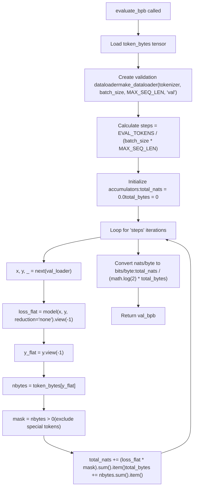
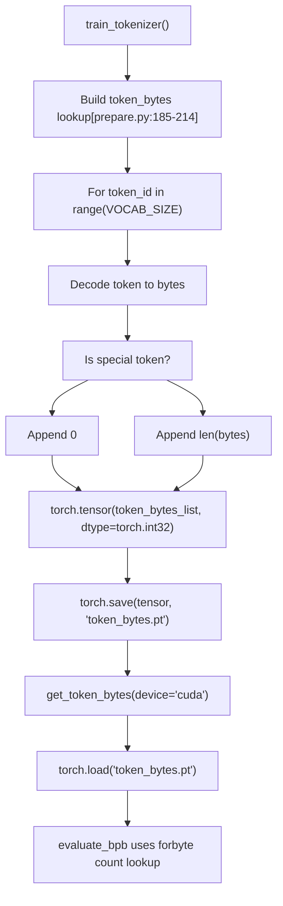
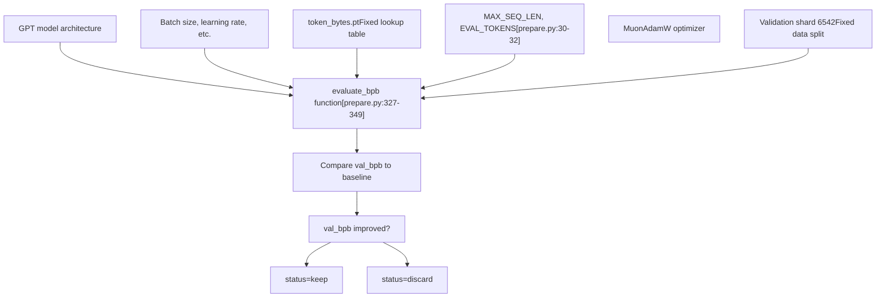

# Evaluation Harness

Relevant source files

-   [prepare.py](https://github.com/karpathy/autoresearch/blob/e6d79c12/prepare.py)

## Purpose and Scope

The evaluation harness is the fixed, immutable evaluation system that measures model performance using the `evaluate_bpb` function in [prepare.py327-349](https://github.com/karpathy/autoresearch/blob/e6d79c12/prepare.py#L327-L349) This function calculates the **bits per byte (BPB)** metric, which is vocabulary-size-independent and enables fair comparison across experiments that modify model architecture, tokenizer vocabulary size, or any other aspect of `train.py`.

This page documents the evaluation harness implementation and metric calculation. For information about the BPB metric's mathematical properties and why lower is better, see [Validation Bits Per Byte (val\_bpb)](/karpathy/autoresearch/5.1-validation-bits-per-byte-(val_bpb)). For the broader data pipeline that includes tokenizer training and dataloaders, see [prepare.py - Data and Evaluation](/karpathy/autoresearch/3.2-prepare.py-data-and-evaluation).

**Sources:** [prepare.py1-374](https://github.com/karpathy/autoresearch/blob/e6d79c12/prepare.py#L1-L374) [README.md22](https://github.com/karpathy/autoresearch/blob/e6d79c12/README.md?plain=1#L22-L22)

---

## The evaluate\_bpb Function

The evaluation harness is implemented as a single function that serves as the immutable performance metric for all experiments:

```
@torch.no_grad()def evaluate_bpb(model, tokenizer, batch_size):
```
**Location:** [prepare.py327-349](https://github.com/karpathy/autoresearch/blob/e6d79c12/prepare.py#L327-L349)

**Parameters:**

-   `model`: The GPT model instance to evaluate (from `train.py`).
-   `tokenizer`: Tokenizer instance (used to create validation dataloader).
-   `batch_size`: Number of sequences to process in parallel.

**Returns:** `float` — bits per byte on the validation set (lower is better).

**Sources:** [prepare.py327-349](https://github.com/karpathy/autoresearch/blob/e6d79c12/prepare.py#L327-L349)

---

## Evaluation Flow

The evaluation process follows these steps:

**Diagram: Evaluation Logic Flow**


**Sources:** [prepare.py327-349](https://github.com/karpathy/autoresearch/blob/e6d79c12/prepare.py#L327-L349)

---

## BPB Metric Calculation

### Why Bits Per Byte

The BPB metric measures model performance in a way that is **independent of vocabulary size**. This is critical because:

1.  The agent can modify tokenizer vocabulary size in `train.py`.
2.  Different architectures may benefit from different vocab sizes.
3.  Standard metrics like perplexity scale with vocabulary size.
4.  BPB normalizes by the actual byte content being predicted.

### Calculation Formula

The BPB calculation follows these steps:

| Step | Operation | Units |
| --- | --- | --- |
| 1\. Forward pass | `model(x, y, reduction='none')` | nats per token |
| 2\. Lookup bytes | `token_bytes[y_flat]` | bytes per token |
| 3\. Mask special tokens | `nbytes > 0` | boolean mask |
| 4\. Sum nats | `(loss_flat * mask).sum()` | total nats |
| 5\. Sum bytes | `nbytes.sum()` | total bytes |
| 6\. Convert to bits/byte | `nats / (log(2) * bytes)` | bits per byte |

The conversion from nats (natural log units) to bits uses the factor `1 / math.log(2)` ≈ 1.4427.

**Sources:** [prepare.py336-349](https://github.com/karpathy/autoresearch/blob/e6d79c12/prepare.py#L336-L349)

### Special Token Handling

Special tokens (defined in [prepare.py50](https://github.com/karpathy/autoresearch/blob/e6d79c12/prepare.py#L50-L50) as `<|reserved_0|>` through `<|reserved_3|>`) are assigned zero bytes during tokenizer training [prepare.py186-214](https://github.com/karpathy/autoresearch/blob/e6d79c12/prepare.py#L186-L214) The evaluation harness explicitly excludes these tokens:

```
mask = nbytes > 0  # Exclude special tokens (byte length 0)total_nats += (loss_flat * mask).sum().item()total_bytes += nbytes.sum().item()
```
This ensures that BOS tokens and other special tokens do not artificially inflate or deflate the metric.

**Sources:** [prepare.py346-348](https://github.com/karpathy/autoresearch/blob/e6d79c12/prepare.py#L346-L348) [prepare.py186-214](https://github.com/karpathy/autoresearch/blob/e6d79c12/prepare.py#L186-L214)

---

## Token Bytes Lookup

### The token\_bytes.pt Tensor

The `token_bytes` tensor is a crucial component created during tokenizer training:

**Diagram: Token Bytes Generation and Consumption**


**Creation:** [prepare.py185-214](https://github.com/karpathy/autoresearch/blob/e6d79c12/prepare.py#L185-L214)
**Loading:** [prepare.py237-240](https://github.com/karpathy/autoresearch/blob/e6d79c12/prepare.py#L237-L240)
**Usage:** [prepare.py336](https://github.com/karpathy/autoresearch/blob/e6d79c12/prepare.py#L336-L336)

### Lookup Mechanism

The lookup process is extremely efficient:

```
token_bytes = get_token_bytes(device="cuda")  # Load once# ... in evaluation loop:y_flat = y.view(-1)           # Shape: [batch_size * seq_len]nbytes = token_bytes[y_flat]  # Vectorized lookup, same shape
```
This single indexing operation converts all target token IDs to their corresponding byte counts simultaneously.

**Sources:** [prepare.py237-240](https://github.com/karpathy/autoresearch/blob/e6d79c12/prepare.py#L237-L240) [prepare.py344-346](https://github.com/karpathy/autoresearch/blob/e6d79c12/prepare.py#L344-L346)

---

## Fixed Evaluation Parameters

The evaluation harness uses constants from [prepare.py30-32](https://github.com/karpathy/autoresearch/blob/e6d79c12/prepare.py#L30-L32) to ensure consistency:

| Parameter | Value | Source | Purpose |
| --- | --- | --- | --- |
| `MAX_SEQ_LEN` | 2048 | [prepare.py30](https://github.com/karpathy/autoresearch/blob/e6d79c12/prepare.py#L30-L30) | Sequence length for validation batches |
| `EVAL_TOKENS` | 20,971,520 | [prepare.py32](https://github.com/karpathy/autoresearch/blob/e6d79c12/prepare.py#L32-L32) | Total tokens to evaluate (40 \* 524288) |
| `VAL_SHARD` | 6542 | [prepare.py43](https://github.com/karpathy/autoresearch/blob/e6d79c12/prepare.py#L43-L43) | Pinned validation shard index |

### Number of Evaluation Steps

The number of batches processed is deterministic:

```
steps = EVAL_TOKENS // (batch_size * MAX_SEQ_LEN)
```
This ensures every experiment evaluates on **exactly the same amount of data**, regardless of the batch size chosen in `train.py`.

**Sources:** [prepare.py338](https://github.com/karpathy/autoresearch/blob/e6d79c12/prepare.py#L338-L338) [prepare.py32](https://github.com/karpathy/autoresearch/blob/e6d79c12/prepare.py#L32-L32)

---

## Immutability and Fair Comparison

### Why the Harness Cannot Be Modified

The evaluation harness is explicitly **immutable** — agents and researchers cannot modify it. This design choice is fundamental to the autoresearch system:

**Diagram: System Boundary and Metric Flow**


**Sources:** [README.md17-18](https://github.com/karpathy/autoresearch/blob/e6d79c12/README.md?plain=1#L17-L18) [prepare.py324-325](https://github.com/karpathy/autoresearch/blob/e6d79c12/prepare.py#L324-L325)

### Fair Comparison Guarantees

By keeping the evaluation harness immutable, the system guarantees:

1.  **Same metric definition** — All experiments use identical BPB calculation.
2.  **Same data split** — All experiments evaluate on shard 6542.
3.  **Same token count** — All experiments process exactly `EVAL_TOKENS`.
4.  **Same sequence length** — All experiments use `MAX_SEQ_LEN` for validation.
5.  **Vocab-size independence** — Architectural changes to vocabulary are fairly compared.

**Sources:** [README.md22-23](https://github.com/karpathy/autoresearch/blob/e6d79c12/README.md?plain=1#L22-L23) [prepare.py324-325](https://github.com/karpathy/autoresearch/blob/e6d79c12/prepare.py#L324-L325)

---

## Implementation Deep Dive

### Complete Code Walkthrough

The evaluation logic is structured to minimize GPU-CPU synchronization overhead:

1.  **Setup Phase**: The `@torch.no_grad()` decorator disables gradient tracking [prepare.py327](https://github.com/karpathy/autoresearch/blob/e6d79c12/prepare.py#L327-L327) The `token_bytes` tensor is loaded to the GPU [prepare.py336](https://github.com/karpathy/autoresearch/blob/e6d79c12/prepare.py#L336-L336)
2.  **Accumulation Loop**: For each step, it fetches a batch from `make_dataloader` [prepare.py341](https://github.com/karpathy/autoresearch/blob/e6d79c12/prepare.py#L341-L341)
3.  **Forward Pass**: The model must support `reduction='none'` to return per-token losses [prepare.py343](https://github.com/karpathy/autoresearch/blob/e6d79c12/prepare.py#L343-L343)
4.  **Byte Lookup**: Target tokens `y` are flattened and used to index into the `token_bytes` tensor [prepare.py344-345](https://github.com/karpathy/autoresearch/blob/e6d79c12/prepare.py#L344-L345)
5.  **Masking**: A boolean mask `nbytes > 0` is created to exclude special tokens [prepare.py346](https://github.com/karpathy/autoresearch/blob/e6d79c12/prepare.py#L346-L346)
6.  **Reduction**: Losses and bytes are summed and moved to the CPU via `.item()` [prepare.py347-348](https://github.com/karpathy/autoresearch/blob/e6d79c12/prepare.py#L347-L348)
7.  **Final Calculation**: The ratio is converted from nats to bits using `math.log(2)` [prepare.py349](https://github.com/karpathy/autoresearch/blob/e6d79c12/prepare.py#L349-L349)

**Sources:** [prepare.py327-349](https://github.com/karpathy/autoresearch/blob/e6d79c12/prepare.py#L327-L349)
