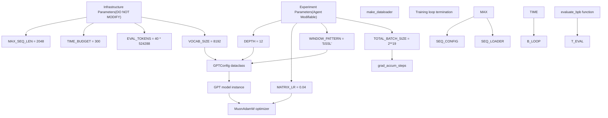
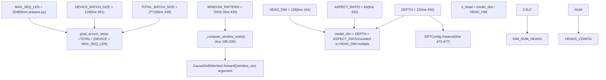
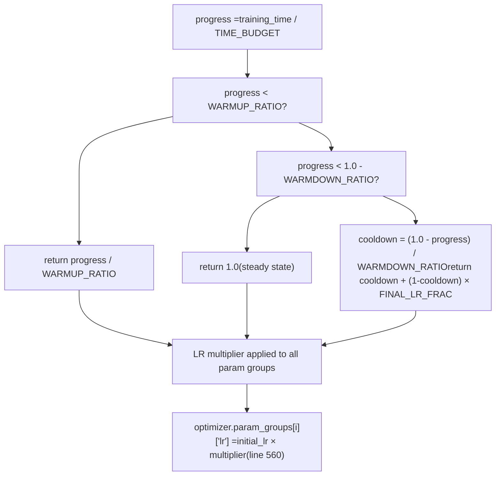
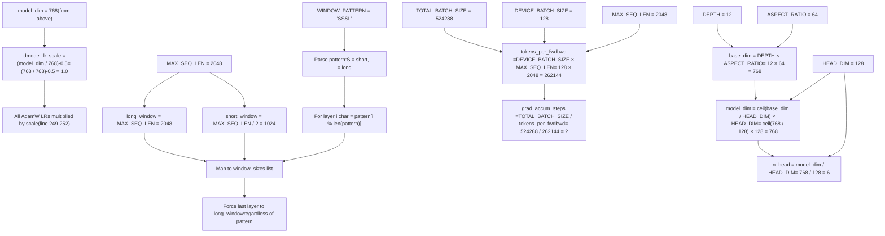
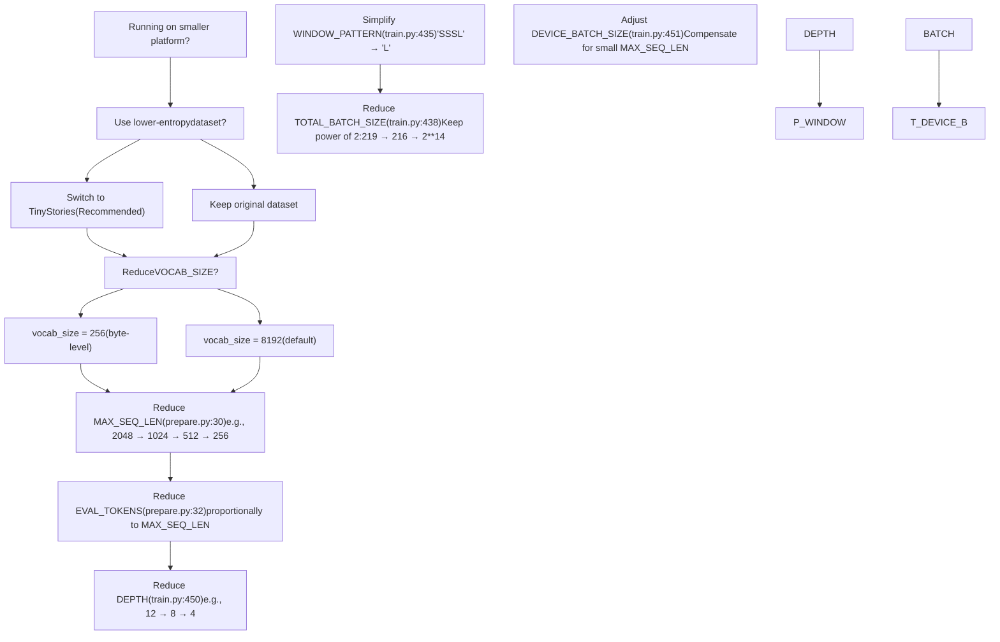

# System Parameters

Relevant source files

-   [prepare.py](https://github.com/karpathy/autoresearch/blob/e6d79c12/prepare.py)
-   [train.py](https://github.com/karpathy/autoresearch/blob/e6d79c12/train.py)

This page documents the key constants and hyperparameters that control autoresearch behavior. Parameters are split into two categories based on system architecture: **infrastructure parameters** in `prepare.py` that establish fixed constraints for fair comparison, and **experiment parameters** in `train.py` that the agent modifies during autonomous research. For guidance on how the agent modifies these parameters, see [Modifying train.py Effectively](/karpathy/autoresearch/8.1-modifying-train.py-effectively). For platform-specific tuning recommendations, see [Platform Adaptation and Forks](/karpathy/autoresearch/8.4-platform-adaptation-and-forks).

## Parameter Architecture

The system enforces a strict boundary between immutable infrastructure and mutable experimentation:

**Sources:** [prepare.py27-32](https://github.com/karpathy/autoresearch/blob/e6d79c12/prepare.py#L27-L32) [train.py432-451](https://github.com/karpathy/autoresearch/blob/e6d79c12/train.py#L432-L451)

## Infrastructure Parameters (prepare.py)

These constants are declared in `prepare.py` and must not be modified. They establish the fixed evaluation framework that ensures all experiments are fairly comparable.

### Core Constants

| Parameter | Value | Location | Purpose |
| --- | --- | --- | --- |
| `MAX_SEQ_LEN` | 2048 | [prepare.py30](https://github.com/karpathy/autoresearch/blob/e6d79c12/prepare.py#L30-L30) | Context length for all models. Used by dataloader and evaluation. |
| `TIME_BUDGET` | 300 | [prepare.py31](https://github.com/karpathy/autoresearch/blob/e6d79c12/prepare.py#L31-L31) | Wall clock training time in seconds (5 minutes). Excludes compilation/startup. |
| `EVAL_TOKENS` | 40 × 524288 = 20,971,520 | [prepare.py32](https://github.com/karpathy/autoresearch/blob/e6d79c12/prepare.py#L32-L32) | Total tokens processed during validation to compute `val_bpb`. |

### Data and Tokenization

| Parameter | Value | Location | Purpose |
| --- | --- | --- | --- |
| `VOCAB_SIZE` | 8192 | [prepare.py45](https://github.com/karpathy/autoresearch/blob/e6d79c12/prepare.py#L45-L45) | BPE tokenizer vocabulary size. |
| `SPLIT_PATTERN` | GPT-4 style regex | [prepare.py48](https://github.com/karpathy/autoresearch/blob/e6d79c12/prepare.py#L48-L48) | BPE tokenization split pattern. |
| `SPECIAL_TOKENS` | 4 reserved tokens | [prepare.py50](https://github.com/karpathy/autoresearch/blob/e6d79c12/prepare.py#L50-L50) | Special tokens including BOS. |
| `BOS_TOKEN` | \`"< | reserved\_0 | \>"\` |
| `VAL_SHARD` | 6542 | [prepare.py43](https://github.com/karpathy/autoresearch/blob/e6d79c12/prepare.py#L43-L43) | Pinned validation shard (last shard in dataset). |
| `MAX_SHARD` | 6542 | [prepare.py42](https://github.com/karpathy/autoresearch/blob/e6d79c12/prepare.py#L42-L42) | Maximum training shard index. |

### Storage Paths

| Parameter | Value | Location | Purpose |
| --- | --- | --- | --- |
| `CACHE_DIR` | `~/.cache/autoresearch` | [prepare.py38](https://github.com/karpathy/autoresearch/blob/e6d79c12/prepare.py#L38-L38) | Root cache directory. |
| `DATA_DIR` | `~/.cache/autoresearch/data` | [prepare.py39](https://github.com/karpathy/autoresearch/blob/e6d79c12/prepare.py#L39-L39) | Parquet shard storage. |
| `TOKENIZER_DIR` | `~/.cache/autoresearch/tokenizer` | [prepare.py40](https://github.com/karpathy/autoresearch/blob/e6d79c12/prepare.py#L40-L40) | Tokenizer pickle and token\_bytes storage. |

**Sources:** [prepare.py26-51](https://github.com/karpathy/autoresearch/blob/e6d79c12/prepare.py#L26-L51)

### Why These Are Fixed

The infrastructure parameters establish three critical invariants:

1.  **Time Budget Fairness**: `TIME_BUDGET = 300` ensures all experiments run for exactly 5 minutes (wall clock, after warmup), making `val_bpb` comparable across vastly different architectures (e.g., a 2-layer model vs. a 20-layer model).

2.  **Metric Consistency**: `EVAL_TOKENS` and `MAX_SEQ_LEN` ensure the `evaluate_bpb()` function [prepare.py343-365](https://github.com/karpathy/autoresearch/blob/e6d79c12/prepare.py#L343-L365) produces identical measurements regardless of model batch size or architecture changes.

3.  **Data Reproducibility**: Pinned `VAL_SHARD` ensures all experiments evaluate on the same held-out data.

**Sources:** [prepare.py27-32](https://github.com/karpathy/autoresearch/blob/e6d79c12/prepare.py#L27-L32) [prepare.py343-365](https://github.com/karpathy/autoresearch/blob/e6d79c12/prepare.py#L343-L365)

## Experiment Parameters (train.py)

These hyperparameters are defined in `train.py` and are the primary targets for agent modification during autonomous research. The agent proposes changes to these values to improve `val_bpb`.

### Architecture Parameters

**Sources:** [train.py432-451](https://github.com/karpathy/autoresearch/blob/e6d79c12/train.py#L432-L451) [train.py469-477](https://github.com/karpathy/autoresearch/blob/e6d79c12/train.py#L469-L477) [train.py195-206](https://github.com/karpathy/autoresearch/blob/e6d79c12/train.py#L195-L206)

| Parameter | Default | Location | Purpose |
| --- | --- | --- | --- |
| `DEPTH` | 12 | [train.py450](https://github.com/karpathy/autoresearch/blob/e6d79c12/train.py#L450-L450) | Number of transformer layers. Primary model complexity knob. |
| `ASPECT_RATIO` | 64 | [train.py433](https://github.com/karpathy/autoresearch/blob/e6d79c12/train.py#L433-L433) | Multiplier for model dimension: `model_dim = DEPTH × ASPECT_RATIO`. |
| `HEAD_DIM` | 128 | [train.py434](https://github.com/karpathy/autoresearch/blob/e6d79c12/train.py#L434-L434) | Target dimension per attention head. Model dimension rounded to multiple of this. |
| `WINDOW_PATTERN` | `"SSSL"` | [train.py435](https://github.com/karpathy/autoresearch/blob/e6d79c12/train.py#L435-L435) | Sliding window pattern: `S` = half context, `L` = full context. Repeats cyclically. |
| `DEVICE_BATCH_SIZE` | 128 | [train.py451](https://github.com/karpathy/autoresearch/blob/e6d79c12/train.py#L451-L451) | Sequences per forward/backward pass. Reduce if OOM. |
| `TOTAL_BATCH_SIZE` | 524288 (2¹⁹) | [train.py438](https://github.com/karpathy/autoresearch/blob/e6d79c12/train.py#L438-L438) | Total tokens per optimizer step. Must be power of 2. |

### Optimization Parameters

| Parameter | Default | Location | Purpose |
| --- | --- | --- | --- |
| `MATRIX_LR` | 0.04 | [train.py441](https://github.com/karpathy/autoresearch/blob/e6d79c12/train.py#L441-L441) | Base learning rate for matrix parameters (Muon optimizer). |
| `EMBEDDING_LR` | 0.6 | [train.py439](https://github.com/karpathy/autoresearch/blob/e6d79c12/train.py#L439-L439) | Learning rate for token embeddings (`wte`) and value embeddings. |
| `UNEMBEDDING_LR` | 0.004 | [train.py440](https://github.com/karpathy/autoresearch/blob/e6d79c12/train.py#L440-L440) | Learning rate for output projection (`lm_head`). |
| `SCALAR_LR` | 0.5 | [train.py442](https://github.com/karpathy/autoresearch/blob/e6d79c12/train.py#L442-L442) | Learning rate for per-layer scalars (`resid_lambdas`, `x0_lambdas`). |
| `WEIGHT_DECAY` | 0.2 | [train.py443](https://github.com/karpathy/autoresearch/blob/e6d79c12/train.py#L443-L443) | Cautious weight decay for Muon (applied to aligned gradients only). |
| `ADAM_BETAS` | (0.8, 0.95) | [train.py444](https://github.com/karpathy/autoresearch/blob/e6d79c12/train.py#L444-L444) | Adam optimizer beta1 and beta2 for momentum and variance. |

### Learning Rate Schedule Parameters

| Parameter | Default | Location | Purpose |
| --- | --- | --- | --- |
| `WARMUP_RATIO` | 0.0 | [train.py445](https://github.com/karpathy/autoresearch/blob/e6d79c12/train.py#L445-L445) | Fraction of time budget for linear LR warmup. 0.0 = no warmup. |
| `WARMDOWN_RATIO` | 0.5 | [train.py446](https://github.com/karpathy/autoresearch/blob/e6d79c12/train.py#L446-L446) | Fraction of time budget for cosine LR cooldown. 0.5 = last half of training. |
| `FINAL_LR_FRAC` | 0.0 | [train.py447](https://github.com/karpathy/autoresearch/blob/e6d79c12/train.py#L447-L447) | Final LR as fraction of initial LR at end of cooldown. 0.0 = decay to zero. |

**Sources:** [train.py432-447](https://github.com/karpathy/autoresearch/blob/e6d79c12/train.py#L432-L447)

### Learning Rate Schedule Implementation

The schedule is based on `progress = training_time / TIME_BUDGET` and implemented in `get_lr_multiplier()` [train.py518-525](https://github.com/karpathy/autoresearch/blob/e6d79c12/train.py#L518-L525):

**Sources:** [train.py518-563](https://github.com/karpathy/autoresearch/blob/e6d79c12/train.py#L518-L563)

## Parameter Dependencies and Derived Values

Several runtime values are computed from the base parameters:

**Sources:** [train.py469-477](https://github.com/karpathy/autoresearch/blob/e6d79c12/train.py#L469-L477) [train.py495-497](https://github.com/karpathy/autoresearch/blob/e6d79c12/train.py#L495-L497) [train.py195-206](https://github.com/karpathy/autoresearch/blob/e6d79c12/train.py#L195-L206) [train.py248-252](https://github.com/karpathy/autoresearch/blob/e6d79c12/train.py#L248-L252)

### Key Derived Values (Default Configuration)

| Derived Value | Formula | Default Result |
| --- | --- | --- |
| `model_dim` | `((DEPTH × ASPECT_RATIO + HEAD_DIM - 1) // HEAD_DIM) × HEAD_DIM` | 768 |
| `n_head` | `model_dim // HEAD_DIM` | 6 |
| `tokens_per_fwdbwd` | `DEVICE_BATCH_SIZE × MAX_SEQ_LEN` | 262,144 |
| `grad_accum_steps` | `TOTAL_BATCH_SIZE // tokens_per_fwdbwd` | 2 |
| `dmodel_lr_scale` | `(model_dim / 768) ** -0.5` | 1.0 |
| `long_window` | `MAX_SEQ_LEN` | 2048 |
| `short_window` | `MAX_SEQ_LEN // 2` | 1024 |

**Sources:** [train.py469-477](https://github.com/karpathy/autoresearch/blob/e6d79c12/train.py#L469-L477) [train.py495-497](https://github.com/karpathy/autoresearch/blob/e6d79c12/train.py#L495-L497) [train.py248](https://github.com/karpathy/autoresearch/blob/e6d79c12/train.py#L248-L248)

## Platform Adaptation Parameters

For running autoresearch on hardware smaller than an H100, the following parameters can be tuned. Parameters in `prepare.py` require modifying infrastructure code (creating a fork), while parameters in `train.py` can be modified by the agent.

### Recommended Tuning Sequence

**Sources:** [prepare.py30-45](https://github.com/karpathy/autoresearch/blob/e6d79c12/prepare.py#L30-L45) [train.py435-451](https://github.com/karpathy/autoresearch/blob/e6d79c12/train.py#L435-L451)

### Critical Constraints

1.  **Power of 2 Batch Sizes**: `TOTAL_BATCH_SIZE` must be a power of 2 to ensure clean gradient accumulation. [train.py496](https://github.com/karpathy/autoresearch/blob/e6d79c12/train.py#L496-L496) asserts `TOTAL_BATCH_SIZE % tokens_per_fwdbwd == 0`.

2.  **Window Pattern Efficiency**: The `"SSSL"` pattern uses alternating banded attention that may be inefficient on non-Hopper GPUs. Use `"L"` (full attention only) for broader compatibility.

3.  **Token Budget**: `EVAL_TOKENS` should scale with `MAX_SEQ_LEN` to maintain evaluation consistency. If `MAX_SEQ_LEN` is reduced by 4×, reduce `EVAL_TOKENS` by approximately 4×.

4.  **Vocab Size and Dataset**: For byte-level tokenization (`vocab_size = 256`), simpler datasets are recommended since compression is minimal.

**Sources:** [train.py496](https://github.com/karpathy/autoresearch/blob/e6d79c12/train.py#L496-L496) [train.py195-206](https://github.com/karpathy/autoresearch/blob/e6d79c12/train.py#L195-L206)

## Parameter Modification Policy

The table below summarizes which parameters can be modified by the agent versus which require creating a fork:

| Parameter | Location | Agent Can Modify? | Notes |
| --- | --- | --- | --- |
| `MAX_SEQ_LEN` | `prepare.py:30` | ❌ No | Infrastructure constant. Fork required. |
| `TIME_BUDGET` | `prepare.py:31` | ❌ No | Infrastructure constant. Fork required. |
| `EVAL_TOKENS` | `prepare.py:32` | ❌ No | Infrastructure constant. Fork required. |
| `VOCAB_SIZE` | `prepare.py:45` | ❌ No | Requires retraining tokenizer. Fork required. |
| `DEPTH` | `train.py:450` | ✅ Yes | Primary complexity knob for agent. |
| `ASPECT_RATIO` | `train.py:433` | ✅ Yes | Model width parameter. |
| `HEAD_DIM` | `train.py:434` | ✅ Yes | Attention head dimension. |
| `WINDOW_PATTERN` | `train.py:435` | ✅ Yes | Sliding window attention pattern. |
| `DEVICE_BATCH_SIZE` | `train.py:451` | ✅ Yes | Adjust for memory constraints. |
| `TOTAL_BATCH_SIZE` | `train.py:438` | ✅ Yes | Total tokens per optimizer step. |
| `MATRIX_LR` | `train.py:441` | ✅ Yes | Learning rate for matrix parameters. |
| `EMBEDDING_LR` | `train.py:439` | ✅ Yes | Learning rate for embeddings. |
| `UNEMBEDDING_LR` | `train.py:440` | ✅ Yes | Learning rate for output head. |
| `SCALAR_LR` | `train.py:442` | ✅ Yes | Learning rate for scalars. |
| `WEIGHT_DECAY` | `train.py:443` | ✅ Yes | Regularization strength. |
| `ADAM_BETAS` | `train.py:444` | ✅ Yes | Adam momentum parameters. |
| `WARMUP_RATIO` | `train.py:445` | ✅ Yes | LR warmup schedule. |
| `WARMDOWN_RATIO` | `train.py:446` | ✅ Yes | LR cooldown schedule. |
| `FINAL_LR_FRAC` | `train.py:447` | ✅ Yes | Final LR fraction. |

**Sources:** [prepare.py27-45](https://github.com/karpathy/autoresearch/blob/e6d79c12/prepare.py#L27-L45) [train.py432-451](https://github.com/karpathy/autoresearch/blob/e6d79c12/train.py#L432-L451)
