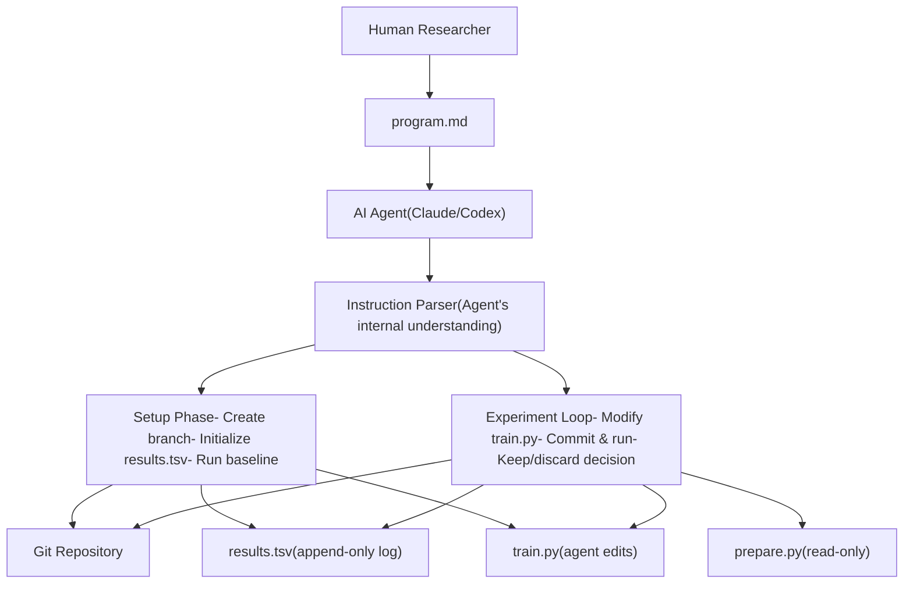
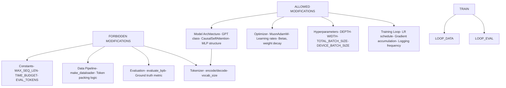
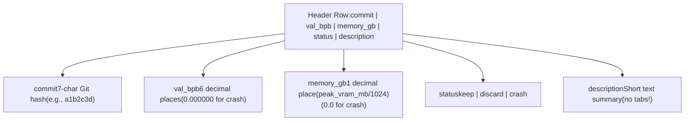
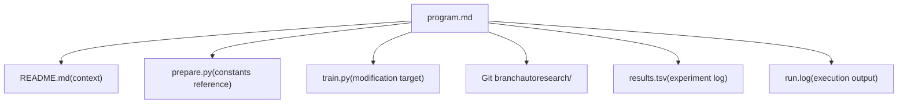

# program.md - Agent Instructions

Relevant source files

-   [README.md](https://github.com/karpathy/autoresearch/blob/e6d79c12/README.md?plain=1)
-   [program.md](https://github.com/karpathy/autoresearch/blob/e6d79c12/program.md?plain=1)

`program.md` is the human-editable instruction file that defines the research objectives and operational constraints for the autonomous AI agent. It serves as the "research org code" - a lightweight specification that guides agent behavior without requiring changes to the Python codebase. The human iterates on this file to steer research direction, while the agent uses it as its sole source of operational guidance.

For information about the agent's execution workflow, see [4.1 The Research Loop](https://github.com/karpathy/autoresearch/blob/e6d79c12/4.1 The Research Loop) For details about the files the agent modifies, see [3.1 train.py - The Mutable Core](https://github.com/karpathy/autoresearch/blob/e6d79c12/3.1 train.py - The Mutable Core) For infrastructure constraints, see [3.2 prepare.py - Data and Evaluation](https://github.com/karpathy/autoresearch/blob/e6d79c12/3.2 prepare.py - Data and Evaluation)

## Role in the System Architecture

`program.md` occupies the meta-level of the autoresearch hierarchy. It is the single point of human control over the autonomous research process. Unlike traditional research where humans directly modify code, autoresearch inverts this relationship: humans write instructions in natural language, and the agent translates these into code modifications.

Title: System Hierarchy and Instruction Flow


Sources: [program.md1-115](https://github.com/karpathy/autoresearch/blob/e6d79c12/program.md?plain=1#L1-L115) [README.md7-17](https://github.com/karpathy/autoresearch/blob/e6d79c12/README.md?plain=1#L7-L17)

## File Structure

`program.md` is organized into five main sections, each serving a distinct operational purpose:

| Section | Line Range | Purpose | Agent Interaction |
| --- | --- | --- | --- |
| **Header** | [program.md1-3](https://github.com/karpathy/autoresearch/blob/e6d79c12/program.md?plain=1#L1-L3) | Project title and context | One-time read for context |
| **Setup** | [program.md5-19](https://github.com/karpathy/autoresearch/blob/e6d79c12/program.md?plain=1#L5-L19) | Initialization procedures | Executed once per experiment run |
| **Experimentation** | [program.md21-39](https://github.com/karpathy/autoresearch/blob/e6d79c12/program.md?plain=1#L21-L39) | Rules, constraints, and goals | Referenced continuously during loop |
| **Output Format** | [program.md41-62](https://github.com/karpathy/autoresearch/blob/e6d79c12/program.md?plain=1#L41-L62) | Expected script output structure | Used for result extraction |
| **Logging Results** | [program.md64-88](https://github.com/karpathy/autoresearch/blob/e6d79c12/program.md?plain=1#L64-L88) | TSV format specification | Used after each experiment |
| **The Experiment Loop** | [program.md90-115](https://github.com/karpathy/autoresearch/blob/e6d79c12/program.md?plain=1#L90-L115) | Autonomous operation workflow | Executed indefinitely |

Sources: [program.md1-115](https://github.com/karpathy/autoresearch/blob/e6d79c12/program.md?plain=1#L1-L115)

## Setup Instructions Section

The setup section defines a six-step initialization protocol that establishes the foundation for an autonomous research run. Each step has specific verification requirements and failure modes.

Title: Agent Setup Protocol

> **[Mermaid stateDiagram]**
> *(图表结构无法解析)*

### Key Setup Constraints

The setup protocol enforces several critical constraints:

1.  **Branch uniqueness**: The branch `autoresearch/<tag>` must not exist. This prevents accidental overwrites of previous experiments [program.md9-10](https://github.com/karpathy/autoresearch/blob/e6d79c12/program.md?plain=1#L9-L10)
2.  **Data verification**: The agent must confirm that `~/.cache/autoresearch/` contains both data shards and `tokenizer.pkl` before proceeding [program.md15](https://github.com/karpathy/autoresearch/blob/e6d79c12/program.md?plain=1#L15-L15)
3.  **Results initialization**: `results.tsv` is created with only the header row initially [program.md16](https://github.com/karpathy/autoresearch/blob/e6d79c12/program.md?plain=1#L16-L16)
4.  **Baseline establishment**: The very first run must always be the unmodified `train.py` to establish a fair comparison baseline [program.md39](https://github.com/karpathy/autoresearch/blob/e6d79c12/program.md?plain=1#L39-L39)

Sources: [program.md5-19](https://github.com/karpathy/autoresearch/blob/e6d79c12/program.md?plain=1#L5-L19) [README.md25-38](https://github.com/karpathy/autoresearch/blob/e6d79c12/README.md?plain=1#L25-L38)

## Experimentation Rules and Constraints

The experimentation section establishes a clear permission model that defines what the agent can and cannot modify. This section is referenced continuously during the autonomous loop.

Title: Permissions Matrix and File Scopes


### Primary Goal and Constraints

-   **Primary metric**: Minimize `val_bpb` (validation bits per byte). This metric is vocab-size-independent, enabling fair comparison across architectural changes [program.md33](https://github.com/karpathy/autoresearch/blob/e6d79c12/program.md?plain=1#L33-L33)
-   **Fixed constraint**: `TIME_BUDGET` is typically 300 seconds (5 minutes wall clock). This is immutable and defined in the infrastructure layer [program.md23](https://github.com/karpathy/autoresearch/blob/e6d79c12/program.md?plain=1#L23-L23) [README.md17](https://github.com/karpathy/autoresearch/blob/e6d79c12/README.md?plain=1#L17-L17)
-   **Soft constraint**: `peak_vram_mb` should not increase dramatically. Some increase is acceptable for meaningful `val_bpb` gains, but memory explosion is grounds for discarding an experiment [program.md35](https://github.com/karpathy/autoresearch/blob/e6d79c12/program.md?plain=1#L35-L35)
-   **Simplicity criterion**: The agent must evaluate complexity vs. improvement trade-offs. A 0.001 improvement with 20 lines of complex code is discarded, while a zero improvement with simpler code is kept [program.md37](https://github.com/karpathy/autoresearch/blob/e6d79c12/program.md?plain=1#L37-L37)

Sources: [program.md21-39](https://github.com/karpathy/autoresearch/blob/e6d79c12/program.md?plain=1#L21-L39) [README.md61-66](https://github.com/karpathy/autoresearch/blob/e6d79c12/README.md?plain=1#L61-L66)

## Output Format and Metric Extraction

The agent expects a specific output format from `train.py` to extract performance metrics. The output section serves as a contract between the training script and the agent's parsing logic [program.md41-43](https://github.com/karpathy/autoresearch/blob/e6d79c12/program.md?plain=1#L41-L43)

### Expected Output Structure

When `train.py` completes, it prints a summary block starting with `---`:

```
---
val_bpb:          0.997900
training_seconds: 300.1
total_seconds:    325.9
peak_vram_mb:     45060.2
mfu_percent:      39.80
total_tokens_M:   499.6
num_steps:        953
num_params_M:     50.3
depth:            8
```
### Metric Extraction Commands

The agent uses shell commands to extract metrics from `run.log` [program.md58-61](https://github.com/karpathy/autoresearch/blob/e6d79c12/program.md?plain=1#L58-L61):

```
# Extract primary metricgrep "^val_bpb:" run.log # Extract memory usagegrep "^peak_vram_mb:" run.log # Combined extractiongrep "^val_bpb:\|^peak_vram_mb:" run.log
```
**Crash handling**: If `grep` produces empty output, the run crashed. The agent then executes `tail -n 50 run.log` to retrieve the Python stack trace for diagnostic purposes [program.md101](https://github.com/karpathy/autoresearch/blob/e6d79c12/program.md?plain=1#L101-L101)

Sources: [program.md41-62](https://github.com/karpathy/autoresearch/blob/e6d79c12/program.md?plain=1#L41-L62) [program.md100-101](https://github.com/karpathy/autoresearch/blob/e6d79c12/program.md?plain=1#L100-L101)

## Results Logging Format

All experiments are logged to `results.tsv`, a tab-separated values file that is **never committed to Git** [program.md102](https://github.com/karpathy/autoresearch/blob/e6d79c12/program.md?plain=1#L102-L102) This file provides a complete audit trail of all attempted experiments, including failures.

### TSV Schema

Title: results.tsv Column Specification


### Example Entries

| commit | val\_bpb | memory\_gb | status | description |
| --- | --- | --- | --- | --- |
| a1b2c3d | 0.997900 | 44.0 | keep | baseline |
| b2c3d4e | 0.993200 | 44.2 | keep | increase LR to 0.04 |
| c3d4e5f | 1.005000 | 44.0 | discard | switch to GeLU activation |
| d4e5f6g | 0.000000 | 0.0 | crash | double model width (OOM) |

Sources: [program.md64-88](https://github.com/karpathy/autoresearch/blob/e6d79c12/program.md?plain=1#L64-L88)

## The Autonomous Experiment Loop

The experiment loop is the core autonomous workflow that runs indefinitely until manually interrupted by the human [program.md112](https://github.com/karpathy/autoresearch/blob/e6d79c12/program.md?plain=1#L112-L112)

Title: Infinite Research Loop

### Loop Invariants

1.  **Branch state**: The Git branch always points to the best-so-far configuration (lowest `val_bpb`). Discarded experiments are rolled back via `git reset --hard HEAD~1` [program.md104](https://github.com/karpathy/autoresearch/blob/e6d79c12/program.md?plain=1#L104-L104)
2.  **Time budget**: Each experiment runs for exactly 5 minutes (excluding compilation) [program.md23](https://github.com/karpathy/autoresearch/blob/e6d79c12/program.md?plain=1#L23-L23)
3.  **Append-only log**: `results.tsv` records all attempts, including crashes and discards.
4.  **Autonomy**: The agent **never stops** to ask the human for permission [program.md112](https://github.com/karpathy/autoresearch/blob/e6d79c12/program.md?plain=1#L112-L112)

Sources: [program.md90-115](https://github.com/karpathy/autoresearch/blob/e6d79c12/program.md?plain=1#L90-L115)

## Error Handling and Crash Recovery

The agent distinguishes between recoverable errors and fundamental failures [program.md110](https://github.com/karpathy/autoresearch/blob/e6d79c12/program.md?plain=1#L110-L110)

### Crash Detection

Crashes are detected when `grep` produces empty output. The agent then executes `tail -n 50 run.log` to read the stack trace [program.md101](https://github.com/karpathy/autoresearch/blob/e6d79c12/program.md?plain=1#L101-L101)

### Recovery Logic

-   **Simple fixes** (typos, missing imports): Fix and re-run the same idea [program.md110](https://github.com/karpathy/autoresearch/blob/e6d79c12/program.md?plain=1#L110-L110)
-   **Fundamental failures** (OOM, logic bugs): Log as "crash", reset the branch, and move to a new idea [program.md110](https://github.com/karpathy/autoresearch/blob/e6d79c12/program.md?plain=1#L110-L110)
-   **Timeout**: If a run exceeds 10 minutes, it is killed and treated as a failure [program.md108](https://github.com/karpathy/autoresearch/blob/e6d79c12/program.md?plain=1#L108-L108)

Sources: [program.md100-110](https://github.com/karpathy/autoresearch/blob/e6d79c12/program.md?plain=1#L100-L110)

## Relationship to Other System Components

`program.md` interfaces with several other system components:

Title: Instruction-to-Execution Mapping


Sources: [program.md11-14](https://github.com/karpathy/autoresearch/blob/e6d79c12/program.md?plain=1#L11-L14) [program.md64-88](https://github.com/karpathy/autoresearch/blob/e6d79c12/program.md?plain=1#L64-L88) [README.md55-57](https://github.com/karpathy/autoresearch/blob/e6d79c12/README.md?plain=1#L55-L57)
