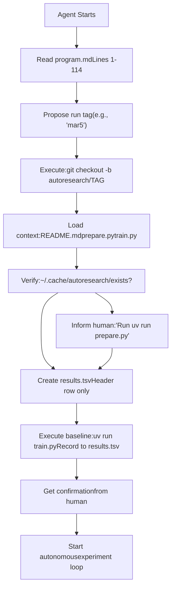
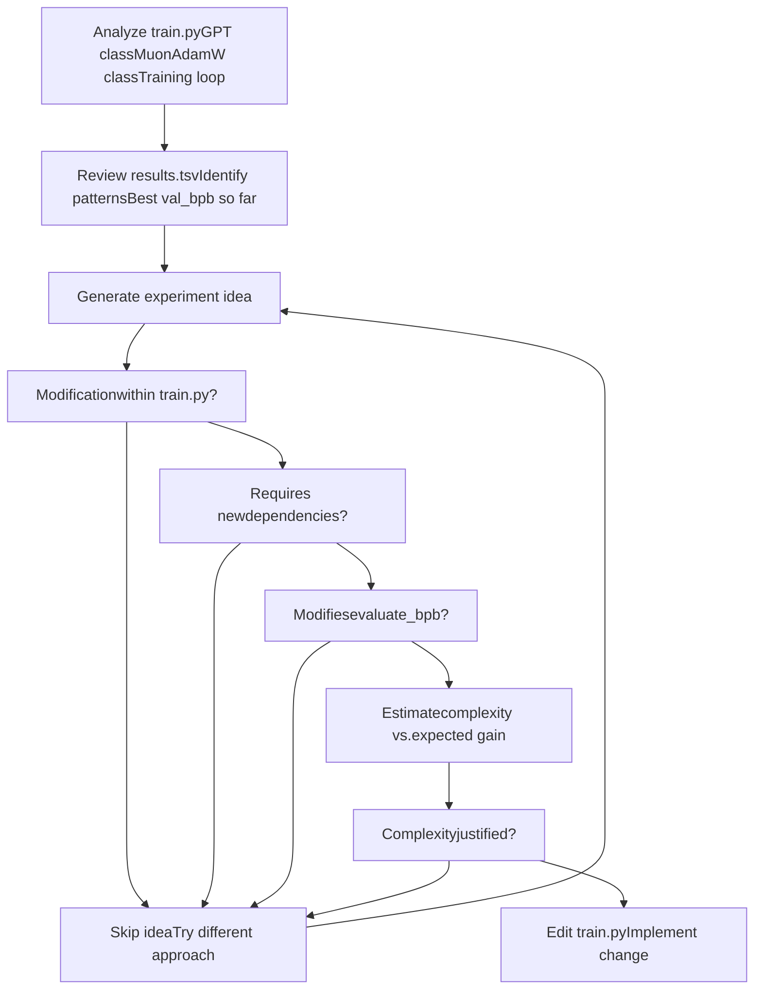
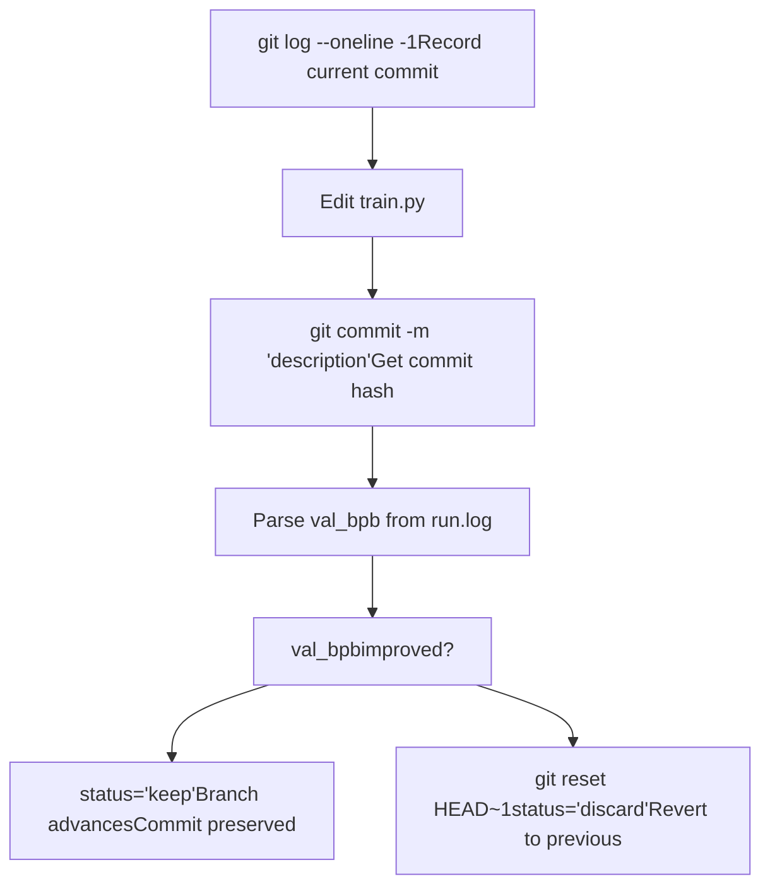
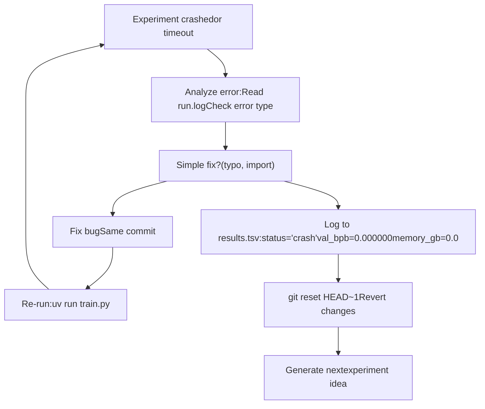

# Agent Operation

Relevant source files

-   [.gitignore](https://github.com/karpathy/autoresearch/blob/e6d79c12/.gitignore)
-   [program.md](https://github.com/karpathy/autoresearch/blob/e6d79c12/program.md?plain=1)

## Purpose and Scope

This page documents how the AI agent (Claude, GPT-4, or similar LLM) conducts autonomous research within the autoresearch system. It covers the agent's operational workflow from initialization through continuous experimentation, including code modification strategies, experiment execution, result evaluation, and decision-making processes.

For details on the research loop structure, see [The Research Loop](/karpathy/autoresearch/4.1-the-research-loop). For experiment lifecycle details, see [Experiment Lifecycle](/karpathy/autoresearch/4.2-experiment-lifecycle). For decision-making logic, see [Decision Making and Branch Management](/karpathy/autoresearch/4.3-decision-making-and-branch-management). For error handling, see [Error Handling and Recovery](/karpathy/autoresearch/4.4-error-handling-and-recovery).

---

## Agent Initialization

The agent begins operation by reading [program.md1-18](https://github.com/karpathy/autoresearch/blob/e6d79c12/program.md?plain=1#L1-L18) and working with the human to establish a research session. The initialization sequence involves:

### Setup Steps

| Step | Action | Purpose |
| --- | --- | --- |
| 1 | Agree on run tag | Create unique branch identifier (e.g., `mar5`) [program.md9](https://github.com/karpathy/autoresearch/blob/e6d79c12/program.md?plain=1#L9-L9) |
| 2 | Create branch | `git checkout -b autoresearch/<tag>` from master [program.md10](https://github.com/karpathy/autoresearch/blob/e6d79c12/program.md?plain=1#L10-L10) |
| 3 | Read in-scope files | Load `README.md`, `prepare.py`, `train.py` into context [program.md11-14](https://github.com/karpathy/autoresearch/blob/e6d79c12/program.md?plain=1#L11-L14) |
| 4 | Verify data exists | Check `~/.cache/autoresearch/` for shards and tokenizer [program.md15](https://github.com/karpathy/autoresearch/blob/e6d79c12/program.md?plain=1#L15-L15) |
| 5 | Initialize `results.tsv` | Create log file with header row only [program.md16](https://github.com/karpathy/autoresearch/blob/e6d79c12/program.md?plain=1#L16-L16) |
| 6 | Confirm setup | Get human approval to proceed [program.md17](https://github.com/karpathy/autoresearch/blob/e6d79c12/program.md?plain=1#L17-L17) |

#### Baseline Run

Per [program.md39](https://github.com/karpathy/autoresearch/blob/e6d79c12/program.md?plain=1#L39-L39) the agent **must** execute a baseline run as the first experiment:

> Your very first run should always be to establish the baseline, so you will run the training script as is.

The baseline run:

1.  Executes `train.py` without modifications.
2.  Records actual measured metrics to `results.tsv`.
3.  Establishes the starting point for comparison.

**Agent Initialization Flow**


**Sources:** [program.md6-18](https://github.com/karpathy/autoresearch/blob/e6d79c12/program.md?plain=1#L6-L18) [program.md39](https://github.com/karpathy/autoresearch/blob/e6d79c12/program.md?plain=1#L39-L39)

---

## The Autonomous Research Loop

Once initialized, the agent enters an infinite loop executing the protocol defined in [program.md90-111](https://github.com/karpathy/autoresearch/blob/e6d79c12/program.md?plain=1#L90-L111) The loop operates **continuously and autonomously** without human intervention until manually stopped.

### Loop Structure

The core loop follows eight steps, repeated indefinitely:

### Loop Invariants

The loop maintains these invariants:

1.  **No human intervention required** - Agent never pauses to ask "should I continue?" [program.md112](https://github.com/karpathy/autoresearch/blob/e6d79c12/program.md?plain=1#L112-L112)
2.  **Time budget fixed** - Every experiment runs for exactly 300 seconds training time [program.md23](https://github.com/karpathy/autoresearch/blob/e6d79c12/program.md?plain=1#L23-L23)
3.  **Single branch advancement** - Git branch moves forward only on improvements [program.md103](https://github.com/karpathy/autoresearch/blob/e6d79c12/program.md?plain=1#L103-L103)
4.  **Complete logging** - All experiments (keep/discard/crash) recorded in `results.tsv` [program.md102](https://github.com/karpathy/autoresearch/blob/e6d79c12/program.md?plain=1#L102-L102)

**Sources:** [program.md90-111](https://github.com/karpathy/autoresearch/blob/e6d79c12/program.md?plain=1#L90-L111) [program.md23](https://github.com/karpathy/autoresearch/blob/e6d79c12/program.md?plain=1#L23-L23)

---

## Code Modification Process

The agent modifies **only** `train.py`. All other files are read-only. The modification scope is defined in [program.md25-31](https://github.com/karpathy/autoresearch/blob/e6d79c12/program.md?plain=1#L25-L31)

### Permitted Modifications

| Component | Examples | Constraints |
| --- | --- | --- |
| **Model Architecture** | Layer count, hidden size, attention heads, MLP ratios | Must fit in VRAM [program.md35](https://github.com/karpathy/autoresearch/blob/e6d79c12/program.md?plain=1#L35-L35) |
| **Optimizer** | Algorithm, learning rate, weight decay, momentum | Must converge in 5 minutes [program.md33](https://github.com/karpathy/autoresearch/blob/e6d79c12/program.md?plain=1#L33-L33) |
| **Hyperparameters** | Batch size, gradient accumulation, dropout | Respect time budget [program.md23](https://github.com/karpathy/autoresearch/blob/e6d79c12/program.md?plain=1#L23-L23) |
| **Training Loop** | Learning rate schedules, warmup/warmdown, loss functions | Must complete evaluation [program.md31](https://github.com/karpathy/autoresearch/blob/e6d79c12/program.md?plain=1#L31-L31) |

### Prohibited Modifications

The agent **cannot**:

-   Modify `prepare.py` - contains data loading and training constants [program.md29](https://github.com/karpathy/autoresearch/blob/e6d79c12/program.md?plain=1#L29-L29)
-   Install new packages beyond `pyproject.toml` [program.md30](https://github.com/karpathy/autoresearch/blob/e6d79c12/program.md?plain=1#L30-L30)
-   Change the evaluation harness - `evaluate_bpb` function in `prepare.py` is ground truth [program.md31](https://github.com/karpathy/autoresearch/blob/e6d79c12/program.md?plain=1#L31-L31)

### Modification Strategy

The agent proposes changes based on:

-   Research ideas from code comments and referenced papers.
-   Previous experiment outcomes in `results.tsv`.
-   **Simplicity criterion**: All else being equal, simpler is better. A small improvement that adds ugly complexity is not worth it [program.md37](https://github.com/karpathy/autoresearch/blob/e6d79c12/program.md?plain=1#L37-L37)

**Code Modification Decision Tree**


**Sources:** [program.md25-31](https://github.com/karpathy/autoresearch/blob/e6d79c12/program.md?plain=1#L25-L31) [program.md37](https://github.com/karpathy/autoresearch/blob/e6d79c12/program.md?plain=1#L37-L37)

---

## Experiment Execution

The agent executes experiments using a fixed command pattern defined in [program.md99](https://github.com/karpathy/autoresearch/blob/e6d79c12/program.md?plain=1#L99-L99)

### Execution Command

```
uv run train.py > run.log 2>&1
```
Key aspects:

-   **Output redirection:** All stdout/stderr captured in `run.log`.
-   **No terminal output:** Prevents context flooding.
-   **No `tee` usage:** Agent must read `run.log` after completion [program.md99](https://github.com/karpathy/autoresearch/blob/e6d79c12/program.md?plain=1#L99-L99)

### Execution Timeline

> **[Mermaid gantt]**
> *(图表结构无法解析)*

### Output Parsing

The agent extracts metrics using [program.md100](https://github.com/karpathy/autoresearch/blob/e6d79c12/program.md?plain=1#L100-L100):

```
grep "^val_bpb:\|^peak_vram_mb:" run.log
```
Expected output format includes `val_bpb`, `training_seconds`, `peak_vram_mb`, and `mfu_percent` [program.md46-56](https://github.com/karpathy/autoresearch/blob/e6d79c12/program.md?plain=1#L46-L56)

**Metric Extraction and Logging**

> **[Mermaid sequence]**
> *(图表结构无法解析)*

**Sources:** [program.md99-100](https://github.com/karpathy/autoresearch/blob/e6d79c12/program.md?plain=1#L99-L100) [program.md46-56](https://github.com/karpathy/autoresearch/blob/e6d79c12/program.md?plain=1#L46-L56)

---

## Result Evaluation and Decision Making

The agent evaluates experiment outcomes by comparing `val_bpb` against the previous best value. Lower is better.

### Decision Criteria

The decision logic from [program.md103-104](https://github.com/karpathy/autoresearch/blob/e6d79c12/program.md?plain=1#L103-L104):

```
if new_val_bpb < previous_best_val_bpb:    # KEEP: Advance branch, status='keep'else:    # DISCARD: Revert changes, status='discard'    # git reset HEAD~1
```
### Results TSV Format

Each experiment is logged to `results.tsv` (tab-separated) with the format defined in [program.md66-88](https://github.com/karpathy/autoresearch/blob/e6d79c12/program.md?plain=1#L66-L88):

| Column | Type | Description |
| --- | --- | --- |
| `commit` | string | 7-character git hash [program.md74](https://github.com/karpathy/autoresearch/blob/e6d79c12/program.md?plain=1#L74-L74) |
| `val_bpb` | float | Validation bits per byte (0.000000 for crashes) [program.md75](https://github.com/karpathy/autoresearch/blob/e6d79c12/program.md?plain=1#L75-L75) |
| `memory_gb` | float | Peak VRAM in GB, round to .1f [program.md76](https://github.com/karpathy/autoresearch/blob/e6d79c12/program.md?plain=1#L76-L76) |
| `status` | enum | `keep`, `discard`, or `crash` [program.md77](https://github.com/karpathy/autoresearch/blob/e6d79c12/program.md?plain=1#L77-L77) |
| `description` | string | Short text description [program.md78](https://github.com/karpathy/autoresearch/blob/e6d79c12/program.md?plain=1#L78-L78) |

**Sources:** [program.md66-88](https://github.com/karpathy/autoresearch/blob/e6d79c12/program.md?plain=1#L66-L88) [program.md103-104](https://github.com/karpathy/autoresearch/blob/e6d79c12/program.md?plain=1#L103-L104)

---

## Git Operations and Branch Management

The agent uses Git to track experiments and maintain a clean history of improvements.

### Git Workflow per Experiment


### Git Commands

| Operation | Command | When Used |
| --- | --- | --- |
| Check state | `git log --oneline -1` | Step 1: Before each experiment [program.md96](https://github.com/karpathy/autoresearch/blob/e6d79c12/program.md?plain=1#L96-L96) |
| Commit changes | `git commit -m "description"` | Step 3: After modifying train.py [program.md98](https://github.com/karpathy/autoresearch/blob/e6d79c12/program.md?plain=1#L98-L98) |
| Revert on discard | `git reset HEAD~1` | Step 10: When val\_bpb doesn't improve [program.md104](https://github.com/karpathy/autoresearch/blob/e6d79c12/program.md?plain=1#L104-L104) |

The `results.tsv` file is explicitly excluded from Git via [.gitignore23](https://github.com/karpathy/autoresearch/blob/e6d79c12/.gitignore#L23-L23) and should not be committed [program.md102](https://github.com/karpathy/autoresearch/blob/e6d79c12/program.md?plain=1#L102-L102)

**Sources:** [program.md96-104](https://github.com/karpathy/autoresearch/blob/e6d79c12/program.md?plain=1#L96-L104) [.gitignore23](https://github.com/karpathy/autoresearch/blob/e6d79c12/.gitignore#L23-L23)

---

## Continuous Operation

The agent runs **indefinitely** until manually interrupted. This is critical for overnight research.

### Non-Stop Directive

From [program.md112](https://github.com/karpathy/autoresearch/blob/e6d79c12/program.md?plain=1#L112-L112):

> **NEVER STOP**: Once the experiment loop has begun (after the initial setup), do NOT pause to ask the human if you should continue. ... The human might be asleep, or gone from a computer and expects you to continue working *indefinitely* until you are manually stopped.

### Expected Throughput

From [program.md114](https://github.com/karpathy/autoresearch/blob/e6d79c12/program.md?plain=1#L114-L114):

-   Each experiment: ~5 minutes training time.
-   Experiments per hour: ~12.
-   Overnight (8 hours): ~100 experiments.

### Timeout Handling

From [program.md108](https://github.com/karpathy/autoresearch/blob/e6d79c12/program.md?plain=1#L108-L108):

-   Each experiment should take ~5 minutes total.
-   Timeout threshold: 10 minutes.
-   Action on timeout: Kill process, treat as failure (discard and revert).

**Sources:** [program.md108-114](https://github.com/karpathy/autoresearch/blob/e6d79c12/program.md?plain=1#L108-L114)

---

## Error Handling and Recovery

The agent must handle crashes, timeouts, and OOM errors without human intervention. See [Error Handling and Recovery](/karpathy/autoresearch/4.4-error-handling-and-recovery) for details.

### Crash Handling Logic

From [program.md101-110](https://github.com/karpathy/autoresearch/blob/e6d79c12/program.md?plain=1#L101-L110):

1.  If `grep` output is empty, the run crashed.
2.  Run `tail -n 50 run.log` to read the stack trace.
3.  If the bug is a simple typo/import error, fix it and re-run.
4.  If the idea is fundamentally broken (e.g., OOM), skip it, log "crash", and move on.

**Crash Handling Logic**


**Sources:** [program.md101](https://github.com/karpathy/autoresearch/blob/e6d79c12/program.md?plain=1#L101-L101) [program.md110](https://github.com/karpathy/autoresearch/blob/e6d79c12/program.md?plain=1#L110-L110)
