# The Research Loop

Relevant source files

-   [program.md](https://github.com/karpathy/autoresearch/blob/e6d79c12/program.md?plain=1)

This document describes the core autonomous research loop that drives the autoresearch system. The research loop is an infinite cycle where the agent continuously proposes modifications to `train.py`, executes experiments, evaluates results, and makes keep/discard decisions without human intervention.

For details on individual experiment execution mechanics, see **4.2 Experiment Lifecycle**. For the keep/discard decision logic and Git operations, see **4.3 Decision Making and Branch Management**. For crash handling, see **4.4 Error Handling and Recovery**.

**Sources**: [program.md90-115](https://github.com/karpathy/autoresearch/blob/e6d79c12/program.md?plain=1#L90-L115) [README.md63-65](https://github.com/karpathy/autoresearch/blob/e6d79c12/README.md?plain=1#L63-L65)

---

## Loop Initialization

Before entering the autonomous loop, the agent performs a one-time setup sequence in collaboration with the user:

| Step | Action | Command/File | Purpose |
| --- | --- | --- | --- |
| 1 | Agree on tag | e.g., `mar5` | Identifies this experimental run |
| 2 | Create branch | `git checkout -b autoresearch/<tag>` | Isolates experiments from master |
| 3 | Read context | `README.md`, `prepare.py`, `train.py` | Full understanding of system |
| 4 | Verify data | Check `~/.cache/autoresearch/` | Ensure data shards exist |
| 5 | Initialize log | Create `results.tsv` with header | Prepare experiment tracking |
| 6 | Baseline run | `uv run train.py` | Establish initial `val_bpb` |

After the baseline run establishes the initial metric (e.g., `val_bpb: 0.997900`), the agent enters the infinite autonomous loop.

**Sources**: [program.md5-19](https://github.com/karpathy/autoresearch/blob/e6d79c12/program.md?plain=1#L5-L19) [program.md39-63](https://github.com/karpathy/autoresearch/blob/e6d79c12/program.md?plain=1#L39-L63)

---

## The Infinite Loop Pattern

The research loop is explicitly designed as a non-terminating process defined by the `LOOP FOREVER` directive in [program.md94](https://github.com/karpathy/autoresearch/blob/e6d79c12/program.md?plain=1#L94-L94):

The loop continues indefinitely until manually interrupted by the human. The agent does **not** pause to ask for permission to continue.

**Sources**: [program.md94-112](https://github.com/karpathy/autoresearch/blob/e6d79c12/program.md?plain=1#L94-L112)

---

## Loop Step Details

Each iteration of the research loop follows a precise nine-step sequence:

### Step 1: Read Git State

```
git log -1 --onelinegit status
```
The agent examines the current branch (e.g., `autoresearch/mar5`) and commit to understand what changes have been kept so far. This informs the next idea generation.

### Step 2: Tune train.py

The agent modifies [train.py](https://github.com/karpathy/autoresearch/blob/e6d79c12/train.py) directly. Changes can include:

-   Model architecture (e.g., `DEPTH`, `WIDTH`, `N_HEAD`)
-   Optimizer parameters (e.g., learning rates, weight decay)
-   Training hyperparameters (e.g., `TOTAL_BATCH_SIZE`, `DEVICE_BATCH_SIZE`)
-   Scheduling logic (e.g., `WARMUP_FRACTION`, `STABLE_FRACTION`)

The agent **cannot** modify [prepare.py](https://github.com/karpathy/autoresearch/blob/e6d79c12/prepare.py) or install new dependencies.

**Sources**: [program.md25-31](https://github.com/karpathy/autoresearch/blob/e6d79c12/program.md?plain=1#L25-L31) [train.py10-50](https://github.com/karpathy/autoresearch/blob/e6d79c12/train.py#L10-L50)

### Step 3: Git Commit

```
git add train.pygit commit -m "increase DEPTH from 8 to 12"
```
Each experimental change is committed with a descriptive message. The commit hash will later be logged to `results.tsv`.

### Step 4: Run Experiment

```
uv run train.py > run.log 2>&1
```
The training script executes with all output redirected to `run.log`. The agent does **not** use `tee` or allow output to flood the context. The run terminates automatically after 5 minutes of training time (controlled by `TIME_BUDGET = 300` in [prepare.py29](https://github.com/karpathy/autoresearch/blob/e6d79c12/prepare.py#L29-L29)).

**Sources**: [program.md99](https://github.com/karpathy/autoresearch/blob/e6d79c12/program.md?plain=1#L99-L99) [prepare.py29](https://github.com/karpathy/autoresearch/blob/e6d79c12/prepare.py#L29-L29)

### Step 5: Extract Metrics

```
grep "^val_bpb:\|^peak_vram_mb:" run.log
```
The agent extracts the final metrics from the log file:

```
val_bpb:          0.993200
peak_vram_mb:     44250.5
```
If `grep` returns empty output, the run crashed (see **4.4 Error Handling and Recovery**).

**Sources**: [program.md100-101](https://github.com/karpathy/autoresearch/blob/e6d79c12/program.md?plain=1#L100-L101)

### Step 6: Crash Detection

If the metrics extraction fails, the agent runs:

```
tail -n 50 run.log
```
This reveals the Python stack trace. Simple fixes (typos, missing imports) are attempted immediately. Fundamental failures (OOM, architectural bugs) are logged and discarded.

**Sources**: [program.md101](https://github.com/karpathy/autoresearch/blob/e6d79c12/program.md?plain=1#L101-L101)

### Step 7: Record Results

The agent appends a line to `results.tsv`:

```
commit	val_bpb	memory_gb	status	descriptionb2c3d4e	0.993200	43.2	keep	increase DEPTH from 8 to 12
```
Format specifications:

-   **commit**: Short hash (7 characters) from `git rev-parse --short HEAD`
-   **val\_bpb**: Six decimal places (e.g., `0.993200`), or `0.000000` for crashes
-   **memory\_gb**: `peak_vram_mb / 1024` rounded to 1 decimal (e.g., `43.2`), or `0.0` for crashes
-   **status**: One of `keep`, `discard`, or `crash`
-   **description**: Brief explanation of the change

The TSV file is **not** committed to Git; it remains untracked.

**Sources**: [program.md64-88](https://github.com/karpathy/autoresearch/blob/e6d79c12/program.md?plain=1#L64-L88) [program.md102](https://github.com/karpathy/autoresearch/blob/e6d79c12/program.md?plain=1#L102-L102)

### Step 8: Keep Decision

If `val_bpb` improved (new value < previous best):

-   The Git commit is **kept**
-   The branch advances to this commit
-   The agent continues from this new state

**Sources**: [program.md103](https://github.com/karpathy/autoresearch/blob/e6d79c12/program.md?plain=1#L103-L103)

### Step 9: Discard Decision

If `val_bpb` did not improve (new value ≥ previous best) or the run crashed:

```
git reset --hard HEAD~1
```
The commit is removed, returning `train.py` to the previous working state. The experiment is still logged in `results.tsv` for post-hoc analysis.

**Sources**: [program.md104](https://github.com/karpathy/autoresearch/blob/e6d79c12/program.md?plain=1#L104-L104)

---

## Code Entities in the Loop

The following diagram maps loop operations to specific code constructs and file locations:

```mermaid
flowchart TD
    GIT_LOG["git log -1"]
    GIT_STATUS["git status"]
    TRAIN_PY["train.py"]
    DEPTH["train.py:DEPTH"]
    WIDTH["train.py:WIDTH"]
    TOTAL_BATCH_SIZE["train.py:TOTAL_BATCH_SIZE"]
    WARMUP_FRACTION["train.py:WARMUP_FRACTION"]
    GIT_ADD["git add train.py"]
    GIT_COMMIT["git commit -m '...'"]
    UV_RUN["uv run train.py"]
    RUN_LOG["run.log file"]
    TIME_BUDGET["prepare.py:TIME_BUDGET"]
    GREP_CMD["grep '^val_bpb:' run.log"]
    VAL_BPB["val_bpb metric"]
    PEAK_VRAM["peak_vram_mb metric"]
    RESULTS_TSV["results.tsv"]
    TSV_COLS["commit | val_bpb | memory_gb | status | description"]
    KEEP["Git commit kept"]
    DISCARD["git reset --hard HEAD~1"]

    GIT --> LOG_TRAIN_PY
    GIT --> STATUS_TRAIN_PY
    DEPTH --> GIT_ADD
    WIDTH --> GIT_ADD
    TOTAL --> BATCH_SIZE_GIT_ADD
    WARMUP --> FRACTION_GIT_ADD
    GIT --> COMMIT_UV_RUN
    UV --> RUN_RUN_LOG
    TIME --> BUDGET_UV_RUN
    RUN --> LOG_GREP_CMD
    GREP --> CMD_VAL_BPB
    GREP --> CMD_PEAK_VRAM
    VAL --> BPB_RESULTS_TSV
    PEAK --> VRAM_RESULTS_TSV
    TSV --> COLS_RESULTS_TSV
    VAL --> BPB_KEEP
    VAL --> BPB_DISCARD
    KEEP --> GIT_LOG
    DISCARD --> GIT_LOG
```


**Sources**: [program.md94-104](https://github.com/karpathy/autoresearch/blob/e6d79c12/program.md?plain=1#L94-L104) [train.py10-50](https://github.com/karpathy/autoresearch/blob/e6d79c12/train.py#L10-L50) [prepare.py29](https://github.com/karpathy/autoresearch/blob/e6d79c12/prepare.py#L29-L29)

---

## Autonomy and Non-Termination

The research loop is designed for **completely autonomous operation** without human checkpoints:

### The NEVER STOP Directive

From [program.md112](https://github.com/karpathy/autoresearch/blob/e6d79c12/program.md?plain=1#L112-L112):

> **NEVER STOP**: Once the experiment loop has begun (after the initial setup), do NOT pause to ask the human if you should continue. Do NOT ask "should I keep going?" or "is this a good stopping point?". The human might be asleep, or gone from a computer and expects you to continue working *indefinitely* until you are manually stopped.

This design enables overnight runs where the human initiates the loop and returns hours later to find ~100 completed experiments.

### Idea Exhaustion Handling

If the agent runs out of obvious ideas, it should:

-   Re-read `train.py`, `README.md`, and `program.md` for new angles
-   Review `results.tsv` to identify near-miss experiments worth revisiting
-   Try more radical architectural changes
-   Combine multiple previous modifications
-   Reference papers cited in code comments

The loop runs until **manually interrupted** by the human.

**Sources**: [program.md112](https://github.com/karpathy/autoresearch/blob/e6d79c12/program.md?plain=1#L112-L112) [program.md114](https://github.com/karpathy/autoresearch/blob/e6d79c12/program.md?plain=1#L114-L114)

---

## Timing and Throughput

The fixed time budget drives the system's throughput characteristics:

| Metric | Value | Derivation |
| --- | --- | --- |
| Training time | 5 minutes | `TIME_BUDGET = 300` in [prepare.py29](https://github.com/karpathy/autoresearch/blob/e6d79c12/prepare.py#L29-L29) |
| Startup/compilation overhead | ~30-60 seconds | PyTorch compilation, data loading |
| Evaluation time | ~20 seconds | Fixed by `EVAL_TOKENS = 40 * 524288` |
| Total per experiment | ~5-6 minutes | Training + overhead |
| Experiments per hour | ~12 | 60 / 5 |
| Experiments overnight (8 hours) | ~96-100 | 12 × 8 |

This throughput is independent of:

-   Model size (controlled by `DEPTH`, `WIDTH`)
-   Batch size (`TOTAL_BATCH_SIZE`, `DEVICE_BATCH_SIZE`)
-   Architecture (e.g., switching from transformers to SSMs)

The time budget ensures all experiments are **fairly comparable** regardless of what the agent modifies.

**Sources**: [README.md64](https://github.com/karpathy/autoresearch/blob/e6d79c12/README.md?plain=1#L64-L64) [program.md23](https://github.com/karpathy/autoresearch/blob/e6d79c12/program.md?plain=1#L23-L23) [program.md114](https://github.com/karpathy/autoresearch/blob/e6d79c12/program.md?plain=1#L114-L114) [prepare.py29](https://github.com/karpathy/autoresearch/blob/e6d79c12/prepare.py#L29-L29)

---

## Constraints and Boundaries

The research loop operates under strict constraints to maintain focus and reproducibility:

### Modifiable Scope

**Allowed**: The agent may modify any aspect of [train.py](https://github.com/karpathy/autoresearch/blob/e6d79c12/train.py):

-   Model architecture (e.g., `class GPT`, `class Block`)
-   Optimizer selection and parameters (e.g., `Muon`, `AdamW` configuration)
-   Training loop logic (e.g., gradient accumulation, LR scheduling)
-   Hyperparameters (e.g., `DEPTH`, `TOTAL_BATCH_SIZE`, learning rates)

### Immutable Scope

**Forbidden**: The agent **cannot** modify:

-   [prepare.py](https://github.com/karpathy/autoresearch/blob/e6d79c12/prepare.py) — fixed infrastructure (data, tokenizer, evaluation)
-   `pyproject.toml` — dependency specification
-   The `evaluate_bpb` function in [prepare.py](https://github.com/karpathy/autoresearch/blob/e6d79c12/prepare.py) — ground truth metric

Attempting to modify these files breaks the comparability guarantee.

**Sources**: [program.md25-31](https://github.com/karpathy/autoresearch/blob/e6d79c12/program.md?plain=1#L25-L31)

### Timeout Handling

If an experiment exceeds 10 minutes total runtime:

1.  Kill the process
2.  Treat as a failure
3.  Log with `status=crash`
4.  Git reset and continue

This prevents runaway processes from blocking the loop.

**Sources**: [program.md108](https://github.com/karpathy/autoresearch/blob/e6d79c12/program.md?plain=1#L108-L108)

---

## Example Loop Execution

The following table shows a realistic sequence of 5 consecutive loop iterations:

| Iteration | Modification | Command | Result | Decision | Logged Status |
| --- | --- | --- | --- | --- | --- |
| 1 (baseline) | None | `uv run train.py` | `val_bpb: 0.997900` | Keep | `keep` |
| 2 | Increase `DEPTH` from 8 to 12 | `uv run train.py` | `val_bpb: 0.993200` | Keep (improved) | `keep` |
| 3 | Change activation to GeLU | `uv run train.py` | `val_bpb: 1.005000` | Discard (worse) | `discard` |
| 4 | Double `WIDTH` (OOM) | `uv run train.py` | Crash (no output) | Discard | `crash` |
| 5 | Increase LR to 0.04 | `uv run train.py` | `val_bpb: 0.991500` | Keep (improved) | `keep` |

After these 5 iterations:

-   Git history contains commits 1, 2, and 5 (the kept experiments)
-   `results.tsv` contains all 5 rows, including discarded and crashed attempts
-   The agent continues from iteration 5's state

**Sources**: [program.md80-88](https://github.com/karpathy/autoresearch/blob/e6d79c12/program.md?plain=1#L80-L88) [program.md94-104](https://github.com/karpathy/autoresearch/blob/e6d79c12/program.md?plain=1#L94-L104)
