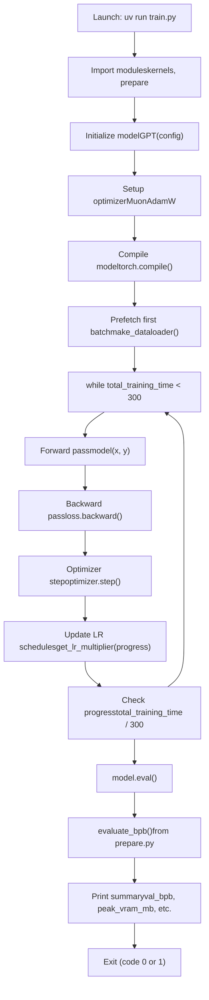
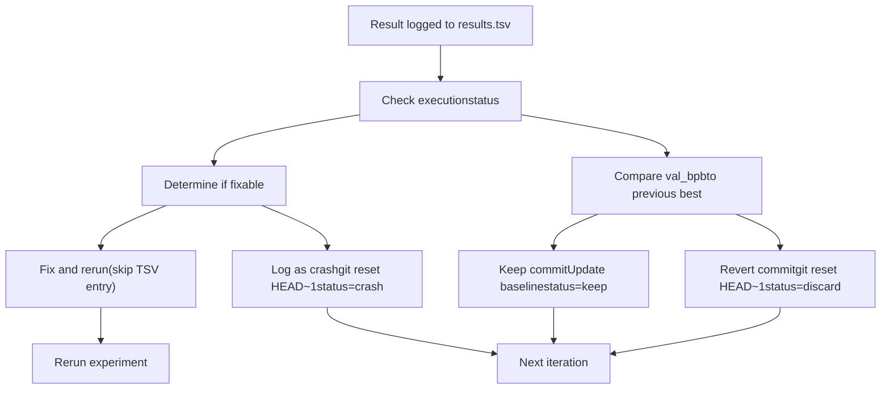

# Experiment Lifecycle

Relevant source files

-   [analysis.ipynb](https://github.com/karpathy/autoresearch/blob/e6d79c12/analysis.ipynb)
-   [program.md](https://github.com/karpathy/autoresearch/blob/e6d79c12/program.md?plain=1)

This page provides a detailed walkthrough of a single experiment's lifecycle, from code modification through result logging. An experiment is one iteration of the autonomous research loop: the agent modifies `train.py`, commits the change, executes training, extracts metrics, and logs results. For the overall research loop structure, see [The Research Loop (4.1)](https://github.com/karpathy/autoresearch/blob/e6d79c12/The Research Loop (4.1)) For the decision-making process that follows metric extraction (keep vs. discard), see [Decision Making and Branch Management (4.3)](https://github.com/karpathy/autoresearch/blob/e6d79c12/Decision Making and Branch Management (4.3))

---

## Overview

Each experiment progresses through six distinct phases:

| Phase | Duration | Key Artifacts | Reversible |
| --- | --- | --- | --- |
| Code Modification | Variable | Modified `train.py` | Yes (uncommitted) |
| Git Commit | < 1s | Git commit hash | Yes (via reset) |
| Execution | ~7 min | `run.log` | No |
| Metric Extraction | < 1s | Parsed values | N/A |
| Result Logging | < 1s | Updated `results.tsv` | No |
| Decision Making | < 1s | Git state change | Varies |

The experiment lifecycle is designed to be **atomic and reproducible**: each run produces a Git commit, execution log, and TSV entry that can be traced back to specific code changes.

Sources: [program.md90-110](https://github.com/karpathy/autoresearch/blob/e6d79c12/program.md?plain=1#L90-L110) [train.py1-632](https://github.com/karpathy/autoresearch/blob/e6d79c12/train.py#L1-L632)

---

## Experiment Lifecycle State Machine

> **[Mermaid stateDiagram]**
> *(图表结构无法解析)*

Sources: [program.md90-110](https://github.com/karpathy/autoresearch/blob/e6d79c12/program.md?plain=1#L90-L110)

---

## Phase 1: Code Modification

The agent modifies `train.py` based on an experimental hypothesis. This is the only file that can be changed during autonomous operation.

### Modifiable Code Entities

The following components in `train.py` are fair game for modification:

| Component | Code Location | Examples |
| --- | --- | --- |
| Model architecture | `GPTConfig` [train.py33-42](https://github.com/karpathy/autoresearch/blob/e6d79c12/train.py#L33-L42) | `n_layer`, `n_head`, `n_embd`, `window_pattern` |
| Hyperparameters | Lines 430-453 | `EMBEDDING_LR`, `MATRIX_LR`, `WEIGHT_DECAY`, `ADAM_BETAS` |
| Model size | Lines 434, 451-452 | `ASPECT_RATIO`, `DEPTH`, `DEVICE_BATCH_SIZE` |
| Optimizer setup | `GPT.setup_optimizer()` [train.py237-267](https://github.com/karpathy/autoresearch/blob/e6d79c12/train.py#L237-L267) | Learning rates, parameter grouping |
| Training loop | Lines 544-606 | Gradient accumulation, scheduling logic |
| Model components | `CausalSelfAttention`, `MLP`, `Block` | Attention mechanism, feedforward structure |

### Immutable Dependencies

The agent reads but cannot modify:

-   `prepare.py`: `Tokenizer`, `make_dataloader()`, `evaluate_bpb()` [prepare.py1-248](https://github.com/karpathy/autoresearch/blob/e6d79c12/prepare.py#L1-L248)
-   `pyproject.toml`: Dependency specifications
-   Data shards in `~/.cache/autoresearch/` [program.md15](https://github.com/karpathy/autoresearch/blob/e6d79c12/program.md?plain=1#L15-L15)

Sources: [train.py1-632](https://github.com/karpathy/autoresearch/blob/e6d79c12/train.py#L1-L632) [program.md25-31](https://github.com/karpathy/autoresearch/blob/e6d79c12/program.md?plain=1#L25-L31)

---

## Phase 2: Git Commit

After modifying `train.py`, the agent creates a Git commit to checkpoint the experimental change.

> **[Mermaid sequence]**
> *(图表结构无法解析)*

The commit message typically describes the experimental idea (e.g., "Increase MATRIX\_LR to 0.04"). The 7-character commit hash becomes the primary identifier for this experiment in `results.tsv` [program.md74](https://github.com/karpathy/autoresearch/blob/e6d79c12/program.md?plain=1#L74-L74)

**Key Point**: At this stage, the commit exists but has not been tested. If the experiment fails, the commit will be reverted via `git reset HEAD~1` [program.md104](https://github.com/karpathy/autoresearch/blob/e6d79c12/program.md?plain=1#L104-L104)

Sources: [program.md98-104](https://github.com/karpathy/autoresearch/blob/e6d79c12/program.md?plain=1#L98-L104)

---

## Phase 3: Execution

The agent launches training via `uv run train.py`, redirecting all output to `run.log` [program.md99](https://github.com/karpathy/autoresearch/blob/e6d79c12/program.md?plain=1#L99-L99):

```
uv run train.py > run.log 2>&1
```
This phase consists of three sub-stages: startup, training loop, and final evaluation.

### Execution Flow Diagram


Sources: [train.py1-632](https://github.com/karpathy/autoresearch/blob/e6d79c12/train.py#L1-L632)

### Startup Phase

**Key Operations** [train.py458-516](https://github.com/karpathy/autoresearch/blob/e6d79c12/train.py#L458-L516):

1.  **Environment setup** [train.py7-9](https://github.com/karpathy/autoresearch/blob/e6d79c12/train.py#L7-L9): Configure PyTorch memory allocator.
2.  **Tokenizer loading** [train.py466](https://github.com/karpathy/autoresearch/blob/e6d79c12/train.py#L466-L466): Load pre-trained tokenizer from `~/.cache/autoresearch/tokenizer/`.
3.  **Model instantiation** [train.py483-486](https://github.com/karpathy/autoresearch/blob/e6d79c12/train.py#L483-L486): Create `GPT` model and move to CUDA with `to_empty(device=device)`.
4.  **Optimizer setup** [train.py500-507](https://github.com/karpathy/autoresearch/blob/e6d79c12/train.py#L500-L507): Call `model.setup_optimizer()` to create `MuonAdamW` instance.
5.  **Model compilation** [train.py509](https://github.com/karpathy/autoresearch/blob/e6d79c12/train.py#L509-L509): Apply `torch.compile()` for performance.
6.  **Dataloader creation** [train.py511-512](https://github.com/karpathy/autoresearch/blob/e6d79c12/train.py#L511-L512): Initialize training dataloader and prefetch first batch.

Sources: [train.py458-516](https://github.com/karpathy/autoresearch/blob/e6d79c12/train.py#L458-L516)

### Training Loop

**Core Loop Structure** [train.py544-606](https://github.com/karpathy/autoresearch/blob/e6d79c12/train.py#L544-L606):

-   **Time budget enforcement** [train.py604-605](https://github.com/karpathy/autoresearch/blob/e6d79c12/train.py#L604-L605): Loop exits when `total_training_time >= 300` seconds.
-   **Progress-based scheduling** [train.py556](https://github.com/karpathy/autoresearch/blob/e6d79c12/train.py#L556-L556): `progress = total_training_time / 300` drives LR schedules.
-   **Warmup/warmdown** [train.py519-526](https://github.com/karpathy/autoresearch/blob/e6d79c12/train.py#L519-L526): `get_lr_multiplier(progress)` implements warmup and warmdown phases.
-   **Fast fail detection** [train.py571-573](https://github.com/karpathy/autoresearch/blob/e6d79c12/train.py#L571-L573): Exit with code 1 if `train_loss > 100` (prevents wasting time on exploded runs).

Sources: [train.py544-606](https://github.com/karpathy/autoresearch/blob/e6d79c12/train.py#L544-L606)

### Final Evaluation

After the training loop completes, the model is evaluated:

```
model.eval()with autocast_ctx:    val_bpb = evaluate_bpb(model, tokenizer, DEVICE_BATCH_SIZE)
```
The `evaluate_bpb()` function [prepare.py220-248](https://github.com/karpathy/autoresearch/blob/e6d79c12/prepare.py#L220-L248) is the **immutable evaluation harness** that processes `EVAL_TOKENS` to return a single float value representing model perplexity.

Sources: [train.py612-614](https://github.com/karpathy/autoresearch/blob/e6d79c12/train.py#L612-L614) [prepare.py220-248](https://github.com/karpathy/autoresearch/blob/e6d79c12/prepare.py#L220-L248)

---

## Phase 4: Metric Extraction

The agent parses `run.log` to extract key metrics using `grep` [program.md100](https://github.com/karpathy/autoresearch/blob/e6d79c12/program.md?plain=1#L100-L100):

```
grep "^val_bpb:\|^peak_vram_mb:" run.log
```
**Extracted Metrics**:

| Metric | Format | Example | Source Line |
| --- | --- | --- | --- |
| `val_bpb` | Float (6 decimals) | 0.997900 | [train.py623](https://github.com/karpathy/autoresearch/blob/e6d79c12/train.py#L623-L623) |
| `peak_vram_mb` | Float (1 decimal) | 45060.2 | [train.py626](https://github.com/karpathy/autoresearch/blob/e6d79c12/train.py#L626-L626) |

**Derived Value**: `memory_gb` is computed as `peak_vram_mb / 1024` [program.md76](https://github.com/karpathy/autoresearch/blob/e6d79c12/program.md?plain=1#L76-L76)

Sources: [program.md100-101](https://github.com/karpathy/autoresearch/blob/e6d79c12/program.md?plain=1#L100-L101) [train.py622-631](https://github.com/karpathy/autoresearch/blob/e6d79c12/train.py#L622-L631)

---

## Phase 5: Result Logging

Every experiment is logged to `results.tsv`, a tab-separated file with five columns [program.md71](https://github.com/karpathy/autoresearch/blob/e6d79c12/program.md?plain=1#L71-L71):

```
commit	val_bpb	memory_gb	status	description
```
### TSV Schema

| Column | Type | Format | Example | Notes |
| --- | --- | --- | --- | --- |
| `commit` | String | 7-char hash | `a1b2c3d` | Git commit short hash |
| `val_bpb` | Float | 6 decimals | `0.997900` | Validation bits-per-byte; `0.000000` for crashes |
| `memory_gb` | Float | 1 decimal | `44.0` | Peak VRAM in GB; `0.0` for crashes |
| `status` | Enum | `keep`, `discard`, `crash` | `keep` | Outcome of decision-making phase |
| `description` | String | Free text | `increase LR to 0.04` | Short experiment description |

Sources: [program.md64-88](https://github.com/karpathy/autoresearch/blob/e6d79c12/program.md?plain=1#L64-L88)

---

## Phase 6: Transition to Decision Making

After logging results, the agent evaluates the outcome and decides whether to keep or discard the commit [program.md103-104](https://github.com/karpathy/autoresearch/blob/e6d79c12/program.md?plain=1#L103-L104)

### Decision Criteria


Sources: [program.md102-110](https://github.com/karpathy/autoresearch/blob/e6d79c12/program.md?plain=1#L102-L110)

---

## Timing and Performance

Typical experiment durations [program.md107-108](https://github.com/karpathy/autoresearch/blob/e6d79c12/program.md?plain=1#L107-L108):

| Phase | Time | Variance | Bottleneck |
| --- | --- | --- | --- |
| Code Modification | 30-120s | High | Agent reasoning time |
| Git Commit | < 1s | Low | Disk I/O |
| Execution - Startup | 20-30s | Medium | Torch compilation, model init |
| Execution - Training | 300s | Low | Fixed 5-minute budget |
| Execution - Eval | 1-3s | Low | Validation data size |
| Metric Extraction | < 1s | Low | Grep operation |
| Result Logging | < 1s | Low | File append |
| **Total** | **~7 min** | Medium | Dominated by training time |

Sources: [program.md107-108](https://github.com/karpathy/autoresearch/blob/e6d79c12/program.md?plain=1#L107-L108) [train.py544-606](https://github.com/karpathy/autoresearch/blob/e6d79c12/train.py#L544-L606)

---

## Error Scenarios

### Timeout

If execution exceeds 10 minutes, the agent kills the process and treats it as a failure (`status=crash`) [program.md108](https://github.com/karpathy/autoresearch/blob/e6d79c12/program.md?plain=1#L108-L108)

### Fast Fail (Loss Explosion)

If `train_loss > 100`, the script exits with code 1 [train.py571-573](https://github.com/karpathy/autoresearch/blob/e6d79c12/train.py#L571-L573) The agent logs this as a crash.

### Out of Memory (OOM)

If CUDA runs out of memory, the script crashes. The agent may attempt a fix (e.g., reducing `DEVICE_BATCH_SIZE`) or log as a crash and move on [program.md110](https://github.com/karpathy/autoresearch/blob/e6d79c12/program.md?plain=1#L110-L110)

Sources: [program.md107-110](https://github.com/karpathy/autoresearch/blob/e6d79c12/program.md?plain=1#L107-L110) [train.py571-573](https://github.com/karpathy/autoresearch/blob/e6d79c12/train.py#L571-L573)
