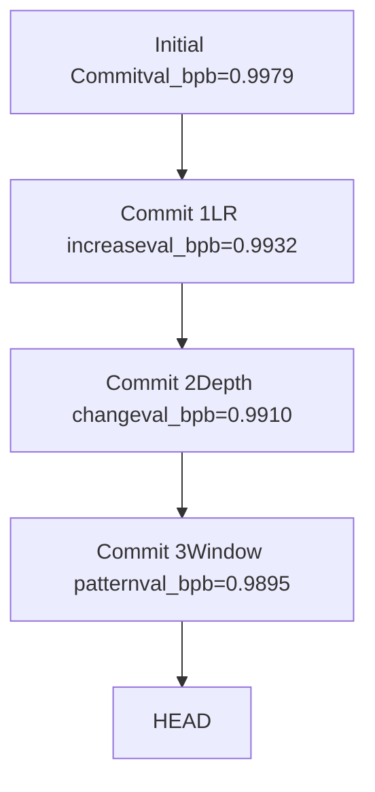

# Decision Making and Branch Management

Relevant source files

-   [.gitignore](https://github.com/karpathy/autoresearch/blob/e6d79c12/.gitignore)
-   [program.md](https://github.com/karpathy/autoresearch/blob/e6d79c12/program.md?plain=1)

## Purpose and Scope

This page documents the decision logic that governs whether experimental changes to `train.py` are kept or discarded, and how Git branch operations implement the optimization frontier. After each experiment completes ([4.2](https://github.com/karpathy/autoresearch/blob/e6d79c12/4.2)), the agent must decide whether the modification improved performance. This decision determines whether the Git commit is kept (advancing the branch) or reverted (returning to the previous state).

For information about the experiment lifecycle leading to the decision point, see [4.2 Experiment Lifecycle](https://github.com/karpathy/autoresearch/blob/e6d79c12/4.2 Experiment Lifecycle) For details on the `val_bpb` metric used in decision making, see [5.1 Validation Bits Per Byte](https://github.com/karpathy/autoresearch/blob/e6d79c12/5.1 Validation Bits Per Byte) For the complete logging of all decisions, see [6.1 results.tsv Structure](https://github.com/karpathy/autoresearch/blob/e6d79c12/6.1 results.tsv Structure)

**Sources:** [program.md90-110](https://github.com/karpathy/autoresearch/blob/e6d79c12/program.md?plain=1#L90-L110)

---

## The Binary Decision Model

Each experiment results in one of three outcomes based on the agent's evaluation of the `run.log` and the resulting `val_bpb` metric [program.md41-62](https://github.com/karpathy/autoresearch/blob/e6d79c12/program.md?plain=1#L41-L62)

| Outcome | Condition | Git Action | `results.tsv` Status |
| --- | --- | --- | --- |
| **Keep** | `val_bpb < previous_best` | Commit is retained | `keep` |
| **Discard** | `val_bpb >= previous_best` | `git reset` to previous commit | `discard` |
| **Crash** | Empty grep output or timeout | `git reset` to previous commit | `crash` |

The decision is strictly binary based on performance comparison. There is no manual intervention or human review during the autonomous loop—the agent evaluates metrics and immediately executes the corresponding Git operation [program.md103-105](https://github.com/karpathy/autoresearch/blob/e6d79c12/program.md?plain=1#L103-L105)

**Sources:** [program.md103-105](https://github.com/karpathy/autoresearch/blob/e6d79c12/program.md?plain=1#L103-L105) [program.md41-62](https://github.com/karpathy/autoresearch/blob/e6d79c12/program.md?plain=1#L41-L62)

---

## Decision Criteria

### Primary Metric: val\_bpb

The sole determinant for keep vs. discard is `val_bpb` (validation bits per byte). A change is kept if and only if:

```
current_val_bpb < best_val_bpb_so_far
```
The comparison is strict inequality—equal performance results in discard unless it satisfies the simplicity criterion. The goal is continuous improvement: "get the lowest val\_bpb" [program.md33](https://github.com/karpathy/autoresearch/blob/e6d79c12/program.md?plain=1#L33-L33) Since `val_bpb` is vocabulary-size independent and measured on a fixed evaluation set, this comparison remains fair across all architectural modifications [program.md29-31](https://github.com/karpathy/autoresearch/blob/e6d79c12/program.md?plain=1#L29-L31)

**Sources:** [program.md33](https://github.com/karpathy/autoresearch/blob/e6d79c12/program.md?plain=1#L33-L33) [program.md103-104](https://github.com/karpathy/autoresearch/blob/e6d79c12/program.md?plain=1#L103-L104) [program.md29-31](https://github.com/karpathy/autoresearch/blob/e6d79c12/program.md?plain=1#L29-L31)

### Secondary Constraint: peak\_vram\_mb

`peak_vram_mb` is extracted alongside `val_bpb` using the grep command:

```
grep "^val_bpb:\|^peak_vram_mb:" run.log
```
However, VRAM is a **soft constraint**: "Some increase is acceptable for meaningful val\_bpb gains, but it should not blow up dramatically" [program.md35](https://github.com/karpathy/autoresearch/blob/e6d79c12/program.md?plain=1#L35-L35) The agent uses judgment—a significant reduction in `val_bpb` might justify 10-20% more VRAM, but a marginal improvement should not blow up the memory budget.

Out-of-memory (OOM) errors result in crash status and automatic discard [program.md110](https://github.com/karpathy/autoresearch/blob/e6d79c12/program.md?plain=1#L110-L110)

**Sources:** [program.md35](https://github.com/karpathy/autoresearch/blob/e6d79c12/program.md?plain=1#L35-L35) [program.md100](https://github.com/karpathy/autoresearch/blob/e6d79c12/program.md?plain=1#L100-L100) [program.md110](https://github.com/karpathy/autoresearch/blob/e6d79c12/program.md?plain=1#L110-L110)

### Simplicity Criterion

When `val_bpb` improvements are marginal, code simplicity becomes the tiebreaker [program.md37](https://github.com/karpathy/autoresearch/blob/e6d79c12/program.md?plain=1#L37-L37):

| Scenario | Decision |
| --- | --- |
| 0.001 improvement + 20 lines of complexity | Discard ("Probably not worth it") |
| 0.001 improvement from deleting code | Keep ("Definitely keep") |
| ~0 change + much simpler code | Keep |
| Equal performance + removed feature | Keep ("simplification win") |

This criterion prevents the codebase from accumulating hacky optimizations that add minimal value. The agent weighs "complexity cost against the improvement magnitude" [program.md37](https://github.com/karpathy/autoresearch/blob/e6d79c12/program.md?plain=1#L37-L37)

**Sources:** [program.md37](https://github.com/karpathy/autoresearch/blob/e6d79c12/program.md?plain=1#L37-L37)

---

## Git Branch as Optimization Frontier

The experiment runs on a dedicated branch (e.g., `autoresearch/mar5`) created during setup [program.md9-10](https://github.com/karpathy/autoresearch/blob/e6d79c12/program.md?plain=1#L9-L10) This branch serves as the **optimization frontier**—its HEAD always represents the best-known configuration.


**Key Properties:**

-   Each commit on the branch improved `val_bpb` over its parent [program.md103](https://github.com/karpathy/autoresearch/blob/e6d79c12/program.md?plain=1#L103-L103)
-   Discarded experiments are never committed to the permanent history—they are reset [program.md104](https://github.com/karpathy/autoresearch/blob/e6d79c12/program.md?plain=1#L104-L104)
-   The branch forms a monotonically improving sequence in terms of validation performance.
-   `git log` on the branch shows only successful experiments that advanced the state of the art.

**Sources:** [program.md9-10](https://github.com/karpathy/autoresearch/blob/e6d79c12/program.md?plain=1#L9-L10) [program.md92](https://github.com/karpathy/autoresearch/blob/e6d79c12/program.md?plain=1#L92-L92) [program.md103-105](https://github.com/karpathy/autoresearch/blob/e6d79c12/program.md?plain=1#L103-L105)

---

## Keep Decision: Advancing the Branch

When `val_bpb` improves, the experiment "advances" the branch by retaining the Git commit [program.md103](https://github.com/karpathy/autoresearch/blob/e6d79c12/program.md?plain=1#L103-L103)

**Git Operations Sequence:**

**Example Command Flow:**

```
# Modify train.py (e.g., increase DEPTH from 8 to 10)git add train.pygit commit -m "increase depth to 10"# Commit hash: a1b2c3d uv run train.py > run.log 2>&1grep "^val_bpb:" run.log# Output: val_bpb:          0.989500 # Decision: 0.9895 < 0.9910 (previous best) -> KEEP# Append to results.tsv:# a1b2c3d	0.989500	46.2	keep	increase depth to 10
```
The commit message briefly describes the modification, as this becomes part of the permanent experiment history [program.md78](https://github.com/karpathy/autoresearch/blob/e6d79c12/program.md?plain=1#L78-L78)

**Sources:** [program.md98](https://github.com/karpathy/autoresearch/blob/e6d79c12/program.md?plain=1#L98-L98) [program.md103](https://github.com/karpathy/autoresearch/blob/e6d79c12/program.md?plain=1#L103-L103) [program.md78](https://github.com/karpathy/autoresearch/blob/e6d79c12/program.md?plain=1#L78-L78)

---

## Discard Decision: Reverting State

When `val_bpb` fails to improve, the agent performs `git reset` to return to the previous commit [program.md104](https://github.com/karpathy/autoresearch/blob/e6d79c12/program.md?plain=1#L104-L104)

**Git Operations Sequence:**

**Example Command Flow:**

```
# Modify train.py (e.g., switch to GeLU activation)git add train.pygit commit -m "switch to GeLU activation"# Commit hash: b2c3d4e uv run train.py > run.log 2>&1grep "^val_bpb:" run.log# Output: val_bpb:          0.992100 # Decision: 0.9921 >= 0.9895 (previous best) -> DISCARD# Append to results.tsv:# b2c3d4e	0.992100	45.8	discard	switch to GeLU activation git reset --hard HEAD~1# HEAD now back at a1b2c3d (previous commit)
```
The discarded commit hash is still logged in `results.tsv` for analysis, but it no longer exists in Git history [program.md102](https://github.com/karpathy/autoresearch/blob/e6d79c12/program.md?plain=1#L102-L102)

**Sources:** [program.md102](https://github.com/karpathy/autoresearch/blob/e6d79c12/program.md?plain=1#L102-L102) [program.md104](https://github.com/karpathy/autoresearch/blob/e6d79c12/program.md?plain=1#L104-L104)

---

## Decision State Machine

The complete decision flow integrates metrics extraction, comparison logic, and Git operations:

**Decision Points:**

1.  **Grep output check** [program.md101](https://github.com/karpathy/autoresearch/blob/e6d79c12/program.md?plain=1#L101-L101): Empty output indicates a crash.
2.  **val\_bpb comparison** [program.md103-104](https://github.com/karpathy/autoresearch/blob/e6d79c12/program.md?plain=1#L103-L104): Determines keep vs. discard.
3.  **Logging** [program.md102](https://github.com/karpathy/autoresearch/blob/e6d79c12/program.md?plain=1#L102-L102): All outcomes recorded in `results.tsv`.
4.  **Git action** [program.md103-104](https://github.com/karpathy/autoresearch/blob/e6d79c12/program.md?plain=1#L103-L104): Keep commits, discard resets.

**Sources:** [program.md94-110](https://github.com/karpathy/autoresearch/blob/e6d79c12/program.md?plain=1#L94-L110) [program.md101-104](https://github.com/karpathy/autoresearch/blob/e6d79c12/program.md?plain=1#L101-L104)

---

## Branch Management Best Practices

### Never Stop Condition

The experiment loop runs **indefinitely** until manually interrupted [program.md112](https://github.com/karpathy/autoresearch/blob/e6d79c12/program.md?plain=1#L112-L112) The agent does not pause to ask whether to continue. This enables autonomous overnight operation where the agent can complete approx 100 experiments over the duration of an average human sleep [program.md114](https://github.com/karpathy/autoresearch/blob/e6d79c12/program.md?plain=1#L114-L114)

### Timeout Handling

Experiments should take ~5 minutes. If a run exceeds 10 minutes, the agent is instructed to kill it and treat it as a failure (discard and revert) [program.md108](https://github.com/karpathy/autoresearch/blob/e6d79c12/program.md?plain=1#L108-L108)

### Sparse Rewinding

The agent is instructed that rewinding to an earlier commit (beyond the immediate previous one) should be done "very very sparingly (if ever)" [program.md106](https://github.com/karpathy/autoresearch/blob/e6d79c12/program.md?plain=1#L106-L106) The branch moves forward monotonically—backward jumps would discard the entire improvement frontier.

**Sources:** [program.md106](https://github.com/karpathy/autoresearch/blob/e6d79c12/program.md?plain=1#L106-L106) [program.md108](https://github.com/karpathy/autoresearch/blob/e6d79c12/program.md?plain=1#L108-L108) [program.md112-114](https://github.com/karpathy/autoresearch/blob/e6d79c12/program.md?plain=1#L112-L114)

---

## Relationship to Complete Log

The Git branch and `results.tsv` serve complementary purposes:

| Aspect | Git Branch (`autoresearch/<tag>`) | `results.tsv` |
| --- | --- | --- |
| **Content** | Only successful experiments (keep) | All experiments (keep, discard, crash) |
| **Purpose** | Track optimization frontier | Complete audit trail |
| **Commits** | Retained for improvements | Hash logged for all attempts |
| **Persistence** | Permanent Git history | Untracked file [program.md102](https://github.com/karpathy/autoresearch/blob/e6d79c12/program.md?plain=1#L102-L102) |

The Git history represents the "best path" through the optimization landscape, while `results.tsv` captures the complete search process including failed attempts. Note that `results.tsv` is explicitly excluded from Git tracking to avoid merge conflicts and pollution of the research branch [program.md102](https://github.com/karpathy/autoresearch/blob/e6d79c12/program.md?plain=1#L102-L102) [.gitignore23](https://github.com/karpathy/autoresearch/blob/e6d79c12/.gitignore#L23-L23)

**Sources:** [program.md102](https://github.com/karpathy/autoresearch/blob/e6d79c12/program.md?plain=1#L102-L102) [program.md103-105](https://github.com/karpathy/autoresearch/blob/e6d79c12/program.md?plain=1#L103-L105) [.gitignore23](https://github.com/karpathy/autoresearch/blob/e6d79c12/.gitignore#L23-L23)

---

## Code References

The decision logic is primarily specified in the agent instructions:

-   **Decision criteria:** [program.md33](https://github.com/karpathy/autoresearch/blob/e6d79c12/program.md?plain=1#L33-L33) (val\_bpb goal), [program.md35](https://github.com/karpathy/autoresearch/blob/e6d79c12/program.md?plain=1#L35-L35) (VRAM constraint), [program.md37](https://github.com/karpathy/autoresearch/blob/e6d79c12/program.md?plain=1#L37-L37) (simplicity)
-   **Keep logic:** [program.md103](https://github.com/karpathy/autoresearch/blob/e6d79c12/program.md?plain=1#L103-L103) ("advance the branch")
-   **Discard logic:** [program.md104](https://github.com/karpathy/autoresearch/blob/e6d79c12/program.md?plain=1#L104-L104) ("git reset back")
-   **Crash detection:** [program.md101](https://github.com/karpathy/autoresearch/blob/e6d79c12/program.md?plain=1#L101-L101) (empty grep output)
-   **Logging requirement:** [program.md102](https://github.com/karpathy/autoresearch/blob/e6d79c12/program.md?plain=1#L102-L102) (record in results.tsv)
-   **Autonomous operation:** [program.md112](https://github.com/karpathy/autoresearch/blob/e6d79c12/program.md?plain=1#L112-L112) (never stop)

The actual Git operations (`git commit`, `git reset --hard HEAD~1`) are executed by the agent as shell commands based on these instructions.

**Sources:** [program.md33-37](https://github.com/karpathy/autoresearch/blob/e6d79c12/program.md?plain=1#L33-L37) [program.md94-110](https://github.com/karpathy/autoresearch/blob/e6d79c12/program.md?plain=1#L94-L110)
