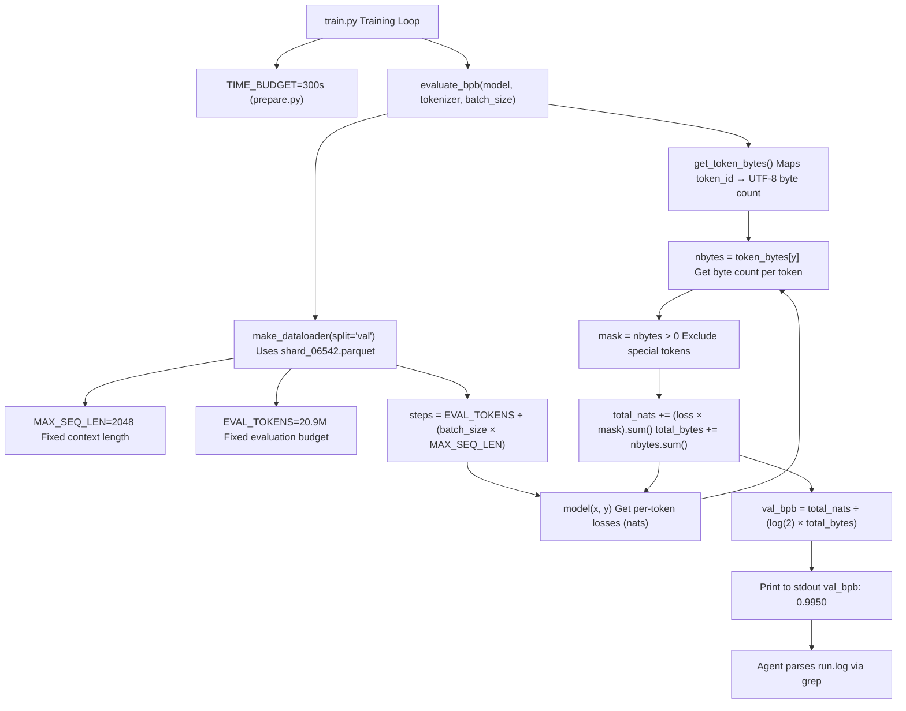
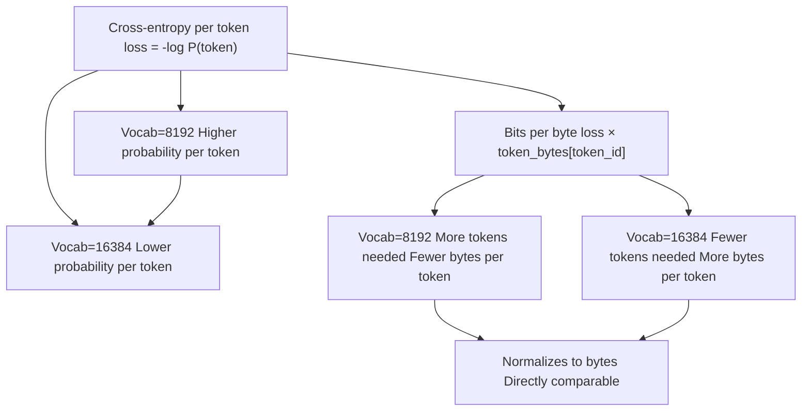
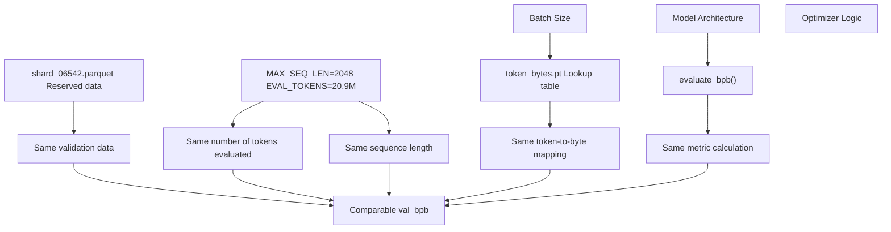

# Metrics and Evaluation

Relevant source files

-   [analysis.ipynb](https://github.com/karpathy/autoresearch/blob/e6d79c12/analysis.ipynb)
-   [prepare.py](https://github.com/karpathy/autoresearch/blob/e6d79c12/prepare.py)
-   [program.md](https://github.com/karpathy/autoresearch/blob/e6d79c12/program.md?plain=1)

This page documents the evaluation strategy used in autoresearch, focusing on the `val_bpb` (validation bits per byte) metric and how the system's constraints enable fair comparison across diverse experiments. The evaluation harness is implemented in `prepare.py` and is immutable—the agent cannot modify it—ensuring that all performance improvements reflect genuine model advances rather than evaluation inconsistencies.

For detailed information about:

-   The mathematical definition and calculation of `val_bpb`, see [Validation Bits Per Byte (val\_bpb)](/karpathy/autoresearch/5.1-validation-bits-per-byte-(val_bpb))
-   Hard and soft constraints enforced during evaluation, see [System Constraints](/karpathy/autoresearch/5.2-system-constraints)
-   The design philosophy behind evaluation consistency, see [Fair Comparison Philosophy](/karpathy/autoresearch/5.3-fair-comparison-philosophy)

---

## Evaluation Strategy

The autoresearch system uses a **fixed evaluation protocol** to ensure meaningful comparisons between experiments. All evaluations are performed by the `evaluate_bpb` function in [prepare.py327-349](https://github.com/karpathy/autoresearch/blob/e6d79c12/prepare.py#L327-L349) which is immutable and imported by `train.py`. This separation guarantees that architectural changes, hyperparameter adjustments, and optimizer modifications are measured on identical ground truth.

**Core evaluation principles:**

1.  **Single metric**: `val_bpb` (bits per byte) is the sole optimization target [program.md33](https://github.com/karpathy/autoresearch/blob/e6d79c12/program.md?plain=1#L33-L33)
2.  **Fixed budget**: Every experiment trains for exactly 5 minutes (300 seconds) [prepare.py31](https://github.com/karpathy/autoresearch/blob/e6d79c12/prepare.py#L31-L31)
3.  **Consistent data**: Validation always uses the pinned last shard `shard_06542.parquet` [prepare.py43-44](https://github.com/karpathy/autoresearch/blob/e6d79c12/prepare.py#L43-L44)
4.  **Fixed tokens**: Evaluation processes exactly `EVAL_TOKENS` (approx 20.9M) tokens [prepare.py32](https://github.com/karpathy/autoresearch/blob/e6d79c12/prepare.py#L32-L32)
5.  **Immutable harness**: The `evaluate_bpb` function must not be modified by the agent [program.md31](https://github.com/karpathy/autoresearch/blob/e6d79c12/program.md?plain=1#L31-L31)

Sources: [prepare.py31-44](https://github.com/karpathy/autoresearch/blob/e6d79c12/prepare.py#L31-L44) [prepare.py327-349](https://github.com/karpathy/autoresearch/blob/e6d79c12/prepare.py#L327-L349) [program.md31-33](https://github.com/karpathy/autoresearch/blob/e6d79c12/program.md?plain=1#L31-L33)

---

## The val\_bpb Metric

**Definition**: Validation bits per byte (val\_bpb) measures how many bits are needed to encode each byte of text under the model's predicted distribution. Lower values indicate better compression and thus better language modeling.

**Key properties:**

| Property | Value | Significance |
| --- | --- | --- |
| **Vocabulary independence** | Yes | Model can change `VOCAB_SIZE` freely |
| **Unit** | bits/byte | Directly interpretable information theory metric |
| **Direction** | Lower is better | Target is to minimize `val_bpb` |
| **Special tokens** | Excluded | Tokens with 0 byte length (like \`< |

The metric is calculated by:

1.  Computing per-token cross-entropy loss (in nats).
2.  Mapping each token to its UTF-8 byte length via a `token_bytes` lookup tensor [prepare.py185-200](https://github.com/karpathy/autoresearch/blob/e6d79c12/prepare.py#L185-L200)
3.  Summing total nats and total bytes (excluding special tokens where `nbytes == 0`).
4.  Converting to bits per byte: `total_nats / (math.log(2) * total_bytes)` [prepare.py348](https://github.com/karpathy/autoresearch/blob/e6d79c12/prepare.py#L348-L348)

Sources: [prepare.py185-200](https://github.com/karpathy/autoresearch/blob/e6d79c12/prepare.py#L185-L200) [prepare.py327-349](https://github.com/karpathy/autoresearch/blob/e6d79c12/prepare.py#L327-L349) [program.md33](https://github.com/karpathy/autoresearch/blob/e6d79c12/program.md?plain=1#L33-L33)

---

## Evaluation Process Flow

**Process description:**

1.  After the 5-minute training budget expires, `train.py` calls `evaluate_bpb(model, tokenizer, batch_size)` [prepare.py327](https://github.com/karpathy/autoresearch/blob/e6d79c12/prepare.py#L327-L327)
2.  The function uses `get_token_bytes()` to retrieve a tensor mapping each token ID to its UTF-8 byte length [prepare.py237-240](https://github.com/karpathy/autoresearch/blob/e6d79c12/prepare.py#L237-L240)
3.  A validation dataloader is created using `split="val"`, which exclusively reads the pinned `VAL_SHARD` [prepare.py246-247](https://github.com/karpathy/autoresearch/blob/e6d79c12/prepare.py#L246-L247)
4.  The number of evaluation steps is calculated based on `EVAL_TOKENS` [prepare.py338](https://github.com/karpathy/autoresearch/blob/e6d79c12/prepare.py#L338-L338)
5.  For each step, the model computes per-token losses.
6.  Each token is mapped to its byte count, and special tokens (0 bytes) are masked out [prepare.py344-345](https://github.com/karpathy/autoresearch/blob/e6d79c12/prepare.py#L344-L345)
7.  Losses and byte counts are accumulated across all steps.
8.  The final metric is computed as bits per byte [prepare.py348](https://github.com/karpathy/autoresearch/blob/e6d79c12/prepare.py#L348-L348)

Sources: [prepare.py237-247](https://github.com/karpathy/autoresearch/blob/e6d79c12/prepare.py#L237-L247) [prepare.py327-349](https://github.com/karpathy/autoresearch/blob/e6d79c12/prepare.py#L327-L349) [program.md58-62](https://github.com/karpathy/autoresearch/blob/e6d79c12/program.md?plain=1#L58-L62)

---

## Vocabulary-Size Independence

The `val_bpb` metric's most critical property is **vocabulary-size independence**, which allows the agent to experiment with different tokenizer configurations (e.g., changing `VOCAB_SIZE` in `prepare.py` or architecture in `train.py`) while maintaining comparable results.

**Example comparison:** Even if the per-token loss is higher with a larger vocabulary (because the probability mass is spread thinner), the `val_bpb` remains stable because the denominator (total bytes) is fixed by the text itself, not the number of tokens the model chose to use to represent it [prepare.py348](https://github.com/karpathy/autoresearch/blob/e6d79c12/prepare.py#L348-L348)

Sources: [prepare.py327-349](https://github.com/karpathy/autoresearch/blob/e6d79c12/prepare.py#L327-L349) [prepare.py185-200](https://github.com/karpathy/autoresearch/blob/e6d79c12/prepare.py#L185-L200)

---

## Evaluation Consistency Guarantees

The system enforces multiple constraints to ensure every experiment is evaluated identically:

**Constraint enforcement:**

1.  **Data split**: Validation always uses `shard_06542.parquet`, reserved during preparation [prepare.py43-44](https://github.com/karpathy/autoresearch/blob/e6d79c12/prepare.py#L43-L44)
2.  **Sequence length**: Evaluation uses `MAX_SEQ_LEN=2048` regardless of training configuration [prepare.py30](https://github.com/karpathy/autoresearch/blob/e6d79c12/prepare.py#L30-L30)
3.  **Token budget**: Evaluation processes exactly `EVAL_TOKENS` tokens, independent of batch size [prepare.py32](https://github.com/karpathy/autoresearch/blob/e6d79c12/prepare.py#L32-L32)
4.  **Byte mapping**: The `token_bytes` tensor is computed once during tokenizer training [prepare.py185](https://github.com/karpathy/autoresearch/blob/e6d79c12/prepare.py#L185-L185)
5.  **Function immutability**: The agent cannot modify `prepare.py`, so evaluation logic is fixed [program.md29](https://github.com/karpathy/autoresearch/blob/e6d79c12/program.md?plain=1#L29-L29)

Sources: [prepare.py30-44](https://github.com/karpathy/autoresearch/blob/e6d79c12/prepare.py#L30-L44) [prepare.py185-200](https://github.com/karpathy/autoresearch/blob/e6d79c12/prepare.py#L185-L200) [prepare.py327-349](https://github.com/karpathy/autoresearch/blob/e6d79c12/prepare.py#L327-L349) [program.md29-31](https://github.com/karpathy/autoresearch/blob/e6d79c12/program.md?plain=1#L29-L31)

---

## Code Entity Reference

The following code entities implement the evaluation system:

| Entity | Location | Role |
| --- | --- | --- |
| `evaluate_bpb()` | [prepare.py327-349](https://github.com/karpathy/autoresearch/blob/e6d79c12/prepare.py#L327-L349) | Main evaluation function (immutable) |
| `get_token_bytes()` | [prepare.py237-240](https://github.com/karpathy/autoresearch/blob/e6d79c12/prepare.py#L237-L240) | Loads token→byte lookup tensor |
| `token_bytes.pt` | `TOKENIZER_DIR` | Pre-computed UTF-8 byte counts per token [prepare.py144](https://github.com/karpathy/autoresearch/blob/e6d79c12/prepare.py#L144-L144) |
| `make_dataloader()` | [prepare.py260-321](https://github.com/karpathy/autoresearch/blob/e6d79c12/prepare.py#L260-L321) | Creates validation data iterator |
| `EVAL_TOKENS` | [prepare.py32](https://github.com/karpathy/autoresearch/blob/e6d79c12/prepare.py#L32-L32) | Fixed token budget (approx 20.9M tokens) |
| `MAX_SEQ_LEN` | [prepare.py30](https://github.com/karpathy/autoresearch/blob/e6d79c12/prepare.py#L30-L30) | Fixed sequence length (2048 tokens) |
| `TIME_BUDGET` | [prepare.py31](https://github.com/karpathy/autoresearch/blob/e6d79c12/prepare.py#L31-L31) | Fixed training duration (300 seconds) |
| `VAL_SHARD` | [prepare.py43](https://github.com/karpathy/autoresearch/blob/e6d79c12/prepare.py#L43-L43) | Reserved validation shard index (6542) |

**Evaluation workflow in `train.py`:** The training script is expected to call `evaluate_bpb` at the end of its loop and print the result. The agent then uses `grep "^val_bpb:" run.log` to extract this value [program.md61](https://github.com/karpathy/autoresearch/blob/e6d79c12/program.md?plain=1#L61-L61)

Sources: [prepare.py30-44](https://github.com/karpathy/autoresearch/blob/e6d79c12/prepare.py#L30-L44) [prepare.py144](https://github.com/karpathy/autoresearch/blob/e6d79c12/prepare.py#L144-L144) [prepare.py327-349](https://github.com/karpathy/autoresearch/blob/e6d79c12/prepare.py#L327-L349) [program.md61](https://github.com/karpathy/autoresearch/blob/e6d79c12/program.md?plain=1#L61-L61)

---

## Metrics vs. Constraints

The system distinguishes between the **metric** (what we measure) and **constraints** (what we fix):

-   **Objective**: Minimize `val_bpb` [program.md33](https://github.com/karpathy/autoresearch/blob/e6d79c12/program.md?plain=1#L33-L33)
-   **Hard Constraints**: `TIME_BUDGET` (5 mins), `MAX_SEQ_LEN`, `EVAL_TOKENS`, and the immutable `evaluate_bpb` function [program.md23-31](https://github.com/karpathy/autoresearch/blob/e6d79c12/program.md?plain=1#L23-L31)
-   **Soft Constraints**: `peak_vram_mb` (VRAM should not blow up dramatically) [program.md35](https://github.com/karpathy/autoresearch/blob/e6d79c12/program.md?plain=1#L35-L35) and the **Simplicity Criterion** (simpler code is preferred all else being equal) [program.md37](https://github.com/karpathy/autoresearch/blob/e6d79c12/program.md?plain=1#L37-L37)

**Key insight**: The agent can modify anything in `train.py` (architecture, optimizer, LR), but all experiments are evaluated identically. This design ensures that improvements in `val_bpb` reflect genuine advances rather than evaluation artifacts.

Sources: [prepare.py30-32](https://github.com/karpathy/autoresearch/blob/e6d79c12/prepare.py#L30-L32) [program.md23-37](https://github.com/karpathy/autoresearch/blob/e6d79c12/program.md?plain=1#L23-L37)

---

## Integration with Results Tracking

After evaluation completes, the agent extracts `val_bpb` and `peak_vram_mb` from `run.log` and logs it to `results.tsv` [program.md100-102](https://github.com/karpathy/autoresearch/blob/e6d79c12/program.md?plain=1#L100-L102)

The **decision logic** is as follows:

-   If `val_bpb` **improved** (lower): `status=keep`, the git commit is preserved and the branch advances [program.md103](https://github.com/karpathy/autoresearch/blob/e6d79c12/program.md?plain=1#L103-L103)
-   If `val_bpb` is **equal or worse**: `status=discard`, the agent performs `git reset` to the previous state [program.md104](https://github.com/karpathy/autoresearch/blob/e6d79c12/program.md?plain=1#L104-L104)
-   If training **crashed**: `status=crash`, the agent attempts a fix or moves on [program.md110](https://github.com/karpathy/autoresearch/blob/e6d79c12/program.md?plain=1#L110-L110)

For details on results tracking and visualization, see [Results and Analysis](/karpathy/autoresearch/6-results-and-analysis).

Sources: [program.md100-110](https://github.com/karpathy/autoresearch/blob/e6d79c12/program.md?plain=1#L100-L110)
