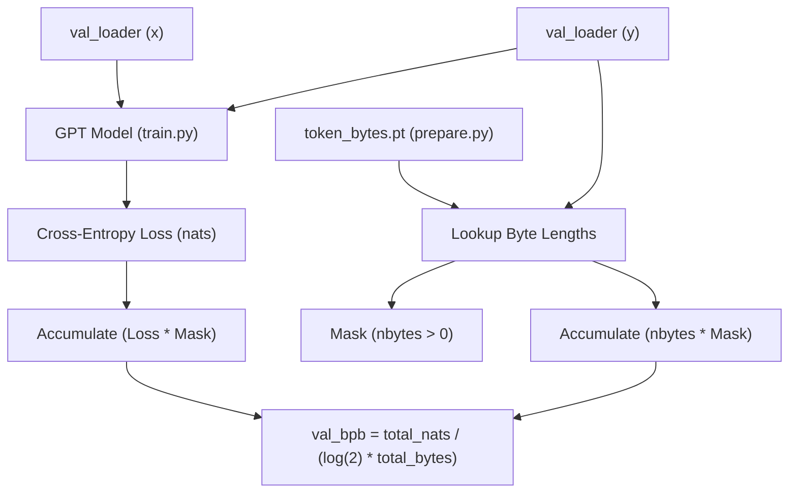
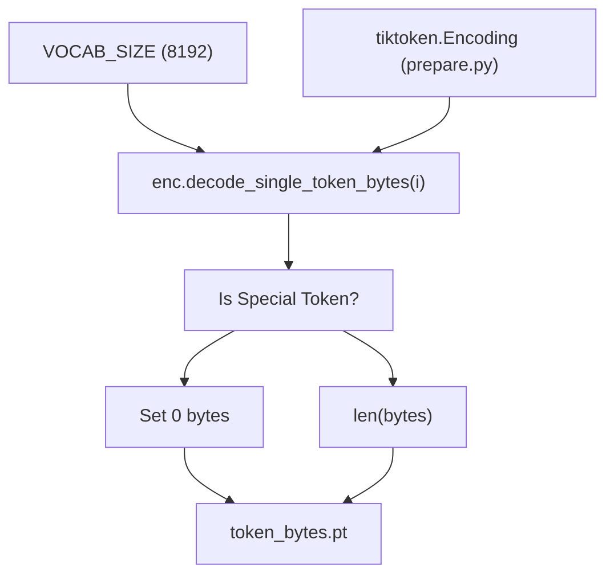

# Validation Bits Per Byte (val\_bpb)

Relevant source files

-   [analysis.ipynb](https://github.com/karpathy/autoresearch/blob/e6d79c12/analysis.ipynb)
-   [prepare.py](https://github.com/karpathy/autoresearch/blob/e6d79c12/prepare.py)

## Purpose and Scope

This page provides a detailed technical explanation of the `val_bpb` (validation bits per byte) metric used in the `autoresearch` system to evaluate model performance. It defines the metric's calculation, explains its vocabulary-size independence, and documents the implementation within the evaluation harness.

For information about other system constraints, see [System Constraints](https://github.com/karpathy/autoresearch/blob/e6d79c12/System Constraints) For details about the broader evaluation philosophy, see [Fair Comparison Philosophy](https://github.com/karpathy/autoresearch/blob/e6d79c12/Fair Comparison Philosophy)

---

## Overview

The `val_bpb` metric measures a language model's **compression efficiency** in bits per byte of raw UTF-8 text. Unlike traditional perplexity-based metrics that depend on tokenizer vocabulary size, `val_bpb` normalizes by the byte content of the text being predicted. This property is critical for `autoresearch`: the agent can modify `VOCAB_SIZE`, model architecture, or any other aspect of `train.py`, and the resulting `val_bpb` values remain directly comparable.

**Key properties:**

-   **Lower is better**: Fewer bits per byte indicates better compression/prediction.
-   **Vocabulary-size-independent**: Enables fair comparison across different tokenizers.
-   **Fixed evaluation harness**: Uses a fixed validation shard and token budget.
-   **Byte-level normalization**: Measures information content in the original text, not token count.

Sources: [prepare.py327-349](https://github.com/karpathy/autoresearch/blob/e6d79c12/prepare.py#L327-L349) [prepare.py45](https://github.com/karpathy/autoresearch/blob/e6d79c12/prepare.py#L45-L45)

---

## The evaluate\_bpb Function

The core evaluation logic resides in the `evaluate_bpb` function in `prepare.py`. This function is part of the immutable infrastructure layer; the agent is instructed not to modify it to ensure consistent evaluation across all experiments.

### Fixed Evaluation Parameters

The evaluation environment is strictly controlled by constants defined in `prepare.py` to prevent "gaming" the metric.

| Parameter | Value | File Reference | Purpose |
| --- | --- | --- | --- |
| `MAX_SEQ_LEN` | 2048 | [prepare.py30](https://github.com/karpathy/autoresearch/blob/e6d79c12/prepare.py#L30-L30) | Context length for evaluation batches |
| `EVAL_TOKENS` | 20,971,520 | [prepare.py32](https://github.com/karpathy/autoresearch/blob/e6d79c12/prepare.py#L32-L32) | Total tokens to evaluate (40 \* 524288) |
| `VAL_SHARD` | 6542 | [prepare.py43](https://github.com/karpathy/autoresearch/blob/e6d79c12/prepare.py#L43-L43) | Pinned validation shard (`shard_06542.parquet`) |
| `VOCAB_SIZE` | 8192 | [prepare.py45](https://github.com/karpathy/autoresearch/blob/e6d79c12/prepare.py#L45-L45) | Default vocabulary size for the BPE tokenizer |

Sources: [prepare.py30-45](https://github.com/karpathy/autoresearch/blob/e6d79c12/prepare.py#L30-L45)

---

## Calculation Process

The `val_bpb` calculation bridges the gap between the model's token-level cross-entropy loss and the byte-level information content.

### High-Level Data Flow

The following diagram illustrates how the `evaluate_bpb` function transforms model outputs into the final metric using the `token_bytes` lookup table.

**Title: val\_bpb Calculation Data Flow**

Sources: [prepare.py327-349](https://github.com/karpathy/autoresearch/blob/e6d79c12/prepare.py#L327-L349)

### Implementation Details

The function iterates through the validation dataloader for a number of steps determined by `EVAL_TOKENS`.

1.  **Model Forward Pass**: The model computes cross-entropy loss with `reduction='none'` to get per-token nats [prepare.py341](https://github.com/karpathy/autoresearch/blob/e6d79c12/prepare.py#L341-L341)
2.  **Byte Lookup**: The target tokens `y` are used as indices into the `token_bytes` tensor [prepare.py344](https://github.com/karpathy/autoresearch/blob/e6d79c12/prepare.py#L344-L344)
3.  **Special Token Masking**: Tokens with 0 bytes (special tokens like `<|reserved_0|>`) are masked out [prepare.py345](https://github.com/karpathy/autoresearch/blob/e6d79c12/prepare.py#L345-L345)
4.  **Aggregation**: Total nats and total bytes are accumulated across all evaluation steps [prepare.py346-347](https://github.com/karpathy/autoresearch/blob/e6d79c12/prepare.py#L346-L347)
5.  **Conversion**: The final ratio is divided by `math.log(2)` to convert from nats/byte to bits/byte [prepare.py349](https://github.com/karpathy/autoresearch/blob/e6d79c12/prepare.py#L349-L349)

Sources: [prepare.py327-349](https://github.com/karpathy/autoresearch/blob/e6d79c12/prepare.py#L327-L349)

---

## The token\_bytes Tensor

The `token_bytes` tensor is a critical component created during the one-time setup in `prepare.py`. It maps every token ID in the vocabulary to its actual length in UTF-8 bytes.

### Generation Logic

During `train_tokenizer`, the system iterates through the entire vocabulary of the `tiktoken` encoding.

**Title: Token to Byte Mapping Process**

Sources: [prepare.py184-205](https://github.com/karpathy/autoresearch/blob/e6d79c12/prepare.py#L184-L205)

### Why Special Tokens Have Zero Bytes

Special tokens (e.g., `BOS_TOKEN`) are control signals rather than actual text content. By assigning them a byte length of 0, the `evaluate_bpb` function effectively ignores the model's performance on these tokens, ensuring the metric reflects only the compression of the underlying natural language or code data.

Sources: [prepare.py186-189](https://github.com/karpathy/autoresearch/blob/e6d79c12/prepare.py#L186-L189) [prepare.py345](https://github.com/karpathy/autoresearch/blob/e6d79c12/prepare.py#L345-L345)

---

## Mathematical Formulation

The `val_bpb` metric is defined as:

$$ \\text{val\_bpb} = \\frac{\\sum \\text{CrossEntropyLoss (nats)}}{\\log(2) \\cdot \\sum \\text{UTF-8 Byte Lengths}} $$

This formulation ensures that:

1.  **Model A** with a small vocabulary and **Model B** with a large vocabulary can be compared directly.
2.  Improvements in tokenization (packing more information into fewer tokens) are captured because the denominator (total bytes) remains constant for the same validation text, while the numerator (total nats) decreases if the model predicts the denser tokens more accurately.

Sources: [prepare.py328-332](https://github.com/karpathy/autoresearch/blob/e6d79c12/prepare.py#L328-L332) [prepare.py349](https://github.com/karpathy/autoresearch/blob/e6d79c12/prepare.py#L349-L349)

---

## Usage in Results and Analysis

The `val_bpb` is the primary value recorded in `results.tsv` [analysis.ipynb24-26](https://github.com/karpathy/autoresearch/blob/e6d79c12/analysis.ipynb#L24-L26) The `analysis.ipynb` notebook uses this metric to:

-   Identify the **Running Minimum** (the "frontier" of research progress) [analysis.ipynb112-114](https://github.com/karpathy/autoresearch/blob/e6d79c12/analysis.ipynb#L112-L114)
-   Calculate the **Delta** (improvement) between successive "KEPT" experiments [analysis.ipynb196-200](https://github.com/karpathy/autoresearch/blob/e6d79c12/analysis.ipynb#L196-L200)
-   Generate the `progress.png` visualization, which plots `val_bpb` over the experiment sequence [analysis.ipynb130-141](https://github.com/karpathy/autoresearch/blob/e6d79c12/analysis.ipynb#L130-L141)

Sources: [analysis.ipynb24-32](https://github.com/karpathy/autoresearch/blob/e6d79c12/analysis.ipynb#L24-L32) [analysis.ipynb108-115](https://github.com/karpathy/autoresearch/blob/e6d79c12/analysis.ipynb#L108-L115) [analysis.ipynb196-200](https://github.com/karpathy/autoresearch/blob/e6d79c12/analysis.ipynb#L196-L200)
