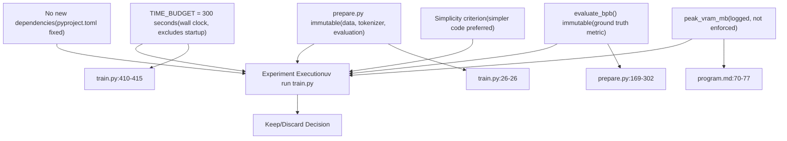
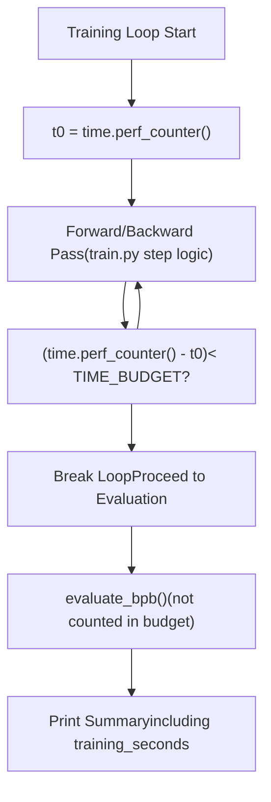
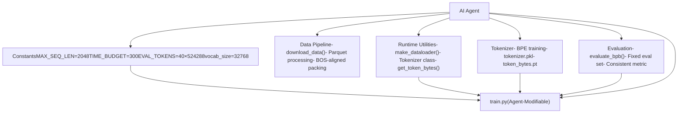
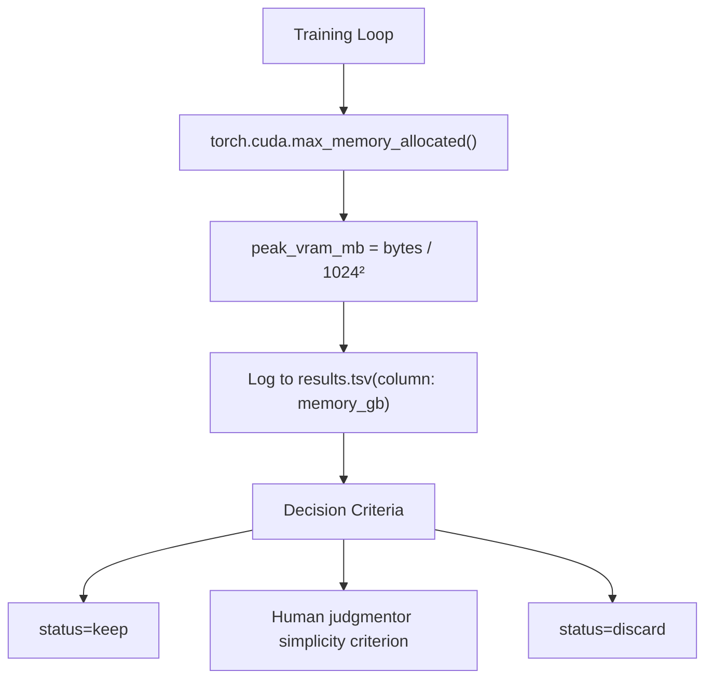

# System Constraints

Relevant source files

-   [program.md](https://github.com/karpathy/autoresearch/blob/e6d79c12/program.md?plain=1)
-   [train.py](https://github.com/karpathy/autoresearch/blob/e6d79c12/train.py)

This page documents the fixed constraints that all autoresearch experiments must operate under. These constraints ensure fair comparison across experiments and enable the autonomous research loop to function reliably. For information about the primary optimization metric, see [Validation Bits Per Byte (val\_bpb)](/karpathy/autoresearch/5.1-validation-bits-per-byte-(val_bpb)). For the rationale behind these constraints, see [Fair Comparison Philosophy](/karpathy/autoresearch/5.3-fair-comparison-philosophy).

## Overview of Constraint Hierarchy

The autoresearch system enforces two types of constraints: **hard constraints** that must never be violated, and **soft constraints** that provide guidance but allow flexibility when justified by results.

### Constraint Classification

**Sources**: [program.md23](https://github.com/karpathy/autoresearch/blob/e6d79c12/program.md?plain=1#L23-L23) [program.md28-32](https://github.com/karpathy/autoresearch/blob/e6d79c12/program.md?plain=1#L28-L32) [program.md35](https://github.com/karpathy/autoresearch/blob/e6d79c12/program.md?plain=1#L35-L35) [train.py26](https://github.com/karpathy/autoresearch/blob/e6d79c12/train.py#L26-L26) [train.py410-415](https://github.com/karpathy/autoresearch/blob/e6d79c12/train.py#L410-L415)

## Hard Constraints

### Fixed Time Budget: TIME\_BUDGET = 300 Seconds

The most fundamental constraint is the **fixed 5-minute (300-second) time budget** for all training runs. This is a wall clock measurement that excludes compilation and startup overhead.

#### Time Budget Specification

| Parameter | Value | Measurement Type | Exclusions |
| --- | --- | --- | --- |
| `TIME_BUDGET` | 300 seconds | Wall clock | Compilation, startup, final evaluation |
| Expected total runtime | ~325 seconds | Wall clock | Includes startup (~20s) + evaluation (~5s) |
| Timeout threshold | 600 seconds (10 min) | Wall clock | If exceeded, kill and treat as crash |

#### Implementation in Code

The time budget is enforced through wall clock measurement in the training loop within `train.py`:

The actual timing code structure in `train.py` follows this pattern:

-   Import `TIME_BUDGET` from `prepare.py` [train.py26](https://github.com/karpathy/autoresearch/blob/e6d79c12/train.py#L26-L26)
-   Initialize `t0 = time.perf_counter()` before the loop starts [train.py410](https://github.com/karpathy/autoresearch/blob/e6d79c12/train.py#L410-L410)
-   Check elapsed time `t_now - t0 < TIME_BUDGET` after each training step [train.py415](https://github.com/karpathy/autoresearch/blob/e6d79c12/train.py#L415-L415)
-   Break the training loop when budget is exhausted.
-   Log `training_seconds` in the final summary output [program.md48](https://github.com/karpathy/autoresearch/blob/e6d79c12/program.md?plain=1#L48-L48)

**Sources**: [prepare.py24-29](https://github.com/karpathy/autoresearch/blob/e6d79c12/prepare.py#L24-L29) [train.py26](https://github.com/karpathy/autoresearch/blob/e6d79c12/train.py#L26-L26) [train.py410-415](https://github.com/karpathy/autoresearch/blob/e6d79c12/train.py#L410-L415) [program.md23](https://github.com/karpathy/autoresearch/blob/e6d79c12/program.md?plain=1#L23-L23) [program.md48](https://github.com/karpathy/autoresearch/blob/e6d79c12/program.md?plain=1#L48-L48)

#### Rationale and Implications

The fixed time budget has several critical implications:

1.  **Platform-Specific Optimization**: With a fixed time budget, the agent optimizes for the best model *for your specific hardware* within that time window. An H100 will achieve different results than a 4090, but each will find its optimal architecture. [program.md58](https://github.com/karpathy/autoresearch/blob/e6d79c12/program.md?plain=1#L58-L58)
2.  **Throughput vs. Efficiency Trade-off**: Experiments naturally balance model size, batch size, and complexity. A larger model that processes fewer tokens may outperform a smaller model that processes more tokens, if it learns more efficiently. [program.md33](https://github.com/karpathy/autoresearch/blob/e6d79c12/program.md?plain=1#L33-L33)
3.  **Approximately 12 Experiments Per Hour**: With 5 minutes of training + ~25 seconds overhead, each experiment takes ~5.5 minutes. This yields **~12 experiments/hour** or **~100 experiments during an 8-hour overnight run**. [program.md114](https://github.com/karpathy/autoresearch/blob/e6d79c12/program.md?plain=1#L114-L114)
4.  **No Step-Based Comparison**: Unlike traditional training where models are compared at fixed step counts, autoresearch allows any architectural change as long as it completes within the time budget.

**Sources**: [program.md33](https://github.com/karpathy/autoresearch/blob/e6d79c12/program.md?plain=1#L33-L33) [program.md58](https://github.com/karpathy/autoresearch/blob/e6d79c12/program.md?plain=1#L58-L58) [program.md114](https://github.com/karpathy/autoresearch/blob/e6d79c12/program.md?plain=1#L114-L114)

### Immutable Infrastructure Files

The second hard constraint is that `prepare.py` and its provided utilities **cannot be modified** by the agent. This file is read-only and establishes the fixed experimental infrastructure. [program.md28-29](https://github.com/karpathy/autoresearch/blob/e6d79c12/program.md?plain=1#L28-L29)

#### What Cannot Be Modified

**Key immutable components**:

1.  **`MAX_SEQ_LEN = 2048`**: Maximum sequence length for training and evaluation. [prepare.py24](https://github.com/karpathy/autoresearch/blob/e6d79c12/prepare.py#L24-L24)
2.  **`TIME_BUDGET = 300`**: The 5-minute time constraint. [prepare.py25](https://github.com/karpathy/autoresearch/blob/e6d79c12/prepare.py#L25-L25)
3.  **`EVAL_TOKENS`**: Exactly 40 validation batches evaluated, ensuring consistent evaluation cost across all experiments. [prepare.py26](https://github.com/karpathy/autoresearch/blob/e6d79c12/prepare.py#L26-L26)
4.  **`evaluate_bpb()` function**: The ground truth evaluation function. [prepare.py273-302](https://github.com/karpathy/autoresearch/blob/e6d79c12/prepare.py#L273-L302)
5.  **Tokenizer training**: The BPE tokenizer is trained once during `prepare.py` execution and cached. [prepare.py100-167](https://github.com/karpathy/autoresearch/blob/e6d79c12/prepare.py#L100-L167)
6.  **Data preparation**: Data downloading, processing, and packing algorithms are fixed. [prepare.py46-98](https://github.com/karpathy/autoresearch/blob/e6d79c12/prepare.py#L46-L98)

**Sources**: [prepare.py24-26](https://github.com/karpathy/autoresearch/blob/e6d79c12/prepare.py#L24-L26) [prepare.py46-98](https://github.com/karpathy/autoresearch/blob/e6d79c12/prepare.py#L46-L98) [prepare.py100-167](https://github.com/karpathy/autoresearch/blob/e6d79c12/prepare.py#L100-L167) [prepare.py273-302](https://github.com/karpathy/autoresearch/blob/e6d79c12/prepare.py#L273-L302) [program.md28-29](https://github.com/karpathy/autoresearch/blob/e6d79c12/program.md?plain=1#L28-L29)

### No New Dependencies

The third hard constraint is that no packages can be added beyond what is specified in `pyproject.toml`. The agent can only use existing dependencies. [program.md30](https://github.com/karpathy/autoresearch/blob/e6d79c12/program.md?plain=1#L30-L30)

## Soft Constraints

### Memory Usage: peak\_vram\_mb

Unlike the hard time budget, **VRAM usage is a soft constraint**. The `peak_vram_mb` metric is logged to `results.tsv` but not enforced as a hard limit. [program.md35](https://github.com/karpathy/autoresearch/blob/e6d79c12/program.md?plain=1#L35-L35)

#### Memory Tracking and Logging

**Sources**: [program.md35](https://github.com/karpathy/autoresearch/blob/e6d79c12/program.md?plain=1#L35-L35) [program.md70-77](https://github.com/karpathy/autoresearch/blob/e6d79c12/program.md?plain=1#L70-L77)

#### Guidelines for Memory Increases

From `program.md`:

> **VRAM** is a soft constraint. Some increase is acceptable for meaningful val\_bpb gains, but it should not blow up dramatically. [program.md35](https://github.com/karpathy/autoresearch/blob/e6d79c12/program.md?plain=1#L35-L35)

Practical interpretation involves weighing memory increases against `val_bpb` improvements. Out-of-Memory (OOM) crashes are treated as failures. [program.md110](https://github.com/karpathy/autoresearch/blob/e6d79c12/program.md?plain=1#L110-L110)

### Simplicity Criterion

The second soft constraint is a preference for **simpler code** when performance is equal or similar.

From `program.md`:

> **Simplicity criterion**: All else being equal, simpler is better. A small improvement that adds ugly complexity is not worth it. Conversely, removing something and getting equal or better results is a great outcome — that's a simplification win. [program.md37](https://github.com/karpathy/autoresearch/blob/e6d79c12/program.md?plain=1#L37-L37)

This criterion encourages the agent to explore code deletions and simplifications, not just additions.

**Sources**: [program.md37](https://github.com/karpathy/autoresearch/blob/e6d79c12/program.md?plain=1#L37-L37)

## Constraint Enforcement Mechanisms

### Enforcement Summary Table

| Constraint | Enforcement Mechanism | Violation Consequence |
| --- | --- | --- |
| `TIME_BUDGET = 300s` | `time.perf_counter()` check in `train.py` [train.py415](https://github.com/karpathy/autoresearch/blob/e6d79c12/train.py#L415-L415) | Loop breaks automatically, experiment completes normally |
| `prepare.py` immutable | Agent instructions in `program.md` [program.md28-29](https://github.com/karpathy/autoresearch/blob/e6d79c12/program.md?plain=1#L28-L29) | Agent should refuse; if violated, system may break |
| No new dependencies | `uv` only installs from fixed `pyproject.toml` [program.md30](https://github.com/karpathy/autoresearch/blob/e6d79c12/program.md?plain=1#L30-L30) | Import errors, experiment crashes |
| `evaluate_bpb()` immutable | Function lives in `prepare.py` (immutable) | Cannot be modified without violating infrastructure constraint |
| `peak_vram_mb` soft limit | Logged but not enforced [program.md35](https://github.com/karpathy/autoresearch/blob/e6d79c12/program.md?plain=1#L35-L35) | Experiment completes; decision made during keep/discard |
| Simplicity criterion | Agent judgment during keep/discard [program.md37](https://github.com/karpathy/autoresearch/blob/e6d79c12/program.md?plain=1#L37-L37) | Not automatically enforced; relies on agent reasoning |
| Timeout (10 min) | Manual kill by agent or timeout wrapper [program.md108](https://github.com/karpathy/autoresearch/blob/e6d79c12/program.md?plain=1#L108-L108) | Logged as crash, commit discarded |

**Sources**: [program.md23-37](https://github.com/karpathy/autoresearch/blob/e6d79c12/program.md?plain=1#L23-L37) [program.md108](https://github.com/karpathy/autoresearch/blob/e6d79c12/program.md?plain=1#L108-L108) [train.py415](https://github.com/karpathy/autoresearch/blob/e6d79c12/train.py#L415-L415)

## Timeout Handling

While the training loop is designed to complete in 5 minutes, the agent must handle pathological cases where execution hangs or takes excessively long.

### Timeout Policy

From `program.md`:

> **Timeout**: Each experiment should take ~5 minutes total (+ a few seconds for startup and eval overhead). If a run exceeds 10 minutes, kill it and treat it as a failure (discard and revert). [program.md108](https://github.com/karpathy/autoresearch/blob/e6d79c12/program.md?plain=1#L108-L108)

#### Expected Runtime Breakdown

For a typical successful experiment:

| Phase | Duration | Counted in TIME\_BUDGET? |
| --- | --- | --- |
| Environment startup | ~5-10s | ❌ No |
| **Training loop** | **~300s** | ✅ **Yes** [train.py415](https://github.com/karpathy/autoresearch/blob/e6d79c12/train.py#L415-L415) |
| Final evaluation | ~5s | ❌ No |
| **Total** | **~325-335s** | \- |

**Sources**: [program.md48-49](https://github.com/karpathy/autoresearch/blob/e6d79c12/program.md?plain=1#L48-L49) [program.md108](https://github.com/karpathy/autoresearch/blob/e6d79c12/program.md?plain=1#L108-L108) [train.py415](https://github.com/karpathy/autoresearch/blob/e6d79c12/train.py#L415-L415)

---

The constraints documented on this page establish the **fair playing field** for all experiments. By fixing the time budget, infrastructure, and evaluation mechanism, autoresearch ensures that `val_bpb` improvements reflect genuine model advancements. For details on how these constraints enable fair comparison, see [Fair Comparison Philosophy](/karpathy/autoresearch/5.3-fair-comparison-philosophy).
