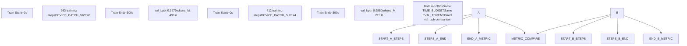

# Fair Comparison Philosophy

Relevant source files

-   [README.md](https://github.com/karpathy/autoresearch/blob/e6d79c12/README.md?plain=1)
-   [program.md](https://github.com/karpathy/autoresearch/blob/e6d79c12/program.md?plain=1)

This page explains why autoresearch experiments are directly comparable despite radical changes to model architecture, batch size, optimizer, and hyperparameters. The fair comparison philosophy is central to autonomous operation: the agent can safely modify any aspect of `train.py` while maintaining a meaningful common metric across all experiments.

---

## Core Fair Comparison Mechanisms

Autoresearch ensures fair comparison through three immutable design decisions that separate experiment variables from evaluation infrastructure.

### Fixed Time Budget Enforcement

All experiments run for exactly **300 seconds of training time** (wall clock), excluding startup and compilation overhead. This constraint is enforced by the training loop in `train.py`, which checks elapsed time against `TIME_BUDGET` imported from `prepare.py`.

**Training Time Flow**

**Time Budget in Training Loop**

The training loop measures elapsed time and terminates when `TIME_BUDGET` is reached:

[train.py385-506](https://github.com/karpathy/autoresearch/blob/e6d79c12/train.py#L385-L506)

Key implementation details:

-   `TIME_BUDGET` is imported from `prepare.py` [train.py4](https://github.com/karpathy/autoresearch/blob/e6d79c12/train.py#L4-L4) and cannot be changed by the agent [program.md29-30](https://github.com/karpathy/autoresearch/blob/e6d79c12/program.md?plain=1#L29-L30)
-   Time measurement excludes model compilation and initial evaluation [train.py408-410](https://github.com/karpathy/autoresearch/blob/e6d79c12/train.py#L408-L410)
-   Step count varies based on model size, batch size, and GPU speed [README.md64](https://github.com/karpathy/autoresearch/blob/e6d79c12/README.md?plain=1#L64-L64)
-   The agent cannot extend training time to compensate for slower models [program.md23](https://github.com/karpathy/autoresearch/blob/e6d79c12/program.md?plain=1#L23-L23)

**Sources**: [README.md17](https://github.com/karpathy/autoresearch/blob/e6d79c12/README.md?plain=1#L17-L17) [README.md64-65](https://github.com/karpathy/autoresearch/blob/e6d79c12/README.md?plain=1#L64-L65) [program.md23](https://github.com/karpathy/autoresearch/blob/e6d79c12/program.md?plain=1#L23-L23) [train.py4](https://github.com/karpathy/autoresearch/blob/e6d79c12/train.py#L4-L4) [train.py408-410](https://github.com/karpathy/autoresearch/blob/e6d79c12/train.py#L408-L410)

---

### Immutable Evaluation Harness

The `evaluate_bpb` function in `prepare.py` is the ground truth metric that cannot be modified. This ensures all experiments are measured identically regardless of architectural changes.

**Evaluation Logic Separation**

```mermaid
flowchart TD
    EVAL_TOKENS["EVAL_TOKENS40 × 524288 = 20,971,520"]
    TOKEN_BYTES["token_bytes tensorByte count per token"]
    EVAL_FUNC["evaluate_bpb(model)Ground truth function"]
    MODEL_A["GPT Model Avocab_size=8192DEPTH=8"]
    MODEL_B["GPT Model Bvocab_size=4096DEPTH=12"]
    MODEL_C["GPT Model CCustom architecture"]
    METRIC_A["val_bpb: 0.9979"]
    METRIC_B["val_bpb: 0.9850"]
    METRIC_C["val_bpb: 0.9912"]

    EVAL --> TOKENS_EVAL_FUNC
    TOKEN --> BYTES_EVAL_FUNC
    MODEL --> A_EVAL_FUNC
    MODEL --> B_EVAL_FUNC
    MODEL --> C_EVAL_FUNC
    EVAL --> FUNC_METRIC_A
    EVAL --> FUNC_METRIC_B
    EVAL --> FUNC_METRIC_C
```

**Evaluation Function Characteristics**

| Property | Value | Rationale |
| --- | --- | --- |
| Function Name | `evaluate_bpb` | Defined in `prepare.py` [program.md31](https://github.com/karpathy/autoresearch/blob/e6d79c12/program.md?plain=1#L31-L31) |
| Evaluation Tokens | `EVAL_TOKENS` | Fixed sample size for consistent variance [README.md76](https://github.com/karpathy/autoresearch/blob/e6d79c12/README.md?plain=1#L76-L76) |
| Metric Output | Bits per byte (float) | Vocab-size independent [README.md17](https://github.com/karpathy/autoresearch/blob/e6d79c12/README.md?plain=1#L17-L17) |
| Modification Policy | **Immutable** | Agent cannot alter evaluation logic [program.md29-31](https://github.com/karpathy/autoresearch/blob/e6d79c12/program.md?plain=1#L29-L31) |
| Location | `prepare.py` | Outside agent's modification scope [README.md13](https://github.com/karpathy/autoresearch/blob/e6d79c12/README.md?plain=1#L13-L13) |

**Sources**: [README.md13](https://github.com/karpathy/autoresearch/blob/e6d79c12/README.md?plain=1#L13-L13) [README.md17](https://github.com/karpathy/autoresearch/blob/e6d79c12/README.md?plain=1#L17-L17) [README.md76](https://github.com/karpathy/autoresearch/blob/e6d79c12/README.md?plain=1#L76-L76) [program.md29-31](https://github.com/karpathy/autoresearch/blob/e6d79c12/program.md?plain=1#L29-L31)

---

### Vocab-Size Independent Metric

The `val_bpb` metric measures bits per byte rather than perplexity or cross-entropy per token, making it independent of vocabulary size changes.

**Why Bits Per Byte?**

Traditional metrics like perplexity depend on vocabulary size:

-   **Perplexity**: `exp(cross_entropy_per_token)` — changes when vocab size changes.
-   **Cross-entropy per token**: Higher vocab size = more classes = typically higher entropy.
-   **Bits per byte**: Measures information content of the actual data bytes, invariant to tokenization [README.md17](https://github.com/karpathy/autoresearch/blob/e6d79c12/README.md?plain=1#L17-L17)

**Metric Calculation Flow**

```mermaid
flowchart TD
    VOCAB_A["vocab_size=8192BPE tokenizer"]
    VOCAB_B["vocab_size=4096Smaller vocab"]
    VOCAB_C["vocab_size=256Byte-level"]
    PRED_A["Token probabilities8192 classes"]
    PRED_B["Token probabilities4096 classes"]
    PRED_C["Token probabilities256 classes"]
    TOKEN_BYTES_LOOKUP["token_bytes tensorMaps token → byte count"]
    BPB_CALC["Bits per byte calculationVocab-size independent"]
    RESULT["val_bpbDirectly comparable"]

    VOCAB --> A_PRED_A
    VOCAB --> B_PRED_B
    VOCAB --> C_PRED_C
    PRED --> A_TOKEN_BYTES_LOOKUP
    PRED --> B_TOKEN_BYTES_LOOKUP
    PRED --> C_TOKEN_BYTES_LOOKUP
    TOKEN --> BYTES_LOOKUP_BPB_CALC
    BPB --> CALC_RESULT
```

**Calculation Overview**

The `evaluate_bpb` function:

1.  Runs the model on `EVAL_TOKENS` from the validation set.
2.  Computes log probabilities for each predicted token.
3.  Looks up byte count for each token using `token_bytes` tensor.
4.  Computes bits per byte: `total_bits / total_bytes`.

This means an experiment that changes `vocab_size` in the tokenizer (if it were possible, though `prepare.py` is fixed) or changes how the model processes those tokens produces a `val_bpb` directly comparable to the baseline [README.md17](https://github.com/karpathy/autoresearch/blob/e6d79c12/README.md?plain=1#L17-L17)

**Sources**: [README.md17](https://github.com/karpathy/autoresearch/blob/e6d79c12/README.md?plain=1#L17-L17) [prepare.py](https://github.com/karpathy/autoresearch/blob/e6d79c12/prepare.py)

---

## Mutable vs Immutable Components

The fair comparison philosophy relies on a strict boundary between what the agent can modify and what remains fixed.

### Component Modification Matrix

| Component | File | Agent Can Modify? | Rationale |
| --- | --- | --- | --- |
| `GPT` model architecture | `train.py` | ✅ Yes | Experimental variable [program.md26](https://github.com/karpathy/autoresearch/blob/e6d79c12/program.md?plain=1#L26-L26) |
| `MuonAdamW` optimizer | `train.py` | ✅ Yes | Experimental variable [program.md26](https://github.com/karpathy/autoresearch/blob/e6d79c12/program.md?plain=1#L26-L26) |
| Training loop | `train.py` | ✅ Yes | Experimental variable (within constraints) [program.md26](https://github.com/karpathy/autoresearch/blob/e6d79c12/program.md?plain=1#L26-L26) |
| Hyperparameters | `train.py` | ✅ Yes | Experimental variable [program.md26](https://github.com/karpathy/autoresearch/blob/e6d79c12/program.md?plain=1#L26-L26) |
| `DEVICE_BATCH_SIZE` | `train.py` | ✅ Yes | Tunable for memory/throughput [README.md75](https://github.com/karpathy/autoresearch/blob/e6d79c12/README.md?plain=1#L75-L75) |
| `TOTAL_BATCH_SIZE` | `train.py` | ✅ Yes | Tunable for optimization [README.md79](https://github.com/karpathy/autoresearch/blob/e6d79c12/README.md?plain=1#L79-L79) |
| `TIME_BUDGET` | `prepare.py` | ❌ No | Fair comparison constraint [program.md29](https://github.com/karpathy/autoresearch/blob/e6d79c12/program.md?plain=1#L29-L29) |
| `MAX_SEQ_LEN` | `prepare.py` | ❌ No | Data preparation parameter [program.md29](https://github.com/karpathy/autoresearch/blob/e6d79c12/program.md?plain=1#L29-L29) |
| `EVAL_TOKENS` | `prepare.py` | ❌ No | Evaluation consistency [program.md29](https://github.com/karpathy/autoresearch/blob/e6d79c12/program.md?plain=1#L29-L29) |
| `evaluate_bpb` function | `prepare.py` | ❌ No | Ground truth metric [program.md31](https://github.com/karpathy/autoresearch/blob/e6d79c12/program.md?plain=1#L31-L31) |
| Tokenizer | `prepare.py` | ❌ No | Fixed during data prep [program.md29](https://github.com/karpathy/autoresearch/blob/e6d79c12/program.md?plain=1#L29-L29) |
| Dataloader logic | `prepare.py` | ❌ No | Consistent data sampling [program.md29](https://github.com/karpathy/autoresearch/blob/e6d79c12/program.md?plain=1#L29-L29) |

**Code Entity Mapping**

```mermaid
flowchart TD
    TIME_BUDGET_CONST["TIME_BUDGET = 300"]
    MAX_SEQ_CONST["MAX_SEQ_LEN = 2048"]
    EVAL_TOKENS_CONST["EVAL_TOKENS = 40 × 524288"]
    EVALUATE_FUNC["def evaluate_bpb(model)"]
    DATALOADER_FUNC["def make_dataloader()"]
    TOKEN_BYTES_CONST["token_bytes"]
    GPT_CLASS["class GPT(nn.Module)"]
    MUON_CLASS["class MuonAdamW"]
    DEPTH_VAR["DEPTH = 8"]
    BATCH_VAR["DEVICE_BATCH_SIZE = 8"]
    TRAIN_LOOP["Training loopwhile elapsed < TIME_BUDGET"]

    TIME --> BUDGET_CONST_TRAIN_LOOP
    EVALUATE --> FUNC_TRAIN_LOOP
    DATALOADER --> FUNC_TRAIN_LOOP
    DEPTH --> VAR_GPT_CLASS
    BATCH --> VAR_TRAIN_LOOP
    GPT --> CLASS_TRAIN_LOOP
    MUON --> CLASS_TRAIN_LOOP
```

**Enforcement Mechanism**

The boundary is enforced through the agent's instructions in `program.md`:

[program.md28-31](https://github.com/karpathy/autoresearch/blob/e6d79c12/program.md?plain=1#L28-L31)

The agent is explicitly forbidden from modifying `prepare.py`. This is a policy constraint—the agent could technically edit the file, but doing so violates the research protocol and invalidates all results.

**Sources**: [README.md13-15](https://github.com/karpathy/autoresearch/blob/e6d79c12/README.md?plain=1#L13-L15) [README.md75](https://github.com/karpathy/autoresearch/blob/e6d79c12/README.md?plain=1#L75-L75) [README.md79](https://github.com/karpathy/autoresearch/blob/e6d79c12/README.md?plain=1#L79-L79) [program.md13-14](https://github.com/karpathy/autoresearch/blob/e6d79c12/program.md?plain=1#L13-L14) [program.md26-31](https://github.com/karpathy/autoresearch/blob/e6d79c12/program.md?plain=1#L26-L31)

---

## Platform-Specific Optimization

The fixed time budget means autoresearch optimizes for the specific hardware it runs on, rather than seeking universally optimal architectures.

### Platform Optimization Philosophy

```mermaid
flowchart TD
    H100_BUDGET["TIME_BUDGET = 300s"]
    H100_OPT["Agent optimizes for H100Large models viableHigh throughput"]
    H100_RESULT["Best: DEPTH=12, wide modelval_bpb: 0.9750"]
    M1_BUDGET["TIME_BUDGET = 300s"]
    M1_OPT["Agent optimizes for M1Small models preferredLower throughput"]
    M1_RESULT["Best: DEPTH=4, narrow modelval_bpb: 1.0200"]
    NO_COMPARE["Results NOT comparableacross platforms"]
    YES_COMPARE["Results ARE comparablewithin platform"]

    H100 --> BUDGET_H100_OPT
    H100 --> OPT_H100_RESULT
    M1 --> BUDGET_M1_OPT
    M1 --> OPT_M1_RESULT
    H100 --> RESULT_NO_COMPARE
    M1 --> RESULT_NO_COMPARE
    H100 --> RESULT_YES_COMPARE
    M1 --> RESULT_YES_COMPARE
```

**Trade-off: Fairness vs Universality**

| Aspect | Fixed Time Budget | Fixed Step Budget |
| --- | --- | --- |
| **Cross-experiment fairness** | ✅ Perfect (same time) | ❌ Unfair (larger models penalized) |
| **Cross-platform comparison** | ❌ Invalid (different hardware) | ✅ Valid (same computation) |
| **Agent optimization target** | Platform-specific efficiency | Universal architecture |

The fixed time budget design prioritizes **within-platform fairness** over **across-platform comparability** [README.md64](https://github.com/karpathy/autoresearch/blob/e6d79c12/README.md?plain=1#L64-L64)

**Platform Adaptation Parameters**

For running on smaller platforms, these parameters should be tuned (manually by the human in `prepare.py` or by the agent in `train.py`):

| Parameter | H100 Default | Small Platform Example | Rationale |
| --- | --- | --- | --- |
| `MAX_SEQ_LEN` | 2048 | 256-512 | Reduce memory footprint \[README.md:75\] |
| `vocab_size` | 8192 | 256-1024 | Smaller tokenizer for simple data \[README.md:74\] |
| `EVAL_TOKENS` | 20,971,520 | Lower | Faster validation \[README.md:76\] |
| `DEPTH` | 8 | 4 | Primary complexity knob \[README.md:77\] |
| `WINDOW_PATTERN` | "SSSL" | "L" | Avoid inefficient patterns \[README.md:78\] |

**Sources**: [README.md64-65](https://github.com/karpathy/autoresearch/blob/e6d79c12/README.md?plain=1#L64-L65) [README.md71-80](https://github.com/karpathy/autoresearch/blob/e6d79c12/README.md?plain=1#L71-L80)

---

## Comparison Validity Guarantees

### Valid Comparisons

Experiments are **directly comparable** when:

1.  ✅ Run on the same platform (same GPU, same machine).
2.  ✅ Use the same `prepare.py` (same `TIME_BUDGET`, `EVAL_TOKENS`, `evaluate_bpb`).
3.  ✅ Use the same data cache (`~/.cache/autoresearch/` unchanged).
4.  ✅ Run on the same branch (e.g., `autoresearch/mar5`).

Under these conditions, `val_bpb` is a valid metric for ranking experiments regardless of model size, batch size, or architecture [README.md64](https://github.com/karpathy/autoresearch/blob/e6d79c12/README.md?plain=1#L64-L64)

### Invalid Comparisons

Experiments are **NOT comparable** when:

1.  ❌ Run on different hardware (H100 vs A100 vs MacBook).
2.  ❌ Different `TIME_BUDGET` values (300s vs 600s).
3.  ❌ Different `EVAL_TOKENS` (different validation set sizes).
4.  ❌ Modified `evaluate_bpb` function.
5.  ❌ Different datasets or tokenizers.

**Sources**: [README.md64-65](https://github.com/karpathy/autoresearch/blob/e6d79c12/README.md?plain=1#L64-L65) [program.md23](https://github.com/karpathy/autoresearch/blob/e6d79c12/program.md?plain=1#L23-L23) [program.md29-31](https://github.com/karpathy/autoresearch/blob/e6d79c12/program.md?plain=1#L29-L31)

---

## Simplicity Criterion Integration

The fair comparison philosophy extends beyond numerical metrics to include code simplicity as a tie-breaking criterion.

[program.md37](https://github.com/karpathy/autoresearch/blob/e6d79c12/program.md?plain=1#L37-L37)

**Decision Matrix**

| Scenario | val\_bpb Change | Complexity Change | Decision |
| --- | --- | --- | --- |
| A | \-0.005 (better) | +20 lines hacky code | Probably discard |
| B | \-0.005 (better) | \-10 lines (simpler) | **Keep** (double win) |
| C | \-0.001 (better) | \-15 lines (simpler) | **Keep** (simplification) |
| D | ~0 (neutral) | \-20 lines (much simpler) | **Keep** (simplification win) |
| E | \-0.010 (better) | +5 lines clean code | Keep (good improvement) |

The fair comparison philosophy enables this simplicity criterion because the metric (`val_bpb`) is objective and consistent, and the time budget is fixed, so complexity doesn't affect experiment cost [program.md37](https://github.com/karpathy/autoresearch/blob/e6d79c12/program.md?plain=1#L37-L37)

**Sources**: [program.md37](https://github.com/karpathy/autoresearch/blob/e6d79c12/program.md?plain=1#L37-L37)
