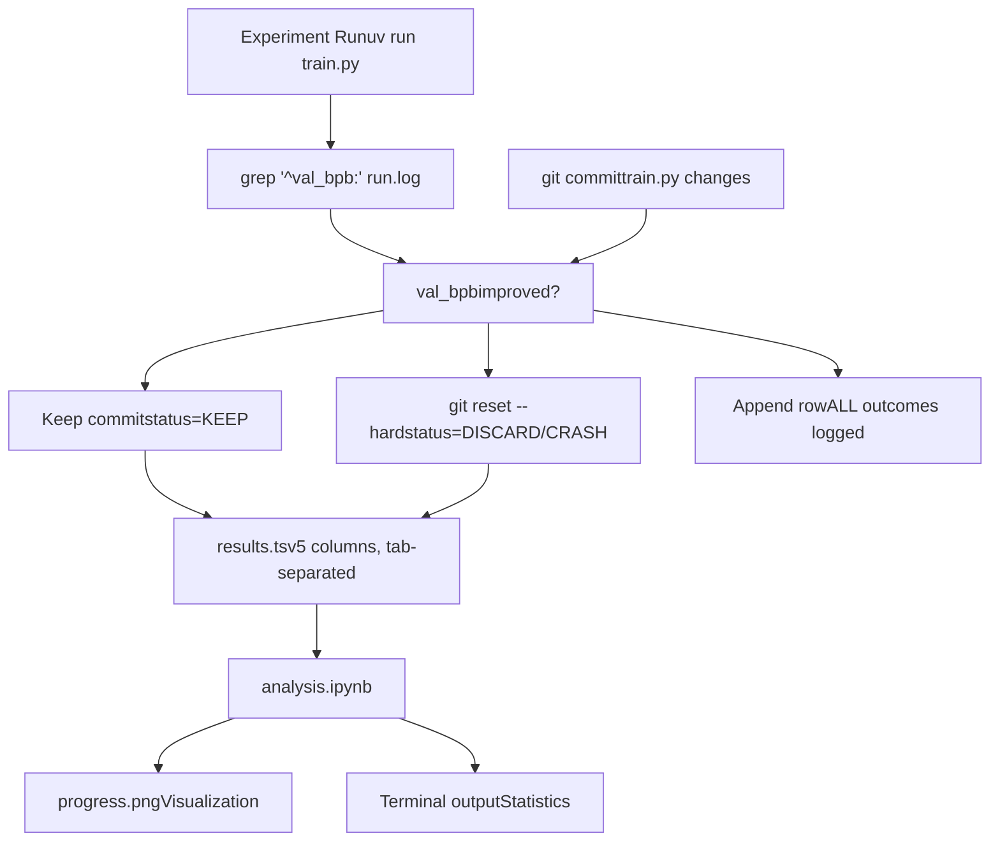
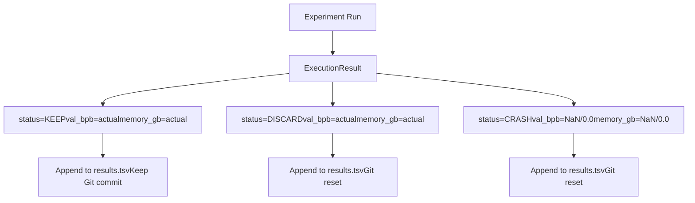

# Results and Analysis

Relevant source files

-   [analysis.ipynb](https://github.com/karpathy/autoresearch/blob/e6d79c12/analysis.ipynb)
-   [progress.png](https://github.com/karpathy/autoresearch/blob/e6d79c12/progress.png)

This page documents the results tracking and analysis infrastructure in autoresearch. The system maintains two parallel logs of experimental outcomes: `results.tsv` (a complete chronological record of all attempts) and the Git commit history (tracking only successful improvements). Post-experiment analysis is performed using `analysis.ipynb`, which generates visualizations and statistics.

For information about the evaluation metrics that populate these results, see [Metrics and Evaluation](/karpathy/autoresearch/5-metrics-and-evaluation). For details on the autonomous research loop that generates these results, see [Agent Operation](/karpathy/autoresearch/4-agent-operation).

## Overview: Dual Logging Architecture

The autoresearch system maintains comprehensive experiment tracking through two complementary mechanisms:

**Dual Logging Philosophy**: Git commits represent the "optimization frontier" (only improvements), while `results.tsv` records the complete experimental history including failures and discarded attempts. This separation enables both efficient branch management (Git stays clean) and comprehensive post-hoc analysis (TSV contains full context).

**Sources**: [analysis.ipynb24-33](https://github.com/karpathy/autoresearch/blob/e6d79c12/analysis.ipynb#L24-L33) [analysis.ipynb61-69](https://github.com/karpathy/autoresearch/blob/e6d79c12/analysis.ipynb#L61-L69)

---

## results.tsv Structure

The `results.tsv` file is a tab-separated values file containing exactly five columns with a header row. This file is **not committed to Git** but remains in the working directory for continuous append operations.

### Column Specification

| Column Index | Name | Type | Description | Example Values |
| --- | --- | --- | --- | --- |
| 1 | `commit` | string | Git commit hash (short, 7 chars) | `a1b2c3d` |
| 2 | `val_bpb` | float | Validation bits per byte | `0.997900`, `0.000000` (crash) |
| 3 | `memory_gb` | float | Peak VRAM in GB (1 decimal) | `44.0`, `0.0` (crash) |
| 4 | `status` | enum | Outcome category | `KEEP`, `DISCARD`, `CRASH` |
| 5 | `description` | string | Brief experiment description | `baseline`, `increase LR to 0.04` |

### Status Value Semantics

**Sources**: [analysis.ipynb24-32](https://github.com/karpathy/autoresearch/blob/e6d79c12/analysis.ipynb#L24-L32) [analysis.ipynb42-52](https://github.com/karpathy/autoresearch/blob/e6d79c12/analysis.ipynb#L42-L52)

### Data Loading and Preprocessing

The `analysis.ipynb` notebook loads the TSV using `pandas.read_csv` with `sep="\t"` [analysis.ipynb25](https://github.com/karpathy/autoresearch/blob/e6d79c12/analysis.ipynb#L25-L25) It performs the following sanitization steps:

1.  **Numeric Conversion**: Coerces `val_bpb` and `memory_gb` to numeric types, handling errors as `NaN` [analysis.ipynb26-27](https://github.com/karpathy/autoresearch/blob/e6d79c12/analysis.ipynb#L26-L27)
2.  **Status Normalization**: Strips whitespace and converts to uppercase (e.g., `KEEP`, `DISCARD`, `CRASH`) [analysis.ipynb28](https://github.com/karpathy/autoresearch/blob/e6d79c12/analysis.ipynb#L28-L28)

For more details on the file format, see [results.tsv Structure](/karpathy/autoresearch/6.1-results.tsv-structure).

---

## Analysis Notebook

The `analysis.ipynb` Jupyter notebook provides post-experiment visualization and statistical analysis of the complete experiment log.

### Primary Visualizations

The notebook generates a comprehensive visualization saved as `progress.png` [analysis.ipynb141](https://github.com/karpathy/autoresearch/blob/e6d79c12/analysis.ipynb#L141-L141)

**Visualization Components**:

-   **Discarded Layer**: Faint gray dots (`#cccccc`) representing unsuccessful attempts [analysis.ipynb98-101](https://github.com/karpathy/autoresearch/blob/e6d79c12/analysis.ipynb#L98-L101)
-   **Kept Layer**: Prominent green dots (`#2ecc71`) representing improvements that were merged [analysis.ipynb103-106](https://github.com/karpathy/autoresearch/blob/e6d79c12/analysis.ipynb#L103-L106)
-   **Frontier Line**: A green step line (`#27ae60`) showing the `cummin()` (cumulative minimum) of `val_bpb` over time [analysis.ipynb108-114](https://github.com/karpathy/autoresearch/blob/e6d79c12/analysis.ipynb#L108-L114)
-   **Annotations**: Each kept experiment is labeled with its description, rotated 30 degrees for readability [analysis.ipynb116-127](https://github.com/karpathy/autoresearch/blob/e6d79c12/analysis.ipynb#L116-L127)

For a guide on interpreting these plots, see [Analysis Notebook](/karpathy/autoresearch/6.2-analysis-notebook).

### Statistical Outputs

The notebook computes several key performance indicators:

-   **Keep Rate**: Calculated as `n_keep / (n_keep + n_discard)` [analysis.ipynb46-51](https://github.com/karpathy/autoresearch/blob/e6d79c12/analysis.ipynb#L46-L51)
-   **Total Improvement**: Measures the delta between the first row (baseline) and the best `val_bpb` achieved [analysis.ipynb163-169](https://github.com/karpathy/autoresearch/blob/e6d79c12/analysis.ipynb#L163-L169)
-   **Top Hits**: Ranks experiments by the improvement delta relative to the previous `KEEP` state [analysis.ipynb196-200](https://github.com/karpathy/autoresearch/blob/e6d79c12/analysis.ipynb#L196-L200)

For more on these statistics, see [Interpreting Results](/karpathy/autoresearch/6.3-interpreting-results).

---

## Interpreting Results

### Research Signals

-   **Keep Rate**: A high keep rate suggests the agent is in a "low-hanging fruit" phase. A very low keep rate may indicate the search space is exhausted or the agent's ideas are too radical for the current architecture [analysis.ipynb51](https://github.com/karpathy/autoresearch/blob/e6d79c12/analysis.ipynb#L51-L51)
-   **Frontier Slope**: Steep drops in the `running_min` step line indicate architectural breakthroughs, while gradual declines suggest hyperparameter tuning [analysis.ipynb112-114](https://github.com/karpathy/autoresearch/blob/e6d79c12/analysis.ipynb#L112-L114)
-   **Delta Ranking**: By shifting the `val_bpb` column and calculating `prev_bpb - val_bpb`, the notebook identifies which specific ideas provided the most significant performance gains [analysis.ipynb199-200](https://github.com/karpathy/autoresearch/blob/e6d79c12/analysis.ipynb#L199-L200)

For detailed interpretation strategies, see [Interpreting Results](/karpathy/autoresearch/6.3-interpreting-results).

---

## Git History vs. Complete Log

The system maintains a clean separation between version control and experimental history:

1.  **Git Commit History**: Acts as the "winning" branch. Every commit in the history is a functional improvement over its parent. This is the source of truth for the current best `train.py`.
2.  **results.tsv**: Acts as the "lab notebook." It records the short commit hash [analysis.ipynb25](https://github.com/karpathy/autoresearch/blob/e6d79c12/analysis.ipynb#L25-L25) the metric achieved, and the description for **every** attempt.

This allows a researcher to use `git log` to see the evolution of the code, while using `analysis.ipynb` to see the total effort (including the many failed attempts) required to reach that state.

For more details on this relationship, see [Git History vs. Complete Log](/karpathy/autoresearch/6.4-git-history-vs.-complete-log).

**Sources**: [analysis.ipynb24-32](https://github.com/karpathy/autoresearch/blob/e6d79c12/analysis.ipynb#L24-L32) [analysis.ipynb61-67](https://github.com/karpathy/autoresearch/blob/e6d79c12/analysis.ipynb#L61-L67) [analysis.ipynb175-178](https://github.com/karpathy/autoresearch/blob/e6d79c12/analysis.ipynb#L175-L178)
