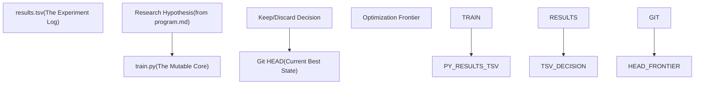

# results.tsv Structure

Relevant source files

-   [analysis.ipynb](https://github.com/karpathy/autoresearch/blob/e6d79c12/analysis.ipynb)
-   [program.md](https://github.com/karpathy/autoresearch/blob/e6d79c12/program.md?plain=1)

## Purpose and Scope

The `results.tsv` file is the complete append-only log of all experiments conducted during an autonomous research session. It records every experiment attempt—successful, failed, or crashed—with its validation metric, memory usage, and outcome decision. This file serves as the source of truth for post-experiment analysis and provides a full historical record independent of git branch state.

For information about analyzing this data, see **6.2 Analysis Notebook**. For understanding the metrics logged, see **5.1 Validation Bits Per Byte (val\_bpb)**. For the relationship between this log and git commits, see **6.4 Git History vs. Complete Log**.

**Sources:** [program.md64-103](https://github.com/karpathy/autoresearch/blob/e6d79c12/program.md?plain=1#L64-L103) [analysis.ipynb1-26](https://github.com/karpathy/autoresearch/blob/e6d79c12/analysis.ipynb#L1-L26)

---

## File Format Specification

`results.tsv` is a **tab-separated values** file with exactly 5 columns and a header row. The file uses tab characters (`\t`) as delimiters, not commas, because experiment descriptions often contain natural language commas which would break standard CSV parsing [program.md66-68](https://github.com/karpathy/autoresearch/blob/e6d79c12/program.md?plain=1#L66-L68)

**Key Properties:**

-   **Format:** Tab-separated values (TSV) [program.md66](https://github.com/karpathy/autoresearch/blob/e6d79c12/program.md?plain=1#L66-L66)
-   **Header row:** Required: `commit val_bpb memory_gb status description` [program.md71-72](https://github.com/karpathy/autoresearch/blob/e6d79c12/program.md?plain=1#L71-L72)
-   **Delimiter:** Tab character (`\t`) [program.md66](https://github.com/karpathy/autoresearch/blob/e6d79c12/program.md?plain=1#L66-L66)
-   **Encoding:** UTF-8
-   **Git status:** Untracked (intentionally excluded from commits) [program.md102](https://github.com/karpathy/autoresearch/blob/e6d79c12/program.md?plain=1#L102-L102)
-   **Append-only:** New experiments are appended as new rows during the loop [program.md94-102](https://github.com/karpathy/autoresearch/blob/e6d79c12/program.md?plain=1#L94-L102)
-   **Initialization:** Created with the header row during the initial setup phase [program.md16](https://github.com/karpathy/autoresearch/blob/e6d79c12/program.md?plain=1#L16-L16)

**Sources:** [program.md16-102](https://github.com/karpathy/autoresearch/blob/e6d79c12/program.md?plain=1#L16-L102)

---

## Column Definitions

The TSV contains exactly 5 columns in this order:

| Column | Type | Format | Description |
| --- | --- | --- | --- |
| `commit` | String | 7 characters | Short git commit hash identifying the experiment code state |
| `val_bpb` | Float | 6 decimal places | Validation bits-per-byte metric (e.g., `0.997900`) |
| `memory_gb` | Float | 1 decimal place | Peak VRAM usage in gigabytes (e.g., `44.0`) |
| `status` | Enum | Text | Outcome: `keep`, `discard`, or `crash` |
| `description` | String | Freeform | Human-readable description of the experimental change |

### Column 1: commit

The 7-character short git commit hash. This hash links the logged result to the exact code state in git history [program.md74](https://github.com/karpathy/autoresearch/blob/e6d79c12/program.md?plain=1#L74-L74) Even if a commit is later discarded (reverted) in the git branch, its hash remains in `results.tsv` for traceability.

### Column 2: val\_bpb

The primary optimization metric: validation bits-per-byte. Lower values indicate better compression and model quality [program.md33](https://github.com/karpathy/autoresearch/blob/e6d79c12/program.md?plain=1#L33-L33)

-   **Format:** 6 decimal places (e.g., `0.997900`) [program.md75](https://github.com/karpathy/autoresearch/blob/e6d79c12/program.md?plain=1#L75-L75)
-   **Extraction:** Parsed from `run.log` via `grep "^val_bpb:"` [program.md61](https://github.com/karpathy/autoresearch/blob/e6d79c12/program.md?plain=1#L61-L61)
-   **Crashes:** Logged as `0.000000` to indicate an invalid run [program.md75](https://github.com/karpathy/autoresearch/blob/e6d79c12/program.md?plain=1#L75-L75)

### Column 3: memory\_gb

Peak VRAM usage during training, measured in gigabytes.

-   **Format:** 1 decimal place (e.g., `44.0`) [program.md76](https://github.com/karpathy/autoresearch/blob/e6d79c12/program.md?plain=1#L76-L76)
-   **Calculation:** `peak_vram_mb / 1024` [program.md76](https://github.com/karpathy/autoresearch/blob/e6d79c12/program.md?plain=1#L76-L76)
-   **Crashes:** Logged as `0.0` [program.md76](https://github.com/karpathy/autoresearch/blob/e6d79c12/program.md?plain=1#L76-L76)

### Column 4: status

The decision outcome for the experiment [program.md77](https://github.com/karpathy/autoresearch/blob/e6d79c12/program.md?plain=1#L77-L77)

-   `keep`: The experiment improved `val_bpb` (or was a simplification win); the commit is retained on the branch [program.md103](https://github.com/karpathy/autoresearch/blob/e6d79c12/program.md?plain=1#L103-L103)
-   `discard`: The experiment failed to improve the metric; the branch is reset to the previous state [program.md104](https://github.com/karpathy/autoresearch/blob/e6d79c12/program.md?plain=1#L104-L104)
-   `crash`: The script failed to finish (OOM, syntax error, etc.); the branch is reset [program.md101](https://github.com/karpathy/autoresearch/blob/e6d79c12/program.md?plain=1#L101-L101)

### Column 5: description

A short text description of the modification [program.md78](https://github.com/karpathy/autoresearch/blob/e6d79c12/program.md?plain=1#L78-L78) This is generated by the agent to explain its hypothesis (e.g., "increase LR to 0.04") [program.md85](https://github.com/karpathy/autoresearch/blob/e6d79c12/program.md?plain=1#L85-L85)

**Sources:** [program.md33-104](https://github.com/karpathy/autoresearch/blob/e6d79c12/program.md?plain=1#L33-L104) [analysis.ipynb24-32](https://github.com/karpathy/autoresearch/blob/e6d79c12/analysis.ipynb#L24-L32)

---

## Experiment Lifecycle and Logging Flow

The following diagram illustrates how the autonomous agent (defined in `program.md`) interacts with the code (`train.py`) and logs results.

### Logging Decision Flow

```mermaid
flowchart TD
    START["Agent modifies train.py(Experiment Idea)"]
    COMMIT["git commit -m '...'"]
    RUN["uv run train.py > run.log"]
    GREP_BPB["grep '^val_bpb:' run.log"]
    GREP_MEM["grep '^peak_vram_mb:' run.log"]
    CHECK_CRASH["Is grep output empty?"]
    LOG_CRASH["results.tsv: [hash] | 0.0 | 0.0 | crash | [desc]"]
    EVALUATE["val_bpb < previous_best?"]
    LOG_KEEP["results.tsv: [hash] | val | mem | keep | [desc]"]
    LOG_DISCARD["results.tsv: [hash] | val | mem | discard | [desc]"]
    ADVANCE["Keep commit(Branch moves forward)"]
    RESET["git reset --hard HEAD~1(Revert changes)"]
    LOOP["LOOP FOREVER"]

    RUN --> GREP_BPB
    RUN --> GREP_MEM
    GREP --> BPB_CHECK_CRASH
    CHECK --> CRASH_LOG_CRASH
    CHECK --> CRASH_EVALUATE
    EVALUATE --> LOG_KEEP
    EVALUATE --> LOG_DISCARD
    LOG --> KEEP_ADVANCE
    LOG --> DISCARD_RESET
    LOG --> CRASH_RESET
    ADVANCE --> LOOP
    RESET --> LOOP
```


**Diagram: Logging decision flow from experiment completion to results.tsv entry.**

**Sources:** [program.md94-112](https://github.com/karpathy/autoresearch/blob/e6d79c12/program.md?plain=1#L94-L112)

---

## Data Extraction and Parsing

The agent uses standard shell tools to extract data from the `run.log` generated by `train.py`.

### Training Output Summary

The `train.py` script is designed to print a structured block at the end of a 5-minute run [program.md43-56](https://github.com/karpathy/autoresearch/blob/e6d79c12/program.md?plain=1#L43-L56):

```
---val_bpb:          0.997900training_seconds: 300.1peak_vram_mb:     45060.2...
```
### Extraction Logic

The agent executes the following to populate the TSV [program.md61-100](https://github.com/karpathy/autoresearch/blob/e6d79c12/program.md?plain=1#L61-L100):

```
# Extract BPBgrep "^val_bpb:" run.log# Extract VRAMgrep "^peak_vram_mb:" run.log
```
### Pandas Loading in analysis.ipynb

The analysis notebook parses this TSV using `pd.read_csv` with specific handling for numeric conversion to manage "crash" entries [analysis.ipynb20-29](https://github.com/karpathy/autoresearch/blob/e6d79c12/analysis.ipynb#L20-L29):

```
df = pd.read_csv("results.tsv", sep="\t")df["val_bpb"] = pd.to_numeric(df["val_bpb"], errors="coerce")df["memory_gb"] = pd.to_numeric(df["memory_gb"], errors="coerce")df["status"] = df["status"].str.strip().str.upper()
```
**Sources:** [program.md43-100](https://github.com/karpathy/autoresearch/blob/e6d79c12/program.md?plain=1#L43-L100) [analysis.ipynb20-29](https://github.com/karpathy/autoresearch/blob/e6d79c12/analysis.ipynb#L20-L29)

---

## Relationship to Git History

There is a fundamental divergence between the Git log and `results.tsv`. Git represents the **Optimization Frontier**, while `results.tsv` represents the **Search Trajectory**.

### Code Entity Mapping


**Diagram: Mapping of Research Hypotheses to Code Entities and Version Control.**

### Comparison Table

| Feature | Git History | `results.tsv` |
| --- | --- | --- |
| **Persistence** | Permanent (Committed) | Local (Untracked) |
| **Contents** | Only `keep` commits | `keep`, `discard`, and `crash` |
| **Structure** | Tree/Lineage | Linear Append-only Log |
| **Metric Data** | In commit messages (optional) | Structured Columns (Mandatory) |

**Sources:** [program.md94-106](https://github.com/karpathy/autoresearch/blob/e6d79c12/program.md?plain=1#L94-L106) [analysis.ipynb61-78](https://github.com/karpathy/autoresearch/blob/e6d79c12/analysis.ipynb#L61-L78)

---

## Special Cases

### The Baseline Entry

The very first row of `results.tsv` must be the baseline. This is established by running the unmodified `train.py` [program.md39](https://github.com/karpathy/autoresearch/blob/e6d79c12/program.md?plain=1#L39-L39)

-   **Status:** `keep` [program.md84](https://github.com/karpathy/autoresearch/blob/e6d79c12/program.md?plain=1#L84-L84)
-   **Description:** `baseline` [program.md84](https://github.com/karpathy/autoresearch/blob/e6d79c12/program.md?plain=1#L84-L84)

### Crash Handling

If `grep` returns nothing, the run is considered a crash. The agent is instructed to log `0.000000` for `val_bpb` and `0.0` for `memory_gb` [program.md75-76](https://github.com/karpathy/autoresearch/blob/e6d79c12/program.md?plain=1#L75-L76) It then reads the last 50 lines of `run.log` to attempt a fix or move on [program.md101](https://github.com/karpathy/autoresearch/blob/e6d79c12/program.md?plain=1#L101-L101)

### Simplification Wins

If an experiment results in a `val_bpb` that is equal to or slightly worse than the baseline but significantly simplifies the code, the agent may mark it as `keep` based on the **Simplicity Criterion** [program.md37](https://github.com/karpathy/autoresearch/blob/e6d79c12/program.md?plain=1#L37-L37)

**Sources:** [program.md37-101](https://github.com/karpathy/autoresearch/blob/e6d79c12/program.md?plain=1#L37-L101)
