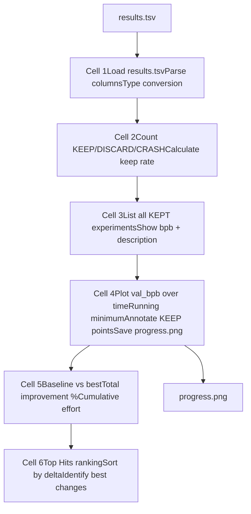
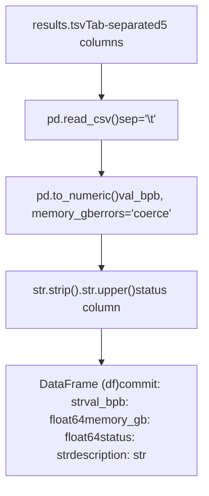
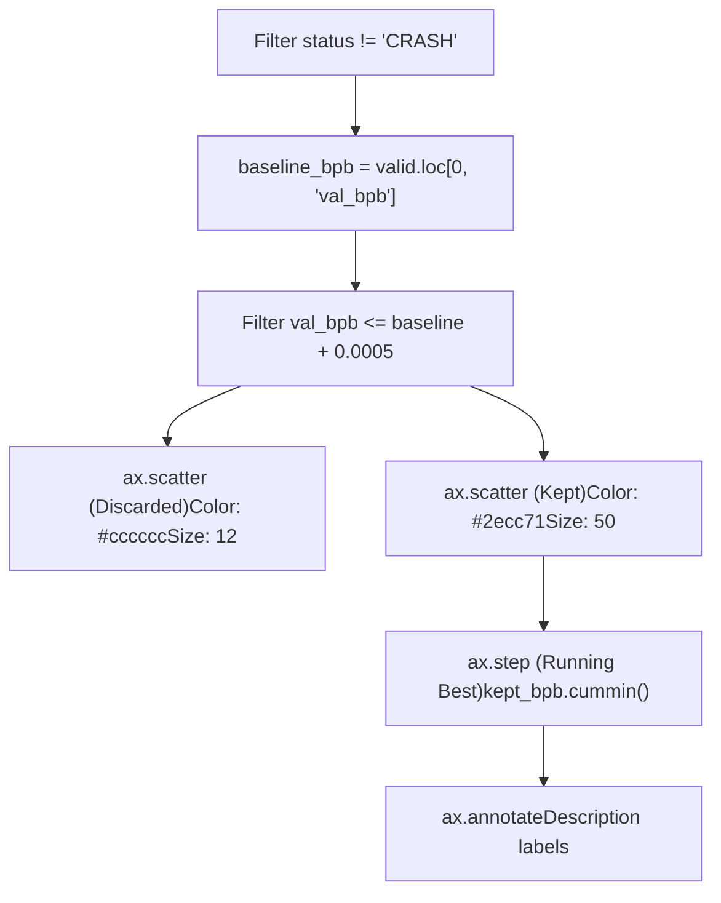
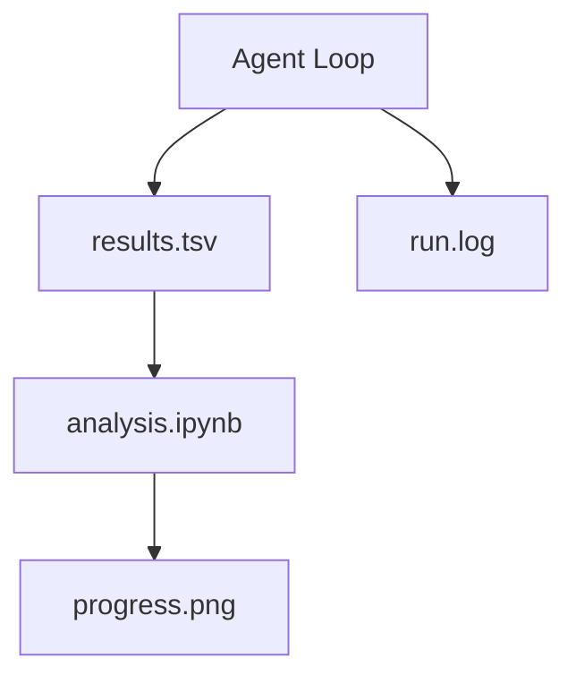

# Analysis Notebook

Relevant source files

-   [analysis.ipynb](https://github.com/karpathy/autoresearch/blob/e6d79c12/analysis.ipynb)
-   [progress.png](https://github.com/karpathy/autoresearch/blob/e6d79c12/progress.png)

The `analysis.ipynb` notebook provides post-experiment analysis and visualization of autonomous research results. It processes the `results.tsv` file to generate summary statistics, visualizations, and rankings that enable human researchers to quickly review overnight experiment progress and identify successful optimization strategies.

For information about the `results.tsv` file format, see [6.1 Results.tsv Structure](https://github.com/karpathy/autoresearch/blob/e6d79c12/6.1 Results.tsv Structure) For guidance on interpreting experiment outcomes, see [6.3 Interpreting Results](https://github.com/karpathy/autoresearch/blob/e6d79c12/6.3 Interpreting Results)

---

## Overview

The analysis notebook serves as the primary interface for human review of agent-driven experiments. After the autonomous agent executes multiple experiments overnight, a human researcher can run this notebook to:

1.  **Load experiment data** from `results.tsv` \[analysis.ipynb:24-32\]
2.  **Calculate summary statistics** (total experiments, keep rate, improvement magnitude) \[analysis.ipynb:42-52\]
3.  **Visualize progress** with a time-series plot showing `val_bpb` evolution \[analysis.ipynb:87-142\]
4.  **Generate rankings** of experiments by improvement delta \[analysis.ipynb:198-218\]
5.  **Export visualizations** to `progress.png` for easy sharing \[analysis.ipynb:141\]

The notebook is read-only with respect to experimental state—it does not modify `results.tsv`, Git branches, or `train.py`. Its sole purpose is analysis and reporting.

Sources: [analysis.ipynb1-253](https://github.com/karpathy/autoresearch/blob/e6d79c12/analysis.ipynb#L1-L253)

---

## Notebook Structure

The notebook consists of executable cells organized into functional sections:

**Data Flow Diagram**

Sources: [analysis.ipynb1-253](https://github.com/karpathy/autoresearch/blob/e6d79c12/analysis.ipynb#L1-L253)

---

## Data Loading and Preprocessing

The first cell loads `results.tsv` and performs essential data cleaning using `pandas` \[analysis.ipynb:20-28\]:

**Preprocessing Pipeline**

Key preprocessing steps:

-   **Numeric Conversion**: `val_bpb` and `memory_gb` are converted to floats \[analysis.ipynb:26-27\]. The `errors="coerce"` flag ensures that malformed entries (common in `CRASH` status rows) are turned into `NaN` rather than breaking the notebook.
-   **Status Normalization**: The `status` column is stripped of whitespace and converted to uppercase to ensure consistent filtering for `KEEP`, `DISCARD`, and `CRASH` labels \[analysis.ipynb:28\].

Sources: [analysis.ipynb14-33](https://github.com/karpathy/autoresearch/blob/e6d79c12/analysis.ipynb#L14-L33)

---

## Status Summary Statistics

The second cell computes the distribution of experiment outcomes \[analysis.ipynb:42-52\]:

-   **Experiment Counts**: Uses `df["status"].value_counts()` to tally outcomes.
-   **Keep Rate Calculation**: Defined as `n_keep / (n_keep + n_discard)` \[analysis.ipynb:49-51\]. This metric excludes `CRASH` outcomes from the denominator to measure the agent's "success rate" on valid experiments.

The third cell provides a detailed listing of all `KEEP` experiments, printing the experiment index, `val_bpb`, memory usage, and the agent's description \[analysis.ipynb:61-68\].

Sources: [analysis.ipynb36-52](https://github.com/karpathy/autoresearch/blob/e6d79c12/analysis.ipynb#L36-L52) [analysis.ipynb55-69](https://github.com/karpathy/autoresearch/blob/e6d79c12/analysis.ipynb#L55-L69)

---

## Progress Visualization

The fourth cell generates `progress.png`, the primary visual artifact of the research process \[analysis.ipynb:87-143\].

**Visualization Implementation Logic**

### Visualization Design

-   **Discarded Points**: Rendered as faint background dots (`#cccccc`) to show the breadth of exploration without cluttering the view \[analysis.ipynb:100-101\].
-   **Kept Points**: Rendered as prominent green dots (`#2ecc71`) with black edges \[analysis.ipynb:104-106\].
-   **Running Best**: A step line using `cummin()` (cumulative minimum) of kept results \[analysis.ipynb:112-114\]. This represents the "optimization frontier."
-   **Annotations**: Each kept point is labeled with its description (truncated to 45 characters) rotated at 30 degrees \[analysis.ipynb:116-126\].
-   **Dynamic Scaling**: The Y-axis limits are automatically set based on the `baseline_bpb` and the current `best` result with a 15% margin \[analysis.ipynb:137-138\].

Sources: [analysis.ipynb81-145](https://github.com/karpathy/autoresearch/blob/e6d79c12/analysis.ipynb#L81-L145)

---

## Statistical Analysis and Rankings

The final sections of the notebook compute aggregate performance metrics and rank the impact of individual changes.

### Summary Statistics

The notebook calculates the following \[analysis.ipynb:162-171\]:

-   **Baseline val\_bpb**: Taken from the first row of the log.
-   **Best val\_bpb**: The minimum value found among kept experiments.
-   **Total Improvement**: Calculated as `baseline_bpb - best_bpb` and expressed as a percentage of the baseline.

### Top Hits Ranking

The notebook identifies which specific modifications yielded the largest gains by calculating a "delta" for each kept experiment \[analysis.ipynb:198-201\]:

$$ \\text{delta}*n = \\text{val\_bpb}*{n-1} - \\text{val\_bpb}\_n $$

Where $n$ and $n-1$ are consecutive experiments in the `KEEP` sequence. The results are sorted by delta to highlight the most effective architectural or hyperparameter changes \[analysis.ipynb:206-218\].

Sources: [analysis.ipynb155-180](https://github.com/karpathy/autoresearch/blob/e6d79c12/analysis.ipynb#L155-L180) [analysis.ipynb190-221](https://github.com/karpathy/autoresearch/blob/e6d79c12/analysis.ipynb#L190-L221)

---

## Integration with System Entities

The analysis notebook acts as the observer for the `Research Loop` executed by the agent.

**System Entity Relationship**

| Entity | Role in Analysis |
| --- | --- |
| `results.tsv` | The primary data source; contains the history of all `KEEP`, `DISCARD`, and `CRASH` events \[analysis.ipynb:25\]. |
| `val_bpb` | The target metric for all plots and delta calculations \[analysis.ipynb:26\]. |
| `description` | Textual metadata provided by the agent, used for plot annotations and ranking tables \[analysis.ipynb:118\]. |
| `progress.png` | The final exported visualization summarizing the research session \[analysis.ipynb:141\]. |

Sources: [analysis.ipynb1-253](https://github.com/karpathy/autoresearch/blob/e6d79c12/analysis.ipynb#L1-L253)
