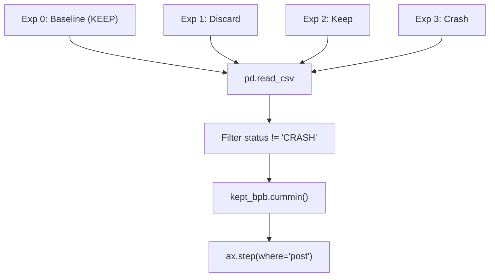
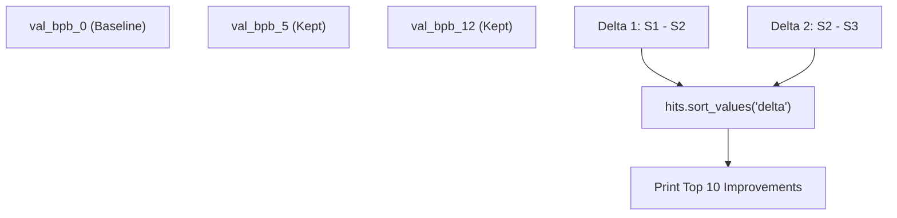

# Interpreting Results

Relevant source files

-   [analysis.ipynb](https://github.com/karpathy/autoresearch/blob/e6d79c12/analysis.ipynb)

This page provides a technical guide to interpreting the experimental data generated by the autonomous research loop. It focuses on the logic within `analysis.ipynb` for processing `results.tsv`, calculating metrics like keep rates and deltas, and visualizing the optimization frontier.

---

## Understanding Status Values

Each experiment entry in `results.tsv` is categorized by a status that dictates how the system handles the code modification and how the analysis notebook processes the data point.

| Status | Code Entity Meaning | `val_bpb` Value | `memory_gb` | Git Lifecycle |
| --- | --- | --- | --- | --- |
| `KEEP` | Improvement found | `< current_best` | Peak VRAM | Commit preserved on branch |
| `DISCARD` | No improvement | `≥ current_best` | Peak VRAM | `git reset --hard` to previous |
| `CRASH` | Runtime failure | `0.000000` | `0.0` | `git reset --hard` to previous |

The decision logic in the research loop is binary: a modification is only "Kept" if it strictly improves the validation metric. This creates a strictly monotonic "frontier" of improvements.

**Sources**: [analysis.ipynb24-28](https://github.com/karpathy/autoresearch/blob/e6d79c12/analysis.ipynb#L24-L28) [analysis.ipynb42-48](https://github.com/karpathy/autoresearch/blob/e6d79c12/analysis.ipynb#L42-L48)

---

## Keep Rate and Efficiency

The **keep rate** is the primary metric for measuring the "intelligence" or efficiency of the research program defined in `program.md`. It represents the ratio of successful improvements to total valid attempts.

### Calculation Logic

The `analysis.ipynb` notebook calculates this by filtering out `CRASH` statuses to focus on research quality rather than implementation stability.

```
n_keep = counts.get("KEEP", 0)n_discard = counts.get("DISCARD", 0)n_decided = n_keep + n_discardkeep_rate = n_keep / n_decided
```
**Sources**: [analysis.ipynb42-51](https://github.com/karpathy/autoresearch/blob/e6d79c12/analysis.ipynb#L42-L51)

### Keep Rate Interpretation Matrix

| Rate | Technical Implication | System State |
| --- | --- | --- |
| **\> 25%** | Low-hanging fruit | The model is far from optimal; simple changes (LR, width) are still yielding wins. |
| **10-25%** | Steady progress | The agent is successfully navigating the trade-off space. Typical for mature `program.md`. |
| **< 10%** | Diminishing returns | The architecture is stabilizing. Agent may need more "creative" instructions to break plateaus. |

---

## The Optimization Frontier

The system tracks progress through a "Running Minimum" or "Frontier." Because the agent always branches from the last `KEEP` commit, the sequence of successful experiments forms a cumulative chain of improvements.

### Visualizing the Frontier

The `analysis.ipynb` generates a step-plot (`progress.png`) that maps the `val_bpb` over the experiment index.

**Frontier Mapping Logic**


**Sources**: [analysis.ipynb90-114](https://github.com/karpathy/autoresearch/blob/e6d79c12/analysis.ipynb#L90-L114)

The `ax.step` function with `where="post"` is used to show that a specific `val_bpb` remains the "best known" until a subsequent `KEEP` experiment surpasses it.

**Sources**: [analysis.ipynb113-114](https://github.com/karpathy/autoresearch/blob/e6d79c12/analysis.ipynb#L113-L114)

---

## Delta Calculations and Top Hits

To identify which specific ideas were most impactful, the analysis notebook computes a **Delta** for every `KEEP` experiment.

### Cumulative Delta Logic

Since each `KEEP` builds on the one before it, the improvement of experiment $N$ is measured against the result of experiment $N-1$ in the filtered "Kept" list.

```
kept = df[df["status"] == "KEEP"].copy()kept["prev_bpb"] = kept["val_bpb"].shift(1)kept["delta"] = kept["prev_bpb"] - kept["val_bpb"]
```
**Sources**: [analysis.ipynb198-200](https://github.com/karpathy/autoresearch/blob/e6d79c12/analysis.ipynb#L198-L200)

### Top Hits Ranking

The "Top Hits" section sorts these deltas to highlight the most significant architectural or hyperparameter breakthroughs.

**Delta Distribution Flow**


**Sources**: [analysis.ipynb198-213](https://github.com/karpathy/autoresearch/blob/e6d79c12/analysis.ipynb#L198-L213)

---

## Baseline vs. Best Comparison

The first row of `results.tsv` (index 0) is always the baseline—the result of running the initial `train.py` before any modifications. The notebook uses this to calculate the **Total Improvement**.

### Key Statistics Summary

The notebook outputs a summary block providing a high-level view of the autonomous run's success:

-   **Baseline val\_bpb**: `df.iloc[0]["val_bpb"]`
-   **Best val\_bpb**: `kept["val_bpb"].min()`
-   **Total Improvement**: `baseline_bpb - best_bpb`
-   **Percentage Gain**: `(Total Improvement / Baseline) * 100`

**Sources**: [analysis.ipynb163-169](https://github.com/karpathy/autoresearch/blob/e6d79c12/analysis.ipynb#L163-L169)

---

## Interpreting Memory Usage

While `val_bpb` is the primary optimization target, `memory_gb` serves as a critical constraint. The agent is instructed to keep `peak_vram_mb` within the limits of the hardware (e.g., 80GB for an A100).

-   **OOM Crashes**: If `memory_gb` is 0.0 and status is `CRASH`, the experiment likely hit an Out-Of-Memory error.
-   **Memory Efficiency**: If a `KEEP` experiment reduces `val_bpb` while also reducing `memory_gb`, it is considered a high-quality architectural improvement (e.g., switching to sliding window attention).

**Sources**: [analysis.ipynb27-28](https://github.com/karpathy/autoresearch/blob/e6d79c12/analysis.ipynb#L27-L28) [analysis.ipynb67](https://github.com/karpathy/autoresearch/blob/e6d79c12/analysis.ipynb#L67-L67)
