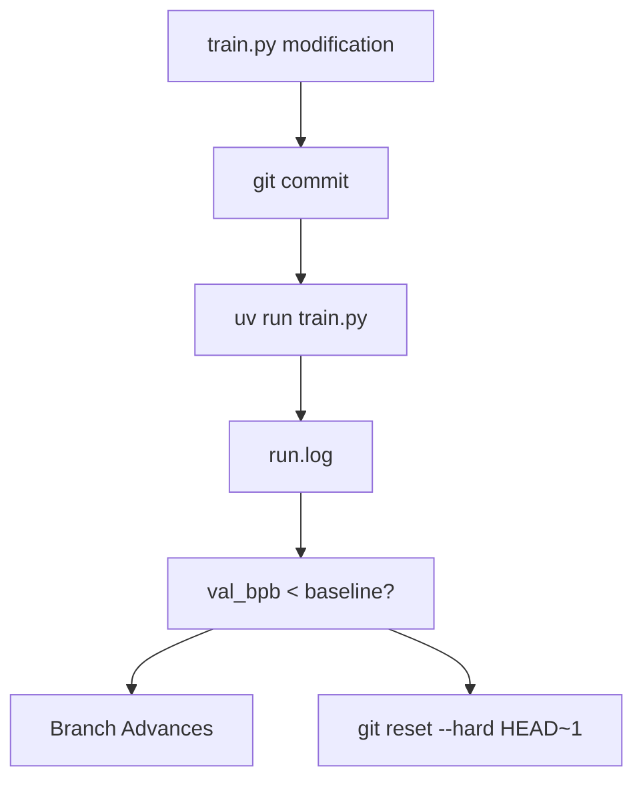
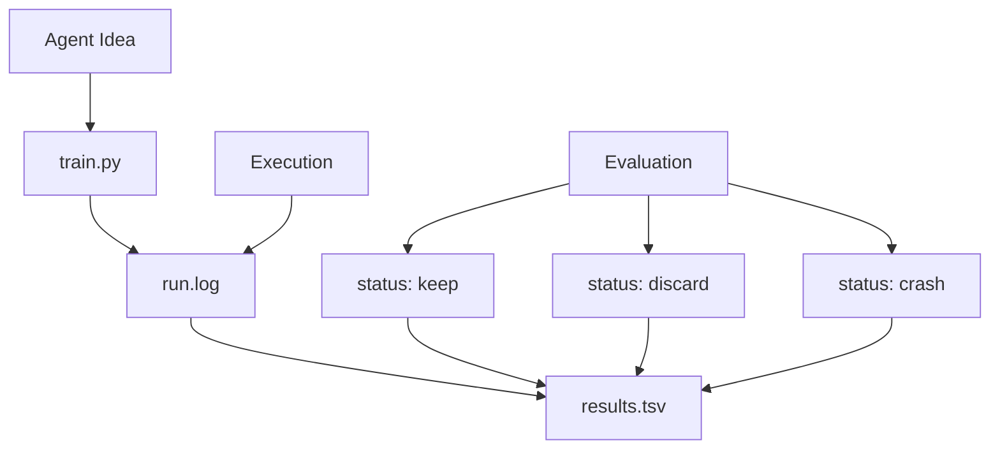

# Git History vs. Complete Log

Relevant source files

-   [.gitignore](https://github.com/karpathy/autoresearch/blob/e6d79c12/.gitignore)
-   [program.md](https://github.com/karpathy/autoresearch/blob/e6d79c12/program.md?plain=1)

**Purpose**: This page explains the dual tracking system used in `autoresearch`: the Git branch contains only the "frontier" of successful improvements, while `results.tsv` contains a complete log of every experiment, including discards and crashes. Understanding this separation is critical for interpreting research progress and reviewing code changes.

---

## Overview: Two Complementary Systems

Autoresearch maintains two parallel records of experimental work to balance code cleanliness with research transparency.

| System | Contents | Purpose | Implementation |
| --- | --- | --- | --- |
| **Git Branch** (`autoresearch/<tag>`) | Only `keep` commits | Clean code history of improvements | Managed via `git reset` [program.md104](https://github.com/karpathy/autoresearch/blob/e6d79c12/program.md?plain=1#L104-L104) |
| **results.tsv** | All experiments (`keep`, `discard`, `crash`) | Complete research log | Appended after every run [program.md66](https://github.com/karpathy/autoresearch/blob/e6d79c12/program.md?plain=1#L66-L66) |

This separation serves a critical purpose: **Git history is optimized for code clarity, while `results.tsv` is optimized for research insight**. The Git branch shows a linear sequence of successful changes, making it easy to review what actually improved the model. The TSV file preserves the complete experimental record, which is essential for understanding the research process and avoiding re-trying failed ideas.

**Sources**: [program.md90-109](https://github.com/karpathy/autoresearch/blob/e6d79c12/program.md?plain=1#L90-L109) [.gitignore23](https://github.com/karpathy/autoresearch/blob/e6d79c12/.gitignore#L23-L23)

---

## Git Branch: The Optimization Frontier

### Commit Structure and Decision Logic

The Git branch (e.g., `autoresearch/mar5`) represents the current "best" version of the code. It follows a strict "advance or revert" logic based on the `val_bpb` metric.

**Diagram: The Git Branch Decision Loop**

The agent performs this logic at [program.md103-104](https://github.com/karpathy/autoresearch/blob/e6d79c12/program.md?plain=1#L103-L104):

-   If `val_bpb` improved (lower value), the commit is kept.
-   If `val_bpb` is equal or worse, the agent performs a `git reset` back to the last known good state.

**Sources**: [program.md96-108](https://github.com/karpathy/autoresearch/blob/e6d79c12/program.md?plain=1#L96-L108)

### What Git History Preserves

The Git branch maintains only the commits with `status=keep`. Each commit in the history represents:

-   **Functional Improvements**: The exact modifications to `train.py` that produced a lower `val_bpb`.
-   **Monotonic Progress**: Each subsequent commit is guaranteed to be better than or equal to its parent.
-   **Reviewable Diffs**: Changes are isolated, allowing humans to use `git show` or `git diff` to see exactly what the agent changed (e.g., hyperparameter tweaks or architectural shifts).

**Sources**: [program.md103-106](https://github.com/karpathy/autoresearch/blob/e6d79c12/program.md?plain=1#L103-L106)

---

## results.tsv: The Complete Research Log

### TSV File Structure

The `results.tsv` file is the "lab notebook." It is explicitly excluded from Git tracking in [.gitignore23](https://github.com/karpathy/autoresearch/blob/e6d79c12/.gitignore#L23-L23) to allow it to persist across `git reset` operations. It uses a tab-separated format to prevent commas in descriptions from breaking the parser [program.md66](https://github.com/karpathy/autoresearch/blob/e6d79c12/program.md?plain=1#L66-L66)

**Column Definitions** [program.md70-78](https://github.com/karpathy/autoresearch/blob/e6d79c12/program.md?plain=1#L70-L78):

| Column | Type | Description |
| --- | --- | --- |
| `commit` | string | Short 7-char git commit hash |
| `val_bpb` | float | Validation bits per byte (0.000000 for crashes) |
| `memory_gb` | float | Peak VRAM in GB (rounded to .1f) |
| `status` | string | `keep`, `discard`, or `crash` |
| `description` | string | Short text description of the experiment |

**Sources**: [program.md70-88](https://github.com/karpathy/autoresearch/blob/e6d79c12/program.md?plain=1#L70-L88) [.gitignore23](https://github.com/karpathy/autoresearch/blob/e6d79c12/.gitignore#L23-L23)

### Status Assignment Logic

The `status` column categorizes the outcome of the experiment loop described in [program.md94-110](https://github.com/karpathy/autoresearch/blob/e6d79c12/program.md?plain=1#L94-L110):

**Diagram: Mapping Research Outcomes to results.tsv**

-   **`keep`**: Experiment improved the metric; commit stays in Git.
-   **`discard`**: Experiment ran but didn't improve; Git state is reset.
-   **`crash`**: Script failed (OOM, syntax error, etc.); logged as 0.0 metrics [program.md110](https://github.com/karpathy/autoresearch/blob/e6d79c12/program.md?plain=1#L110-L110)

**Sources**: [program.md74-88](https://github.com/karpathy/autoresearch/blob/e6d79c12/program.md?plain=1#L74-L88) [program.md100-104](https://github.com/karpathy/autoresearch/blob/e6d79c12/program.md?plain=1#L100-L104)

---

## Information Distribution

The two systems capture different aspects of the research process:

| Information Type | Found in Git History? | Found in results.tsv? |
| --- | --- | --- |
| Successful Code Diffs | ✅ Yes | ❌ No (Hash only) |
| Failed Ideas/Descriptions | ❌ No (Reset) | ✅ Yes |
| Peak VRAM Usage | ❌ No | ✅ Yes |
| Precise `val_bpb` | ❌ No (unless in msg) | ✅ Yes |
| Temporal Order of All Tries | ❌ No | ✅ Yes |

### Synchronization

Because `results.tsv` is not tracked by Git, it acts as a persistent memory for the agent. Even when the agent executes `git reset back to where you started` [program.md104](https://github.com/karpathy/autoresearch/blob/e6d79c12/program.md?plain=1#L104-L104) the record of that failed attempt remains in the TSV. This prevents the agent from entering infinite loops of re-trying the same failed idea, as it can "look at the git state" and its own log [program.md96](https://github.com/karpathy/autoresearch/blob/e6d79c12/program.md?plain=1#L96-L96)

**Sources**: [program.md94-106](https://github.com/karpathy/autoresearch/blob/e6d79c12/program.md?plain=1#L94-L106) [.gitignore23](https://github.com/karpathy/autoresearch/blob/e6d79c12/.gitignore#L23-L23)

---

## Using Both Systems for Analysis

The `analysis.ipynb` notebook leverages this dual-system approach to provide a comprehensive view of the research run.

1.  **Progress Visualization**: The notebook plots `val_bpb` over time, marking `keep` points as a "frontier" line while showing `discard` points as noise around it.
2.  **Efficiency Metrics**: By comparing the number of `keep` vs. `discard` rows in `results.tsv`, it calculates the "Keep Rate" (agent's research efficiency).
3.  **Delta Analysis**: It calculates the improvement magnitude between successive `keep` commits.

**Sources**: [program.md114](https://github.com/karpathy/autoresearch/blob/e6d79c12/program.md?plain=1#L114-L114) [analysis.ipynb1-253](https://github.com/karpathy/autoresearch/blob/e6d79c12/analysis.ipynb#L1-L253) (implied by context of analysis tools).
