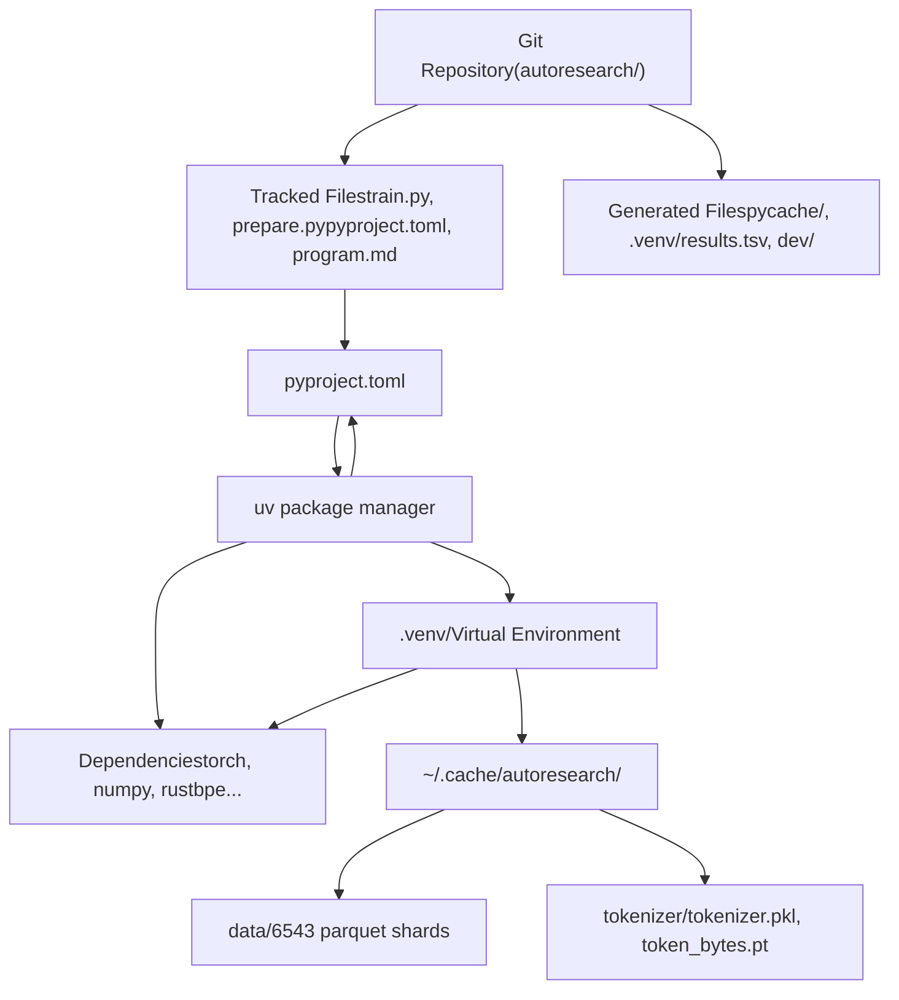
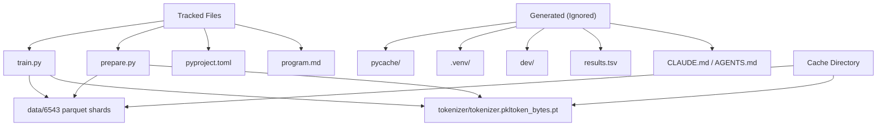

# Development Environment

Relevant source files

-   [.gitignore](https://github.com/karpathy/autoresearch/blob/e6d79c12/.gitignore)
-   [pyproject.toml](https://github.com/karpathy/autoresearch/blob/e6d79c12/pyproject.toml)
-   [uv.lock](https://github.com/karpathy/autoresearch/blob/e6d79c12/uv.lock)

The autoresearch development environment is designed for reproducibility and simplicity. It uses `uv` for dependency management, enforces Python 3.10+, and maintains a clear separation between tracked source code and generated artifacts. The environment ensures that all experiments run in identical conditions, making results comparable across machines and over time.

This page provides an overview of the development setup. For detailed dependency information, see [Python and Dependencies](/karpathy/autoresearch/7.1-python-and-dependencies). For file organization and version control patterns, see [Version Control and Artifacts](/karpathy/autoresearch/7.2-version-control-and-artifacts).

## Core Environment Components

The development environment consists of three key components that work together to ensure reproducible experiments:

**Component Overview**

**Sources**: [pyproject.toml1-28](https://github.com/karpathy/autoresearch/blob/e6d79c12/pyproject.toml#L1-L28) [.gitignore1-24](https://github.com/karpathy/autoresearch/blob/e6d79c12/.gitignore#L1-L24)

### Python Version and uv

The system requires **Python 3.10 or higher** ([pyproject.toml6](https://github.com/karpathy/autoresearch/blob/e6d79c12/pyproject.toml#L6-L6) [uv.lock3](https://github.com/karpathy/autoresearch/blob/e6d79c12/uv.lock#L3-L3)) and uses **`uv`** as the package manager. `uv` provides:

-   Fast dependency resolution via `uv.lock` ([uv.lock1-19](https://github.com/karpathy/autoresearch/blob/e6d79c12/uv.lock#L1-L19))
-   Isolated virtual environments in `.venv/` ([.gitignore10](https://github.com/karpathy/autoresearch/blob/e6d79c12/.gitignore#L10-L10))
-   Custom PyPI index support for PyTorch CUDA 12.8 ([pyproject.toml19-27](https://github.com/karpathy/autoresearch/blob/e6d79c12/pyproject.toml#L19-L27))
-   Automatic environment activation via `uv run`

**Sources**: [pyproject.toml6](https://github.com/karpathy/autoresearch/blob/e6d79c12/pyproject.toml#L6-L6) [uv.lock3](https://github.com/karpathy/autoresearch/blob/e6d79c12/uv.lock#L3-L3) [.gitignore10](https://github.com/karpathy/autoresearch/blob/e6d79c12/.gitignore#L10-L10) [pyproject.toml19-27](https://github.com/karpathy/autoresearch/blob/e6d79c12/pyproject.toml#L19-L27)

## Dependency Management

The system maintains a minimal dependency set defined in [pyproject.toml7-17](https://github.com/karpathy/autoresearch/blob/e6d79c12/pyproject.toml#L7-L17) Key dependency categories:

| Category | Packages | Used By |
| --- | --- | --- |
| **Computation** | `torch==2.9.1`, `numpy>=2.2.6`, `kernels>=0.11.7` | `train.py` training loop |
| **Data** | `pyarrow>=21.0.0`, `pandas>=2.3.3`, `requests>=2.32.0` | `prepare.py` data pipeline |
| **Tokenization** | `rustbpe>=0.1.0`, `tiktoken>=0.11.0` | `prepare.py` tokenizer training |
| **Analysis** | `matplotlib>=3.10.8` | `analysis.ipynb` visualization |

The critical dependency is **PyTorch 2.9.1 with CUDA 12.8**, installed via a custom index defined in [pyproject.toml19-27](https://github.com/karpathy/autoresearch/blob/e6d79c12/pyproject.toml#L19-L27) This ensures GPU acceleration is available rather than CPU-only PyTorch. The `uv.lock` file ensures exact versions (e.g., `torch==2.9.1`) are pinned across all development environments ([uv.lock72](https://github.com/karpathy/autoresearch/blob/e6d79c12/uv.lock#L72-L72)).

For complete dependency details, see [Python and Dependencies](/karpathy/autoresearch/7.1-python-and-dependencies).

**Sources**: [pyproject.toml7-17](https://github.com/karpathy/autoresearch/blob/e6d79c12/pyproject.toml#L7-L17) [pyproject.toml19-27](https://github.com/karpathy/autoresearch/blob/e6d79c12/pyproject.toml#L19-L27) [uv.lock72](https://github.com/karpathy/autoresearch/blob/e6d79c12/uv.lock#L72-L72)

## File Organization

The system maintains three categories of files with distinct lifecycles:

**File Categories and Locations**

**Sources**: [.gitignore1-24](https://github.com/karpathy/autoresearch/blob/e6d79c12/.gitignore#L1-L24)

### Tracked vs. Generated Files

| Category | Files | Lifecycle |
| --- | --- | --- |
| **Tracked** | `train.py`, `prepare.py`, `pyproject.toml`, `program.md` | Modified by human/agent, committed to Git |
| **Generated** | `__pycache__/`, `.venv/`, `dev/`, `results.tsv`, `CLAUDE.md` | Created during execution, ignored by Git ([.gitignore1-24](https://github.com/karpathy/autoresearch/blob/e6d79c12/.gitignore#L1-L24)) |
| **Cached** | `~/.cache/autoresearch/data/`, `~/.cache/autoresearch/tokenizer/` | Created once by `prepare.py`, persists across branches |

The `.gitignore` patterns ([.gitignore1-24](https://github.com/karpathy/autoresearch/blob/e6d79c12/.gitignore#L1-L24)) ensure that only source code and configuration are tracked, while build artifacts, agent session files like `CLAUDE.md` ([.gitignore16](https://github.com/karpathy/autoresearch/blob/e6d79c12/.gitignore#L16-L16)), and experiment outputs like `results.tsv` ([.gitignore23](https://github.com/karpathy/autoresearch/blob/e6d79c12/.gitignore#L23-L23)) are ignored. This prevents repository bloat and ensures clean Git history showing only intentional code changes.

For detailed version control patterns, see [Version Control and Artifacts](/karpathy/autoresearch/7.2-version-control-and-artifacts).

**Sources**: [.gitignore1-24](https://github.com/karpathy/autoresearch/blob/e6d79c12/.gitignore#L1-L24)

## Setup Workflow

The complete environment setup follows a one-time initialization process, after which experiments can be run repeatedly:

**Initial Setup Sequence**

> **[Mermaid sequence]**
> *(图表结构无法解析)*

**Sources**: [pyproject.toml1-28](https://github.com/karpathy/autoresearch/blob/e6d79c12/pyproject.toml#L1-L28)

**Commands**

| Command | Purpose | Frequency |
| --- | --- | --- |
| `uv sync` | Install dependencies into `.venv/` | Once per clone (or after updating `pyproject.toml`) |
| `uv run prepare.py` | Download data, train tokenizer | Once per machine (or to reset cache) |
| `uv run train.py` | Execute training experiment | Each experiment (hundreds of times) |

After initial setup, the `.venv/` and `~/.cache/autoresearch/` directories persist. All subsequent experiments reuse these artifacts, ensuring consistent evaluation conditions. All commands automatically activate the virtual environment, so manual activation is not required.

**Sources**: [pyproject.toml1-28](https://github.com/karpathy/autoresearch/blob/e6d79c12/pyproject.toml#L1-L28)
