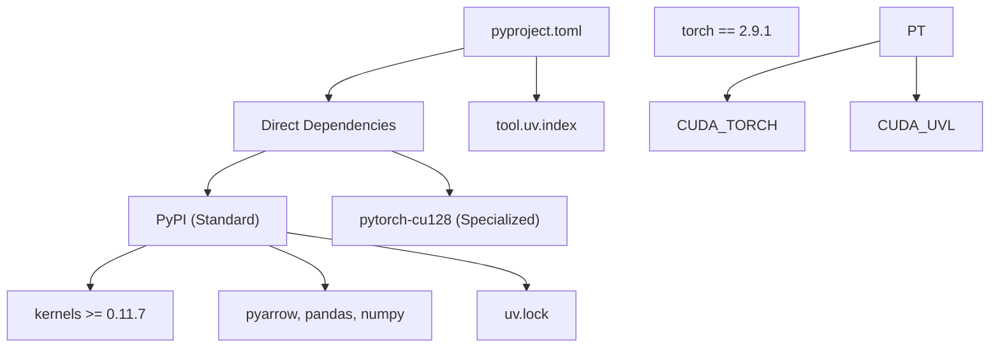
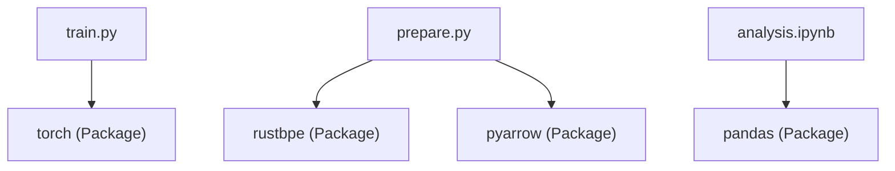

# Python and Dependencies

Relevant source files

-   [.python-version](https://github.com/karpathy/autoresearch/blob/e6d79c12/.python-version)
-   [pyproject.toml](https://github.com/karpathy/autoresearch/blob/e6d79c12/pyproject.toml)
-   [uv.lock](https://github.com/karpathy/autoresearch/blob/e6d79c12/uv.lock)

## Purpose and Scope

This page documents the Python environment requirements and dependency management for `autoresearch`. It details the Python 3.10+ constraint, the structure of `pyproject.toml`, dependency categories, and how the `uv` package manager handles deterministic resolution and locking, including the specialized PyTorch CUDA 12.8 requirement.

---

## Python Version Requirement

Autoresearch requires **Python 3.10 or higher**. This constraint is enforced through both project metadata and local environment pinning.

**pyproject.toml specification:** The project metadata explicitly defines the supported Python range to ensure compatibility with modern features like structural pattern matching and improved type hinting [pyproject.toml6](https://github.com/karpathy/autoresearch/blob/e6d79c12/pyproject.toml#L6-L6)

**Local development version pin:** The [.python-version1](https://github.com/karpathy/autoresearch/blob/e6d79c12/.python-version#L1-L1) file pins the local development environment to Python 3.10. This file is utilized by tools like `uv` or `pyenv` to automatically select the correct interpreter.

The 3.10+ requirement is necessitated by:

-   Modern PyTorch 2.9.1 compatibility [pyproject.toml16](https://github.com/karpathy/autoresearch/blob/e6d79c12/pyproject.toml#L16-L16)
-   Advanced typing features (e.g., union types with `|`).
-   High-performance data processing libraries like `numpy` 2.2+ and `pandas` 3.0+ [uv.lock51-54](https://github.com/karpathy/autoresearch/blob/e6d79c12/uv.lock#L51-L54)

Sources: [pyproject.toml6](https://github.com/karpathy/autoresearch/blob/e6d79c12/pyproject.toml#L6-L6) [.python-version1](https://github.com/karpathy/autoresearch/blob/e6d79c12/.python-version#L1-L1) [uv.lock3](https://github.com/karpathy/autoresearch/blob/e6d79c12/uv.lock#L3-L3) [uv.lock51-54](https://github.com/karpathy/autoresearch/blob/e6d79c12/uv.lock#L51-L54)

---

## Project Configuration Structure

The [pyproject.toml](https://github.com/karpathy/autoresearch/blob/e6d79c12/pyproject.toml) file follows the PEP 518/621 standard. It defines the research environment as a fixed infrastructure that the autonomous agent cannot modify.

### Dependency Flow and Resolution

The following diagram illustrates how `pyproject.toml` directs `uv` to resolve dependencies from standard and specialized indexes.

**Diagram: Dependency Resolution Flow**

Sources: [pyproject.toml1-28](https://github.com/karpathy/autoresearch/blob/e6d79c12/pyproject.toml#L1-L28) [uv.lock1-19](https://github.com/karpathy/autoresearch/blob/e6d79c12/uv.lock#L1-L19)

---

## Dependency Categories

### Machine Learning Core (Fixed Infrastructure)

| Package | Version | Role |
| --- | --- | --- |
| `torch` | `2.9.1` | Primary DL framework. Pinned to `cu128` for CUDA 12.8 support [pyproject.toml16](https://github.com/karpathy/autoresearch/blob/e6d79c12/pyproject.toml#L16-L16) |
| `kernels` | `>=0.11.7` | Highly optimized CUDA kernels used by `train.py` [pyproject.toml8](https://github.com/karpathy/autoresearch/blob/e6d79c12/pyproject.toml#L8-L8) |
| `numpy` | `>=2.2.6` | Fundamental numerical operations [pyproject.toml10](https://github.com/karpathy/autoresearch/blob/e6d79c12/pyproject.toml#L10-L10) |

**PyTorch CUDA Configuration:** To ensure the agent has access to the latest performance optimizations, PyTorch is pulled from a dedicated index [pyproject.toml19-27](https://github.com/karpathy/autoresearch/blob/e6d79c12/pyproject.toml#L19-L27):

-   **Index Name:** `pytorch-cu128`
-   **URL:** `https://download.pytorch.org/whl/cu128`
-   **Constraint:** `explicit = true` (Prevents other packages from accidentally using this index).

Sources: [pyproject.toml8-27](https://github.com/karpathy/autoresearch/blob/e6d79c12/pyproject.toml#L8-L27) [uv.lock72-73](https://github.com/karpathy/autoresearch/blob/e6d79c12/uv.lock#L72-L73)

### Tokenization and Data Pipeline

| Package | Version | Role |
| --- | --- | --- |
| `rustbpe` | `>=0.1.0` | Rust-based tokenizer trainer used in `prepare.py` [pyproject.toml14](https://github.com/karpathy/autoresearch/blob/e6d79c12/pyproject.toml#L14-L14) |
| `tiktoken` | `>=0.11.0` | High-speed inference-time tokenization [pyproject.toml15](https://github.com/karpathy/autoresearch/blob/e6d79c12/pyproject.toml#L15-L15) |
| `pyarrow` | `>=21.0.0` | Handles the Parquet shards for the dataset [pyproject.toml12](https://github.com/karpathy/autoresearch/blob/e6d79c12/pyproject.toml#L12-L12) |
| `requests` | `>=2.32.0` | Downloads raw data shards [pyproject.toml13](https://github.com/karpathy/autoresearch/blob/e6d79c12/pyproject.toml#L13-L13) |

Sources: [pyproject.toml12-15](https://github.com/karpathy/autoresearch/blob/e6d79c12/pyproject.toml#L12-L15)

### Analysis and Tracking

| Package | Version | Role |
| --- | --- | --- |
| `pandas` | `>=2.3.3` | Processes `results.tsv` for experiment tracking [pyproject.toml11](https://github.com/karpathy/autoresearch/blob/e6d79c12/pyproject.toml#L11-L11) |
| `matplotlib` | `>=3.10.8` | Generates `progress.png` via `analysis.ipynb` [pyproject.toml9](https://github.com/karpathy/autoresearch/blob/e6d79c12/pyproject.toml#L9-L9) |

Sources: [pyproject.toml9-11](https://github.com/karpathy/autoresearch/blob/e6d79c12/pyproject.toml#L9-L11)

---

## The `uv` Package Manager and Lock File

Autoresearch uses `uv` for deterministic environment management. The [uv.lock](https://github.com/karpathy/autoresearch/blob/e6d79c12/uv.lock) file ensures that every research agent and human developer operates in an identical environment.

### Lock File Implementation Details

The lock file includes `resolution-markers` that handle multi-platform support and Python version variances (e.g., selecting different `numpy` or `pandas` versions for Python 3.11 vs 3.12+) [uv.lock4-19](https://github.com/karpathy/autoresearch/blob/e6d79c12/uv.lock#L4-L19)

**Diagram: Code Entity to Dependency Mapping**

Sources: [uv.lock45-60](https://github.com/karpathy/autoresearch/blob/e6d79c12/uv.lock#L45-L60) [pyproject.toml7-17](https://github.com/karpathy/autoresearch/blob/e6d79c12/pyproject.toml#L7-L17)

### Key uv Operations

The system relies on `uv` to maintain the boundary between the mutable research code (`train.py`) and the immutable environment.

| Operation | Command | Effect |
| --- | --- | --- |
| **Sync** | `uv sync` | Installs exact versions from `uv.lock`. |
| **Execution** | `uv run <script>` | Runs scripts within the isolated, locked environment. |
| **Verification** | `uv lock --check` | Ensures `pyproject.toml` and `uv.lock` are in sync. |

The `autoresearch` package itself is treated as a "virtual" package within the lock file, allowing it to manage its own local source code as a dependency [uv.lock45-47](https://github.com/karpathy/autoresearch/blob/e6d79c12/uv.lock#L45-L47)

Sources: [uv.lock45-73](https://github.com/karpathy/autoresearch/blob/e6d79c12/uv.lock#L45-L73)

---

## Dependency Resolution Logic

The resolution process handles complex transitive dependencies. For example, `matplotlib` pulls in `contourpy`, `cycler`, and `fonttools`, while `requests` pulls in `certifi` and `charset-normalizer` [uv.lock76-95](https://github.com/karpathy/autoresearch/blob/e6d79c12/uv.lock#L76-L95)

### Platform Specifics

The lock file contains hashes and URLs for various architectures, ensuring the system can be deployed on:

-   `manylinux2014_x86_64` (Standard GPU servers) [uv.lock95](https://github.com/karpathy/autoresearch/blob/e6d79c12/uv.lock#L95-L95)
-   `macosx_10_9_universal2` (Local development) [uv.lock90](https://github.com/karpathy/autoresearch/blob/e6d79c12/uv.lock#L90-L90)
-   `win_amd64` (Windows environments) [uv.lock10](https://github.com/karpathy/autoresearch/blob/e6d79c12/uv.lock#L10-L10)

This cross-platform compatibility is crucial for the "research swarm" concept where different agents might run on diverse hardware.

Sources: [uv.lock4-19](https://github.com/karpathy/autoresearch/blob/e6d79c12/uv.lock#L4-L19) [uv.lock85-95](https://github.com/karpathy/autoresearch/blob/e6d79c12/uv.lock#L85-L95)
