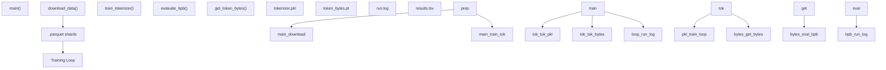

# Version Control and Artifacts

Relevant source files

-   [.gitignore](https://github.com/karpathy/autoresearch/blob/e6d79c12/.gitignore)

## Purpose and Scope

This page documents the version control strategy and artifact management in the `autoresearch` system. It explains the `.gitignore` patterns that separate tracked source code from generated research data, and details the rationale for each exclusion. The system uses a dual-tracking approach: Git history maintains a clean, linear path of successful architectural improvements, while `results.tsv` provides a comprehensive log of every experiment attempted, including failures and crashes.

---

## Git-Tracked Files

The repository tracks a minimal set of files to maintain a clean, reproducible codebase. The version control strategy enforces a core design principle: **only `train.py` is modifiable during autonomous research**.

### Core System Files

All system files are tracked and remain immutable during experiments, with the sole exception of the model definition file:

| File | Purpose | Modifiable by Agent |
| --- | --- | --- |
| `train.py` | Model, optimizer, and training loop | **Yes** - The only file the agent modifies [program.md12-14](https://github.com/karpathy/autoresearch/blob/e6d79c12/program.md?plain=1#L12-L14) |
| `prepare.py` | Data pipeline, tokenizer, and evaluation harness | No - Immutable infrastructure [program.md26-30](https://github.com/karpathy/autoresearch/blob/e6d79c12/program.md?plain=1#L26-L30) |
| `program.md` | Agent instructions and research protocol | No - Immutable [program.md1-5](https://github.com/karpathy/autoresearch/blob/e6d79c12/program.md?plain=1#L1-L5) |
| `pyproject.toml` | Dependency specification and project metadata | No - Immutable [pyproject.toml1-20](https://github.com/karpathy/autoresearch/blob/e6d79c12/pyproject.toml#L1-L20) |
| `uv.lock` | Locked dependency versions for reproducibility | No - Immutable |

The **single modifiable file constraint** ensures that all experiments use identical evaluation infrastructure. When the agent commits changes, only `train.py` differs between commits, making diffs easy to review and understand [program.md91-94](https://github.com/karpathy/autoresearch/blob/e6d79c12/program.md?plain=1#L91-L94)

---

## Git-Ignored Artifacts

The `.gitignore` file defines what artifacts are excluded from version control. This separation ensures the repository contains only essential code while allowing the generation of large data artifacts and experiment outputs.

### Artifact Classification

**Diagram: Artifact Classification and Storage**

Sources: [.gitignore1-24](https://github.com/karpathy/autoresearch/blob/e6d79c12/.gitignore#L1-L24) [program.md95-103](https://github.com/karpathy/autoresearch/blob/e6d79c12/program.md?plain=1#L95-L103)

### Python Build Artifacts

Standard Python-generated files are excluded to prevent build system pollution [.gitignore1-7](https://github.com/karpathy/autoresearch/blob/e6d79c12/.gitignore#L1-L7):

-   `__pycache__/`, `*.py[oc]`: Compiled bytecode.
-   `build/`, `dist/`, `wheels/`, `*.egg-info`: Distribution and build metadata.

### Virtual Environments and Workspaces

Environment directories are excluded to prevent committing large dependency installations or temporary work areas [.gitignore9-13](https://github.com/karpathy/autoresearch/blob/e6d79c12/.gitignore#L9-L13):

-   `.venv`: The local Python environment managed by `uv`.
-   `worktrees/`: Git worktrees used for parallel research runs.
-   `results/`: Output directory for logs from parallel agents.
-   `queue/`: Coordination directory for experiment queuing.

### Agent Session Files

Launcher scripts generate per-session prompt files that are excluded to keep the repository clean [.gitignore15-17](https://github.com/karpathy/autoresearch/blob/e6d79c12/.gitignore#L15-L17):

-   `CLAUDE.md`: Context for the Claude-based agent.
-   `AGENTS.md`: Multi-agent coordination instructions.

### Experiment Results

The `results.tsv` file is explicitly excluded from Git tracking [.gitignore23](https://github.com/karpathy/autoresearch/blob/e6d79c12/.gitignore#L23-L23)

**Rationale for Exclusions:**

1.  **results.tsv**: This file is branch-specific and grows continuously. While critical, tracking it in Git creates merge conflicts if multiple agents run. It is treated as a local database of results [program.md66-70](https://github.com/karpathy/autoresearch/blob/e6d79c12/program.md?plain=1#L66-L70)
2.  **run.log**: This file is ephemeral and overwritten on every experiment run. It contains raw stdout/stderr which is too verbose for version control [program.md99-100](https://github.com/karpathy/autoresearch/blob/e6d79c12/program.md?plain=1#L99-L100)
3.  **Data Shards**: The `.parquet` shards and tokenizer artifacts are stored in `~/.cache/autoresearch/` (outside the repo) because they are large (~100GB) and deterministicly regenerable via `prepare.py`.

---

## The Dual Tracking System

The system maintains two parallel records of research progress: the Git history (The "Frontier") and the TSV log (The "Complete History").

### 1\. Git History: The Optimization Frontier

The research branch maintains a **linear history containing only successful experiments** [program.md9-10](https://github.com/karpathy/autoresearch/blob/e6d79c12/program.md?plain=1#L9-L10)

-   **Keep**: When an experiment improves `val_bpb`, the commit is kept.
-   **Discard**: When results are equal or worse, the commit is reverted via `git reset HEAD~1` [program.md102-103](https://github.com/karpathy/autoresearch/blob/e6d79c12/program.md?plain=1#L102-L103)

This creates a clean Git history where each commit represents a genuine architectural improvement.

### 2\. results.tsv: The Complete Attempt Log

Unlike the Git history, `results.tsv` records every single attempt, including discarded ideas and crashes [program.md101](https://github.com/karpathy/autoresearch/blob/e6d79c12/program.md?plain=1#L101-L101)

**File Structure [program.md66-88](https://github.com/karpathy/autoresearch/blob/e6d79c12/program.md?plain=1#L66-L88):**

| Column | Description |
| --- | --- |
| `commit` | 7-character short hash of the experiment code |
| `val_bpb` | Primary metric (0.000000 if crashed) |
| `memory_gb` | Peak VRAM usage |
| `status` | One of: `keep`, `discard`, or `crash` |
| `description` | Agent's natural language summary of the change |

---

## Data Flow and Artifact Generation

The following diagram illustrates how artifacts are generated and accessed by code entities during the research loop.

**Diagram: Code Entity to Artifact Mapping**

Sources: [prepare.py1-10](https://github.com/karpathy/autoresearch/blob/e6d79c12/prepare.py#L1-L10) [train.py1-20](https://github.com/karpathy/autoresearch/blob/e6d79c12/train.py#L1-L20) [program.md99-101](https://github.com/karpathy/autoresearch/blob/e6d79c12/program.md?plain=1#L99-L101)

### Key Code References

-   **Metric Extraction**: The agent uses shell commands to parse `run.log` and extract `val_bpb` and `peak_vram_mb` [program.md99-100](https://github.com/karpathy/autoresearch/blob/e6d79c12/program.md?plain=1#L99-L100)
-   **Logging Logic**: The agent appends to `results.tsv` using a tab-separated format to avoid comma-parsing errors in descriptions [program.md66-70](https://github.com/karpathy/autoresearch/blob/e6d79c12/program.md?plain=1#L66-L70)
-   **Git Management**: The agent executes `git reset HEAD~1` to prune the code history when an experiment fails to improve the baseline [program.md102-103](https://github.com/karpathy/autoresearch/blob/e6d79c12/program.md?plain=1#L102-L103)

Sources: [.gitignore1-24](https://github.com/karpathy/autoresearch/blob/e6d79c12/.gitignore#L1-L24) [program.md66-103](https://github.com/karpathy/autoresearch/blob/e6d79c12/program.md?plain=1#L66-L103)
