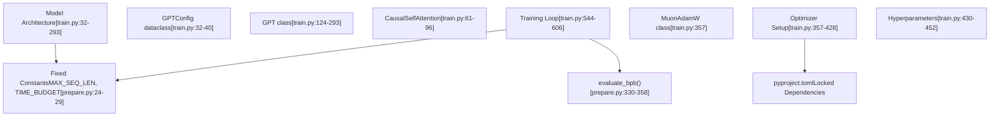
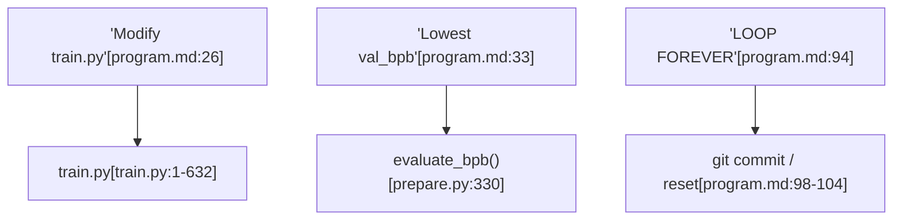

# Advanced Topics

Relevant source files

-   [README.md](https://github.com/karpathy/autoresearch/blob/e6d79c12/README.md?plain=1)
-   [program.md](https://github.com/karpathy/autoresearch/blob/e6d79c12/program.md?plain=1)
-   [train.py](https://github.com/karpathy/autoresearch/blob/e6d79c12/train.py)

This page covers advanced usage patterns, customization strategies, and system extension techniques for the `autoresearch` framework. It serves as a high-level entry point for users looking to push the system beyond its default configuration.

---

## 8.1. Modifying train.py Effectively

The `autoresearch` system maintains a strict boundary between **mutable** and **immutable** components. The agent is permitted to modify only `train.py`, while `prepare.py` and the core system constants remain fixed to ensure fair evaluation.

### Code Modification Boundaries

The following diagram illustrates the relationship between the mutable agent space and the immutable infrastructure.

**Diagram: System Mutability and Code Entity Relationships**

**Sources:** [README.md13-15](https://github.com/karpathy/autoresearch/blob/e6d79c12/README.md?plain=1#L13-L15) [train.py32-40](https://github.com/karpathy/autoresearch/blob/e6d79c12/train.py#L32-L40) [train.py544-606](https://github.com/karpathy/autoresearch/blob/e6d79c12/train.py#L544-L606) [prepare.py24-29](https://github.com/karpathy/autoresearch/blob/e6d79c12/prepare.py#L24-L29)

For a deep dive into modification strategies, see [Modifying train.py Effectively](/karpathy/autoresearch/8.1-modifying-train.py-effectively).

---

## 8.2. Simplicity Criterion

The simplicity criterion is a core philosophical constraint that prevents the agent from introducing "spaghetti code" for marginal gains. It forces a trade-off between raw performance (`val_bpb`) and code maintainability.

**Decision Matrix: Complexity vs. Performance**

| Performance Change | Complexity Change | Decision | Rationale |
| --- | --- | --- | --- |
| Significant Improvement | Added Complexity | **Keep** | Large gains justify architectural cost |
| Minor Improvement | Significant Complexity | **Discard** | "Hacky" code is not worth 0.001 BPB |
| Neutral / Minor Loss | Significant Simplification | **Keep** | Deleting code is a "simplification win" |

For detailed examples of how the agent weighs these factors, see [Simplicity Criterion](/karpathy/autoresearch/8.2-simplicity-criterion). **Sources:** [program.md37](https://github.com/karpathy/autoresearch/blob/e6d79c12/program.md?plain=1#L37-L37)

---

## 8.3. Custom Research Programs

The `program.md` file acts as the "Research Org Code." By modifying this file, humans can redirect the autonomous swarm toward different research objectives, such as memory efficiency, throughput optimization, or alternative architectural paradigms.

**Diagram: Mapping Program Instructions to Code Execution**

**Sources:** [program.md26-33](https://github.com/karpathy/autoresearch/blob/e6d79c12/program.md?plain=1#L26-L33) [program.md94-104](https://github.com/karpathy/autoresearch/blob/e6d79c12/program.md?plain=1#L94-L104) [prepare.py330-358](https://github.com/karpathy/autoresearch/blob/e6d79c12/prepare.py#L330-L358)

For guides on writing effective research instructions, see [Custom Research Programs](/karpathy/autoresearch/8.3-custom-research-programs).

---

## 8.4. Platform Adaptation and Forks

While the core repository is optimized for NVIDIA H100 GPUs, the community has produced forks for MacOS (MLX/MPS) and consumer hardware. Adapting the system requires tuning specific "knobs" in both `prepare.py` and `train.py`.

**Key Tuning Knobs for Small Hardware:**

-   **`MAX_SEQ_LEN`**: Lowering this in [prepare.py26](https://github.com/karpathy/autoresearch/blob/e6d79c12/prepare.py#L26-L26) significantly reduces VRAM.
-   **`DEPTH`**: The primary complexity controller in [train.py451](https://github.com/karpathy/autoresearch/blob/e6d79c12/train.py#L451-L451)
-   **`WINDOW_PATTERN`**: Switching from `"SSSL"` to `"L"` in [train.py436](https://github.com/karpathy/autoresearch/blob/e6d79c12/train.py#L436-L436) can improve efficiency on non-Hopper GPUs.

For platform-specific recommendations and a list of notable forks, see [Platform Adaptation and Forks](/karpathy/autoresearch/8.4-platform-adaptation-and-forks). **Sources:** [README.md71-80](https://github.com/karpathy/autoresearch/blob/e6d79c12/README.md?plain=1#L71-L80) [train.py430-452](https://github.com/karpathy/autoresearch/blob/e6d79c12/train.py#L430-L452)

---

## 8.5. System Limitations and Future Work

The current iteration of `autoresearch` has several architectural constraints:

-   **Single-GPU**: No native support for multi-node or multi-GPU distribution in the default `train.py`.
-   **Fixed Time**: The 5-minute budget [prepare.py27](https://github.com/karpathy/autoresearch/blob/e6d79c12/prepare.py#L27-L27) favors models that converge quickly over those that scale better with long-term compute.
-   **Single-File**: The agent cannot refactor the project structure into multiple modules.

For a discussion on scaling constraints and planned enhancements, see [System Limitations and Future Work](/karpathy/autoresearch/8.5-system-limitations-and-future-work). **Sources:** [README.md61-64](https://github.com/karpathy/autoresearch/blob/e6d79c12/README.md?plain=1#L61-L64) [prepare.py27](https://github.com/karpathy/autoresearch/blob/e6d79c12/prepare.py#L27-L27)
