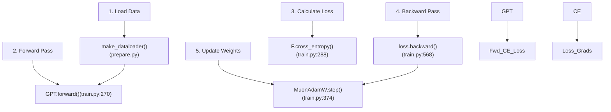
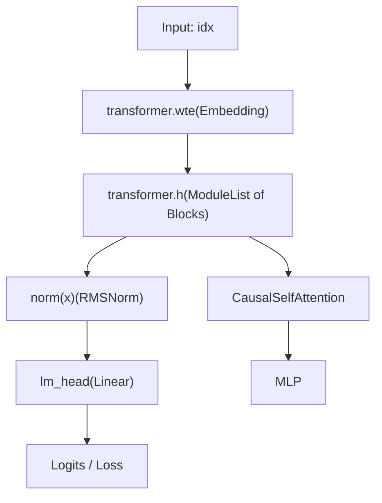

# Modifying train.py Effectively

Relevant source files

-   [program.md](https://github.com/karpathy/autoresearch/blob/e6d79c12/program.md?plain=1)
-   [train.py](https://github.com/karpathy/autoresearch/blob/e6d79c12/train.py)

## Purpose and Scope

This page provides technical best practices and strategies for modifying `train.py`, the only mutable file in the autoresearch system [program.md25-26](https://github.com/karpathy/autoresearch/blob/e6d79c12/program.md?plain=1#L25-L26) It details the implementation of the model architecture, the hybrid optimizer, and the time-constrained training loop. This guide is intended for developers or agents aiming to optimize the `val_bpb` metric within the fixed 5-minute training budget [program.md23-33](https://github.com/karpathy/autoresearch/blob/e6d79c12/program.md?plain=1#L23-L33)

**Sources:** [program.md1-114](https://github.com/karpathy/autoresearch/blob/e6d79c12/program.md?plain=1#L1-L114) [train.py1-632](https://github.com/karpathy/autoresearch/blob/e6d79c12/train.py#L1-L632)

---

## Understanding train.py Structure

The `train.py` file is structured into four functional blocks. Modifications to one block often require corresponding adjustments in others (e.g., adding a layer type in the Model section requires updating the Optimizer's parameter grouping).

| Section | Line Range | Purpose | Key Code Entities |
| --- | --- | --- | --- |
| **GPT Model** | [train.py30-293](https://github.com/karpathy/autoresearch/blob/e6d79c12/train.py#L30-L293) | Architecture definition | `GPTConfig`, `CausalSelfAttention`, `MLP`, `Block`, `GPT` |
| **Optimizer** | [train.py294-428](https://github.com/karpathy/autoresearch/blob/e6d79c12/train.py#L294-L428) | Hybrid Muon/AdamW logic | `adamw_step_fused`, `muon_step_fused`, `MuonAdamW` |
| **Hyperparameters** | [train.py429-453](https://github.com/karpathy/autoresearch/blob/e6d79c12/train.py#L429-L453) | Global configuration | `ASPECT_RATIO`, `TOTAL_BATCH_SIZE`, `MATRIX_LR`, `DEPTH` |
| **Training Loop** | [train.py454-632](https://github.com/karpathy/autoresearch/blob/e6d79c12/train.py#L454-L632) | Execution & Scheduling | `get_lr_multiplier`, `get_muon_momentum`, `train_loader` |

### System Data Flow Diagram

The following diagram maps the relationship between the natural language concepts of "training" and the specific code entities in `train.py`.

**Sources:** [train.py270-293](https://github.com/karpathy/autoresearch/blob/e6d79c12/train.py#L270-L293) [train.py374-428](https://github.com/karpathy/autoresearch/blob/e6d79c12/train.py#L374-L428) [train.py568](https://github.com/karpathy/autoresearch/blob/e6d79c12/train.py#L568-L568) [prepare.py126-149](https://github.com/karpathy/autoresearch/blob/e6d79c12/prepare.py#L126-L149)

---

## Architecture Modifications

Architecture changes modify the `GPT` class and its sub-modules. These are high-leverage changes but must respect the constraints of Flash Attention 3 and `torch.compile`.

### Core Model Components

1.  **Attention Mechanism**: Implemented in `CausalSelfAttention` [train.py61-97](https://github.com/karpathy/autoresearch/blob/e6d79c12/train.py#L61-L97) It uses `fa3.flash_attn_func` [train.py93](https://github.com/karpathy/autoresearch/blob/e6d79c12/train.py#L93-L93) which requires 4D tensors of shape `(B, T, n_head, head_dim)`.
2.  **MLP Block**: A standard feed-forward network using `F.relu(x).square()` [train.py107](https://github.com/karpathy/autoresearch/blob/e6d79c12/train.py#L107-L107)
3.  **Residual Stream**: Employs multi-scale residuals using `resid_lambdas` and `x0_lambdas` [train.py278-280](https://github.com/karpathy/autoresearch/blob/e6d79c12/train.py#L278-L280)
4.  **Value Embeddings**: Implemented via `value_embeds` [train.py139-142](https://github.com/karpathy/autoresearch/blob/e6d79c12/train.py#L139-L142) and mixed into the attention values (`v`) using an input-dependent `ve_gate` [train.py84-87](https://github.com/karpathy/autoresearch/blob/e6d79c12/train.py#L84-L87)

### Model Logic Flow

This diagram illustrates how data flows through the specific architectural entities defined in `train.py`.

**Sources:** [train.py30-293](https://github.com/karpathy/autoresearch/blob/e6d79c12/train.py#L30-L293) [train.py112-121](https://github.com/karpathy/autoresearch/blob/e6d79c12/train.py#L112-L121) [train.py124-293](https://github.com/karpathy/autoresearch/blob/e6d79c12/train.py#L124-L293)

---

## Optimizer and Hyperparameter Tuning

The system uses `MuonAdamW` [train.py357](https://github.com/karpathy/autoresearch/blob/e6d79c12/train.py#L357-L357) a hybrid optimizer. Tuning this effectively requires understanding how parameters are grouped.

### Parameter Grouping Logic

The `setup_optimizer` function [train.py237-267](https://github.com/karpathy/autoresearch/blob/e6d79c12/train.py#L237-L267) splits parameters into three distinct categories:

1.  **Muon Group**: 2D matrices in `transformer.h` (hidden layers) [train.py252-254](https://github.com/karpathy/autoresearch/blob/e6d79c12/train.py#L252-L254)
2.  **AdamW Group (Embeddings)**: `wte` and `value_embeds` [train.py255-257](https://github.com/karpathy/autoresearch/blob/e6d79c12/train.py#L255-L257)
3.  **AdamW Group (Small/1D)**: `lm_head`, `resid_lambdas`, `x0_lambdas`, and all biases/norms [train.py258-260](https://github.com/karpathy/autoresearch/blob/e6d79c12/train.py#L258-L260)

### Effective Tuning Ranges

| Hyperparameter | Code Symbol | Baseline Value | Suggested Tuning |
| --- | --- | --- | --- |
| Matrix LR | `MATRIX_LR` | 0.04 [train.py442](https://github.com/karpathy/autoresearch/blob/e6d79c12/train.py#L442-L442) | 0.01 - 0.08 |
| Embedding LR | `EMBEDDING_LR` | 0.6 [train.py440](https://github.com/karpathy/autoresearch/blob/e6d79c12/train.py#L440-L440) | 0.1 - 1.0 |
| Model Depth | `DEPTH` | 8 [train.py451](https://github.com/karpathy/autoresearch/blob/e6d79c12/train.py#L451-L451) | 6 - 12 |
| Batch Size | `TOTAL_BATCH_SIZE` | 2\*\*19 [train.py448](https://github.com/karpathy/autoresearch/blob/e6d79c12/train.py#L448-L448) | 2**18 - 2**20 |
| Warmdown Ratio | `WARMDOWN_RATIO` | 0.5 [train.py431](https://github.com/karpathy/autoresearch/blob/e6d79c12/train.py#L431-L431) | 0.3 - 0.7 |

**Sources:** [train.py237-267](https://github.com/karpathy/autoresearch/blob/e6d79c12/train.py#L237-L267) [train.py429-453](https://github.com/karpathy/autoresearch/blob/e6d79c12/train.py#L429-L453)

---

## Training Loop and Scheduling

The training loop [train.py544-606](https://github.com/karpathy/autoresearch/blob/e6d79c12/train.py#L544-L606) is governed by a `TIME_BUDGET` (300 seconds) [prepare.py13](https://github.com/karpathy/autoresearch/blob/e6d79c12/prepare.py#L13-L13)

### Learning Rate Schedule

The `get_lr_multiplier` function [train.py519-526](https://github.com/karpathy/autoresearch/blob/e6d79c12/train.py#L519-L526) implements a three-phase schedule:

1.  **Warmup**: Linear increase (default `WARMUP_RATIO` is 0.0).
2.  **Constant**: Max LR maintained.
3.  **Warmdown**: Linear decay to `FINAL_LR_FRAC` [train.py524-526](https://github.com/karpathy/autoresearch/blob/e6d79c12/train.py#L524-L526)

### Timing and Compilation

To ensure fair comparison, the script handles `torch.compile` overhead by:

-   Running 10 warmup steps [train.py579](https://github.com/karpathy/autoresearch/blob/e6d79c12/train.py#L579-L579)
-   Resetting the `start_time` after step 10 [train.py580](https://github.com/karpathy/autoresearch/blob/e6d79c12/train.py#L580-L580)
-   Exiting the loop once `total_training_time >= TIME_BUDGET` [train.py604](https://github.com/karpathy/autoresearch/blob/e6d79c12/train.py#L604-L604)

**Sources:** [train.py519-533](https://github.com/karpathy/autoresearch/blob/e6d79c12/train.py#L519-L533) [train.py544-606](https://github.com/karpathy/autoresearch/blob/e6d79c12/train.py#L544-L606) [prepare.py13](https://github.com/karpathy/autoresearch/blob/e6d79c12/prepare.py#L13-L13)

---

## Best Practices for Modification

1.  **VRAM Management**: If increasing `DEPTH` or `ASPECT_RATIO`, decrease `DEVICE_BATCH_SIZE` [train.py452](https://github.com/karpathy/autoresearch/blob/e6d79c12/train.py#L452-L452) to avoid `OutOfMemoryError`. The script uses `expandable_segments` [train.py8](https://github.com/karpathy/autoresearch/blob/e6d79c12/train.py#L8-L8) to help mitigate fragmentation.
2.  **Simplicity Criterion**: Weigh the `val_bpb` gain against code complexity. A gain of < 0.001 is rarely worth adding > 20 lines of code [program.md37-38](https://github.com/karpathy/autoresearch/blob/e6d79c12/program.md?plain=1#L37-L38)
3.  **Initialization**: If adding new layers, ensure they are initialized in `init_weights()` [train.py150-182](https://github.com/karpathy/autoresearch/blob/e6d79c12/train.py#L150-L182) Note that `c_proj` weights are initialized to zero [train.py161-163](https://github.com/karpathy/autoresearch/blob/e6d79c12/train.py#L161-L163) to start as identity residuals.
4.  **Softcapping**: The model uses a `softcap` of 50.0 on logits [train.py283-286](https://github.com/karpathy/autoresearch/blob/e6d79c12/train.py#L283-L286) Modifying this can significantly impact training stability.
5.  **Rotary Embeddings**: RoPE is precomputed for a length of `sequence_len * 10` [train.py144](https://github.com/karpathy/autoresearch/blob/e6d79c12/train.py#L144-L144) If you significantly increase sequence length, ensure `rotary_seq_len` is updated.

**Sources:** [train.py8](https://github.com/karpathy/autoresearch/blob/e6d79c12/train.py#L8-L8) [train.py150-182](https://github.com/karpathy/autoresearch/blob/e6d79c12/train.py#L150-L182) [train.py283-286](https://github.com/karpathy/autoresearch/blob/e6d79c12/train.py#L283-L286) [program.md37-38](https://github.com/karpathy/autoresearch/blob/e6d79c12/program.md?plain=1#L37-L38)
