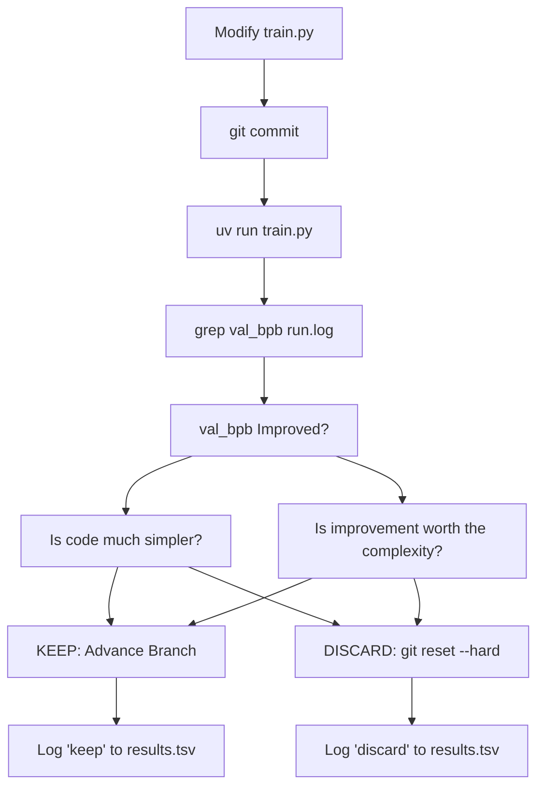
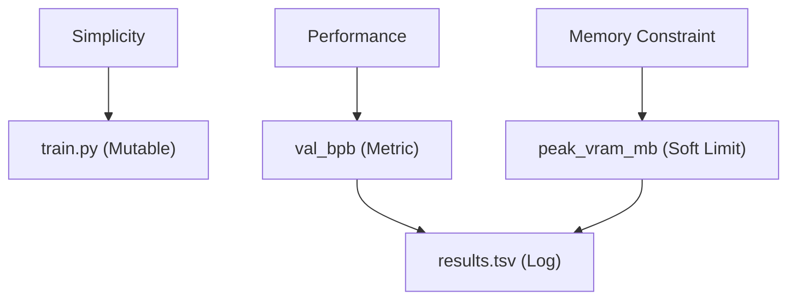

# Simplicity Criterion

Relevant source files

-   [README.md](https://github.com/karpathy/autoresearch/blob/e6d79c12/README.md?plain=1)
-   [program.md](https://github.com/karpathy/autoresearch/blob/e6d79c12/program.md?plain=1)

This page documents the **simplicity criterion**, a qualitative heuristic in the `autoresearch` system that guides agent decision-making when evaluating experimental changes. Unlike hard constraints such as the fixed time budget or immutable evaluation, the simplicity criterion helps the agent balance code complexity against performance improvements.

## Overview

The simplicity criterion is a design principle stating that **all else being equal, simpler is better**. This principle affects how the agent evaluates whether to keep or discard experimental changes to `train.py`. While `val_bpb` improvement is the primary success metric, the simplicity criterion acts as a secondary filter that prevents the codebase from accumulating unnecessary complexity or "hacky" implementations.

Sources: [README.md61-64](https://github.com/karpathy/autoresearch/blob/e6d79c12/README.md?plain=1#L61-L64) [program.md37](https://github.com/karpathy/autoresearch/blob/e6d79c12/program.md?plain=1#L37-L37)

## Definition and Scope

The simplicity criterion is formally defined in the agent's instructions within `program.md`. It specifically targets the trade-off between the magnitude of improvement and the "cost" of the code added to achieve it.

> **Simplicity criterion**: All else being equal, simpler is better. A small improvement that adds ugly complexity is not worth it. Conversely, removing something and getting equal or better results is a great outcome — that's a simplification win. When evaluating whether to keep a change, weigh the complexity cost against the improvement magnitude.

This criterion applies exclusively to `train.py`, as it is the only file the agent is permitted to modify.

Sources: [program.md25-31](https://github.com/karpathy/autoresearch/blob/e6d79c12/program.md?plain=1#L25-L31) [program.md37](https://github.com/karpathy/autoresearch/blob/e6d79c12/program.md?plain=1#L37-L37)

### Complexity vs. Performance Mapping

The system categorizes changes based on their impact on both the metric (`val_bpb`) and the code structure.

| Result Category | Metric Impact | Code Impact | Decision |
| --- | --- | --- | --- |
| **Significant Gain** | Large `val_bpb` drop | Moderate complexity | **KEEP** |
| **Simplification Win** | No change or slight drop | Code deletion/refactor | **KEEP** |
| **Complexity Creep** | Tiny `val_bpb` drop | "Hacky" or large addition | **DISCARD** |
| **Refactor Win** | No change | Significant simplification | **KEEP** |
| **Regression** | `val_bpb` increase | Any | **DISCARD** |

Sources: [program.md37](https://github.com/karpathy/autoresearch/blob/e6d79c12/program.md?plain=1#L37-L37) [program.md103-104](https://github.com/karpathy/autoresearch/blob/e6d79c12/program.md?plain=1#L103-L104)

## Implementation in the Research Loop

The simplicity criterion is integrated into the autonomous `LOOP FOREVER` logic. While the primary branch advancement condition is a lower `val_bpb`, the agent is instructed to use judgment before committing to that advancement.

### Logic Flow for Decision Making

The following diagram illustrates how the `program.md` instructions translate into the decision-making process for the `train.py` modification loop.

**Decision Flow: Simplicity vs. Performance**

Sources: [program.md37-38](https://github.com/karpathy/autoresearch/blob/e6d79c12/program.md?plain=1#L37-L38) [program.md94-106](https://github.com/karpathy/autoresearch/blob/e6d79c12/program.md?plain=1#L94-L106)

## Concrete Examples and Heuristics

The `program.md` provides specific scenarios to calibrate the agent's judgment:

-   **The 0.001 Rule**: A `0.001 val_bpb` improvement that adds 20 lines of "hacky" code is explicitly labeled as "probably not worth it".
-   **Deletion as a Feature**: A `0.001 val_bpb` improvement resulting from deleting code is a "definite keep".
-   **Neutral Performance**: An improvement of approximately `0` that results in much simpler code is a "keep".

Sources: [program.md37](https://github.com/karpathy/autoresearch/blob/e6d79c12/program.md?plain=1#L37-L37)

### Relationship to System Constraints

The simplicity criterion works alongside other constraints defined in the environment:

| Constraint | Type | File Reference |
| --- | --- | --- |
| **Fixed Time Budget** | Hard (5 min) | [README.md64](https://github.com/karpathy/autoresearch/blob/e6d79c12/README.md?plain=1#L64-L64) [program.md23](https://github.com/karpathy/autoresearch/blob/e6d79c12/program.md?plain=1#L23-L23) |
| **VRAM Usage** | Soft | [program.md35](https://github.com/karpathy/autoresearch/blob/e6d79c12/program.md?plain=1#L35-L35) |
| **Single File Edit** | Hard (`train.py` only) | [README.md63](https://github.com/karpathy/autoresearch/blob/e6d79c12/README.md?plain=1#L63-L63) [program.md26](https://github.com/karpathy/autoresearch/blob/e6d79c12/program.md?plain=1#L26-L26) |
| **Metric (val\_bpb)** | Primary Objective | [README.md17](https://github.com/karpathy/autoresearch/blob/e6d79c12/README.md?plain=1#L17-L17) [program.md33](https://github.com/karpathy/autoresearch/blob/e6d79c12/program.md?plain=1#L33-L33) |

Sources: [README.md61-66](https://github.com/karpathy/autoresearch/blob/e6d79c12/README.md?plain=1#L61-L66) [program.md21-40](https://github.com/karpathy/autoresearch/blob/e6d79c12/program.md?plain=1#L21-L40)

## Rationale for the Criterion

The `autoresearch` project is designed to find the most optimal model for a specific platform within a fixed time budget. Without a simplicity criterion, the agent might:

1.  **Overfit the Architecture**: Accumulate dozens of micro-optimizations that only work on the specific 5-minute slice but don't generalize.
2.  **Create Unmaintainable Diffs**: Generate thousands of lines of code that make it impossible for a human to understand the "frontier" of the research in the morning.
3.  **Introduce Fragility**: Complex code is more likely to cause "crashes" (OOM, typos, logic errors) which stall the autonomous loop.

**Natural Language to Code Mapping**

Sources: [README.md11-15](https://github.com/karpathy/autoresearch/blob/e6d79c12/README.md?plain=1#L11-L15) [program.md64-88](https://github.com/karpathy/autoresearch/blob/e6d79c12/program.md?plain=1#L64-L88)

## Results Logging and Status

The simplicity decision is reflected in the `status` column of `results.tsv`.

-   **keep**: The change improved performance sufficiently or simplified the code.
-   **discard**: The change regressed performance or added unjustified complexity.
-   **crash**: The change caused a runtime error (e.g., OOM or syntax error).

The `description` column in `results.tsv` is the agent's opportunity to justify why a change was kept despite complexity, or why a simplification was performed.

Sources: [program.md71-88](https://github.com/karpathy/autoresearch/blob/e6d79c12/program.md?plain=1#L71-L88) [program.md102-106](https://github.com/karpathy/autoresearch/blob/e6d79c12/program.md?plain=1#L102-L106)
