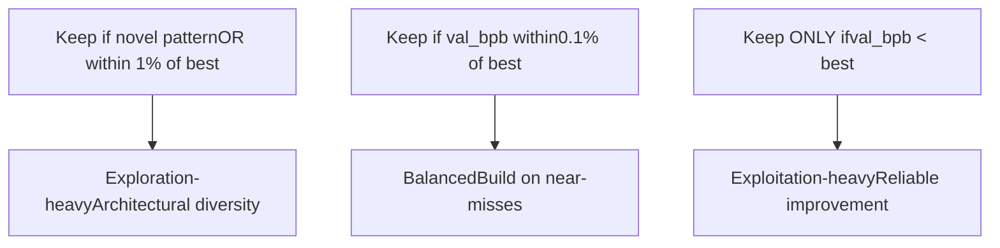
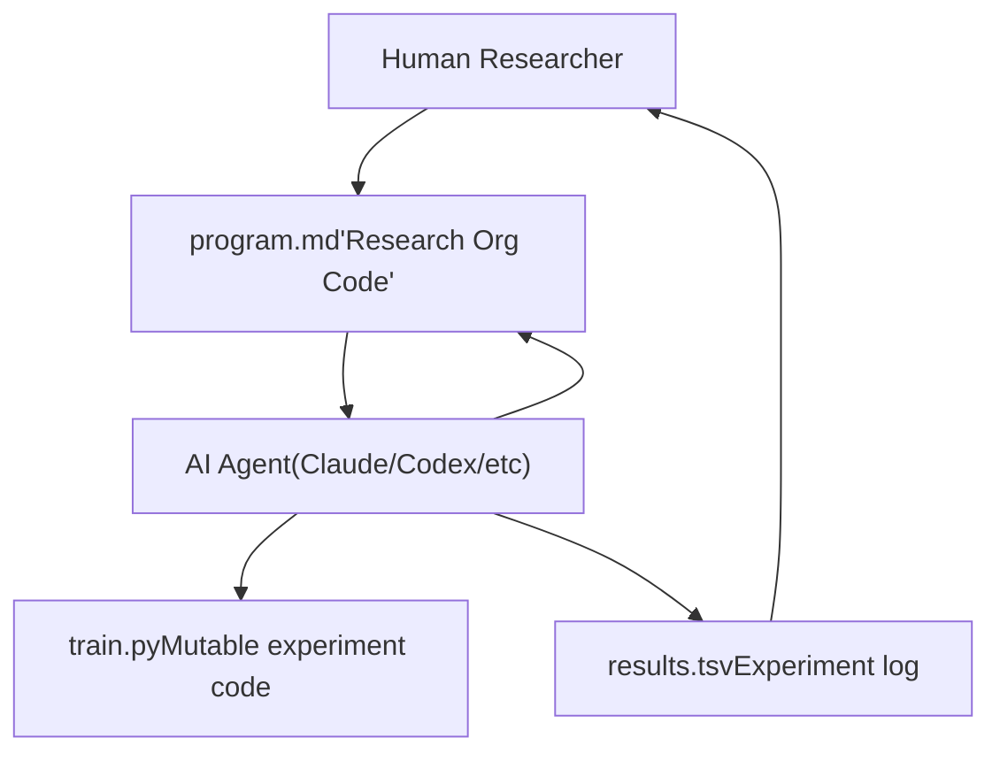

# Custom Research Programs

Relevant source files

-   [README.md](https://github.com/karpathy/autoresearch/blob/e6d79c12/README.md?plain=1)
-   [program.md](https://github.com/karpathy/autoresearch/blob/e6d79c12/program.md?plain=1)

This page documents how to write and customize `program.md` files to guide autonomous agent research toward different objectives. The `program.md` file serves as the "research org code" — the human-editable instructions that define what the agent should optimize for, which constraints it must respect, and how it should operate autonomously.

For information about how the agent executes these instructions in the autonomous loop, see [4.1 The Research Loop](https://github.com/karpathy/autoresearch/blob/e6d79c12/4.1 The Research Loop) For details on what the agent can modify in `train.py`, see [3.1 train.py - The Mutable Core](https://github.com/karpathy/autoresearch/blob/e6d79c12/3.1 train.py - The Mutable Core)

**Sources:** [README.md7](https://github.com/karpathy/autoresearch/blob/e6d79c12/README.md?plain=1#L7-L7) [README.md15](https://github.com/karpathy/autoresearch/blob/e6d79c12/README.md?plain=1#L15-L15) [README.md50](https://github.com/karpathy/autoresearch/blob/e6d79c12/README.md?plain=1#L50-L50) [program.md1-115](https://github.com/karpathy/autoresearch/blob/e6d79c12/program.md?plain=1#L1-L115)

## Purpose of program.md

The `program.md` file is the primary human-agent interface in `autoresearch`. While the human never directly edits `train.py` during autonomous operation, they control research direction by iterating on `program.md`. This file defines:

-   **Research objectives**: What metric to optimize and secondary goals [program.md33](https://github.com/karpathy/autoresearch/blob/e6d79c12/program.md?plain=1#L33-L33)
-   **Operational constraints**: What files can be modified, time budgets, and resource limits [program.md25-31](https://github.com/karpathy/autoresearch/blob/e6d79c12/program.md?plain=1#L25-L31)
-   **Decision criteria**: When to `keep` vs. `discard` experiments [program.md103-104](https://github.com/karpathy/autoresearch/blob/e6d79c12/program.md?plain=1#L103-L104)
-   **Loop behavior**: Initialization procedures, experiment lifecycle, and error handling [program.md90-115](https://github.com/karpathy/autoresearch/blob/e6d79c12/program.md?plain=1#L90-L115)

The default `program.md` is intentionally bare bones [README.md7](https://github.com/karpathy/autoresearch/blob/e6d79c12/README.md?plain=1#L7-L7) The meta-research objective is to iterate on this file to discover the "research org code" that achieves the fastest research progress.

**Sources:** [README.md7](https://github.com/karpathy/autoresearch/blob/e6d79c12/README.md?plain=1#L7-L7) [README.md15](https://github.com/karpathy/autoresearch/blob/e6d79c12/README.md?plain=1#L15-L15) [README.md50](https://github.com/karpathy/autoresearch/blob/e6d79c12/README.md?plain=1#L50-L50) [program.md33](https://github.com/karpathy/autoresearch/blob/e6d79c12/program.md?plain=1#L33-L33) [program.md25-31](https://github.com/karpathy/autoresearch/blob/e6d79c12/program.md?plain=1#L25-L31) [program.md103-104](https://github.com/karpathy/autoresearch/blob/e6d79c12/program.md?plain=1#L103-L104) [program.md90-115](https://github.com/karpathy/autoresearch/blob/e6d79c12/program.md?plain=1#L90-L115)

## Anatomy of the Default program.md

The default `program.md` [program.md1-115](https://github.com/karpathy/autoresearch/blob/e6d79c12/program.md?plain=1#L1-L115) contains five major sections that structure agent behavior:

**Default program.md structure**

```mermaid
flowchart TD
    HEADER["# autoresearch(Context header)"]
    SETUP["## SetupLines 5-19"]
    EXPERIMENT["## ExperimentationLines 21-39"]
    OUTPUT["## Output formatLines 41-56"]
    LOGGING["## Logging resultsLines 64-88"]
    LOOP["## The experiment loopLines 90-115"]
    CREATE_BRANCH["git checkout -b autoresearch/tag"]
    READ_FILES["Read README.md, prepare.py, train.py"]
    VERIFY_DATA["Check ~/.cache/autoresearch/"]
    INIT_TSV["Initialize results.tsv"]
    MODIFY_TRAIN["Edit train.py"]
    RUN_EXP["uv run train.py"]
    EXTRACT_METRIC["grep val_bpb run.log"]
    APPEND_TSV["Append to results.tsv"]
    GIT_COMMIT["git commit"]
    GIT_RESET["git reset --hard"]
    LOOP_FOREVER["Infinite autonomous loop"]
    CRASH_HANDLE["tail -n 50 run.log"]
    NEVER_STOP["Continue indefinitely"]

    HEADER --> SETUP
    SETUP --> CREATE_BRANCH
    SETUP --> READ_FILES
    SETUP --> VERIFY_DATA
    SETUP --> INIT_TSV
    EXPERIMENT --> MODIFY_TRAIN
    EXPERIMENT --> RUN_EXP
    OUTPUT --> EXTRACT_METRIC
    LOGGING --> APPEND_TSV
    LOOP --> LOOP_FOREVER
    LOOP --> GIT_COMMIT
    LOOP --> GIT_RESET
    LOOP --> CRASH_HANDLE
    LOOP --> NEVER_STOP
```

**Sources:** [program.md1-115](https://github.com/karpathy/autoresearch/blob/e6d79c12/program.md?plain=1#L1-L115)

### Section Breakdown

| Section | Lines | Purpose | Key Instructions |
| --- | --- | --- | --- |
| **Setup** | [program.md5-19](https://github.com/karpathy/autoresearch/blob/e6d79c12/program.md?plain=1#L5-L19) | One-time initialization | Create branch, read context files, verify data, initialize `results.tsv`. |
| **Experimentation** | [program.md21-39](https://github.com/karpathy/autoresearch/blob/e6d79c12/program.md?plain=1#L21-L39) | Define scope and goals | Can modify `train.py`, cannot modify `prepare.py`, goal is lowest `val_bpb`. |
| **Output format** | [program.md41-56](https://github.com/karpathy/autoresearch/blob/e6d79c12/program.md?plain=1#L41-L56) | Specify script output | Shows example summary with `val_bpb`, `peak_vram_mb`, `mfu_percent`, etc. |
| **Logging results** | [program.md64-88](https://github.com/karpathy/autoresearch/blob/e6d79c12/program.md?plain=1#L64-L88) | Define `results.tsv` format | 5-column TSV: commit, val\_bpb, memory\_gb, status, description. |
| **The experiment loop** | [program.md90-115](https://github.com/karpathy/autoresearch/blob/e6d79c12/program.md?plain=1#L90-L115) | Autonomous directives | LOOP FOREVER, commit on improvement, reset on failure, NEVER STOP. |

**Sources:** [program.md5-19](https://github.com/karpathy/autoresearch/blob/e6d79c12/program.md?plain=1#L5-L19) [program.md21-39](https://github.com/karpathy/autoresearch/blob/e6d79c12/program.md?plain=1#L21-L39) [program.md41-56](https://github.com/karpathy/autoresearch/blob/e6d79c12/program.md?plain=1#L41-L56) [program.md64-88](https://github.com/karpathy/autoresearch/blob/e6d79c12/program.md?plain=1#L64-L88) [program.md90-115](https://github.com/karpathy/autoresearch/blob/e6d79c12/program.md?plain=1#L90-L115)

## Key Instruction Categories

### Constraints and Boundaries

The `program.md` file establishes clear boundaries on what the agent can and cannot modify:

**Allowed modifications** [program.md25-26](https://github.com/karpathy/autoresearch/blob/e6d79c12/program.md?plain=1#L25-L26):

-   Modify `train.py` — this is the only file the agent edits. Everything inside is fair game: architecture, optimizer, hyperparameters, training loop, batch size, etc.

**Prohibited modifications** [program.md28-31](https://github.com/karpathy/autoresearch/blob/e6d79c12/program.md?plain=1#L28-L31):

-   Modify `prepare.py`. It is read-only and contains the fixed evaluation harness.
-   Install new packages or add dependencies to `pyproject.toml`.
-   Modify the `evaluate_bpb` function in `prepare.py`.

These constraints ensure fair comparison across experiments by fixing the evaluation infrastructure [program.md31](https://github.com/karpathy/autoresearch/blob/e6d79c12/program.md?plain=1#L31-L31)

**Sources:** [program.md25-31](https://github.com/karpathy/autoresearch/blob/e6d79c12/program.md?plain=1#L25-L31) [prepare.py1-255](https://github.com/karpathy/autoresearch/blob/e6d79c12/prepare.py#L1-L255)

### Optimization Objective

The default program defines a primary metric and secondary considerations:

-   **Primary metric**: The goal is to get the lowest `val_bpb` [program.md33](https://github.com/karpathy/autoresearch/blob/e6d79c12/program.md?plain=1#L33-L33) Since the time budget is fixed at 5 minutes, the agent does not need to worry about training time.
-   **VRAM**: Soft constraint. Increases are acceptable for meaningful `val_bpb` gains [program.md35](https://github.com/karpathy/autoresearch/blob/e6d79c12/program.md?plain=1#L35-L35)
-   **Simplicity criterion**: All else being equal, simpler is better [program.md37](https://github.com/karpathy/autoresearch/blob/e6d79c12/program.md?plain=1#L37-L37) A 0.001 improvement that adds 20 lines of hacky code is not worth it, but removing code while maintaining performance is a win.

**Sources:** [program.md33-37](https://github.com/karpathy/autoresearch/blob/e6d79c12/program.md?plain=1#L33-L37)

### Loop Control Directives

The experiment loop section [program.md90-115](https://github.com/karpathy/autoresearch/blob/e6d79c12/program.md?plain=1#L90-L115) contains critical directives that control autonomous behavior:

**Autonomous Loop State Machine**

The **NEVER STOP** directive [program.md112](https://github.com/karpathy/autoresearch/blob/e6d79c12/program.md?plain=1#L112-L112) is critical for autonomous operation, ensuring the agent continues working while the human is away.

**Sources:** [program.md90-115](https://github.com/karpathy/autoresearch/blob/e6d79c12/program.md?plain=1#L90-L115) [program.md112](https://github.com/karpathy/autoresearch/blob/e6d79c12/program.md?plain=1#L112-L112)

## Customization Strategies

### Modifying Research Objectives

The primary customization point is changing what the agent optimizes for.

| Objective | Example Instruction |
| --- | --- |
| **Maximize throughput** | "Keep if `mfu_percent` increases OR `val_bpb` decreases." |
| **Minimize VRAM** | "Goal: achieve `val_bpb` < 1.0 with lowest possible `peak_vram_mb`." |
| **Simplify architecture** | "Keep if `num_params_M` decreases while `val_bpb` stays within 0.5% of baseline." |
| **Explore architectures** | "Keep if `val_bpb` is within 1% of best AND introduces a novel architectural pattern." |

**Example: Multi-objective optimization** Replace [program.md33](https://github.com/karpathy/autoresearch/blob/e6d79c12/program.md?plain=1#L33-L33) with:

> "The goal: Pareto-optimize val\_bpb and peak\_vram\_mb. Keep an experiment if it improves either metric without significantly regressing the other (>5% worse)."

**Sources:** [program.md33](https://github.com/karpathy/autoresearch/blob/e6d79c12/program.md?plain=1#L33-L33) [program.md35](https://github.com/karpathy/autoresearch/blob/e6d79c12/program.md?plain=1#L35-L35) [program.md37](https://github.com/karpathy/autoresearch/blob/e6d79c12/program.md?plain=1#L37-L37)

### Adjusting Decision Criteria

The keep/discard logic [program.md103-104](https://github.com/karpathy/autoresearch/blob/e6d79c12/program.md?plain=1#L103-L104) can be customized to change exploration behavior.

**Exploration Strategies**

**Sources:** [program.md103-104](https://github.com/karpathy/autoresearch/blob/e6d79c12/program.md?plain=1#L103-L104)

### Crash Handling Strategies

The default crash handling [program.md110](https://github.com/karpathy/autoresearch/blob/e6d79c12/program.md?plain=1#L110-L110) attempts simple fixes. Users can specify more aggressive recovery:

> **Crashes**: If a run crashes, parse the stack trace with `tail -n 100 run.log`. If it is an OOM, attempt to reduce `DEPTH` or `DEVICE_BATCH_SIZE` once before giving up.

**Sources:** [program.md110](https://github.com/karpathy/autoresearch/blob/e6d79c12/program.md?plain=1#L110-L110) [program.md101](https://github.com/karpathy/autoresearch/blob/e6d79c12/program.md?plain=1#L101-L101)

### Timeout and Budget Modifications

The default 5-minute budget [program.md23](https://github.com/karpathy/autoresearch/blob/e6d79c12/program.md?plain=1#L23-L23) can be adjusted for different platforms. On slower hardware (Macbooks, etc.), users might want to adjust the budget or follow the platform-specific recommendations in [README.md71-80](https://github.com/karpathy/autoresearch/blob/e6d79c12/README.md?plain=1#L71-L80)

**Sources:** [program.md23](https://github.com/karpathy/autoresearch/blob/e6d79c12/program.md?plain=1#L23-L23) [README.md71-80](https://github.com/karpathy/autoresearch/blob/e6d79c12/README.md?plain=1#L71-L80)

## Writing Effective Agent Instructions

### Clarity and Specificity

Effective instructions are unambiguous. Compare:

-   ❌ **Vague**: "Try to improve the model somehow."
-   ✅ **Specific**: "Modify the GPT model architecture in `train.py`. Valid changes include adjusting `DEPTH` (lines 20-21), changing `n_head` (line 27), or modifying `WINDOW_PATTERN` (line 29)."

### Constraining the Search Space

When targeting specific research areas, narrow the scope to prevent the agent from wandering:

**Example: Optimizer-focused research**

> "For this experiment run, focus ONLY on modifications to the optimizer in `train.py` (lines 290-350). Do NOT modify model architecture or batch sizes."

**Sources:** [program.md25-31](https://github.com/karpathy/autoresearch/blob/e6d79c12/program.md?plain=1#L25-L31) [train.py290-350](https://github.com/karpathy/autoresearch/blob/e6d79c12/train.py#L290-L350)

## Relationship to System Architecture

The `program.md` file sits at the meta-level of the `autoresearch` hierarchy:

**Meta-Optimization Loop**

The human operates exclusively through `program.md`, never directly touching `train.py` during autonomous operation [README.md7](https://github.com/karpathy/autoresearch/blob/e6d79c12/README.md?plain=1#L7-L7) This creates a meta-optimization loop where the human iterates on the "research org code" to maximize research velocity.

**Sources:** [README.md7](https://github.com/karpathy/autoresearch/blob/e6d79c12/README.md?plain=1#L7-L7) [README.md15](https://github.com/karpathy/autoresearch/blob/e6d79c12/README.md?plain=1#L15-L15) [program.md1-115](https://github.com/karpathy/autoresearch/blob/e6d79c12/program.md?plain=1#L1-L115)
