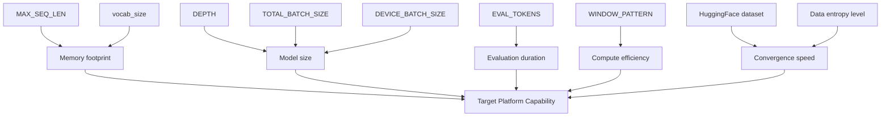
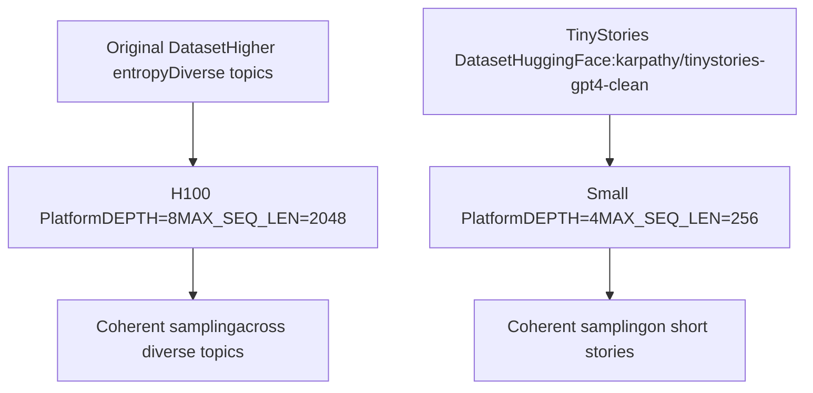
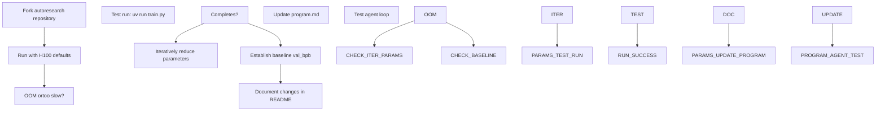

# Platform Adaptation and Forks

Relevant source files

-   [README.md](https://github.com/karpathy/autoresearch/blob/e6d79c12/README.md?plain=1)
-   [train.py](https://github.com/karpathy/autoresearch/blob/e6d79c12/train.py)

This page documents the strategy for adapting autoresearch to different hardware platforms through forking and parameter tuning. The core repository targets high-end NVIDIA H100 GPUs, but community forks enable operation on consumer hardware including MacOS and Windows RTX systems.

For general system parameters and their roles, see **3.3 System Parameters**. For modifying `train.py` during agent operation, see **8.1 Modifying train.py Effectively**.

## Fork Philosophy

The autoresearch core repository intentionally maintains a narrow platform focus to avoid code bloat and complexity. Rather than incorporating multi-platform abstractions, conditional logic, and fallback implementations, the project encourages forking for platform-specific adaptations. This design decision prioritizes:

1.  **Code clarity** - The reference implementation remains simple and readable.
2.  **H100 optimization** - Defaults are tuned for frontier hardware without compromise.
3.  **Community ownership** - Fork maintainers optimize for their target platforms.
4.  **Focused scope** - Core development concentrates on research methodology, not platform support.

The full-featured [nanochat](https://github.com/karpathy/autoresearch/blob/e6d79c12/nanochat) repository demonstrates multi-platform patterns (Flash Attention 3 fallbacks, generic device support, autodetection) that fork maintainers can reference when adapting autoresearch [README.md68-70](https://github.com/karpathy/autoresearch/blob/e6d79c12/README.md?plain=1#L68-L70)

**Sources:** [README.md68-70](https://github.com/karpathy/autoresearch/blob/e6d79c12/README.md?plain=1#L68-L70)

## Existing Platform Forks

Notable forks provide platform-specific adaptations:

| Fork | Platform | Repository | Key Adaptations |
| --- | --- | --- | --- |
| autoresearch-macos | MacOS | [miolini/autoresearch-macos](https://github.com/karpathy/autoresearch/blob/e6d79c12/miolini/autoresearch-macos) | MacOS compatibility layer |
| autoresearch-mlx | MacOS MLX | [trevin-creator/autoresearch-mlx](https://github.com/karpathy/autoresearch/blob/e6d79c12/trevin-creator/autoresearch-mlx) | Apple MLX backend |
| autoresearch-win-rtx | Windows RTX | [jsegov/autoresearch-win-rtx](https://github.com/karpathy/autoresearch/blob/e6d79c12/jsegov/autoresearch-win-rtx) | Windows + consumer NVIDIA GPUs |

Each fork maintains the core autoresearch architecture (immutable `prepare.py`, mutable `train.py`, agent-driven experimentation) while adapting infrastructure and default parameters for their target platform [README.md83-87](https://github.com/karpathy/autoresearch/blob/e6d79c12/README.md?plain=1#L83-L87)

**Sources:** [README.md83-87](https://github.com/karpathy/autoresearch/blob/e6d79c12/README.md?plain=1#L83-L87)

## Parameter Tuning Strategy

Adapting autoresearch to smaller compute platforms requires systematic parameter reduction across both infrastructure (`prepare.py`) and model configuration (`train.py`).

### Parameter Location Mapping

**Sources:** [README.md71-80](https://github.com/karpathy/autoresearch/blob/e6d79c12/README.md?plain=1#L71-L80) [train.py32-40](https://github.com/karpathy/autoresearch/blob/e6d79c12/train.py#L32-L40)

## Infrastructure Parameters (prepare.py)

These parameters are set during one-time data preparation and affect the fixed evaluation infrastructure.

### MAX\_SEQ\_LEN

**Location:** [prepare.py17](https://github.com/karpathy/autoresearch/blob/e6d79c12/prepare.py#L17-L17)
**Default:** 2048
**Recommended range for small platforms:** 256-512
Controls the maximum sequence length for training and evaluation. Reducing this parameter linearly decreases memory consumption and compute per forward/backward pass [README.md75](https://github.com/karpathy/autoresearch/blob/e6d79c12/README.md?plain=1#L75-L75)

### vocab\_size

**Location:** [train.py35](https://github.com/karpathy/autoresearch/blob/e6d79c12/train.py#L35-L35) (and tokenizer training configuration)
**Default:** 32768 (Note: README mentions 8192 as a baseline for smaller runs)
**Recommended range for small platforms:** 256-4096
Controls BPE tokenizer vocabulary size. Reducing this parameter decreases embedding table size (`vocab_size × n_embd`). One can even use a byte-level tokenizer with 256 bytes [README.md74](https://github.com/karpathy/autoresearch/blob/e6d79c12/README.md?plain=1#L74-L74)

### EVAL\_TOKENS

**Location:** [prepare.py20](https://github.com/karpathy/autoresearch/blob/e6d79c12/prepare.py#L20-L20)
**Default:** 40 \* 524288
**Tuning guidance:** Decrease proportionally with model size reduction.
Controls total tokens evaluated during `evaluate_bpb()` calls. Reducing this parameter speeds up validation measurement but increases variance [README.md76](https://github.com/karpathy/autoresearch/blob/e6d79c12/README.md?plain=1#L76-L76)

**Sources:** [README.md73-77](https://github.com/karpathy/autoresearch/blob/e6d79c12/README.md?plain=1#L73-L77) [prepare.py17-20](https://github.com/karpathy/autoresearch/blob/e6d79c12/prepare.py#L17-L20) [train.py35](https://github.com/karpathy/autoresearch/blob/e6d79c12/train.py#L35-L35)

## Model Parameters (train.py)

These parameters control model architecture and training dynamics.

### DEPTH

**Location:** [train.py348](https://github.com/karpathy/autoresearch/blob/e6d79c12/train.py#L348-L348)
**Default:** 8
**Recommended range for small platforms:** 2-4
The primary single knob controlling model complexity. Many derived variables are functions of this [README.md77](https://github.com/karpathy/autoresearch/blob/e6d79c12/README.md?plain=1#L77-L77)

### WINDOW\_PATTERN

**Location:** [train.py40](https://github.com/karpathy/autoresearch/blob/e6d79c12/train.py#L40-L40)
**Default:** "SSSL"
**Recommended for small platforms:** "L"
Controls alternating attention patterns. "SSSL" uses alternating Sliding window (banded) and Local (full) attention. On platforms without efficient banded kernels, "L" (all local) may be more efficient [README.md78](https://github.com/karpathy/autoresearch/blob/e6d79c12/README.md?plain=1#L78-L78)

### TOTAL\_BATCH\_SIZE

**Location:** [train.py349](https://github.com/karpathy/autoresearch/blob/e6d79c12/train.py#L349-L349)
**Default:** 524288 (2^19)
**Recommended range for small platforms:** 16384-65536 (2^14 to 2^16)
Controls total tokens per gradient update. Reducing this parameter increases update frequency but may require LR schedule adjustment [README.md79](https://github.com/karpathy/autoresearch/blob/e6d79c12/README.md?plain=1#L79-L79)

### DEVICE\_BATCH\_SIZE

**Location:** [train.py352](https://github.com/karpathy/autoresearch/blob/e6d79c12/train.py#L352-L352)
**Default:** Derived from `DEPTH` and `MAX_SEQ_LEN`
Controls the actual GPU batch size. When reducing `MAX_SEQ_LEN`, increasing `DEVICE_BATCH_SIZE` helps maintain tokens per forward/backward pass [README.md75](https://github.com/karpathy/autoresearch/blob/e6d79c12/README.md?plain=1#L75-L75)

**Sources:** [README.md75-79](https://github.com/karpathy/autoresearch/blob/e6d79c12/README.md?plain=1#L75-L79) [train.py40](https://github.com/karpathy/autoresearch/blob/e6d79c12/train.py#L40-L40) [train.py348-352](https://github.com/karpathy/autoresearch/blob/e6d79c12/train.py#L348-L352)

## Dataset Selection

For small compute platforms, dataset choice critically affects convergence speed and model quality.

### Recommended Dataset: TinyStories

The [TinyStories dataset](https://huggingface.co/datasets/karpathy/tinystories-gpt4-clean) contains GPT-4 generated short stories with significantly lower entropy. This allows small models to produce coherent results and visible progress [README.md73](https://github.com/karpathy/autoresearch/blob/e6d79c12/README.md?plain=1#L73-L73)

**Sources:** [README.md73-74](https://github.com/karpathy/autoresearch/blob/e6d79c12/README.md?plain=1#L73-L74)

## Scaling Strategy Decision Tree

The following diagram illustrates the decision process for parameter tuning:

```mermaid
flowchart TD
    START["Start: H100 defaultsDEPTH=8, MAX_SEQ_LEN=2048"]
    CHECK_MEM["Does training fitin GPU memory?"]
    CHECK_TIME["Does experimentcomplete in ~5 minutes?"]
    REDUCE_SEQ["Reduce MAX_SEQ_LEN2048→1024→512→256"]
    CHECK_STILL_OOM["Still OOM?"]
    REDUCE_DEPTH["Reduce DEPTH8→6→4→2"]
    COMPENSATE_BATCH["Increase DEVICE_BATCH_SIZE"]
    CHECK_STILL_OOM2["Still OOM?"]
    REDUCE_VOCAB["Reduce vocab_size"]
    SIMPLIFY_ATTN["Change WINDOW_PATTERNSSSL→L"]
    CHECK_EVAL["Is evaluationtoo slow?"]
    REDUCE_BATCH["Reduce TOTAL_BATCH_SIZE"]
    REDUCE_EVAL["Reduce EVAL_TOKENS"]
    CONSIDER_DATA["Are val_bpb valuesimproving slowly?"]
    SWITCH_DATA["Switch to TinyStories"]
    DONE["Configuration complete"]

    START --> CHECK_MEM
    CHECK --> MEM_CHECK_TIME
    CHECK --> MEM_REDUCE_SEQ
    REDUCE --> SEQ_CHECK_STILL_OOM
    CHECK --> STILL_OOM_REDUCE_DEPTH
    CHECK --> STILL_OOM_COMPENSATE_BATCH
    REDUCE --> DEPTH_CHECK_STILL_OOM2
    CHECK --> STILL_OOM2_REDUCE_VOCAB
    CHECK --> STILL_OOM2_CHECK_TIME
    REDUCE --> VOCAB_CHECK_TIME
    COMPENSATE --> BATCH_CHECK_TIME
    CHECK --> TIME_SIMPLIFY_ATTN
    CHECK --> TIME_CHECK_EVAL
    SIMPLIFY --> ATTN_REDUCE_BATCH
    REDUCE --> BATCH_CHECK_EVAL
    CHECK --> EVAL_REDUCE_EVAL
    CHECK --> EVAL_CONSIDER_DATA
    REDUCE --> EVAL_CONSIDER_DATA
    CONSIDER --> DATA_SWITCH_DATA
    CONSIDER --> DATA_DONE
```

**Sources:** [README.md71-80](https://github.com/karpathy/autoresearch/blob/e6d79c12/README.md?plain=1#L71-L80)

## Platform-Specific Considerations

### MacOS Platforms

-   **Challenges:** No CUDA support (requires MPS or MLX), integrated VRAM constraints.
-   **Recommendations:** Start with `DEPTH=2-4`, `MAX_SEQ_LEN=256-512`, and `WINDOW_PATTERN="L"`. Use TinyStories dataset [README.md71-80](https://github.com/karpathy/autoresearch/blob/e6d79c12/README.md?plain=1#L71-L80)

### Windows RTX Consumer GPUs

-   **Challenges:** VRAM constraints (8-16GB), different kernel performance vs. datacenter GPUs.
-   **Recommendations:** Start with `DEPTH=4-6`, monitor `peak_vram_mb` in `results.tsv`, and adjust `DEVICE_BATCH_SIZE` accordingly [README.md71-80](https://github.com/karpathy/autoresearch/blob/e6d79c12/README.md?plain=1#L71-L80)

**Sources:** [README.md68-80](https://github.com/karpathy/autoresearch/blob/e6d79c12/README.md?plain=1#L68-L80)

## Fork Adaptation Workflow

**Sources:** [README.md68-87](https://github.com/karpathy/autoresearch/blob/e6d79c12/README.md?plain=1#L68-L87)

## Maintaining Comparability

Results are **not comparable across platforms**. The fixed 5-minute time budget means:

1.  Different platforms train different numbers of steps.
2.  Different model sizes achieve different `val_bpb` values.
3.  Optimal hyperparameters vary by platform.

Each fork establishes its own baseline. The process optimizes for the specific platform's constraints [README.md64-65](https://github.com/karpathy/autoresearch/blob/e6d79c12/README.md?plain=1#L64-L65)

**Sources:** [README.md64-65](https://github.com/karpathy/autoresearch/blob/e6d79c12/README.md?plain=1#L64-L65)

## Summary Table: Parameter Tuning Reference

| Parameter | File | H100 Default | Small Platform Range | Primary Effect |
| --- | --- | --- | --- | --- |
| `MAX_SEQ_LEN` | `prepare.py` | 2048 | 256-512 | Memory, compute/pass |
| `vocab_size` | `train.py` | 32768 | 256-4096 | Embedding table size |
| `EVAL_TOKENS` | `prepare.py` | 40\*524288 | 10\*524288 | Validation time |
| `DEPTH` | `train.py` | 8 | 2-4 | Model size |
| `WINDOW_PATTERN` | `train.py` | "SSSL" | "L" | Attention efficiency |
| `TOTAL_BATCH_SIZE` | `train.py` | 524288 | 16384-65536 | Gradient accumulation |
| `DEVICE_BATCH_SIZE` | `train.py` | Derived | Adjust for memory | GPU memory usage |

**Sources:** [README.md71-80](https://github.com/karpathy/autoresearch/blob/e6d79c12/README.md?plain=1#L71-L80) [train.py32-40](https://github.com/karpathy/autoresearch/blob/e6d79c12/train.py#L32-L40) [prepare.py17-20](https://github.com/karpathy/autoresearch/blob/e6d79c12/prepare.py#L17-L20)
