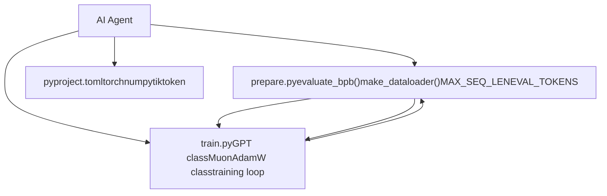
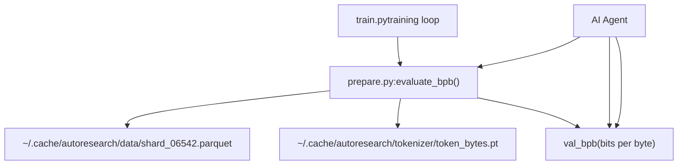

# System Limitations and Future Work

Relevant source files

-   [README.md](https://github.com/karpathy/autoresearch/blob/e6d79c12/README.md?plain=1)
-   [program.md](https://github.com/karpathy/autoresearch/blob/e6d79c12/program.md?plain=1)

This page documents the known limitations of the autoresearch system's current design, the tradeoffs made to achieve its goals, and potential extensions or improvements for future versions. The system is designed as a "bare bones baseline" [README.md7](https://github.com/karpathy/autoresearch/blob/e6d79c12/README.md?plain=1#L7-L7) to demonstrate autonomous research, prioritizing simplicity and reproducibility over feature completeness.

---

## Design Constraints and Their Impact

The autoresearch system deliberately enforces several hard constraints to enable autonomous operation and fair comparison. While these constraints simplify the system and ensure experimental validity, they also impose fundamental limitations on what kinds of research can be conducted.

### Single-File Modification Constraint

The most significant architectural limitation is that only `train.py` can be modified by the agent. All other components—`prepare.py` and `pyproject.toml`—are immutable.

**Current Limitation:**

**Sources:** [README.md13-15](https://github.com/karpathy/autoresearch/blob/e6d79c12/README.md?plain=1#L13-L15) [README.md63-64](https://github.com/karpathy/autoresearch/blob/e6d79c12/README.md?plain=1#L63-L64) [program.md12-14](https://github.com/karpathy/autoresearch/blob/e6d79c12/program.md?plain=1#L12-L14) [program.md28-31](https://github.com/karpathy/autoresearch/blob/e6d79c12/program.md?plain=1#L28-L31)

**Impact:**

-   **Fixed Context:** Cannot experiment with different sequence lengths as `MAX_SEQ_LEN` is fixed in `prepare.py` [prepare.py10](https://github.com/karpathy/autoresearch/blob/e6d79c12/prepare.py#L10-L10)
-   **Static Evaluation:** Cannot modify the evaluation metric `val_bpb` or the amount of data used for validation (`EVAL_TOKENS`) [prepare.py12](https://github.com/karpathy/autoresearch/blob/e6d79c12/prepare.py#L12-L12)
-   **Dependency Lock:** Cannot add new libraries (e.g., custom kernels or logging tools) because `pyproject.toml` is off-limits [program.md30](https://github.com/karpathy/autoresearch/blob/e6d79c12/program.md?plain=1#L30-L30)
-   **Data Pipeline:** Cannot modify the dataloader implementation or the BOS-aligned packing strategy [prepare.py157-195](https://github.com/karpathy/autoresearch/blob/e6d79c12/prepare.py#L157-L195)

---

### Fixed Time Budget Limitation

All experiments run for exactly 5 minutes of wall-clock training time. This is enforced in `train.py` by checking the elapsed time against the budget.

**Current Implementation Constraints:**

| Constraint | Value | Location | Modifiable |
| --- | --- | --- | --- |
| Training time | 5 minutes | `train.py:TIME_BUDGET` | Yes (by Agent) |
| Sequence length | 2048 | `prepare.py:MAX_SEQ_LEN` | No |
| Eval tokens | ~20.9M | `prepare.py:EVAL_TOKENS` | No |
| GPU count | 1 | System Design | No |

**Sources:** [README.md17-18](https://github.com/karpathy/autoresearch/blob/e6d79c12/README.md?plain=1#L17-L18) [README.md64-65](https://github.com/karpathy/autoresearch/blob/e6d79c12/README.md?plain=1#L64-L65) [program.md23](https://github.com/karpathy/autoresearch/blob/e6d79c12/program.md?plain=1#L23-L23) [prepare.py10-12](https://github.com/karpathy/autoresearch/blob/e6d79c12/prepare.py#L10-L12)

**Limitations:**

1.  **No Scaling Law Exploration:** Research on scaling laws requires varying both model size and training duration; a fixed budget prevents exploring long-term convergence [README.md64-65](https://github.com/karpathy/autoresearch/blob/e6d79c12/README.md?plain=1#L64-L65)
2.  **Platform Dependency:** Because the budget is wall-clock time, results on an H100 are not directly comparable to results on a consumer GPU, as the H100 will process significantly more tokens in 5 minutes [README.md64-65](https://github.com/karpathy/autoresearch/blob/e6d79c12/README.md?plain=1#L64-L65)
3.  **Startup Overhead:** The 5-minute timer typically excludes startup/compilation [README.md17-18](https://github.com/karpathy/autoresearch/blob/e6d79c12/README.md?plain=1#L17-L18) but high-complexity models may suffer from long compilation times that aren't captured in the training efficiency metric.

---

### Evaluation Harness Immutability

The `evaluate_bpb()` function in `prepare.py` is the ground truth and cannot be changed by the agent.

**Sources:** [prepare.py210-243](https://github.com/karpathy/autoresearch/blob/e6d79c12/prepare.py#L210-L243) [program.md31](https://github.com/karpathy/autoresearch/blob/e6d79c12/program.md?plain=1#L31-L31) [README.md17-18](https://github.com/karpathy/autoresearch/blob/e6d79c12/README.md?plain=1#L17-L18)

**Limitations:**

1.  **Single Objective:** The agent only optimizes for `val_bpb`. It does not explicitly optimize for inference latency or parameter count unless they indirectly affect training throughput within the 5-minute window [program.md33-35](https://github.com/karpathy/autoresearch/blob/e6d79c12/program.md?plain=1#L33-L35)
2.  **Static Validation Set:** The system always evaluates on a fixed shard (`shard_06542.parquet`), which may lead to overfitting the validation set over hundreds of generations [prepare.py211-215](https://github.com/karpathy/autoresearch/blob/e6d79c12/prepare.py#L211-L215)

---

## Resource and Scalability Limitations

### Single GPU and VRAM Constraints

The system is strictly designed for a single NVIDIA GPU [README.md23](https://github.com/karpathy/autoresearch/blob/e6d79c12/README.md?plain=1#L23-L23)

**Current Resource Management:**

-   **VRAM Soft Constraint:** The agent is told that VRAM is a soft constraint; it should not "blow up dramatically" [program.md35](https://github.com/karpathy/autoresearch/blob/e6d79c12/program.md?plain=1#L35-L35)
-   **Memory Tracking:** Peak VRAM is tracked via `torch.cuda.max_memory_allocated()` and logged in `results.tsv` [program.md43-54](https://github.com/karpathy/autoresearch/blob/e6d79c12/program.md?plain=1#L43-L54) [program.md76](https://github.com/karpathy/autoresearch/blob/e6d79c12/program.md?plain=1#L76-L76)

**Limitations:**

1.  **Model Size Ceiling:** Models are limited by the memory of a single GPU (e.g., ~80GB on H100). There is no support for DeepSpeed, FSDP, or model sharding.
2.  **No Multi-GPU Parallelism:** The agent cannot run data-parallel training to increase the effective batch size or throughput.

---

### Sequential Experimentation

The research loop is inherently sequential. The agent performs one experiment, evaluates it, and then decides on the next step.

> **[Mermaid stateDiagram]**
> *(图表结构无法解析)*

**Sources:** [program.md94-108](https://github.com/karpathy/autoresearch/blob/e6d79c12/program.md?plain=1#L94-L108) [README.md64-65](https://github.com/karpathy/autoresearch/blob/e6d79c12/README.md?plain=1#L64-L65)

**Limitations:**

1.  **Low Throughput:** At ~12 experiments per hour [README.md64-65](https://github.com/karpathy/autoresearch/blob/e6d79c12/README.md?plain=1#L64-L65) the search space exploration is slow compared to parallel hyperparameter sweeps.
2.  **Greedy Search:** The current "keep or discard" logic implements a greedy hill-climbing search [program.md103-104](https://github.com/karpathy/autoresearch/blob/e6d79c12/program.md?plain=1#L103-L104) It cannot easily explore "valleys" (temporary performance drops) to reach higher peaks later.

---

## Future Work and Potential Enhancements

Based on the current limitations, several areas for future development are identified:

### 1\. Compute-Optimal Scaling

Transitioning from a **Time Budget** to a **Compute Budget** (total FLOPs). This would allow the agent to choose between training a small model for many tokens or a large model for fewer tokens within the same "energy" envelope, making results comparable across different hardware.

### 2\. Multi-Agent Collaboration

Implementing a "Research Org" where multiple agents work on different branches of the code simultaneously, occasionally merging successful architectural changes or performing tournament-style selections.

### 3\. Automated Meta-Analysis

Currently, analysis is performed by a human using `analysis.ipynb`. Future work could involve the agent running its own analysis on `results.tsv` to identify scaling trends or hyperparameter correlations before proposing the next batch of experiments.

### 4\. Dynamic Data and Evaluation

Allowing the agent to modify the data curriculum or the tokenizer vocabulary size. To maintain the validity of the `val_bpb` metric, this would require a more sophisticated normalization layer in `prepare.py`.

### 5\. Advanced Hardware Support

Expanding the system to support Apple Silicon (MPS) or multi-GPU setups. While currently avoided to prevent "code bloat" [README.md68-70](https://github.com/karpathy/autoresearch/blob/e6d79c12/README.md?plain=1#L68-L70) forks are encouraged to explore these platforms [README.md71-80](https://github.com/karpathy/autoresearch/blob/e6d79c12/README.md?plain=1#L71-L80)

**Sources:** [README.md7-18](https://github.com/karpathy/autoresearch/blob/e6d79c12/README.md?plain=1#L7-L18) [README.md68-80](https://github.com/karpathy/autoresearch/blob/e6d79c12/README.md?plain=1#L68-L80) [program.md112-115](https://github.com/karpathy/autoresearch/blob/e6d79c12/program.md?plain=1#L112-L115)
