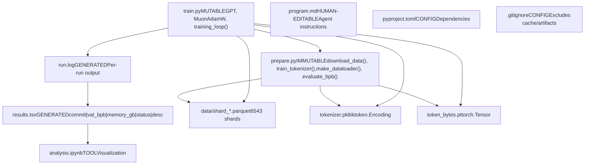
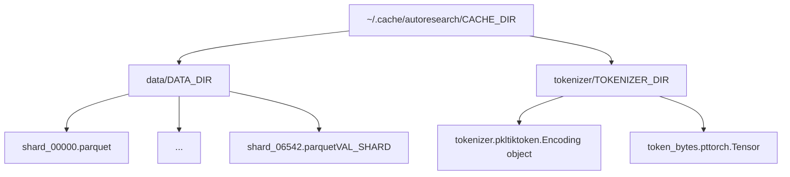
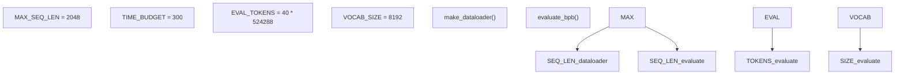

# Reference

Relevant source files

-   [README.md](https://github.com/karpathy/autoresearch/blob/e6d79c12/README.md?plain=1)
-   [prepare.py](https://github.com/karpathy/autoresearch/blob/e6d79c12/prepare.py)
-   [train.py](https://github.com/karpathy/autoresearch/blob/e6d79c12/train.py)

This page provides quick-reference documentation for files, commands, and parameters in the autoresearch system. Use this page for fast lookup of code entities, command syntax, and configuration values.

---

## 9.1. File Reference

### Repository Files

**File System Organization**

Sources: [README.md11-15](https://github.com/karpathy/autoresearch/blob/e6d79c12/README.md?plain=1#L11-L15) [README.md52-59](https://github.com/karpathy/autoresearch/blob/e6d79c12/README.md?plain=1#L52-L59)

### Core Files

| File | Modification Policy | Purpose | Key Code Entities |
| --- | --- | --- | --- |
| `prepare.py` | **IMMUTABLE** (never modify) | Data preparation and evaluation infrastructure | `download_data()`, `train_tokenizer()`, `make_dataloader()`, `evaluate_bpb()`, `Tokenizer` |
| `train.py` | **MUTABLE** (agent modifies) | Model architecture, optimizer, training loop | `GPT`, `CausalSelfAttention`, `MLP`, `MuonAdamW`, `GPTConfig` |
| `program.md` | **HUMAN-EDITABLE** | Research objectives and agent instructions | Agent protocol, decision rules |
| `pyproject.toml` | **CONFIG** | Python dependencies | `torch`, `tiktoken`, `rustbpe`, `pyarrow` |
| `results.tsv` | **GENERATED** | Tab-separated experiment log | Columns: `commit`, `val_bpb`, `memory_gb`, `status`, `description` |
| `analysis.ipynb` | **TOOL** | Post-experiment visualization | Plotting code, statistics computation |
| `run.log` | **GENERATED** | Per-experiment console output | Training logs, metrics, errors |

Sources: [README.md11-16](https://github.com/karpathy/autoresearch/blob/e6d79c12/README.md?plain=1#L11-L16) [README.md52-59](https://github.com/karpathy/autoresearch/blob/e6d79c12/README.md?plain=1#L52-L59)

### Cache Directory Structure

**Cache Directory Layout**

| Path | Variable Name | Content | Created By |
| --- | --- | --- | --- |
| `~/.cache/autoresearch/` | `CACHE_DIR` | Cache root directory | [prepare.py38](https://github.com/karpathy/autoresearch/blob/e6d79c12/prepare.py#L38-L38) |
| `~/.cache/autoresearch/data/` | `DATA_DIR` | Parquet data shards | [prepare.py39](https://github.com/karpathy/autoresearch/blob/e6d79c12/prepare.py#L39-L39) |
| `~/.cache/autoresearch/tokenizer/` | `TOKENIZER_DIR` | Tokenizer artifacts | [prepare.py40](https://github.com/karpathy/autoresearch/blob/e6d79c12/prepare.py#L40-L40) |
| `.../data/shard_06542.parquet` | `VAL_SHARD` | Validation data (last shard) | [prepare.py43-44](https://github.com/karpathy/autoresearch/blob/e6d79c12/prepare.py#L43-L44) |
| `.../tokenizer/tokenizer.pkl` | — | Trained BPE tokenizer | [prepare.py143](https://github.com/karpathy/autoresearch/blob/e6d79c12/prepare.py#L143-L143) |
| `.../tokenizer/token_bytes.pt` | — | UTF-8 byte length lookup table | [prepare.py144](https://github.com/karpathy/autoresearch/blob/e6d79c12/prepare.py#L144-L144) |

Sources: [prepare.py38-45](https://github.com/karpathy/autoresearch/blob/e6d79c12/prepare.py#L38-L45) [prepare.py141-188](https://github.com/karpathy/autoresearch/blob/e6d79c12/prepare.py#L141-L188)

---

## 9.2. Command Reference

### Setup Commands (One-Time)

| Command | Purpose | Duration | Output |
| --- | --- | --- | --- |
| `curl -LsSf https://astral.sh/uv/install.sh | sh` | Install `uv` manager | ~10 sec | `uv` binary |
| `uv sync` | Install dependencies | ~1-2 min | `.venv/` populated |
| `uv run prepare.py` | Full data/tokenizer prep | ~2-5 min | Cache populated |
| `uv run prepare.py --num-shards 8` | Partial data download | ~1 min | Testing cache |

Sources: [README.md25-34](https://github.com/karpathy/autoresearch/blob/e6d79c12/README.md?plain=1#L25-L34) [prepare.py5-10](https://github.com/karpathy/autoresearch/blob/e6d79c12/prepare.py#L5-L10)

### Experiment Commands

| Command | Purpose | Duration | Output |
| --- | --- | --- | --- |
| `uv run train.py` | Run single experiment | ~5-6 min | `run.log` |
| `git commit -m "desc"` | Log experiment change | Instant | New Git commit |
| `git reset HEAD~1` | Discard failed experiment | Instant | Reverts `train.py` |

Sources: [README.md36-37](https://github.com/karpathy/autoresearch/blob/e6d79c12/README.md?plain=1#L36-L37) [README.md63-64](https://github.com/karpathy/autoresearch/blob/e6d79c12/README.md?plain=1#L63-L64)

---

## 9.3. Constants and Parameters

### Infrastructure Constants (prepare.py)

**Fixed System Parameters**

| Constant | Value | Purpose | Location |
| --- | --- | --- | --- |
| `MAX_SEQ_LEN` | 2048 | Context length | [prepare.py30](https://github.com/karpathy/autoresearch/blob/e6d79c12/prepare.py#L30-L30) |
| `TIME_BUDGET` | 300 | 5-minute limit (seconds) | [prepare.py31](https://github.com/karpathy/autoresearch/blob/e6d79c12/prepare.py#L31-L31) |
| `EVAL_TOKENS` | 20,971,520 | Validation token count | [prepare.py32](https://github.com/karpathy/autoresearch/blob/e6d79c12/prepare.py#L32-L32) |
| `VOCAB_SIZE` | 8192 | BPE vocabulary size | [prepare.py45](https://github.com/karpathy/autoresearch/blob/e6d79c12/prepare.py#L45-L45) |
| `SPLIT_PATTERN` | GPT-4 style | BPE regex pattern | [prepare.py48](https://github.com/karpathy/autoresearch/blob/e6d79c12/prepare.py#L48-L48) |

Sources: [prepare.py30-51](https://github.com/karpathy/autoresearch/blob/e6d79c12/prepare.py#L30-L51)

### Model Hyperparameters (train.py)

**Agent-Modifiable Parameters**

| Parameter | Default | Purpose | Location |
| --- | --- | --- | --- |
| `n_layer` | 12 | Number of transformer blocks | [train.py36](https://github.com/karpathy/autoresearch/blob/e6d79c12/train.py#L36-L36) |
| `n_head` | 6 | Number of attention heads | [train.py37](https://github.com/karpathy/autoresearch/blob/e6d79c12/train.py#L37-L37) |
| `n_embd` | 768 | Embedding dimension | [train.py39](https://github.com/karpathy/autoresearch/blob/e6d79c12/train.py#L39-L39) |
| `window_pattern` | `"SSSL"` | Sliding window attention pattern | [train.py40](https://github.com/karpathy/autoresearch/blob/e6d79c12/train.py#L40-L40) |
| `TOTAL_BATCH_SIZE` | 524,288 | Target tokens per update | [train.py270](https://github.com/karpathy/autoresearch/blob/e6d79c12/train.py#L270-L270) |
| `DEVICE_BATCH_SIZE` | 16 | Per-step batch size | [train.py271](https://github.com/karpathy/autoresearch/blob/e6d79c12/train.py#L271-L271) |

Sources: [train.py32-41](https://github.com/karpathy/autoresearch/blob/e6d79c12/train.py#L32-L41) [train.py270-271](https://github.com/karpathy/autoresearch/blob/e6d79c12/train.py#L270-L271)

---

## Key Function Signatures

### prepare.py Exports

| Function | Signature | Purpose |
| --- | --- | --- |
| `make_dataloader` | `(tokenizer, B, T, split)` | Yields (x, y, epoch) |
| `evaluate_bpb` | `(model, tokenizer, batch_size)` | Computes validation BPB |
| `Tokenizer` | `class` | BPE encoding/decoding |

Sources: [prepare.py260-349](https://github.com/karpathy/autoresearch/blob/e6d79c12/prepare.py#L260-L349)

### train.py Components

| Class/Function | Purpose | Location |
| --- | --- | --- |
| `GPT` | Core transformer model | [train.py124](https://github.com/karpathy/autoresearch/blob/e6d79c12/train.py#L124-L124) |
| `CausalSelfAttention` | Attention with optional Value Embedding | [train.py61](https://github.com/karpathy/autoresearch/blob/e6d79c12/train.py#L61-L61) |
| `MuonAdamW` | Hybrid matrix/vector optimizer | [train.py214](https://github.com/karpathy/autoresearch/blob/e6d79c12/train.py#L214-L214) |
| `has_ve` | Value Embedding layer logic | [train.py47](https://github.com/karpathy/autoresearch/blob/e6d79c12/train.py#L47-L47) |

Sources: [train.py47-214](https://github.com/karpathy/autoresearch/blob/e6d79c12/train.py#L47-L214)
