# File Reference

Relevant source files

-   [.gitignore](https://github.com/karpathy/autoresearch/blob/e6d79c12/.gitignore)
-   [README.md](https://github.com/karpathy/autoresearch/blob/e6d79c12/README.md?plain=1)
-   [progress.png](https://github.com/karpathy/autoresearch/blob/e6d79c12/progress.png)

This page provides a complete reference of all files in the `autoresearch` system, their locations, purposes, and modification policies. The system is designed around a clear separation between immutable infrastructure and the mutable training code that the AI agent optimizes.

---

## File Categories Overview

The system architecture is divided into three functional layers: the **Human Layer** (strategic instructions), the **Agent Layer** (autonomous execution and code modification), and the **Infrastructure Layer** (data, evaluation, and environment).

### System Data Flow and Modification Roles

The following diagram illustrates how the AI agent interacts with the codebase, distinguishing between what it reads, what it modifies, and what it generates as output.

**System Entity Relationship Diagram**

**Sources:** [README.md11-18](https://github.com/karpathy/autoresearch/blob/e6d79c12/README.md?plain=1#L11-L18) [README.md54-59](https://github.com/karpathy/autoresearch/blob/e6d79c12/README.md?plain=1#L54-L59) [program.md12-31](https://github.com/karpathy/autoresearch/blob/e6d79c12/program.md?plain=1#L12-L31)

---

## Core System Files

### 1\. train.py (The Mutable Core)

**Modification Policy:** **FULLY MUTABLE**. This is the only file the agent is permitted to edit.

`train.py` contains the entire training pipeline. It is a self-contained script that defines the model architecture, the optimization strategy, and the training loop.

-   **Key Components:**
    -   `GPT` Class: The main model implementation [train.py125-293](https://github.com/karpathy/autoresearch/blob/e6d79c12/train.py#L125-L293)
    -   `MuonAdamW` Class: The hybrid optimizer combining Muon for internal 2D parameters and AdamW for others [train.py357-428](https://github.com/karpathy/autoresearch/blob/e6d79c12/train.py#L357-L428)
    -   **Hyperparameters:** A dedicated block of constants (e.g., `DEPTH`, `TOTAL_BATCH_SIZE`, `MATRIX_LR`) that the agent frequently tunes [train.py433-449](https://github.com/karpathy/autoresearch/blob/e6d79c12/train.py#L433-L449)
    -   **Training Loop:** A time-aware loop that executes for exactly `TIME_BUDGET` seconds [train.py544-606](https://github.com/karpathy/autoresearch/blob/e6d79c12/train.py#L544-L606)

**Sources:** [README.md14](https://github.com/karpathy/autoresearch/blob/e6d79c12/README.md?plain=1#L14-L14) [train.py1-632](https://github.com/karpathy/autoresearch/blob/e6d79c12/train.py#L1-L632)

### 2\. prepare.py (Data and Evaluation)

**Modification Policy:** **IMMUTABLE**. This file provides the "ground truth" for experiments.

`prepare.py` handles the one-time setup and provides runtime utilities that must remain constant to ensure fair comparisons between different versions of `train.py`.

-   **Key Functions:**
    -   `train_tokenizer()`: Trains a BPE tokenizer using `rustbpe` [prepare.py130-193](https://github.com/karpathy/autoresearch/blob/e6d79c12/prepare.py#L130-L193)
    -   `make_dataloader()`: Implements a BOS-aligned, best-fit packing dataloader for 100% token utilization [prepare.py260-322](https://github.com/karpathy/autoresearch/blob/e6d79c12/prepare.py#L260-L322)
    -   `evaluate_bpb()`: The critical evaluation harness that calculates bits-per-byte [prepare.py328-350](https://github.com/karpathy/autoresearch/blob/e6d79c12/prepare.py#L328-L350)

**Sources:** [README.md13](https://github.com/karpathy/autoresearch/blob/e6d79c12/README.md?plain=1#L13-L13) [prepare.py1-374](https://github.com/karpathy/autoresearch/blob/e6d79c12/prepare.py#L1-L374)

### 3\. program.md (Agent Instructions)

**Modification Policy:** **HUMAN-EDITABLE**. This file represents the "Research Org Code."

`program.md` provides the prompt and operational constraints for the AI agent. It defines the research loop, the decision logic for keeping/discarding experiments, and the formatting for `results.tsv`.

-   **Key Protocols:**
    -   **Research Loop:** An 8-step autonomous cycle [program.md90-108](https://github.com/karpathy/autoresearch/blob/e6d79c12/program.md?plain=1#L90-L108)
    -   **Simplicity Criterion:** Rejection of complex changes that yield only marginal gains [program.md37](https://github.com/karpathy/autoresearch/blob/e6d79c12/program.md?plain=1#L37-L37)
    -   **Git Strategy:** Instructions for branch management and `git reset` on failed experiments [program.md104-108](https://github.com/karpathy/autoresearch/blob/e6d79c12/program.md?plain=1#L104-L108)

**Sources:** [README.md15](https://github.com/karpathy/autoresearch/blob/e6d79c12/README.md?plain=1#L15-L15) [program.md1-114](https://github.com/karpathy/autoresearch/blob/e6d79c12/program.md?plain=1#L1-L114)

---

## Technical File Reference Table

| File Path | Type | Modification Rule | Role in System |
| --- | --- | --- | --- |
| `train.py` | Python Script | **Agent-Mutable** | Defines model, optimizer, and training loop. |
| `prepare.py` | Python Script | **Immutable** | Data downloading, tokenizer training, and `evaluate_bpb`. |
| `program.md` | Markdown | **Human-Mutable** | Instructions, goals, and protocol for the AI agent. |
| `pyproject.toml` | TOML | **Immutable** | Dependency management via `uv`. |
| `results.tsv` | TSV Data | **Agent-Append** | 5-column log of every experiment attempt. |
| `progress.png` | Image | **Generated** | Visualization of `val_bpb` progress over time. |
| `analysis.ipynb` | Notebook | **Human-Tool** | Post-hoc analysis of the `results.tsv` log. |
| `.gitignore` | Config | **Immutable** | Prevents tracking of caches and local logs. |

**Sources:** [README.md54-59](https://github.com/karpathy/autoresearch/blob/e6d79c12/README.md?plain=1#L54-L59) [.gitignore1-23](https://github.com/karpathy/autoresearch/blob/e6d79c12/.gitignore#L1-L23) [program.md66-88](https://github.com/karpathy/autoresearch/blob/e6d79c12/program.md?plain=1#L66-L88)

---

## Data and Cache Structure

The system uses a local cache to store heavy artifacts, ensuring that `train.py` can start instantly without re-processing data.

**File System and Code Entity Mapping**

```mermaid
flowchart TD
    root["/"]
    train_py_file["train.py"]
    prepare_py_file["prepare.py"]
    results_tsv_file["results.tsv"]
    cache_dir["Cache Root"]
    data_dir["data/"]
    shard_train["shard_00000.parquet ... shard_06541.parquet"]
    shard_val["shard_06542.parquet (Validation)"]
    tok_dir["tokenizer/"]
    tok_pkl["tokenizer.pkl (tiktoken.Encoding)"]
    tok_bytes["token_bytes.pt (Length Map)"]

    root --> train_py_file
    root --> prepare_py_file
    root --> results_tsv_file
    data --> dir_shard_train
    data --> dir_shard_val
    tok --> dir_tok_pkl
    tok --> dir_tok_bytes
    prepare --> py_file_data_dir
    prepare --> py_file_tok_dir
    train --> py_file_cache_dir
```

**Sources:** [prepare.py32-43](https://github.com/karpathy/autoresearch/blob/e6d79c12/prepare.py#L32-L43) [prepare.py83-103](https://github.com/karpathy/autoresearch/blob/e6d79c12/prepare.py#L83-L103) [prepare.py245-257](https://github.com/karpathy/autoresearch/blob/e6d79c12/prepare.py#L245-L257)

### Artifact Details

-   **results.tsv:** Contains five columns: `commit`, `val_bpb`, `memory_gb`, `status`, and `description` [program.md70-78](https://github.com/karpathy/autoresearch/blob/e6d79c12/program.md?plain=1#L70-L78)
-   **token\_bytes.pt:** A PyTorch tensor mapping `token_id` to its UTF-8 byte length, essential for calculating bits-per-byte [prepare.py237-241](https://github.com/karpathy/autoresearch/blob/e6d79c12/prepare.py#L237-L241)
-   **run.log:** A transient file used by the agent to capture the output of `uv run train.py` and extract metrics via `grep` [program.md99-100](https://github.com/karpathy/autoresearch/blob/e6d79c12/program.md?plain=1#L99-L100)

---

## Configuration and Environment

### pyproject.toml

This file defines the technical environment. It specifies a Python requirement of `>=3.10` and manages dependencies including `torch`, `tiktoken`, `rustbpe`, and `pyarrow`.

**Sources:** [README.md23-31](https://github.com/karpathy/autoresearch/blob/e6d79c12/README.md?plain=1#L23-L31)

### .gitignore

The system explicitly ignores large data caches and session-specific agent files to keep the repository clean.

-   **Ignored:** `__pycache__`, `.venv`, `worktrees/`, `results/`, `queue/`, `results.tsv`, and agent-specific prompt files like `CLAUDE.md` or `AGENTS.md`.

**Sources:** [.gitignore1-23](https://github.com/karpathy/autoresearch/blob/e6d79c12/.gitignore#L1-L23)
