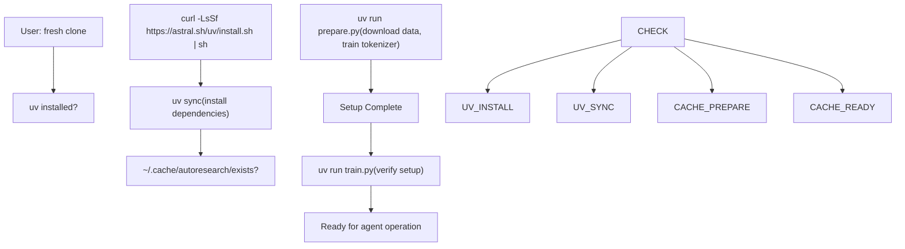
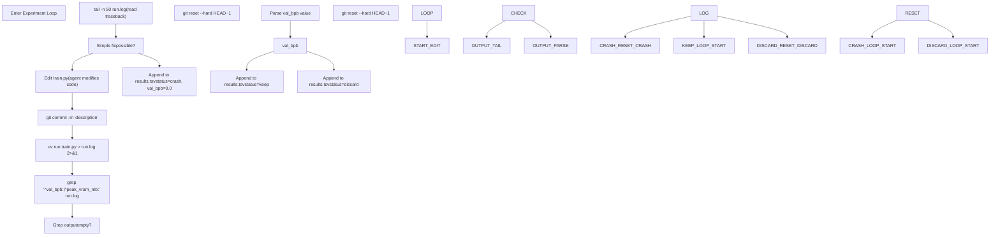

# Command Reference

Relevant source files

-   [README.md](https://github.com/karpathy/autoresearch/blob/e6d79c12/README.md?plain=1)
-   [program.md](https://github.com/karpathy/autoresearch/blob/e6d79c12/program.md?plain=1)

This page provides a comprehensive reference of all command-line operations used in the autoresearch workflow. Commands are organized by phase: initial setup, agent operation, and analysis.

## Initial Setup Commands

These commands are executed once to prepare the autoresearch environment. They establish dependencies, data, and tokenizer artifacts.

| Command | Purpose | Execution Context | Notes |
| --- | --- | --- | --- |
| `curl -LsSf https://astral.sh/uv/install.sh | sh` | Install uv package manager | Shell (one-time) | Required if `uv` is not already installed [README.md28](https://github.com/karpathy/autoresearch/blob/e6d79c12/README.md?plain=1#L28-L28) |
| `uv sync` | Install Python dependencies | Project root | Installs PyTorch and other packages defined in `pyproject.toml` [README.md31](https://github.com/karpathy/autoresearch/blob/e6d79c12/README.md?plain=1#L31-L31) |
| `uv run prepare.py` | Prepare data and tokenizer | Project root | Downloads shards and trains BPE tokenizer (~2 min) [README.md34](https://github.com/karpathy/autoresearch/blob/e6d79c12/README.md?plain=1#L34-L34) |

**Sources:** [README.md25-38](https://github.com/karpathy/autoresearch/blob/e6d79c12/README.md?plain=1#L25-L38) [program.md15](https://github.com/karpathy/autoresearch/blob/e6d79c12/program.md?plain=1#L15-L15)

### Setup Command Flow

The following diagram illustrates the transition from a fresh clone to a state ready for autonomous research, mapping natural language setup steps to specific CLI commands.

**Sources:** [README.md25-40](https://github.com/karpathy/autoresearch/blob/e6d79c12/README.md?plain=1#L25-L40) [program.md15](https://github.com/karpathy/autoresearch/blob/e6d79c12/program.md?plain=1#L15-L15)

## Agent Operation Commands

These commands are executed repeatedly by the autonomous agent during the experiment loop. The agent operates these commands without human intervention.

### Core Experiment Commands

| Command | Purpose | Frequency | Expected Output |
| --- | --- | --- | --- |
| `uv run train.py` | Execute 5-minute training run | Per experiment | Prints metrics summary to stdout [README.md37](https://github.com/karpathy/autoresearch/blob/e6d79c12/README.md?plain=1#L37-L37) |
| `uv run train.py > run.log 2>&1` | Execute with full output capture | Per experiment (agent) | Redirects all output to `run.log` [program.md99](https://github.com/karpathy/autoresearch/blob/e6d79c12/program.md?plain=1#L99-L99) |

**Sources:** [README.md36-37](https://github.com/karpathy/autoresearch/blob/e6d79c12/README.md?plain=1#L36-L37) [program.md23](https://github.com/karpathy/autoresearch/blob/e6d79c12/program.md?plain=1#L23-L23) [program.md99](https://github.com/karpathy/autoresearch/blob/e6d79c12/program.md?plain=1#L99-L99)

### Metric Extraction Commands

The agent uses standard shell utilities to parse the training log and determine the success of an experiment.

| Command | Purpose | Output Format |
| --- | --- | --- |
| `grep "^val_bpb:" run.log` | Extract primary metric | `val_bpb: 0.997900` [program.md61](https://github.com/karpathy/autoresearch/blob/e6d79c12/program.md?plain=1#L61-L61) |
| `grep "^val_bpb:|^peak_vram_mb:" run.log` | Extract key metrics | Multi-line metrics [program.md100](https://github.com/karpathy/autoresearch/blob/e6d79c12/program.md?plain=1#L100-L100) |
| `tail -n 50 run.log` | Debug crashes | Python stack trace [program.md101](https://github.com/karpathy/autoresearch/blob/e6d79c12/program.md?plain=1#L101-L101) |

**Sources:** [program.md60-62](https://github.com/karpathy/autoresearch/blob/e6d79c12/program.md?plain=1#L60-L62) [program.md100-101](https://github.com/karpathy/autoresearch/blob/e6d79c12/program.md?plain=1#L100-L101)

### Experiment Loop Command Sequence

This diagram maps the high-level "Experiment Loop" logic described in `program.md` to the specific code-level commands used to execute it.

**Sources:** [program.md94-110](https://github.com/karpathy/autoresearch/blob/e6d79c12/program.md?plain=1#L94-L110)

## Version Control Commands

Git commands manage experiment branches and track the optimization frontier. The agent uses Git to create checkpoints and revert failed experiments.

### Branch Management

| Command | Purpose | Execution Phase | Example |
| --- | --- | --- | --- |
| `git checkout -b autoresearch/<tag>` | Create new experiment branch | Initial setup | `git checkout -b autoresearch/mar5` [program.md10](https://github.com/karpathy/autoresearch/blob/e6d79c12/program.md?plain=1#L10-L10) |

### Experiment Tracking

| Command | Purpose | When Executed | Effect |
| --- | --- | --- | --- |
| `git commit -m "description"` | Save experiment state | After editing `train.py` | Creates commit with 7-char hash [program.md98](https://github.com/karpathy/autoresearch/blob/e6d79c12/program.md?plain=1#L98-L98) |
| `git reset --hard HEAD~1` | Discard failed experiment | After discard/crash decision | Reverts to previous commit [program.md104](https://github.com/karpathy/autoresearch/blob/e6d79c12/program.md?plain=1#L104-L104) |

**Sources:** [program.md9-10](https://github.com/karpathy/autoresearch/blob/e6d79c12/program.md?plain=1#L9-L10) [program.md96-104](https://github.com/karpathy/autoresearch/blob/e6d79c12/program.md?plain=1#L96-L104)

## File I/O and Redirection

### Output Redirection Rationale

The agent is instructed to use `uv run train.py > run.log 2>&1` [program.md99](https://github.com/karpathy/autoresearch/blob/e6d79c12/program.md?plain=1#L99-L99) This redirection is critical because:

1.  It prevents the agent's context window from being flooded with thousands of lines of training logs.
2.  It allows for post-hoc analysis of the `run.log` using `grep` and `tail` [program.md100-101](https://github.com/karpathy/autoresearch/blob/e6d79c12/program.md?plain=1#L100-L101)

### Results File Handling

The `results.tsv` file is the primary record of the research progress. It is tab-separated to avoid breaking on commas within descriptions [program.md66](https://github.com/karpathy/autoresearch/blob/e6d79c12/program.md?plain=1#L66-L66)

| Operation | Command/Format |
| --- | --- |
| Header | `commit\tval_bpb\tmemory_gb\tstatus\tdescription` [program.md71](https://github.com/karpathy/autoresearch/blob/e6d79c12/program.md?plain=1#L71-L71) |
| Append Result | `<hash>\t<val>\t<mem>\t<status>\t<desc>` [program.md83-88](https://github.com/karpathy/autoresearch/blob/e6d79c12/program.md?plain=1#L83-L88) |

**Note:** `results.tsv` should remain untracked by Git [program.md102](https://github.com/karpathy/autoresearch/blob/e6d79c12/program.md?plain=1#L102-L102)

**Sources:** [program.md66-88](https://github.com/karpathy/autoresearch/blob/e6d79c12/program.md?plain=1#L66-L88) [program.md99-102](https://github.com/karpathy/autoresearch/blob/e6d79c12/program.md?plain=1#L99-L102)

## Complete Command Reference Table

| Category | Command | Purpose |
| --- | --- | --- |
| **Setup** | `uv sync` | Install dependencies [README.md31](https://github.com/karpathy/autoresearch/blob/e6d79c12/README.md?plain=1#L31-L31) |
| **Setup** | `uv run prepare.py` | One-time data prep [README.md34](https://github.com/karpathy/autoresearch/blob/e6d79c12/README.md?plain=1#L34-L34) |
| **Execution** | `uv run train.py` | Run 5-min training [README.md37](https://github.com/karpathy/autoresearch/blob/e6d79c12/README.md?plain=1#L37-L37) |
| **Git** | `git checkout -b autoresearch/<tag>` | Initialize branch [program.md10](https://github.com/karpathy/autoresearch/blob/e6d79c12/program.md?plain=1#L10-L10) |
| **Git** | `git commit -m "..."` | Checkpoint experiment [program.md98](https://github.com/karpathy/autoresearch/blob/e6d79c12/program.md?plain=1#L98-L98) |
| **Git** | `git reset --hard HEAD~1` | Revert failed change [program.md104](https://github.com/karpathy/autoresearch/blob/e6d79c12/program.md?plain=1#L104-L104) |
| **Analysis** | `grep "^val_bpb:" run.log` | Extract primary metric [program.md61](https://github.com/karpathy/autoresearch/blob/e6d79c12/program.md?plain=1#L61-L61) |
| **Analysis** | `tail -n 50 run.log` | Diagnose crash [program.md101](https://github.com/karpathy/autoresearch/blob/e6d79c12/program.md?plain=1#L101-L101) |

**Sources:** [README.md25-40](https://github.com/karpathy/autoresearch/blob/e6d79c12/README.md?plain=1#L25-L40) [program.md9-110](https://github.com/karpathy/autoresearch/blob/e6d79c12/program.md?plain=1#L9-L110)
