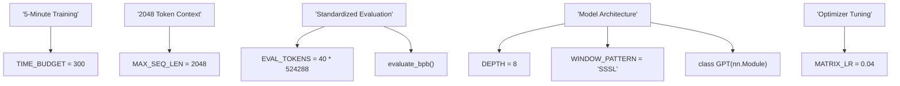
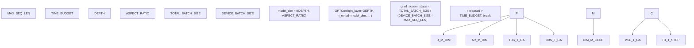

# Constants and Parameters

Relevant source files

-   [prepare.py](https://github.com/karpathy/autoresearch/blob/e6d79c12/prepare.py)
-   [train.py](https://github.com/karpathy/autoresearch/blob/e6d79c12/train.py)

This page provides a comprehensive reference for all constants and parameters in the autoresearch codebase. These values fall into two critical categories:

1.  **Immutable Constants** (in `prepare.py`) — Fixed infrastructure constraints that ensure fair comparison across all experiments.
2.  **Mutable Parameters** (in `train.py`) — Hyperparameters and architectural settings the AI agent is encouraged to modify.

## Purpose and Scope

This reference documents:

-   All immutable constants defined in [prepare.py27-32](https://github.com/karpathy/autoresearch/blob/e6d79c12/prepare.py#L27-L32)
-   All mutable hyperparameters defined in [train.py432-451](https://github.com/karpathy/autoresearch/blob/e6d79c12/train.py#L432-L451)
-   Data and Tokenizer configuration in [prepare.py38-51](https://github.com/karpathy/autoresearch/blob/e6d79c12/prepare.py#L38-L51)
-   The relationship between these values and the training loop in [train.py](https://github.com/karpathy/autoresearch/blob/e6d79c12/train.py)

## Immutable vs. Mutable: System Boundaries

The system enforces a strict boundary between infrastructure (immutable) and research (mutable). This ensures that any improvement in the primary metric (`val_bpb`) is due to architectural or algorithmic innovation rather than simply increasing the compute budget.

### Natural Language to Code Entity Mapping

The following diagram bridges the high-level research concepts to the specific code entities that implement them.

**Sources:** [prepare.py26-32](https://github.com/karpathy/autoresearch/blob/e6d79c12/prepare.py#L26-L32) [train.py429-451](https://github.com/karpathy/autoresearch/blob/e6d79c12/train.py#L429-L451) [train.py124-148](https://github.com/karpathy/autoresearch/blob/e6d79c12/train.py#L124-L148)

---

## Immutable Constants (prepare.py)

These constants are defined at the top of `prepare.py` and are imported by `train.py`. They represent the "rules of the game."

| Constant | Value | Unit | Role |
| --- | --- | --- | --- |
| `MAX_SEQ_LEN` | `2048` | tokens | The fixed context window for training and evaluation. [prepare.py30](https://github.com/karpathy/autoresearch/blob/e6d79c12/prepare.py#L30-L30) |
| `TIME_BUDGET` | `300` | seconds | The wall-clock limit for the training loop. [prepare.py31](https://github.com/karpathy/autoresearch/blob/e6d79c12/prepare.py#L31-L31) |
| `EVAL_TOKENS` | `20,971,520` | tokens | The total volume of data processed during validation. [prepare.py32](https://github.com/karpathy/autoresearch/blob/e6d79c12/prepare.py#L32-L32) |

### Data and Tokenizer Configuration

These values define the environment and dataset characteristics.

| Constant | Value | Purpose |
| --- | --- | --- |
| `VOCAB_SIZE` | `8192` | The size of the BPE vocabulary trained by `rustbpe`. [prepare.py45](https://github.com/karpathy/autoresearch/blob/e6d79c12/prepare.py#L45-L45) |
| `VAL_SHARD` | `6542` | The specific data shard reserved for validation. [prepare.py43](https://github.com/karpathy/autoresearch/blob/e6d79c12/prepare.py#L43-L43) |
| `SPLIT_PATTERN` | `r"..."` | The GPT-4 style regex used for BPE tokenization. [prepare.py48](https://github.com/karpathy/autoresearch/blob/e6d79c12/prepare.py#L48-L48) |
| `BOS_TOKEN` | \`"< | reserved\_0 |

**Sources:** [prepare.py26-52](https://github.com/karpathy/autoresearch/blob/e6d79c12/prepare.py#L26-L52)

---

## Mutable Parameters (train.py)

These parameters are located in the "Hyperparameters" section of `train.py`. The AI agent modifies these values to find better performing models.

### Model Scaling and Architecture

The model dimensions are derived from `DEPTH` and `ASPECT_RATIO` to ensure compatibility with attention head requirements.

| Parameter | Default | Logic / Purpose |
| --- | --- | --- |
| `DEPTH` | `8` | Number of transformer layers. [train.py450](https://github.com/karpathy/autoresearch/blob/e6d79c12/train.py#L450-L450) |
| `ASPECT_RATIO` | `64` | Multiplier for width: `base_dim = DEPTH * ASPECT_RATIO`. [train.py433](https://github.com/karpathy/autoresearch/blob/e6d79c12/train.py#L433-L433) |
| `HEAD_DIM` | `128` | Dimension per attention head. [train.py434](https://github.com/karpathy/autoresearch/blob/e6d79c12/train.py#L434-L434) |
| `WINDOW_PATTERN` | `"SSSL"` | Pattern of Sliding (S) vs Long (L) attention layers. [train.py435](https://github.com/karpathy/autoresearch/blob/e6d79c12/train.py#L435-L435) |

**Derived Width Calculation:** The `model_dim` is calculated in `train.py` to be a multiple of `HEAD_DIM` for clean head splitting: `model_dim = ((base_dim + HEAD_DIM - 1) // HEAD_DIM) * HEAD_DIM` [train.py470-471](https://github.com/karpathy/autoresearch/blob/e6d79c12/train.py#L470-L471)

### Optimization and Learning Rates

The system uses a hybrid optimization strategy: **Muon** for internal 2D matrices and **AdamW** for vectors and embeddings.

| Parameter | Default | Optimizer | Target Parameters |
| --- | --- | --- | --- |
| `MATRIX_LR` | `0.04` | Muon | Linear layer weights (excluding embeddings). [train.py441](https://github.com/karpathy/autoresearch/blob/e6d79c12/train.py#L441-L441) |
| `EMBEDDING_LR` | `0.6` | AdamW | `wte` and `value_embeds`. [train.py439](https://github.com/karpathy/autoresearch/blob/e6d79c12/train.py#L439-L439) |
| `UNEMBEDDING_LR` | `0.004` | AdamW | `lm_head` weights. [train.py440](https://github.com/karpathy/autoresearch/blob/e6d79c12/train.py#L440-L440) |
| `SCALAR_LR` | `0.5` | AdamW | `resid_lambdas`, `x0_lambdas`, etc. [train.py442](https://github.com/karpathy/autoresearch/blob/e6d79c12/train.py#L442-L442) |
| `TOTAL_BATCH_SIZE` | `524288` | — | Global tokens per step ($2^{19}$). [train.py438](https://github.com/karpathy/autoresearch/blob/e6d79c12/train.py#L438-L438) |

**Sources:** [train.py432-451](https://github.com/karpathy/autoresearch/blob/e6d79c12/train.py#L432-L451) [train.py469-477](https://github.com/karpathy/autoresearch/blob/e6d79c12/train.py#L469-L477)

---

## Parameter Data Flow

The following diagram illustrates how these constants and parameters interact during the initialization of a training run.

**Sources:** [train.py469-477](https://github.com/karpathy/autoresearch/blob/e6d79c12/train.py#L469-L477) [train.py495-497](https://github.com/karpathy/autoresearch/blob/e6d79c12/train.py#L495-L497) [train.py603-604](https://github.com/karpathy/autoresearch/blob/e6d79c12/train.py#L603-L604)

### Batch Size and Gradient Accumulation

Because the `TOTAL_BATCH_SIZE` is fixed (typically $2^{19}$ tokens), the system automatically calculates the number of gradient accumulation steps based on the `DEVICE_BATCH_SIZE` and `MAX_SEQ_LEN`.

-   **Calculation:** `grad_accum_steps = TOTAL_BATCH_SIZE // (DEVICE_BATCH_SIZE * MAX_SEQ_LEN)` [train.py497](https://github.com/karpathy/autoresearch/blob/e6d79c12/train.py#L497-L497)
-   **Validation:** The code asserts that `TOTAL_BATCH_SIZE` is exactly divisible by the local batch size to ensure consistent optimization dynamics. [train.py496](https://github.com/karpathy/autoresearch/blob/e6d79c12/train.py#L496-L496)

### Learning Rate Scheduling

The learning rate is not static but follows a three-phase schedule controlled by `WARMUP_RATIO` and `WARMDOWN_RATIO`.

1.  **Warmup:** Linear increase from 0 to max LR. [train.py521-522](https://github.com/karpathy/autoresearch/blob/e6d79c12/train.py#L521-L522)
2.  **Constant:** Max LR maintained. [train.py523-524](https://github.com/karpathy/autoresearch/blob/e6d79c12/train.py#L523-L524)
3.  **Warmdown:** Linear decay (typically to 0) using a cosine-like or linear ramp. [train.py525-528](https://github.com/karpathy/autoresearch/blob/e6d79c12/train.py#L525-L528)

The progress is measured as a fraction of the `TIME_BUDGET`: `progress = training_time / TIME_BUDGET` [train.py518-519](https://github.com/karpathy/autoresearch/blob/e6d79c12/train.py#L518-L519)

**Sources:** [train.py444-447](https://github.com/karpathy/autoresearch/blob/e6d79c12/train.py#L444-L447) [train.py518-532](https://github.com/karpathy/autoresearch/blob/e6d79c12/train.py#L518-L532)
