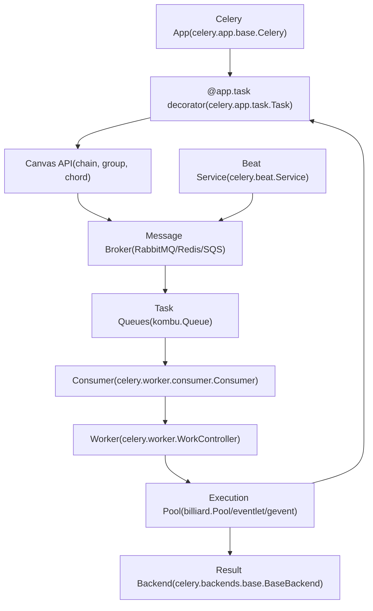
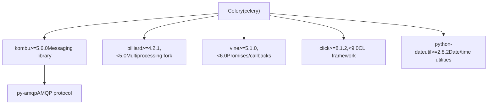

# Celery Overview

Relevant source files

-   [.bumpversion.cfg](https://github.com/celery/celery/blob/4d068b56/.bumpversion.cfg)
-   [Changelog.rst](https://github.com/celery/celery/blob/4d068b56/Changelog.rst)
-   [README.rst](https://github.com/celery/celery/blob/4d068b56/README.rst)
-   [celery/\_\_init\_\_.py](https://github.com/celery/celery/blob/4d068b56/celery/__init__.py)
-   [celery/contrib/sphinx.py](https://github.com/celery/celery/blob/4d068b56/celery/contrib/sphinx.py)
-   [docs/getting-started/introduction.rst](https://github.com/celery/celery/blob/4d068b56/docs/getting-started/introduction.rst)
-   [docs/history/changelog-5.5.rst](https://github.com/celery/celery/blob/4d068b56/docs/history/changelog-5.5.rst)
-   [docs/history/changelog-5.6.rst](https://github.com/celery/celery/blob/4d068b56/docs/history/changelog-5.6.rst)
-   [docs/history/index.rst](https://github.com/celery/celery/blob/4d068b56/docs/history/index.rst)
-   [docs/history/whatsnew-5.5.rst](https://github.com/celery/celery/blob/4d068b56/docs/history/whatsnew-5.5.rst)
-   [docs/history/whatsnew-5.6.rst](https://github.com/celery/celery/blob/4d068b56/docs/history/whatsnew-5.6.rst)
-   [docs/includes/installation.txt](https://github.com/celery/celery/blob/4d068b56/docs/includes/installation.txt)
-   [docs/includes/introduction.txt](https://github.com/celery/celery/blob/4d068b56/docs/includes/introduction.txt)
-   [docs/includes/resources.txt](https://github.com/celery/celery/blob/4d068b56/docs/includes/resources.txt)
-   [docs/index.rst](https://github.com/celery/celery/blob/4d068b56/docs/index.rst)
-   [requirements/default.txt](https://github.com/celery/celery/blob/4d068b56/requirements/default.txt)
-   [setup.cfg](https://github.com/celery/celery/blob/4d068b56/setup.cfg)
-   [setup.py](https://github.com/celery/celery/blob/4d068b56/setup.py)

## Purpose and Scope

This page introduces Celery as a distributed task queue system, explaining its core purpose, main architectural components, and how messages flow between clients, brokers, workers, and result backends. For detailed installation instructions and dependency management, see [Installation and Setup](/celery/celery/1.1-installation-and-setup). For in-depth architectural details and component interactions, see [Core Architecture](/celery/celery/1.2-core-architecture).

## What is Celery?

Celery is a distributed task queue system that enables applications to distribute work across threads, processes, or machines. A task queue accepts units of work called tasks, which dedicated worker processes continuously monitor and execute.

Celery communicates via messages using a message broker to mediate between clients (task producers) and workers (task consumers). The client adds a task message to a queue, the broker delivers it to an available worker, and the worker executes the task. Results can optionally be stored in a result backend for later retrieval.

**Key characteristics:**

| Characteristic | Description |
| --- | --- |
| **Distributed** | Workers and brokers can run across multiple machines and datacenters |
| **Asynchronous** | Tasks execute independently from the calling code |
| **Scalable** | System can scale horizontally by adding more workers |
| **Fault-tolerant** | Automatic retry on connection loss or failure |
| **Flexible** | Supports multiple brokers, backends, serialization formats, and concurrency models |

Sources: [README.rst91-105](https://github.com/celery/celery/blob/4d068b56/README.rst#L91-L105) [docs/includes/introduction.txt10-25](https://github.com/celery/celery/blob/4d068b56/docs/includes/introduction.txt#L10-L25) [docs/getting-started/introduction.rst11-25](https://github.com/celery/celery/blob/4d068b56/docs/getting-started/introduction.rst#L11-L25)

## Architecture Overview

The following diagram shows the main components and their relationships in a Celery system:


### Component Responsibilities

| Component | Primary Class | Purpose |
| --- | --- | --- |
| **Celery App** | `celery.app.base.Celery` | Configuration registry and task management |
| **Task** | `celery.app.task.Task` | Executable unit of work with retry/error handling |
| **Broker** | Various (RabbitMQ/Redis/SQS) | Message transport and queue management |
| **Worker** | `celery.worker.WorkController` | Process lifecycle and component orchestration |
| **Consumer** | `celery.worker.consumer.Consumer` | Message fetching and dispatch |
| **Pool** | `billiard.Pool` / eventlet / gevent | Concurrent task execution |
| **Backend** | `celery.backends.base.BaseBackend` | Task result storage and retrieval |
| **Beat** | `celery.beat.Service` | Periodic task scheduling |

Sources: [celery/\_\_init\_\_.py29-34](https://github.com/celery/celery/blob/4d068b56/celery/__init__.py#L29-L34) [README.rst100-105](https://github.com/celery/celery/blob/4d068b56/README.rst#L100-L105) Diagram 1 from high-level architecture

## Task Execution Flow

The following sequence diagram illustrates how a task moves through the system from invocation to completion:

> **[Mermaid sequence]**
> *(图表结构无法解析)*

### Key Flow Steps

1.  **Task Invocation**: Client calls `task.apply_async()` with arguments
2.  **Message Creation**: App serializes arguments and creates message via AMQP layer
3.  **Routing**: Message routed to appropriate queue based on routing rules
4.  **Delivery**: Broker delivers message to worker consumer (with prefetch)
5.  **Execution**: Consumer dispatches to execution pool
6.  **Result Handling**: Result stored in backend and message acknowledged
7.  **Retrieval**: Client retrieves result asynchronously via `AsyncResult`

Sources: Diagram 2 from high-level architecture, [celery/app/task.py](https://github.com/celery/celery/blob/4d068b56/celery/app/task.py) [celery/worker/consumer/consumer.py](https://github.com/celery/celery/blob/4d068b56/celery/worker/consumer/consumer.py)

## Supported Infrastructure

### Message Brokers

Celery supports multiple message transport backends:

| Broker | Status | Bundle | Description |
| --- | --- | --- | --- |
| **RabbitMQ** | Feature complete | `librabbitmq` | Recommended production broker, supports all features |
| **Redis** | Feature complete | `redis` | Popular alternative, simpler setup |
| **Amazon SQS** | Supported | `sqs` | Managed AWS queue service |
| **Google Pub/Sub** | Experimental | `gcpubsub` | Google Cloud messaging |

Sources: [README.rst219-221](https://github.com/celery/celery/blob/4d068b56/README.rst#L219-L221) [docs/getting-started/introduction.rst132-134](https://github.com/celery/celery/blob/4d068b56/docs/getting-started/introduction.rst#L132-L134) [setup.py12-46](https://github.com/celery/celery/blob/4d068b56/setup.py#L12-L46)

### Result Backends

Storage systems for task results and state:

| Backend Type | Implementations | Bundle |
| --- | --- | --- |
| **Key-Value Stores** | Redis, Memcached (pylibmc/pymemcache) | `redis`, `memcache`, `pymemcache` |
| **Relational Databases** | SQLAlchemy, Django ORM | `sqlalchemy`, `django` |
| **NoSQL Databases** | MongoDB, Cassandra, CouchDB, Couchbase, ArangoDB | `mongodb`, `cassandra`, `couchdb`, `couchbase`, `arangodb` |
| **Cloud Storage** | Amazon S3, DynamoDB, Azure Block Blob, Cosmos DB, Google Cloud Storage | `s3`, `dynamodb`, `azureblockblob`, `cosmosdbsql`, `gcs` |
| **Search Engines** | Elasticsearch, Riak | `elasticsearch`, `riak` |
| **Message Queues** | AMQP (RPC Backend) | Built-in |

Sources: [README.rst227-233](https://github.com/celery/celery/blob/4d068b56/README.rst#L227-L233) [docs/includes/installation.txt59-122](https://github.com/celery/celery/blob/4d068b56/docs/includes/installation.txt#L59-L122) [setup.py12-46](https://github.com/celery/celery/blob/4d068b56/setup.py#L12-L46)

### Concurrency Models

Worker execution strategies:

| Model | Implementation | Bundle | Description |
| --- | --- | --- | --- |
| **prefork** | `billiard.Pool` | Built-in | Multiprocessing with process pools (default) |
| **eventlet** | `eventlet` | `eventlet` | Green threads, async I/O |
| **gevent** | `gevent` | `gevent` | Green threads, async I/O |
| **solo** | Single-threaded | Built-in | Single worker thread (testing/debugging) |
| **threads** | `ThreadPool` | Built-in | Thread-based concurrency |

Sources: [README.rst224-225](https://github.com/celery/celery/blob/4d068b56/README.rst#L224-L225) [celery/\_\_init\_\_.py100-146](https://github.com/celery/celery/blob/4d068b56/celery/__init__.py#L100-L146)

### Serialization Formats

Supported message serialization:

| Format | Bundle | Features |
| --- | --- | --- |
| **json** | Built-in | Default, cross-language compatible |
| **pickle** | Built-in | Python objects, not secure |
| **yaml** | `yaml` | Human-readable |
| **msgpack** | `msgpack` | Binary, compact |
| **auth** | `auth` | Cryptographic message signing |

Compression: zlib, bzip2 (built-in)

Sources: [README.rst236-239](https://github.com/celery/celery/blob/4d068b56/README.rst#L236-L239) [docs/getting-started/introduction.rst155-159](https://github.com/celery/celery/blob/4d068b56/docs/getting-started/introduction.rst#L155-L159)

## Core Dependencies

Celery is built on top of several key libraries:


| Dependency | Version Requirement | Purpose |
| --- | --- | --- |
| **kombu** | \>=5.6.0 | Message queue abstraction and broker communication |
| **billiard** | \>=4.2.1,<5.0 | Multiprocessing pool implementation |
| **vine** | \>=5.1.0,<6.0 | Promise and callback system for async operations |
| **click** | \>=8.1.2,<9.0 | Command-line interface framework |
| **python-dateutil** | \>=2.8.2 | Date and time parsing for scheduling |

Sources: [requirements/default.txt1-11](https://github.com/celery/celery/blob/4d068b56/requirements/default.txt#L1-L11) [setup.py117-119](https://github.com/celery/celery/blob/4d068b56/setup.py#L117-L119)

## Version Information

**Current Version**: 5.6.2 (codename: "recovery")

**Python Support**:

-   CPython: 3.9, 3.10, 3.11, 3.12, 3.13
-   PyPy: 3.9+ (v7.3.12+)

**Note**: Python 3.8 support was dropped in version 5.6.0. Python 3.9 will reach EOL in October 2025.

**Series Naming**: Celery 5.x releases are named after songs by [Jon Hopkins](https://en.wikipedia.org/wiki/Jon_Hopkins).

Sources: [celery/\_\_init\_\_.py18-48](https://github.com/celery/celery/blob/4d068b56/celery/__init__.py#L18-L48) [README.rst123-140](https://github.com/celery/celery/blob/4d068b56/README.rst#L123-L140) [docs/history/whatsnew-5.6.rst40-42](https://github.com/celery/celery/blob/4d068b56/docs/history/whatsnew-5.6.rst#L40-L42)

## Package Structure

The main Celery package exports the following public API:

| Export | Module | Description |
| --- | --- | --- |
| `Celery` | `celery.app.base` | Main application class |
| `Task` | `celery.app.task` | Base task class |
| `current_app` | `celery._state` | Thread-local current app proxy |
| `current_task` | `celery._state` | Thread-local current task proxy |
| `shared_task` | `celery.app` | Decorator for shared tasks |
| `chain` | `celery.canvas` | Sequential workflow primitive |
| `group` | `celery.canvas` | Parallel workflow primitive |
| `chord` | `celery.canvas` | Group with callback primitive |
| `signature` | `celery.canvas` | Task signature wrapper |

Sources: [celery/\_\_init\_\_.py29-34](https://github.com/celery/celery/blob/4d068b56/celery/__init__.py#L29-L34) [celery/\_\_init\_\_.py152-162](https://github.com/celery/celery/blob/4d068b56/celery/__init__.py#L152-L162)

## Simple Example

The simplest Celery application demonstrates the core concepts:

```
from celery import Celery

app = Celery('hello', broker='amqp://guest@localhost//')

@app.task
def hello():
    return 'hello world'
```
This code:

1.  Creates a `Celery` app instance with a name and broker URL
2.  Defines a task using the `@app.task` decorator
3.  The task can be called asynchronously: `hello.delay()` or `hello.apply_async()`
4.  Workers execute the task when it's published to the broker

Sources: [README.rst188-196](https://github.com/celery/celery/blob/4d068b56/README.rst#L188-L196) [docs/getting-started/introduction.rst97-105](https://github.com/celery/celery/blob/4d068b56/docs/getting-started/introduction.rst#L97-L105)

## Entry Points

Celery provides a unified command-line interface:

**Console Script**: `celery` (defined in `setup.py` entry points)

**Main Entry Point**: `celery.__main__:main`

Common subcommands:

-   `celery worker` - Start a worker process
-   `celery beat` - Start the periodic task scheduler
-   `celery events` - Monitor task events
-   `celery inspect` - Inspect running workers
-   `celery control` - Send control commands to workers

For detailed CLI documentation, see [Command Line Interface](/celery/celery/9-command-line-interface).

Sources: [setup.py154-158](https://github.com/celery/celery/blob/4d068b56/setup.py#L154-L158) [celery/\_\_main\_\_.py](https://github.com/celery/celery/blob/4d068b56/celery/__main__.py)

## Framework Integration

Celery integrates with popular web frameworks:

| Framework | Integration | Notes |
| --- | --- | --- |
| Django | Built-in | No additional package needed |
| Flask | Built-in | No additional package needed |
| FastAPI | Built-in | No additional package needed |
| Pyramid | `pyramid_celery` | Integration package available |
| Tornado | `tornado-celery` | Integration package available |

Integration packages provide framework-specific features like database connection management at fork time.

Sources: [README.rst248-268](https://github.com/celery/celery/blob/4d068b56/README.rst#L248-L268) [docs/getting-started/introduction.rst222-246](https://github.com/celery/celery/blob/4d068b56/docs/getting-started/introduction.rst#L222-L246)

## Key Features Summary

| Feature | Description | Documentation Reference |
| --- | --- | --- |
| **Task Workflows** | Compose complex workflows with chains, groups, chords | [Canvas Workflows](/celery/celery/4-canvas-workflows) |
| **Periodic Tasks** | Schedule recurring tasks with crontab or intervals | [Periodic Tasks (Beat)](/celery/celery/7-periodic-tasks-(beat)) |
| **Task Retry** | Automatic retry with exponential backoff | [Tasks](/celery/celery/3-tasks) |
| **Time Limits** | Soft and hard time limits per task | [Tasks](/celery/celery/3-tasks) |
| **Rate Limits** | Control task execution rate | [Tasks](/celery/celery/3-tasks) |
| **Remote Control** | Inspect and control workers at runtime | [Monitoring and Control](/celery/celery/8-monitoring-and-control) |
| **Event Monitoring** | Real-time event stream for monitoring | [Monitoring and Control](/celery/celery/8-monitoring-and-control) |
| **Result Backends** | Multiple storage options for task results | [Result Backends](/celery/celery/6-result-backends) |

Sources: [docs/getting-started/introduction.rst162-218](https://github.com/celery/celery/blob/4d068b56/docs/getting-started/introduction.rst#L162-L218) [README.rst176-215](https://github.com/celery/celery/blob/4d068b56/README.rst#L176-L215)

## Next Steps

-   **Installation**: See [Installation and Setup](/celery/celery/1.1-installation-and-setup) for installation instructions and bundle selection
-   **Architecture Details**: See [Core Architecture](/celery/celery/1.2-core-architecture) for in-depth component descriptions
-   **Configuration**: See [The Celery Application](/celery/celery/2-the-celery-application) for application setup and configuration
-   **Task Development**: See [Tasks](/celery/celery/3-tasks) for task definition and execution patterns
-   **Production Deployment**: See [Workers](/celery/celery/5-workers) for worker configuration and deployment
