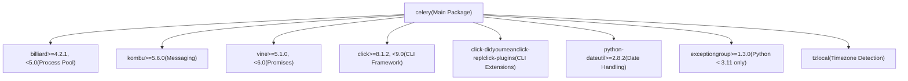
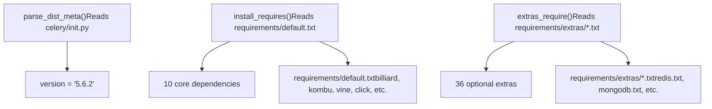

# Installation and Setup

Relevant source files

-   [docs/includes/installation.txt](https://github.com/celery/celery/blob/4d068b56/docs/includes/installation.txt)
-   [requirements/default.txt](https://github.com/celery/celery/blob/4d068b56/requirements/default.txt)
-   [setup.cfg](https://github.com/celery/celery/blob/4d068b56/setup.cfg)
-   [setup.py](https://github.com/celery/celery/blob/4d068b56/setup.py)

This document guides you through installing Celery, understanding its dependencies, and selecting appropriate optional extras for your specific use case. It covers basic pip installation, core dependencies, the extensive extras system, and alternative installation methods.

For information about configuring your Celery application after installation, see [Application Initialization and Configuration](/celery/celery/2.1-application-initialization-and-configuration). For deployment and running workers in production, see [Worker Configuration and Control](/celery/celery/5.4-worker-configuration-and-control).

## Python Version Requirements

Celery 5.6.x requires Python 3.9 or newer. The following Python implementations are officially supported:

| Python Implementation | Minimum Version | Notes |
| --- | --- | --- |
| CPython | 3.9 | Python 3.8 support dropped in v5.6.0b2 |
| CPython | 3.10, 3.11, 3.12, 3.13 | Fully supported |
| PyPy | 3.9+ (v7.3.12+) | Alternative implementation |

**Important**: Celery 5.5.x was the last version to support Python 3.8 (EOL October 2024). Python 3.9 will reach EOL in October 2025.

Sources: [README.rst123-139](https://github.com/celery/celery/blob/4d068b56/README.rst#L123-L139) [setup.py150](https://github.com/celery/celery/blob/4d068b56/setup.py#L150-L150) [celery/\_\_init\_\_.py18-20](https://github.com/celery/celery/blob/4d068b56/celery/__init__.py#L18-L20)

## Core Dependencies

Celery has a minimal set of required dependencies that are automatically installed with the base package:


**Dependency Roles**:

-   **billiard**: Fork of `multiprocessing` providing the prefork worker pool implementation
-   **kombu**: Messaging library that abstracts message transport (AMQP, Redis, SQS, etc.)
-   **vine**: Promises/futures implementation used for callbacks and error handling
-   **click**: Command-line interface framework powering the `celery` command
-   **python-dateutil**: Date/time parsing and manipulation for scheduling
-   **tzlocal**: Automatic timezone detection for the scheduler
-   **exceptiongroup**: Backport of Python 3.11's exception groups for older Python versions

Sources: [requirements/default.txt1-10](https://github.com/celery/celery/blob/4d068b56/requirements/default.txt#L1-L10) [setup.py117-119](https://github.com/celery/celery/blob/4d068b56/setup.py#L117-L119)

## Basic Installation

### Installing from PyPI

The simplest installation method uses `pip`:

```
$ pip install -U Celery
```
This installs Celery with only core dependencies. You will need to install additional packages based on your message broker and result backend choices.

### Verifying Installation

After installation, verify Celery is available:

```
$ celery --version
```
This should display version information like `5.6.2 (recovery)`.

Sources: [README.rst305-310](https://github.com/celery/celery/blob/4d068b56/README.rst#L305-L310)

## Optional Extras System

Celery provides 36 optional "extras" (also called "bundles") that install additional dependencies for specific features. The extras system is defined in [setup.py12-46](https://github.com/celery/celery/blob/4d068b56/setup.py#L12-L46) and accessed via `pip` bracket syntax.

### Installation Syntax

Install extras by specifying them in brackets:

```
# Single extra
$ pip install "celery[redis]"

# Multiple extras (comma-separated)
$ pip install "celery[redis,auth,msgpack]"
```
**Note**: Use quotes around the package specification to prevent shell expansion of brackets.

### Complete Extras Reference


### Extras Categories

#### Serializers

| Extra | Purpose | Use Case |
| --- | --- | --- |
| `celery[auth]` | Auth security serializer | Cryptographic message signing |
| `celery[msgpack]` | MessagePack serialization | Compact binary format |
| `celery[yaml]` | YAML serialization | Human-readable config |

#### Concurrency Models

| Extra | Purpose | Use Case |
| --- | --- | --- |
| `celery[eventlet]` | Eventlet pool | Network I/O bound tasks |
| `celery[gevent]` | Gevent pool | Cooperative multitasking |

#### Message Brokers & Transports

| Extra | Purpose | Dependencies Installed |
| --- | --- | --- |
| `celery[amqp]` | RabbitMQ with librabbitmq | `librabbitmq` |
| `celery[redis]` | Redis broker/backend | `redis>=4.5.2` |
| `celery[sqs]` | Amazon SQS | `boto3`, `pycurl` |
| `celery[gcpubsub]` | Google Cloud Pub/Sub | `google-cloud-pubsub` |
| `celery[zookeeper]` | Apache ZooKeeper | `kazoo` |

#### Result Backends - Cache

| Extra | Purpose | Implementation |
| --- | --- | --- |
| `celery[memcache]` | Memcached backend | `pylibmc` (C extension) |
| `celery[pymemcache]` | Memcached backend | Pure Python |

#### Result Backends - Database

| Extra | Purpose | Dependencies |
| --- | --- | --- |
| `celery[sqlalchemy]` | SQL database backend | `sqlalchemy` (1.4.x or 2.0.x) |
| `celery[django]` | Django ORM backend | Minimum Django version |

#### Result Backends - NoSQL

| Extra | Purpose | Dependencies |
| --- | --- | --- |
| `celery[mongodb]` | MongoDB backend | `pymongo>=4.0.2` |
| `celery[cassandra]` | Apache Cassandra/Astra | DataStax driver |
| `celery[elasticsearch]` | Elasticsearch backend | `elasticsearch` client |
| `celery[couchbase]` | Couchbase backend | Couchbase SDK |
| `celery[couchdb]` | CouchDB backend | CouchDB client |
| `celery[arangodb]` | ArangoDB backend | `pyArango` |
| `celery[riak]` | Riak backend | Riak client |
| `celery[dynamodb]` | AWS DynamoDB | `boto3` |
| `celery[cosmosdbsql]` | Azure Cosmos DB | `pydocumentdb` |
| `celery[consul]` | Consul KV store | `python-consul2` |

#### Result Backends - Cloud Storage

| Extra | Purpose | Dependencies |
| --- | --- | --- |
| `celery[s3]` | Amazon S3 backend | `boto3` |
| `celery[gcs]` | Google Cloud Storage | `google-cloud-storage` |
| `celery[azureblockblob]` | Azure Blob Storage | `azure-storage` |

#### Additional Features

| Extra | Purpose | Use Case |
| --- | --- | --- |
| `celery[tblib]` | Remote tracebacks | `task_remote_tracebacks` feature |
| `celery[solar]` | Solar schedules | Sunrise/sunset scheduling |
| `celery[brotli]` | Brotli compression | Message compression |
| `celery[zstd]` | Zstandard compression | High-performance compression |
| `celery[pydantic]` | Pydantic model support | Type validation |
| `celery[pytest]` | Testing framework | `pytest-celery` fixtures |

Sources: [README.rst331-425](https://github.com/celery/celery/blob/4d068b56/README.rst#L331-L425) [setup.py12-46](https://github.com/celery/celery/blob/4d068b56/setup.py#L12-L46) [setup.py122-124](https://github.com/celery/celery/blob/4d068b56/setup.py#L122-L124)

## Setup.py Structure

The package configuration in [setup.py](https://github.com/celery/celery/blob/4d068b56/setup.py) demonstrates how dependencies are organized:


The `EXTENSIONS` tuple at [setup.py12-46](https://github.com/celery/celery/blob/4d068b56/setup.py#L12-L46) defines all available extras:

```
EXTENSIONS = (
    'arangodb', 'auth', 'azureblockblob', 'brotli', 'cassandra',
    'consul', 'cosmosdbsql', 'couchbase', 'couchdb', 'django',
    'dynamodb', 'elasticsearch', 'eventlet', 'gevent', 'gcs',
    'librabbitmq', 'memcache', 'mongodb', 'msgpack', 'pymemcache',
    'pydantic', 'pyro', 'pytest', 'redis', 's3', 'slmq', 'solar',
    'sqlalchemy', 'sqs', 'tblib', 'yaml', 'zookeeper', 'zstd'
)
```
Each extra maps to a file in `requirements/extras/` (e.g., `redis.txt`, `mongodb.txt`).

Sources: [setup.py12-46](https://github.com/celery/celery/blob/4d068b56/setup.py#L12-L46) [setup.py63-76](https://github.com/celery/celery/blob/4d068b56/setup.py#L63-L76) [setup.py112-124](https://github.com/celery/celery/blob/4d068b56/setup.py#L112-L124)

## Installing from Source

For development or to use the latest unreleased features, install from the GitHub repository.

### Downloading Source Distribution

Download the latest release from PyPI:

```
$ wget https://pypi.org/project/celery/#files
$ tar xvfz celery-5.6.2.tar.gz
$ cd celery-5.6.2
$ python setup.py build
$ python setup.py install  # May require sudo
```
**Note**: Use a virtualenv to avoid requiring elevated privileges.

### Installing Development Version

The development version requires matching development versions of core dependencies:

```
# Install Celery development version
$ pip install https://github.com/celery/celery/zipball/main#egg=celery

# Install matching core dependency versions
$ pip install https://github.com/celery/billiard/zipball/main#egg=billiard
$ pip install https://github.com/celery/py-amqp/zipball/main#egg=amqp
$ pip install https://github.com/celery/kombu/zipball/main#egg=kombu
$ pip install https://github.com/celery/vine/zipball/main#egg=vine
```
**Warning**: Development versions are unstable and not recommended for production use.

### Cloning with Git

For contributing to Celery:

```
$ git clone https://github.com/celery/celery.git
$ cd celery
$ pip install -e .  # Editable install
```
See [Testing Infrastructure](/celery/celery/10.1-testing-infrastructure) for information about running the test suite.

Sources: [README.rst430-476](https://github.com/celery/celery/blob/4d068b56/README.rst#L430-L476)

## Platform-Specific Considerations

### Microsoft Windows

**Official Support Status**: Celery is not officially supported on Windows, though it should work. The maintainers have minimal funding and cannot provide Windows support. Please do not open Windows-specific issues.

### Message Broker Requirements

Celery requires a message broker to function. After installation, you must:

1.  Choose a broker: RabbitMQ (recommended for production), Redis, Amazon SQS, or others
2.  Install and configure the broker
3.  Install the corresponding Celery extra (e.g., `celery[redis]`)

The most common broker choices are:

-   **RabbitMQ**: Feature-complete, robust, recommended for production
-   **Redis**: Feature-complete, simpler setup, good for development and production
-   **Amazon SQS**: Experimental, for AWS environments
-   **SQLite**: For local development only (not recommended for production)

Sources: [README.rst142-151](https://github.com/celery/celery/blob/4d068b56/README.rst#L142-L151) [docs/includes/introduction.txt59-62](https://github.com/celery/celery/blob/4d068b56/docs/includes/introduction.txt#L59-L62)

## Version Information

The current version is defined in [celery/\_\_init\_\_.py18-20](https://github.com/celery/celery/blob/4d068b56/celery/__init__.py#L18-L20):

```
SERIES = 'recovery'
__version__ = '5.6.2'
```
The version follows semantic versioning with format `MAJOR.MINOR.MICRO`. Release code names are based on songs by Jon Hopkins.

Version information is also maintained in:

-   [.bumpversion.cfg2](https://github.com/celery/celery/blob/4d068b56/.bumpversion.cfg#L2-L2) - `current_version = 5.6.2`
-   [docs/includes/introduction.txt1](https://github.com/celery/celery/blob/4d068b56/docs/includes/introduction.txt#L1-L1) - Documentation version
-   [README.rst5](https://github.com/celery/celery/blob/4d068b56/README.rst#L5-L5) - README version

Sources: [celery/\_\_init\_\_.py18-48](https://github.com/celery/celery/blob/4d068b56/celery/__init__.py#L18-L48) [.bumpversion.cfg1-14](https://github.com/celery/celery/blob/4d068b56/.bumpversion.cfg#L1-L14)

## Next Steps

After installation:

1.  **Configure Application**: See [Application Initialization and Configuration](/celery/celery/2.1-application-initialization-and-configuration) for creating and configuring a Celery app
2.  **Define Tasks**: See [Task Definition and Invocation](/celery/celery/3.1-task-definition-and-invocation) for writing your first tasks
3.  **Choose Broker**: See [Message Brokers and Routing](/celery/celery/2.3-message-brokers-and-routing) for broker selection and configuration
4.  **Start Worker**: See [Worker Configuration and Control](/celery/celery/5.4-worker-configuration-and-control) for running workers
5.  **Deploy to Production**: See [CLI Architecture](/celery/celery/9.1-cli-architecture) for production deployment patterns

Sources: [README.rst153-173](https://github.com/celery/celery/blob/4d068b56/README.rst#L153-L173) [docs/index.rst26-32](https://github.com/celery/celery/blob/4d068b56/docs/index.rst#L26-L32)
