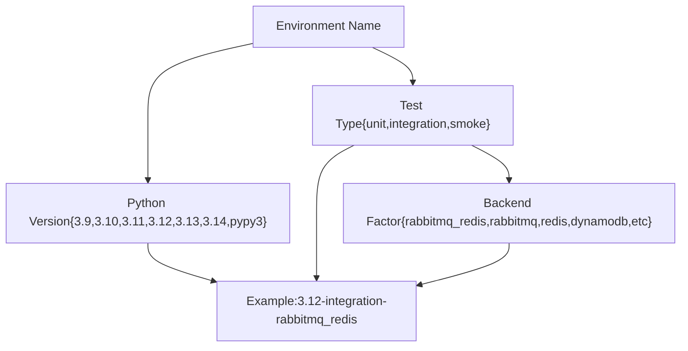
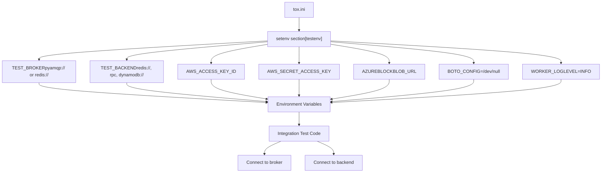
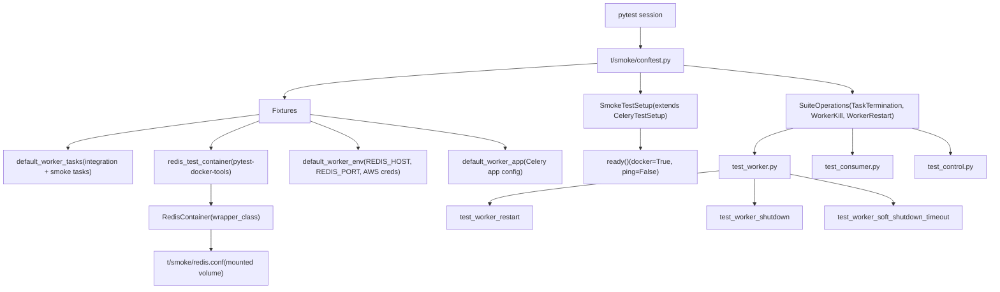
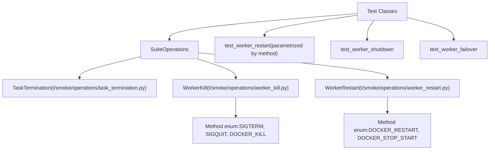
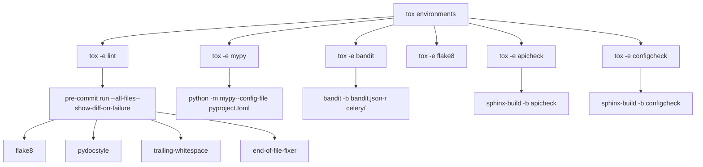
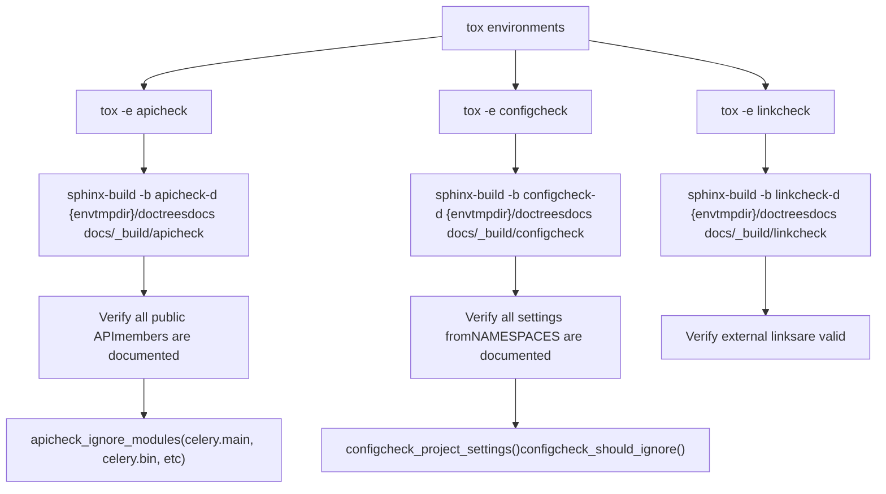
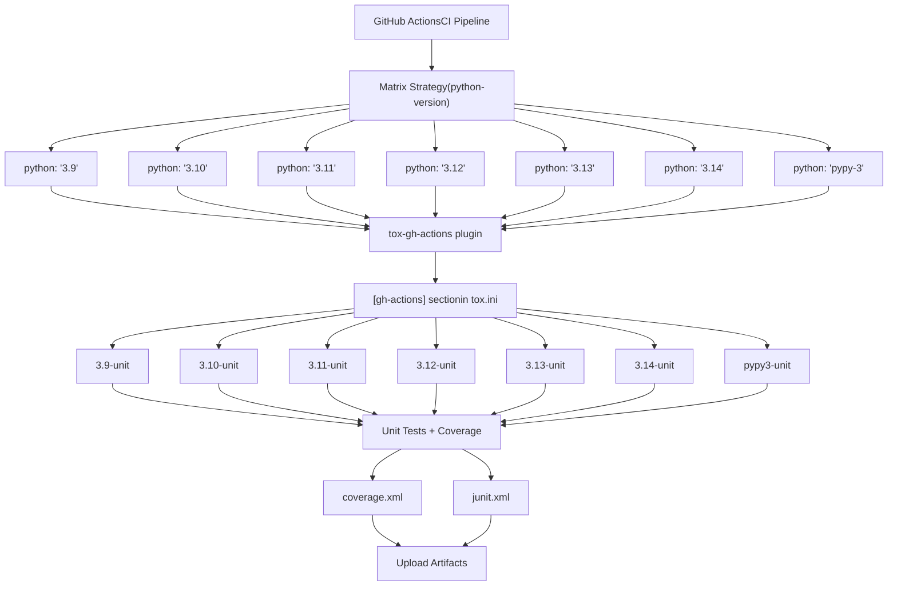
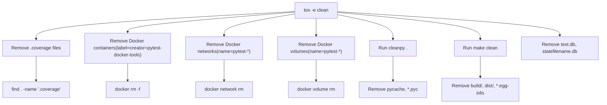

# Development and Testing

Relevant source files

-   [Makefile](https://github.com/celery/celery/blob/4d068b56/Makefile)
-   [celery/app/backends.py](https://github.com/celery/celery/blob/4d068b56/celery/app/backends.py)
-   [docs/Makefile](https://github.com/celery/celery/blob/4d068b56/docs/Makefile)
-   [docs/\_ext/celerydocs.py](https://github.com/celery/celery/blob/4d068b56/docs/_ext/celerydocs.py)
-   [docs/changelog\_formatter.py](https://github.com/celery/celery/blob/4d068b56/docs/changelog_formatter.py)
-   [requirements/docs.txt](https://github.com/celery/celery/blob/4d068b56/requirements/docs.txt)
-   [requirements/extras/pytest.txt](https://github.com/celery/celery/blob/4d068b56/requirements/extras/pytest.txt)
-   [requirements/pkgutils.txt](https://github.com/celery/celery/blob/4d068b56/requirements/pkgutils.txt)
-   [requirements/test-integration.txt](https://github.com/celery/celery/blob/4d068b56/requirements/test-integration.txt)
-   [requirements/test.txt](https://github.com/celery/celery/blob/4d068b56/requirements/test.txt)
-   [t/smoke/conftest.py](https://github.com/celery/celery/blob/4d068b56/t/smoke/conftest.py)
-   [t/smoke/operations/\_\_init\_\_.py](https://github.com/celery/celery/blob/4d068b56/t/smoke/operations/__init__.py)
-   [t/smoke/redis.conf](https://github.com/celery/celery/blob/4d068b56/t/smoke/redis.conf)
-   [t/smoke/tasks.py](https://github.com/celery/celery/blob/4d068b56/t/smoke/tasks.py)
-   [t/smoke/tests/\_\_init\_\_.py](https://github.com/celery/celery/blob/4d068b56/t/smoke/tests/__init__.py)
-   [t/smoke/tests/failover/\_\_init\_\_.py](https://github.com/celery/celery/blob/4d068b56/t/smoke/tests/failover/__init__.py)
-   [t/smoke/tests/failover/test\_broker\_failover.py](https://github.com/celery/celery/blob/4d068b56/t/smoke/tests/failover/test_broker_failover.py)
-   [t/smoke/tests/failover/test\_worker\_failover.py](https://github.com/celery/celery/blob/4d068b56/t/smoke/tests/failover/test_worker_failover.py)
-   [t/smoke/tests/test\_consumer.py](https://github.com/celery/celery/blob/4d068b56/t/smoke/tests/test_consumer.py)
-   [t/smoke/tests/test\_control.py](https://github.com/celery/celery/blob/4d068b56/t/smoke/tests/test_control.py)
-   [t/smoke/tests/test\_worker.py](https://github.com/celery/celery/blob/4d068b56/t/smoke/tests/test_worker.py)
-   [t/smoke/workers/docker/dev](https://github.com/celery/celery/blob/4d068b56/t/smoke/workers/docker/dev)
-   [t/smoke/workers/docker/pypi](https://github.com/celery/celery/blob/4d068b56/t/smoke/workers/docker/pypi)
-   [tox.ini](https://github.com/celery/celery/blob/4d068b56/tox.ini)

This document covers the development infrastructure, testing framework, and quality assurance systems for the Celery codebase. It explains how tests are organized, executed, and integrated into the CI/CD pipeline, as well as the documentation build system and code quality tools.

For information about the command-line interface and worker management, see [Command Line Interface](/celery/celery/9-command-line-interface). For packaging and distribution, see [Packaging and Distribution](/celery/celery/11-packaging-and-distribution).

## Overview of Testing Infrastructure

Celery maintains a comprehensive testing infrastructure that includes unit tests, integration tests, smoke tests, and various quality checks. The testing system is orchestrated through `tox`, which manages multiple test environments across different Python versions and backend combinations.

### Test Directory Structure

The test directory `t/` is organized into three main test suites:

```mermaid
flowchart TD
    Root["t/"]
    Unit["t/unit/"]
    Integration["t/integration/"]
    Smoke["t/smoke/"]
    UnitApp["t/unit/app/"]
    UnitBin["t/unit/bin/"]
    UnitWorker["t/unit/worker/"]
    UnitBackends["t/unit/backends/"]
    UnitTasks["t/unit/tasks/"]
    UnitCanvas["t/unit/canvas.py"]
    IntTasks["t/integration/tasks.py"]
    IntTests["t/integration/test_*.py"]
    SmokeTests["t/smoke/tests/"]
    SmokeTasks["t/smoke/tasks.py"]
    SmokeWorkers["t/smoke/workers/"]
    SmokeOps["t/smoke/operations/"]
    SmokeConf["t/smoke/conftest.py"]
    TestWorker["test_worker.py"]
    TestConsumer["test_consumer.py"]
    TestControl["test_control.py"]
    TestFailover["failover/test_worker_failover.py"]
    DevWorker["workers/dev.py"]
    LatestWorker["workers/latest.py"]
    AltWorker["workers/alt.py"]
    DockerDev["workers/docker/dev"]
    DockerPyPI["workers/docker/pypi"]

    Root --> Unit
    Root --> Integration
    Root --> Smoke
    Unit --> UnitApp
    Unit --> UnitBin
    Unit --> UnitWorker
    Unit --> UnitBackends
    Unit --> UnitTasks
    Unit --> UnitCanvas
    Integration --> IntTasks
    Integration --> IntTests
    Smoke --> SmokeTests
    Smoke --> SmokeTasks
    Smoke --> SmokeWorkers
    Smoke --> SmokeOps
    Smoke --> SmokeConf
    SmokeTests --> TestWorker
    SmokeTests --> TestConsumer
    SmokeTests --> TestControl
    SmokeTests --> TestFailover
    SmokeWorkers --> DevWorker
    SmokeWorkers --> LatestWorker
    SmokeWorkers --> AltWorker
    SmokeWorkers --> DockerDev
    SmokeWorkers --> DockerPyPI
```


**Sources:** [tox.ini1-137](https://github.com/celery/celery/blob/4d068b56/tox.ini#L1-L137) [t/smoke/conftest.py1-156](https://github.com/celery/celery/blob/4d068b56/t/smoke/conftest.py#L1-L156) [t/smoke/tests/test\_worker.py1-503](https://github.com/celery/celery/blob/4d068b56/t/smoke/tests/test_worker.py#L1-L503)

The test directory is organized into three main categories:

| Test Type | Directory | Purpose | Execution Strategy | Framework |
| --- | --- | --- | --- | --- |
| **Unit Tests** | `t/unit/` | Fast, isolated tests with mocked dependencies | Parallel with pytest and coverage | pytest + unittest.mock |
| **Integration Tests** | `t/integration/` | Tests against real brokers and backends | Sequential with backend-specific configs | pytest with real infrastructure |
| **Smoke Tests** | `t/smoke/` | End-to-end validation in Docker containers | Parallel with reruns for flaky tests | pytest-celery framework |

**Sources:** [tox.ini46-51](https://github.com/celery/celery/blob/4d068b56/tox.ini#L46-L51) [requirements/test.txt1-20](https://github.com/celery/celery/blob/4d068b56/requirements/test.txt#L1-L20)

## Tox Environment Matrix

The `tox.ini` file defines a comprehensive test matrix covering multiple Python versions and backend combinations. The test environments are structured using factor-based naming.

### Environment Naming Convention


**Sources:** [tox.ini4-7](https://github.com/celery/celery/blob/4d068b56/tox.ini#L4-L7)

### Supported Python Versions

The test matrix includes:

-   **CPython**: 3.9, 3.10, 3.11, 3.12, 3.13, 3.14
-   **PyPy**: pypy3

Each Python version is tested against:

-   Unit tests (always)
-   Integration tests (with various backend combinations)
-   Smoke tests (always)

**Sources:** [tox.ini89-96](https://github.com/celery/celery/blob/4d068b56/tox.ini#L89-L96)

### Integration Test Backend Combinations

The integration test matrix covers the following backend configurations:

| Environment Factor | Broker | Backend | Use Case |
| --- | --- | --- | --- |
| `rabbitmq_redis` | RabbitMQ (`pyamqp://`) | Redis | Production-like configuration |
| `rabbitmq` | RabbitMQ | RPC backend | AMQP-only stack |
| `redis` | Redis | Redis | All-Redis stack |
| `dynamodb` | Redis | DynamoDB | AWS DynamoDB backend |
| `azureblockblob` | Redis | Azure Blob Storage | Azure cloud backend |
| `cache` | Redis | Cache (pylibmc) | Memcached backend |
| `cassandra` | Redis | Cassandra | NoSQL backend |
| `elasticsearch` | Redis | Elasticsearch | Search-based backend |
| `docker` | RabbitMQ (in container) | Redis (in container) | Containerized testing |

**Sources:** [tox.ini60-88](https://github.com/celery/celery/blob/4d068b56/tox.ini#L60-L88)

## Test Execution Flow

The following diagram shows how tox orchestrates test execution with pytest-celery:

Diagram: Test Execution Flow Through Tox

> **[Mermaid sequence]**
> *(图表结构无法解析)*

**Sources:** [tox.ini46-51](https://github.com/celery/celery/blob/4d068b56/tox.ini#L46-L51) [tox.ini99](https://github.com/celery/celery/blob/4d068b56/tox.ini#L99-L99) [t/smoke/conftest.py20-32](https://github.com/celery/celery/blob/4d068b56/t/smoke/conftest.py#L20-L32)

### Unit Test Execution

Unit tests are executed with coverage tracking:

```
coverage run --source=celery -m pytest -vv --maxfail=10 --capture=no -v \
  --junitxml=junit.xml -o junit_family=legacy
```
Key parameters:

-   `--source=celery`: Track coverage for the celery package
-   `--maxfail=10`: Stop after 10 failures to fail fast
-   `--capture=no`: Show output immediately (useful for debugging)
-   `--junitxml=junit.xml`: Generate XML report for CI systems

After test execution, coverage reports are generated:

```
coverage xml    # For CI integration
coverage report # Console summary
```
**Sources:** [tox.ini47-49](https://github.com/celery/celery/blob/4d068b56/tox.ini#L47-L49)

### Integration Test Execution

Integration tests use environment variables to specify broker and backend URLs:

```
pytest -xsvv t/integration
```
The `-xsvv` flags mean:

-   `-x`: Stop on first failure
-   `-s`: Don't capture output
-   `-vv`: Very verbose output

**Sources:** [tox.ini50](https://github.com/celery/celery/blob/4d068b56/tox.ini#L50-L50)

### Smoke Test Execution

Smoke tests use pytest-xdist for parallel execution and pytest-rerunfailures for flaky test handling:

```
pytest -xsvv t/smoke --dist=loadscope --reruns 5 --reruns-delay 10
```
-   `--dist=loadscope`: Distribute tests by module (maintains test order within modules)
-   `--reruns 5`: Retry failed tests up to 5 times
-   `--reruns-delay 10`: Wait 10 seconds between retries

**Sources:** [tox.ini51](https://github.com/celery/celery/blob/4d068b56/tox.ini#L51-L51)

## Integration Test Configuration

Integration tests require real broker and backend instances. The test configuration is controlled through environment variables set in the `[testenv]` section of `tox.ini`.

### Environment Variable System

Diagram: Integration Test Environment Variables


**Sources:** [tox.ini52-88](https://github.com/celery/celery/blob/4d068b56/tox.ini#L52-L88)

### Backend-Specific Configuration Examples

The `setenv` section in `tox.ini` defines backend-specific environment variables for each integration test factor:

**RabbitMQ + Redis:**

```
rabbitmq_redis: TEST_BROKER=pyamqp://
rabbitmq_redis: TEST_BACKEND=redis://
```
**DynamoDB (with AWS credentials):**

```
dynamodb: TEST_BROKER=redis://
dynamodb: TEST_BACKEND=dynamodb://@localhost:8000
dynamodb: AWS_ACCESS_KEY_ID=test_aws_key_id
dynamodb: AWS_SECRET_ACCESS_KEY=test_aws_secret_key
```
**Azure Blob Storage:**

```
azureblockblob: TEST_BROKER=redis://
azureblockblob: TEST_BACKEND=azureblockblob://DefaultEndpointsProtocol=http;AccountName=devstoreaccount1;...
```
**Docker-based (containerized services):**

```
docker: TEST_BROKER=pyamqp://rabbit:5672
docker: TEST_BACKEND=redis://redis
```
**Sources:** [tox.ini60-88](https://github.com/celery/celery/blob/4d068b56/tox.ini#L60-L88)

### Standard Environment Variables

All test environments set the following:

| Variable | Value | Purpose |
| --- | --- | --- |
| `PIP_EXTRA_INDEX_URL` | `https://celery.github.io/celery-wheelhouse/repo/simple/` | Access pre-built wheels |
| `BOTO_CONFIG` | `/dev/null` | Prevent AWS SDK from reading config |
| `WORKER_LOGLEVEL` | `INFO` | Worker logging verbosity |
| `PYTHONIOENCODING` | `UTF-8` | Force UTF-8 encoding |
| `PYTHONUNBUFFERED` | `1` | Disable output buffering |
| `PYTHONDONTWRITEBYTECODE` | `1` | Skip .pyc file generation |

**Sources:** [tox.ini52-58](https://github.com/celery/celery/blob/4d068b56/tox.ini#L52-L58)

## Smoke Test Infrastructure

Smoke tests use the `pytest-celery` framework to perform end-to-end testing with real Celery workers running in Docker containers. This provides realistic integration testing without requiring manual infrastructure setup.

### pytest-celery Framework Architecture

Diagram: pytest-celery Smoke Test Architecture


**Sources:** [t/smoke/conftest.py1-156](https://github.com/celery/celery/blob/4d068b56/t/smoke/conftest.py#L1-L156) [requirements/test.txt1-3](https://github.com/celery/celery/blob/4d068b56/requirements/test.txt#L1-L3) [requirements/extras/pytest.txt1](https://github.com/celery/celery/blob/4d068b56/requirements/extras/pytest.txt#L1-L1)

### Docker Worker Images

Smoke tests use Docker workers built from custom Dockerfiles that install Celery in different configurations:

| Worker Type | Dockerfile | Purpose |
| --- | --- | --- |
| **Dev Worker** | `t/smoke/workers/docker/dev` | Installs Celery from source with `-e` editable install |
| **PyPI Worker** | `t/smoke/workers/docker/pypi` | Installs specific Celery version from PyPI |

**Dev Worker Configuration:**

-   Base: `python:3.13-bookworm`
-   User: `test_user` (non-root)
-   Installation: `pip install -e /celery[redis,pymemcache,pydantic,sqs]`
-   Command: `celery -A app worker --loglevel=$LOG_LEVEL -n $WORKER_NAME@%h -Q $WORKER_QUEUE`

**Sources:** [t/smoke/workers/docker/dev1-52](https://github.com/celery/celery/blob/4d068b56/t/smoke/workers/docker/dev#L1-L52) [t/smoke/workers/docker/pypi1-52](https://github.com/celery/celery/blob/4d068b56/t/smoke/workers/docker/pypi#L1-L52)

### Smoke Test Operations

The `SuiteOperations` class provides reusable test operations:

Diagram: Smoke Test Operations Class Hierarchy


**Sources:** [t/smoke/conftest.py35-49](https://github.com/celery/celery/blob/4d068b56/t/smoke/conftest.py#L35-L49) [t/smoke/tests/test\_worker.py9](https://github.com/celery/celery/blob/4d068b56/t/smoke/tests/test_worker.py#L9-L9)

### Worker Lifecycle Tests

Smoke tests validate worker behavior during different shutdown scenarios:

**Warm Shutdown (SIGTERM):**

-   Worker completes running tasks before exiting
-   Tests verify task completion with `acks_late=True`
-   Log validation: `"worker: Warm shutdown (MainProcess)"`

**Cold Shutdown (SIGQUIT):**

-   Worker terminates immediately without completing tasks
-   Tests verify tasks do not complete
-   Log validation: `"worker: Cold shutdown (MainProcess)"`

**Soft Shutdown (configurable timeout):**

-   Worker waits up to `worker_soft_shutdown_timeout` seconds
-   Completes short-running tasks, terminates if timeout expires
-   Tests verify timeout behavior and task completion

**Sources:** [t/smoke/tests/test\_worker.py66-236](https://github.com/celery/celery/blob/4d068b56/t/smoke/tests/test_worker.py#L66-L236)

### Consumer and Prefetch Tests

Smoke tests validate consumer behavior including prefetch count management:

**Prefetch Count Reduction:**

-   Tests `worker_enable_prefetch_count_reduction=True`
-   Validates dynamic prefetch adjustment during broker restart
-   Verifies restoration to maximum prefetch after recovery

**Connection Loss Handling:**

-   Tests `worker_cancel_long_running_tasks_on_connection_loss=True`
-   Validates task cancellation and requeue on broker restart
-   Tests with `acks_late=True` for task recovery

**Sources:** [t/smoke/tests/test\_consumer.py1-148](https://github.com/celery/celery/blob/4d068b56/t/smoke/tests/test_consumer.py#L1-L148)

### Failover Tests

Failover tests validate multi-worker scenarios:

```
@pytest.fixture
def celery_worker_cluster(
    celery_worker: CeleryTestWorker,
    celery_alt_dev_worker: CeleryTestWorker,
) -> CeleryWorkerCluster:
    cluster = CeleryWorkerCluster(celery_worker, celery_alt_dev_worker)
    yield cluster
    cluster.teardown()
```
Tests verify:

-   Task execution when first worker is killed
-   Recovery when all workers are killed and restarted
-   Task routing across multiple workers

**Sources:** [t/smoke/tests/failover/test\_worker\_failover.py11-56](https://github.com/celery/celery/blob/4d068b56/t/smoke/tests/failover/test_worker_failover.py#L11-L56)

### Redis Configuration for Tests

Smoke tests use a custom Redis configuration mounted as a volume:

```
bind 0.0.0.0
protected-mode no
save ""
appendonly no
maxmemory-policy noeviction
loglevel verbose
```
This configuration:

-   Allows connections from any IP (for Docker networking)
-   Disables persistence for faster tests
-   Enables verbose logging for debugging

**Sources:** [t/smoke/redis.conf1-7](https://github.com/celery/celery/blob/4d068b56/t/smoke/redis.conf#L1-L7) [t/smoke/conftest.py66-84](https://github.com/celery/celery/blob/4d068b56/t/smoke/conftest.py#L66-L84)

## Code Quality Tools

Celery uses multiple static analysis tools to maintain code quality. These are integrated into tox environments.

### Quality Tool Integration

Diagram: Code Quality Tools in Tox


**Sources:** [tox.ini9-125](https://github.com/celery/celery/blob/4d068b56/tox.ini#L9-L125)

### Static Analysis Tool Configuration

| Tool | Environment | Command | Configuration | Purpose |
| --- | --- | --- | --- | --- |
| **flake8** | `tox -e flake8` | `flake8 celery t` | `.flake8` or `setup.cfg` | PEP 8 style checking |
| **mypy** | `tox -e mypy` | `python -m mypy --config-file pyproject.toml` | `pyproject.toml` | Static type checking |
| **bandit** | `tox -e bandit` | `bandit -b bandit.json -r celery/` | `bandit.json` | Security issue scanning |
| **pre-commit** | `tox -e lint` | `pre-commit run --all-files` | `.pre-commit-config.yaml` | Multi-tool linting |

**Sources:** [tox.ini9-124](https://github.com/celery/celery/blob/4d068b56/tox.ini#L9-L124)

### Pre-commit Hook Integration

The `lint` tox environment runs pre-commit hooks across all files:

```
pre-commit run --all-files --show-diff-on-failure
```
Pre-commit hooks include:

-   `flake8` - Style checking
-   `pydocstyle` - Docstring conventions
-   `trailing-whitespace` - Whitespace cleanup
-   `end-of-file-fixer` - Newline at EOF
-   `check-yaml` - YAML syntax validation
-   `check-added-large-files` - Prevent large file commits

**Sources:** [tox.ini122-124](https://github.com/celery/celery/blob/4d068b56/tox.ini#L122-L124) [requirements/test.txt12](https://github.com/celery/celery/blob/4d068b56/requirements/test.txt#L12-L12)

### Type Checking with Mypy

Mypy performs static type checking with configuration in `pyproject.toml`. The mypy environment uses Python 3.13:

```
python -m mypy --config-file pyproject.toml
```
Type checking is only run on CPython implementations (not PyPy):

```
[testenv:mypy]
commands = python -m mypy --config-file pyproject.toml
```
**Sources:** [tox.ini101-102](https://github.com/celery/celery/blob/4d068b56/tox.ini#L101-L102) [requirements/test.txt11](https://github.com/celery/celery/blob/4d068b56/requirements/test.txt#L11-L11)

### Security Scanning with Bandit

Bandit scans the `celery/` package for common security issues:

```
bandit -b bandit.json -r celery/
```
The `bandit.json` configuration file specifies which tests to run and which files to exclude.

**Sources:** [tox.ini118-120](https://github.com/celery/celery/blob/4d068b56/tox.ini#L118-L120)

## Documentation Validation

Celery uses Sphinx custom builders to validate API and configuration documentation coverage.

### Documentation Check Builders

Diagram: Sphinx Documentation Validation


**Sources:** [tox.ini104-116](https://github.com/celery/celery/blob/4d068b56/tox.ini#L104-L116)

### API Coverage Validation

The `apicheck` builder verifies that all public API members are documented:

```
tox -e apicheck
```
This runs:

```
sphinx-build -b apicheck -d {envtmpdir}/doctrees docs docs/_build/apicheck
```
The builder checks all modules except those in the ignore list (test modules, internal fixups, etc.).

**Sources:** [tox.ini104-108](https://github.com/celery/celery/blob/4d068b56/tox.ini#L104-L108)

### Configuration Coverage Validation

The `configcheck` builder ensures all configuration settings are documented:

```
tox -e configcheck
```
This runs:

```
sphinx-build -b configcheck -d {envtmpdir}/doctrees docs docs/_build/configcheck
```
The builder validates that all settings defined in `celery.app.defaults.NAMESPACES` are documented.

**Sources:** [tox.ini110-112](https://github.com/celery/celery/blob/4d068b56/tox.ini#L110-L112)

### Link Validation

The `linkcheck` builder checks external links in documentation:

```
tox -e linkcheck
```
This runs:

```
sphinx-build -b linkcheck -d {envtmpdir}/doctrees docs docs/_build/linkcheck
```
**Sources:** [tox.ini114-116](https://github.com/celery/celery/blob/4d068b56/tox.ini#L114-L116)

## CI/CD Integration

Celery integrates with GitHub Actions through the `tox-gh-actions` plugin, which automatically selects appropriate tox environments based on the Python version in the CI matrix.

### GitHub Actions Mapping

Diagram: CI/CD Pipeline with tox-gh-actions


**Sources:** [tox.ini2-23](https://github.com/celery/celery/blob/4d068b56/tox.ini#L2-L23)

The `[gh-actions]` section in `tox.ini` defines the Python version to tox environment mapping:

```
[gh-actions]
python =
    3.9: 3.9-unit
    3.10: 3.10-unit
    3.11: 3.11-unit
    3.12: 3.12-unit
    3.13: 3.13-unit
    3.14: 3.14-unit
    pypy-3: pypy3-unit
```
When GitHub Actions runs with `python-version: 3.12`, the `tox-gh-actions` plugin automatically selects the `3.12-unit` environment.

**Sources:** [tox.ini15-23](https://github.com/celery/celery/blob/4d068b56/tox.ini#L15-L23)

### Coverage and Artifact Reporting

Unit test runs generate two types of reports:

1.  **Coverage Report** (`coverage.xml`):

    -   Generated by `coverage xml` command
    -   Contains line-by-line coverage data
    -   Used by coverage reporting services (Codecov, Coveralls)
2.  **JUnit XML Report** (`junit.xml`):

    -   Generated by pytest with `--junitxml=junit.xml`
    -   Contains test execution results
    -   Used by CI systems for test result visualization

**Sources:** [tox.ini47-49](https://github.com/celery/celery/blob/4d068b56/tox.ini#L47-L49)

## Test Cleanup

The `clean` tox environment provides automated cleanup of test artifacts:

```
tox -e clean
```
Diagram: Test Cleanup Process


**Sources:** [tox.ini126-137](https://github.com/celery/celery/blob/4d068b56/tox.ini#L126-L137)

This removes:

-   Coverage files (`*.coverage*`)
-   Docker containers created by pytest-docker-tools (labeled with `creator=pytest-docker-tools`)
-   Docker networks (matching `pytest-*` pattern)
-   Docker volumes (matching `pytest-*` pattern)
-   Python cache files (via `cleanpy`)
-   Build artifacts (via `make clean`)
-   Test databases (`test.db`, `statefilename.db`)

**Sources:** [tox.ini126-137](https://github.com/celery/celery/blob/4d068b56/tox.ini#L126-L137)

## Test Dependencies

### Core Test Dependencies

The `requirements/test.txt` file defines core test dependencies:

| Package | Version | Purpose |
| --- | --- | --- |
| `pytest` | 8.4.2 | Test framework |
| `pytest-celery[all]` | \>=1.2.0,<1.3.0 | Celery-specific test fixtures and Docker integration |
| `pytest-rerunfailures` | \>=15.0 | Retry flaky tests |
| `pytest-subtests` | \>=0.14.1 | Subtests support |
| `pytest-timeout` | 2.4.0 | Test timeout enforcement |
| `pytest-click` | 1.1.0 | Click CLI testing |
| `pytest-order` | 1.3.0 | Test execution ordering |
| `boto3` | \>=1.26.143 | AWS SDK (for DynamoDB, S3 backends) |
| `moto` | \>=4.1.11,<5.1.0 | AWS service mocking |
| `mypy` | 1.19.1 | Static type checking (CPython only) |
| `pre-commit` | \>=4.0.1 | Pre-commit hook framework |

The file also includes extras for specific backends (YAML, msgpack, MongoDB, GCS, Pydantic, Azure, gevent).

**Sources:** [requirements/test.txt1-20](https://github.com/celery/celery/blob/4d068b56/requirements/test.txt#L1-L20)

### Integration Test Dependencies

The `requirements/test-integration.txt` file adds integration-specific dependencies:

```
-r extras/redis.txt
-r extras/azureblockblob.txt
-r extras/auth.txt
-r extras/memcache.txt
pytest-rerunfailures>=11.1.2
git+https://github.com/celery/kombu.git
```
This includes:

-   Redis client libraries
-   Azure Blob Storage SDK
-   Authentication libraries
-   Memcached client
-   Latest development version of Kombu

**Sources:** [requirements/test-integration.txt1-7](https://github.com/celery/celery/blob/4d068b56/requirements/test-integration.txt#L1-L7)

## Summary

Celery's development and testing infrastructure provides:

1.  **Comprehensive test coverage** across unit, integration, and smoke tests
2.  **Multi-environment testing** via tox with 7 Python versions and 9 backend combinations
3.  **Code quality enforcement** through flake8, bandit, mypy, and pre-commit hooks
4.  **Documentation validation** with apicheck and configcheck builders
5.  **CI/CD integration** through GitHub Actions with automatic environment selection
6.  **Docker-based workflows** for developers without local infrastructure
7.  **Custom Sphinx extensions** for enhanced documentation cross-referencing

The test suite ensures reliability across diverse deployment scenarios, while the quality tools maintain code standards and the documentation system keeps the API reference synchronized with the codebase.
